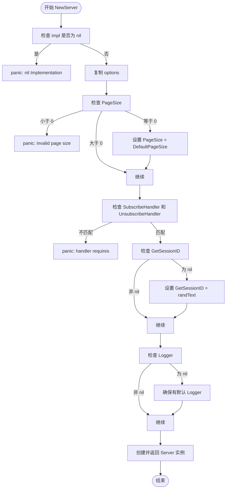
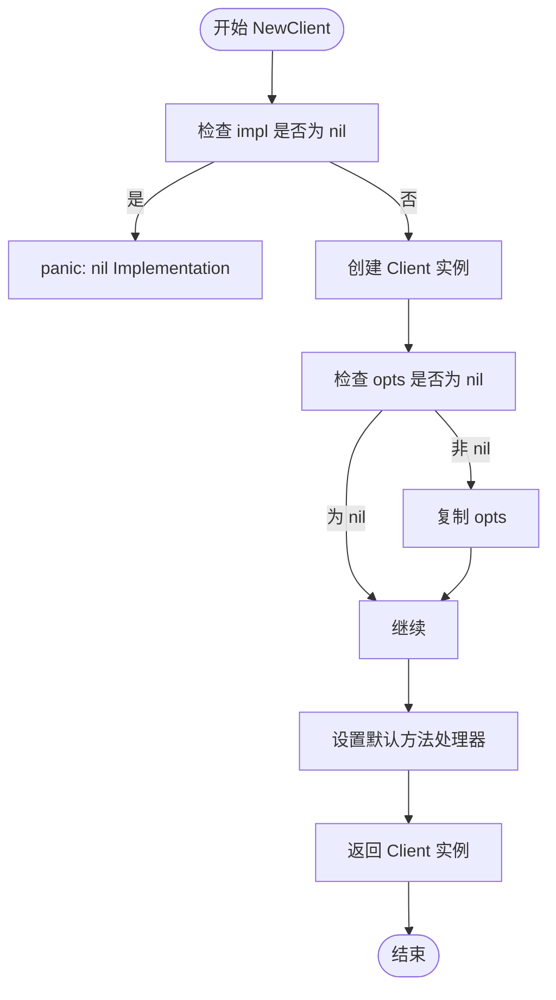

# MCP 核心 API

<cite>
**本文档引用的文件**   
- [mcp.go](file://mcp/mcp.go)
- [server.go](file://mcp/server.go)
- [client.go](file://mcp/client.go)
- [transport.go](file://mcp/transport.go)
</cite>

## 目录
1. [简介](#简介)
2. [初始化过程](#初始化过程)
3. [Server 和 Client 结构体](#server-和-client-结构体)
4. [ServerOptions 和 ClientOptions 配置](#serveroptions-和-clientoptions-配置)
5. [并发安全性](#并发安全性)
6. [API 使用示例](#api-使用示例)

## 简介
MCP（Model Context Protocol）SDK 提供了一套用于构建 MCP 客户端和服务器的工具。核心功能包括创建客户端和服务器实例、添加功能特性以及通过传输层连接对等方。本文档详细说明了 `mcp.NewServer` 和 `mcp.NewClient` 的初始化过程、参数约束、默认值配置，以及 `Server` 和 `Client` 结构体的公开方法集。

**Section sources**
- [mcp.go](file://mcp/mcp.go#L0-L88)

## 初始化过程
### NewServer 初始化
`mcp.NewServer` 函数用于创建一个新的 MCP 服务器实例。第一个参数 `impl` 必须是非空的 `*Implementation`，否则会触发 panic。第二个参数 `options` 是可选的 `*ServerOptions`，用于配置服务器行为。

在初始化过程中，函数会对 `options` 进行一系列验证和默认值设置：
- 如果 `PageSize` 为负数，则 panic。
- 如果 `PageSize` 为零，则设置为默认值 `DefaultPageSize`（1000）。
- 如果 `SubscribeHandler` 存在而 `UnsubscribeHandler` 不存在，或反之，则 panic。
- 如果 `GetSessionID` 为 nil，则使用默认的随机文本生成器 `randText`。
- 如果 `Logger` 为 nil，则确保有一个默认的日志记录器。



**Diagram sources**
- [server.go](file://mcp/server.go#L109-L150)

### NewClient 初始化
`mcp.NewClient` 函数用于创建一个新的 MCP 客户端实例。与 `NewServer` 类似，第一个参数 `impl` 必须是非空的 `*Implementation`，否则会 panic。第二个参数 `opts` 是可选的 `*ClientOptions`，用于配置客户端行为。

初始化过程相对简单，主要是创建 `Client` 结构体实例并设置字段：
- 如果 `opts` 非 nil，则复制其内容到 `Client.opts`。
- 确保 `sendingMethodHandler_` 和 `receivingMethodHandler_` 有默认值。



**Diagram sources**
- [client.go](file://mcp/client.go#L39-L53)

## Server 和 Client 结构体
### Server 结构体
`Server` 结构体代表一个 MCP 服务器实例，包含以下主要字段：
- `impl`: 服务器的实现信息。
- `opts`: 服务器的配置选项。
- `mu`: 互斥锁，用于保护并发访问。
- `prompts`, `tools`, `resources`: 分别存储提示、工具和资源的集合。
- `sessions`: 当前活动的服务器会话列表。
- `sendingMethodHandler_`, `receivingMethodHandler_`: 方法处理器，用于发送和接收消息。
- `resourceSubscriptions`: 资源订阅的映射。

**Section sources**
- [server.go](file://mcp/server.go#L37-L51)

### Client 结构体
`Client` 结构体代表一个 MCP 客户端实例，包含以下主要字段：
- `impl`: 客户端的实现信息。
- `opts`: 客户端的配置选项。
- `mu`: 互斥锁，用于保护并发访问。
- `roots`: 客户端根目录的集合。
- `sessions`: 当前活动的客户端会话列表。
- `sendingMethodHandler_`, `receivingMethodHandler_`: 方法处理器，用于发送和接收消息。

**Section sources**
- [client.go](file://mcp/client.go#L22-L30)

### 公开方法集
#### Server 方法
- `AddPrompt`: 添加或替换一个提示。
- `RemovePrompts`: 移除指定名称的提示。
- `AddTool`: 添加或替换一个工具。
- `RemoveTools`: 移除指定名称的工具。
- `AddResource`: 添加或替换一个资源。
- `RemoveResources`: 移除指定 URI 的资源。
- `AddResourceTemplate`: 添加或替换一个资源模板。
- `RemoveResourceTemplates`: 移除指定 URI 模板的资源模板。
- `Run`: 在指定的传输层上运行服务器。
- `Connect`: 连接到 MCP 服务器并开始处理消息。
- `Sessions`: 返回当前服务器会话的迭代器。

#### Client 方法
- `AddRoots`: 添加或替换客户端根目录。
- `RemoveRoots`: 移除指定 URI 的根目录。
- `Connect`: 连接到 MCP 服务器并初始化会话。
- `AddSendingMiddleware`: 添加发送中间件。
- `AddReceivingMiddleware`: 添加接收中间件。

**Section sources**
- [server.go](file://mcp/server.go#L153-L234)
- [client.go](file://mcp/client.go#L239-L246)

## ServerOptions 和 ClientOptions 配置
### ServerOptions
`ServerOptions` 结构体用于配置服务器的行为，包含以下字段：
- `Instructions`: 可选的客户端指令。
- `Logger`: 日志记录器，用于记录服务器活动。
- `InitializedHandler`: 当收到 "notifications/initialized" 时调用的函数。
- `PageSize`: 列表方法（如 ListTools）单页返回的最大项目数，默认为 `DefaultPageSize`。
- `RootsListChangedHandler`: 当收到 "notifications/roots/list_changed" 时调用的函数。
- `ProgressNotificationHandler`: 当收到 "notifications/progress" 时调用的函数。
- `CompletionHandler`: 当收到 "completion/complete" 时调用的函数。
- `KeepAlive`: 定期发送 "ping" 请求的时间间隔。
- `SubscribeHandler` 和 `UnsubscribeHandler`: 处理资源订阅和取消订阅的函数。
- `HasPrompts`, `HasResources`, `HasTools`: 是否在初始化时通告相应的能力。
- `GetSessionID`: 提供下一个会话 ID 的函数。

**Section sources**
- [server.go](file://mcp/server.go#L54-L99)

### ClientOptions
`ClientOptions` 结构体用于配置客户端的行为，包含以下字段：
- `CreateMessageHandler`: 处理 `sampling/createMessage` 请求的函数。
- `ElicitationHandler`: 处理 `elicitation/create` 请求的函数。
- `ToolListChangedHandler`, `PromptListChangedHandler`, `ResourceListChangedHandler`: 处理来自服务器的通知的函数。
- `ResourceUpdatedHandler`, `LoggingMessageHandler`, `ProgressNotificationHandler`: 处理资源更新、日志消息和进度通知的函数。
- `KeepAlive`: 定期发送 "ping" 请求的时间间隔。

**Section sources**
- [client.go](file://mcp/client.go#L56-L78)

## 并发安全性
`Server` 和 `Client` 结构体都使用互斥锁（`sync.Mutex`）来保护其内部状态，确保在多 goroutine 环境下的并发安全性。例如，在 `Server` 结构体中，`mu` 锁用于保护 `sessions`、`prompts`、`tools` 等字段的访问。在 `Client` 结构体中，`mu` 锁用于保护 `sessions` 和 `roots` 的访问。

此外，`keepaliveCancel` 字段的访问是安全的，因为它只在 `startKeepalive` 中写入一次，并且 `context.CancelFunc` 本身是线程安全的。

**Section sources**
- [server.go](file://mcp/server.go#L42-L42)
- [client.go](file://mcp/client.go#L25-L25)

## API 使用示例
### 创建服务器
```go
server := mcp.NewServer(&mcp.Implementation{Name: "greeter"}, nil)

// 添加一个工具
type args struct {
    Name string `json:"name" jsonschema:"the person to greet"`
}
mcp.AddTool(server, &mcp.Tool{
    Name:        "greet",
    Description: "say hi",
}, func(ctx context.Context, req *mcp.CallToolRequest, args args) (*mcp.CallToolResult, any, error) {
    return &mcp.CallToolResult{
        Content: []mcp.Content{
            &mcp.TextContent{Text: "Hi " + args.Name},
        },
    }, nil, nil
})

// 在标准输入输出传输上运行服务器
if err := server.Run(context.Background(), &mcp.StdioTransport{}); err != nil {
    log.Printf("Server failed: %v", err)
}
```

### 创建客户端
```go
client := mcp.NewClient(&mcp.Implementation{Name: "mcp-client", Version: "v1.0.0"}, nil)
transport := &mcp.CommandTransport{Command: exec.Command("myserver")}
session, err := client.Connect(ctx, transport, nil)
if err != nil {
    log.Fatal(err)
}
defer session.Close()

params := &mcp.CallToolParams{
    Name:      "greet",
    Arguments: map[string]any{"name": "you"},
}
res, err := session.CallTool(ctx, params)
if err != nil {
    log.Fatalf("CallTool failed: %v", err)
}
```

**Section sources**
- [mcp.go](file://mcp/mcp.go#L0-L88)