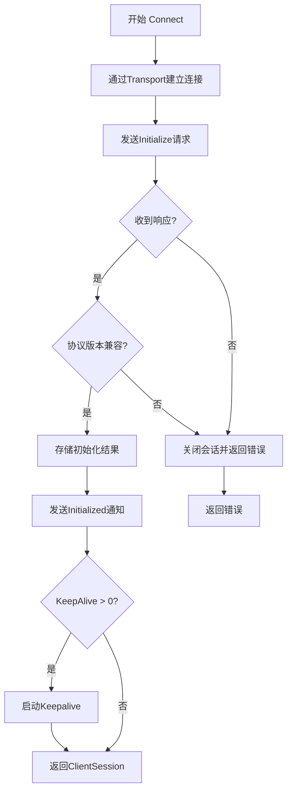
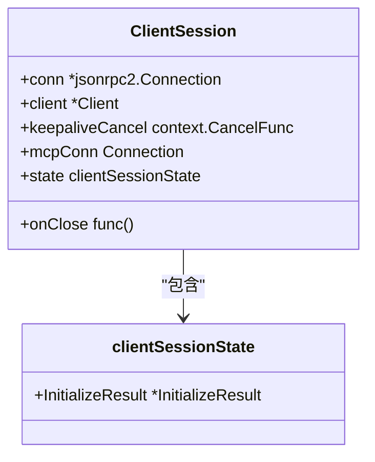

# 会话连接管理

<cite>
**本文档中引用的文件**   
- [client.go](file://mcp/client.go)
- [transport.go](file://mcp/transport.go)
- [shared.go](file://mcp/shared.go)
- [session.go](file://mcp/session.go)
- [conn.go](file://internal/jsonrpc2/conn.go)
</cite>

## 目录
1. [Client.Connect方法实现细节](#clientconnect方法实现细节)
2. [ClientSession结构体设计](#clientsession结构体设计)
3. [Close与Wait方法行为差异](#close与wait方法行为差异)
4. [连接失败处理模式](#连接失败处理模式)
5. [会话生命周期管理示例](#会话生命周期管理示例)

## Client.Connect方法实现细节

`Client.Connect` 方法负责建立完整的MCP会话连接，其执行流程包含以下关键步骤：

1. **传输层连接建立**：通过调用 `connect` 函数（位于 `mcp/transport.go`），使用提供的 `Transport` 接口与服务器建立底层连接。该过程会创建 `jsonrpc2.Connection` 实例并初始化消息读写器。

2. **初始化握手请求**：构造 `InitializeParams` 参数，包含最新协议版本、客户端信息和功能集，然后通过 `handleSend` 发送 `initialize` 请求。此请求使用JSON-RPC调用机制等待服务器响应。

3. **协议版本验证**：检查服务器返回的 `InitializeResult` 中的协议版本是否在客户端支持的版本列表中（`supportedProtocolVersions`）。若不兼容，则返回 `unsupportedProtocolVersionError` 错误。

4. **会话状态更新**：将初始化结果存储在 `ClientSession.state` 中，并通过 `clientConnection` 接口（如果实现）通知连接对象会话状态已更新。

5. **发送初始化通知**：调用 `handleNotify` 发送 `initialized` 通知，告知服务器客户端已准备就绪，此为单向通知无需等待响应。

6. **Keepalive机制启动**：根据 `ClientOptions.KeepAlive` 配置的时间间隔，调用 `startKeepalive` 启动保活机制。

**会话建立流程图**


**图源**
- [client.go](file://mcp/client.go#L135-L170)
- [transport.go](file://mcp/transport.go#L149-L179)

**章节源**
- [client.go](file://mcp/client.go#L135-L170)

## ClientSession结构体设计

`ClientSession` 结构体代表与MCP服务器的逻辑连接，其设计包含以下核心组件：

- **onClose回调函数**：用于在会话关闭时执行清理逻辑，由 `Client.bind` 方法设置。
- **jsonrpc2.Connection关联**：通过 `conn` 字段持有底层JSON-RPC连接，用于消息的发送与接收。
- **keepaliveCancel机制**：`context.CancelFunc` 类型字段，用于取消保活goroutine，其写入是线程安全的（仅在 `startKeepalive` 中写入一次）。
- **mcpConn连接对象**：持有具体的传输层连接实现，用于读写消息。
- **会话状态管理**：`clientSessionState` 结构体存储初始化结果，由于状态仅在 `Connect` 过程中同步设置，当前无需互斥锁保护。

**ClientSession结构图**


**图源**
- [client.go](file://mcp/client.go#L178-L189)
- [client.go](file://mcp/client.go#L191-L193)

**章节源**
- [client.go](file://mcp/client.go#L178-L189)

## Close与Wait方法行为差异

`ClientSession` 提供了两种不同的连接终止方式，其行为和用途有显著区别：

### Close方法（优雅关闭）
- **功能**：执行优雅关闭，阻止新请求处理，等待进行中的请求完成后终止连接。
- **资源清理**：
  - 调用 `keepaliveCancel()` 取消保活goroutine
  - 调用底层 `conn.Close()` 关闭JSON-RPC连接
  - 执行 `onClose` 回调函数
- **并发安全**：方法是幂等的，可被多个goroutine安全调用，包括保活机制本身。

### Wait方法（等待服务器关闭）
- **功能**：阻塞等待服务器主动关闭连接，不主动终止连接。
- **用途**：通常由服务器负责关闭连接时使用，客户端可通过此方法监听连接状态。

```go
// Close方法实现关键代码
func (cs *ClientSession) Close() error {
    if cs.keepaliveCancel != nil {
        cs.keepaliveCancel()
    }
    err := cs.conn.Close()
    if cs.onClose != nil {
        cs.onClose()
    }
    return err
}

// Wait方法实现关键代码
func (cs *ClientSession) Wait() error {
    return cs.conn.Wait()
}
```

**图源**
- [client.go](file://mcp/client.go#L207-L223)
- [client.go](file://mcp/client.go#L227-L229)
- [conn.go](file://internal/jsonrpc2/conn.go#L522-L527)
- [conn.go](file://internal/jsonrpc2/conn.go#L484-L486)

**章节源**
- [client.go](file://mcp/client.go#L207-L229)

## 连接失败处理模式

`Client.Connect` 方法实现了完善的错误处理机制，确保在连接失败时能正确清理资源：

1. **分阶段错误处理**：
   - 若 `connect` 失败，直接返回错误
   - 若 `initialize` 请求失败，先调用 `cs.Close()` 清理已建立的部分连接，再返回错误
   - 若协议版本不兼容，同样先关闭会话再返回特定错误

2. **资源泄露防护**：所有错误路径都确保调用 `Close` 方法，防止半开连接导致的资源泄露。

3. **错误类型**：
   - 传输层错误：直接来自 `Transport.Connect`
   - 协议错误：如 `unsupportedProtocolVersionError`
   - 通信错误：如JSON-RPC编码/解码错误

```go
// 连接失败处理示例
res, err := handleSend[*InitializeResult](ctx, methodInitialize, req)
if err != nil {
    _ = cs.Close() // 确保清理
    return nil, err
}
```

**章节源**
- [client.go](file://mcp/client.go#L135-L170)

## 会话生命周期管理示例

以下是正确管理MCP会话生命周期的最佳实践示例：

```go
func manageSession(ctx context.Context, client *mcp.Client, transport mcp.Transport) error {
    // 建立连接
    session, err := client.Connect(ctx, transport, nil)
    if err != nil {
        return fmt.Errorf("连接失败: %w", err)
    }
    
    // 使用defer确保会话关闭
    defer func() {
        if closeErr := session.Close(); closeErr != nil {
            log.Printf("关闭会话时出错: %v", closeErr)
        }
    }()
    
    // 使用会话进行操作
    tools, err := session.ListTools(ctx, nil)
    if err != nil {
        return fmt.Errorf("获取工具列表失败: %w", err)
    }
    
    // ... 其他操作
    
    return nil
}
```

**关键实践**：
- **defer关闭**：始终使用 `defer session.Close()` 确保会话最终被关闭
- **错误检查**：检查 `Close` 返回的错误，尽管在大多数情况下可忽略
- **上下文管理**：使用适当的 `context.Context` 控制操作超时

**章节源**
- [client.go](file://mcp/client.go#L207-L223)