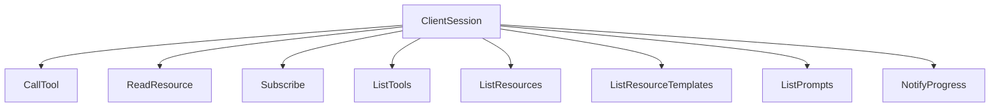
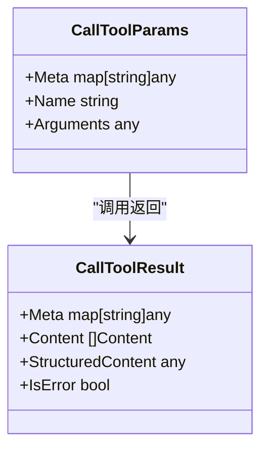
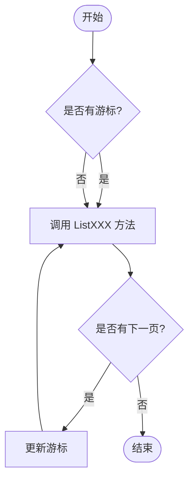
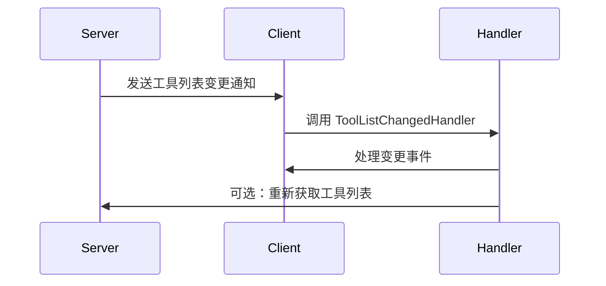
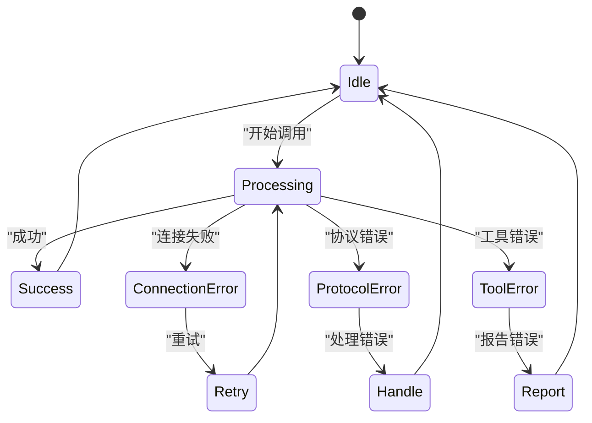

# 功能调用与交互

<cite>
**本文档中引用的文件**  
- [client.go](file://mcp/client.go)
- [protocol.go](file://mcp/protocol.go)
- [shared.go](file://mcp/shared.go)
- [tool.go](file://mcp/tool.go)
- [resource.go](file://mcp/resource.go)
- [features.go](file://mcp/features.go)
- [examples/client/listfeatures/main.go](file://examples/client/listfeatures/main.go)
- [examples/server/basic/main.go](file://examples/server/basic/main.go)
- [examples/server/toolschemas/main.go](file://examples/server/toolschemas/main.go)
</cite>

## 目录
1. [简介](#简介)
2. [核心功能调用方法](#核心功能调用方法)
3. [CallTool 方法详解](#calltool-方法详解)
4. [ListXXX 与迭代器方法的关系](#listxxx-与迭代器方法的关系)
5. [通知类方法使用](#通知类方法使用)
6. [服务器变更响应机制](#服务器变更响应机制)
7. [完整调用示例](#完整调用示例)
8. [错误处理机制](#错误处理机制)

## 简介

`ClientSession` 是 MCP（Model Context Protocol）客户端与服务器交互的核心组件，提供了丰富的功能调用方法。通过 `ClientSession`，客户端可以调用服务器提供的工具、读取资源、订阅资源变更、列出可用工具和资源等功能。这些方法基于 JSON-RPC 2.0 协议实现，确保了跨平台和语言的兼容性。

`ClientSession` 的设计遵循了 MCP 协议规范，支持分页、流式传输和进度通知等高级特性。开发者可以通过这些方法构建智能应用，与 MCP 服务器进行高效的数据交换和功能调用。

**Section sources**
- [client.go](file://mcp/client.go#L178-L189)
- [shared.go](file://mcp/shared.go#L67-L76)

## 核心功能调用方法

`ClientSession` 提供了以下核心功能调用方法：

- **CallTool**: 调用服务器提供的工具
- **ReadResource**: 读取服务器上的资源
- **Subscribe**: 订阅资源变更通知
- **ListTools**: 列出可用的工具
- **ListResources**: 列出可用的资源
- **ListResourceTemplates**: 列出资源模板
- **ListPrompts**: 列出可用的提示
- **NotifyProgress**: 发送进度通知

这些方法共同构成了客户端与 MCP 服务器交互的基础。每个方法都有明确的参数结构和返回值类型，确保了调用的可靠性和可预测性。



**Diagram sources**
- [client.go](file://mcp/client.go#L575-L577)
- [client.go](file://mcp/client.go#L599-L601)

## CallTool 方法详解

`CallTool` 方法用于调用服务器提供的工具。其方法签名如下：

```go
func (cs *ClientSession) CallTool(ctx context.Context, params *CallToolParams) (*CallToolResult, error)
```

### 参数结构

`CallToolParams` 结构包含以下字段：

- **Meta**: 附加的元数据
- **Name**: 工具名称
- **Arguments**: 工具参数，必须为 JSON 对象

### 返回值类型

`CallToolResult` 结构包含以下字段：

- **Meta**: 附加的元数据
- **Content**: 工具调用结果内容
- **StructuredContent**: 结构化结果内容
- **IsError**: 是否发生错误

### 特殊约束

`Arguments` 字段必须为 JSON 对象，这是 MCP 协议的强制要求。如果 `Arguments` 为 `nil`，SDK 会自动将其转换为空的 JSON 对象 `{}`，以避免在传输过程中出现问题。



**Diagram sources**
- [protocol.go](file://mcp/protocol.go#L85-L109)
- [client.go](file://mcp/client.go#L582-L591)

## ListXXX 与迭代器方法的关系

`ListXXX` 方法（如 `ListTools`、`ListResources`）与对应的迭代器方法（如 `Tools`、`Resources`）之间存在密切关系。`ListXXX` 方法是基础的分页查询方法，而迭代器方法则在此基础上提供了更高级的自动分页功能。

### 自动分页实现

迭代器方法通过 `paginate` 函数实现自动分页。`paginate` 函数接受一个 `ListXXX` 方法作为参数，然后在内部循环调用该方法，直到获取到所有数据。

```go
func paginate[P listParams, R listResult[T], T any](ctx context.Context, params P, listFunc func(context.Context, P) (R, error), items func(R) []*T) iter.Seq2[*T, error]
```

### 使用示例

```go
// 使用 ListTools 获取单页数据
res, err := cs.ListTools(ctx, &ListToolsParams{Cursor: "next-cursor"})

// 使用 Tools 迭代器获取所有数据
for tool, err := range cs.Tools(ctx, nil) {
    if err != nil {
        // 处理错误
        break
    }
    // 处理工具
}
```



**Diagram sources**
- [client.go](file://mcp/client.go#L685-L692)
- [client.go](file://mcp/client.go#L698-L705)
- [shared.go](file://mcp/shared.go#L480-L503)

## 通知类方法使用

`NotifyProgress` 是一个重要的通知类方法，用于在长时间运行的任务中向服务器发送进度更新。

### 使用场景

- 文件上传/下载进度
- 大数据处理任务
- 模型训练过程
- 任何需要向服务器报告进度的场景

### 方法签名

```go
func (cs *ClientSession) NotifyProgress(ctx context.Context, params *ProgressNotificationParams) error
```

### 参数结构

`ProgressNotificationParams` 包含以下字段：

- **ProgressToken**: 进度令牌，用于关联请求
- **Message**: 进度描述消息
- **Progress**: 当前进度值
- **Total**: 总进度值

### 使用示例

```go
// 在长时间任务中定期发送进度通知
go func() {
    for i := 0; i <= 100; i++ {
        time.Sleep(100 * time.Millisecond)
        cs.NotifyProgress(ctx, &ProgressNotificationParams{
            ProgressToken: "task-123",
            Message: fmt.Sprintf("处理中... %d%%", i),
            Progress: float64(i),
            Total: 100,
        })
    }
}()
```

**Section sources**
- [client.go](file://mcp/client.go#L677-L679)
- [protocol.go](file://mcp/protocol.go#L380-L398)

## 服务器变更响应机制

当服务器端功能发生变更时，客户端需要能够及时响应。MCP SDK 通过事件处理器机制实现了这一功能。

### ToolListChangedHandler

`ToolListChangedHandler` 是一个事件处理器，当服务器上的工具列表发生变化时触发。

```go
type ClientOptions struct {
    ToolListChangedHandler      func(context.Context, *ToolListChangedRequest)
    PromptListChangedHandler    func(context.Context, *PromptListChangedRequest)
    ResourceListChangedHandler  func(context.Context, *ResourceListChangedRequest)
    // ... 其他处理器
}
```

### 触发条件

- 服务器添加新工具
- 服务器删除现有工具
- 服务器更新工具定义
- 服务器重启或重新加载配置

### 使用示例

```go
client := mcp.NewClient(&mcp.Implementation{Name: "client"}, &mcp.ClientOptions{
    ToolListChangedHandler: func(ctx context.Context, req *mcp.ToolListChangedRequest) {
        log.Println("工具列表已变更，重新获取工具列表")
        // 可以在这里刷新本地缓存或更新UI
    },
})
```



**Diagram sources**
- [client.go](file://mcp/client.go#L68-L68)
- [client.go](file://mcp/client.go#L539-L541)

## 完整调用示例

以下是一个完整的调用示例，展示了如何在实际应用中使用这些 API 与 MCP 服务器进行交互。

```go
func main() {
    ctx := context.Background()
    clientTransport, serverTransport := mcp.NewInMemoryTransports()

    server := mcp.NewServer(&mcp.Implementation{Name: "greeter"}, nil)
    mcp.AddTool(server, &mcp.Tool{Name: "greet", Description: "say hi"}, SayHi)

    serverSession, err := server.Connect(ctx, serverTransport, nil)
    if err != nil {
        log.Fatal(err)
    }

    client := mcp.NewClient(&mcp.Implementation{Name: "client"}, nil)
    clientSession, err := client.Connect(ctx, clientTransport, nil)
    if err != nil {
        log.Fatal(err)
    }

    // 调用工具
    res, err := clientSession.CallTool(ctx, &mcp.CallToolParams{
        Name:      "greet",
        Arguments: map[string]any{"name": "user"},
    })
    if err != nil {
        log.Fatal(err)
    }
    fmt.Println(res.Content[0].(*mcp.TextContent).Text)

    // 列出所有工具
    for tool, err := range clientSession.Tools(ctx, nil) {
        if err != nil {
            log.Fatal(err)
        }
        fmt.Printf("可用工具: %s\n", tool.Name)
    }

    clientSession.Close()
    serverSession.Wait()
}
```

**Section sources**
- [examples/server/basic/main.go](file://examples/server/basic/main.go#L1-L58)
- [examples/client/listfeatures/main.go](file://examples/client/listfeatures/main.go#L1-L86)

## 错误处理机制

MCP SDK 提供了完善的错误处理机制，确保客户端能够正确处理各种异常情况。

### 错误类型

- **连接错误**: 网络连接问题
- **协议错误**: JSON-RPC 协议相关错误
- **工具错误**: 工具调用过程中发生的错误
- **资源错误**: 资源访问相关错误

### 错误处理策略

1. **重试机制**: 对于临时性错误，可以实现重试逻辑
2. **降级处理**: 当某些功能不可用时，提供替代方案
3. **用户提示**: 向用户清晰地展示错误信息
4. **日志记录**: 记录详细的错误信息用于调试

### 错误代码

- **-32002**: 资源未找到
- **-31001**: 方法不支持
- **-32602**: 参数无效



**Diagram sources**
- [shared.go](file://mcp/shared.go#L510-L515)
- [client.go](file://mcp/client.go#L519-L524)