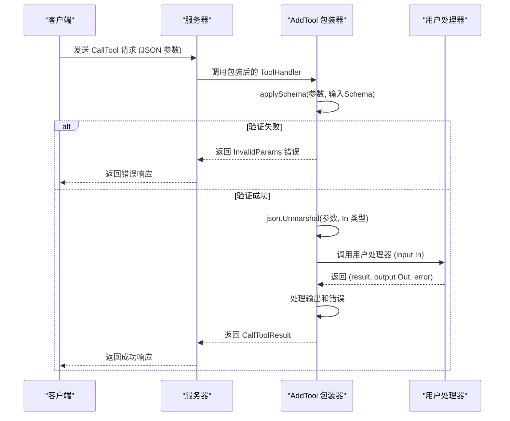

# 工具函数

<cite>
**本文档中引用的文件**  
- [mcp/server.go](file://mcp/server.go)
- [mcp/tool.go](file://mcp/tool.go)
- [mcp/protocol.go](file://mcp/protocol.go)
- [mcp/shared.go](file://mcp/shared.go)
- [mcp/tool_example_test.go](file://mcp/tool_example_test.go)
</cite>

## 目录
1. [简介](#简介)
2. [AddTool泛型函数详解](#addtool泛型函数详解)
3. [输入输出Schema自动推导机制](#输入输出schema自动推导机制)
4. [输入验证与默认值应用](#输入验证与默认值应用)
5. [输出序列化与错误处理](#输出序列化与错误处理)
6. [实际调用示例](#实际调用示例)
7. [辅助函数文档化](#辅助函数文档化)
8. [结论](#结论)

## 简介
本文档详细介绍了MCP（Model Context Protocol）Go SDK中的工具函数，重点聚焦于`AddTool`泛型函数的自动模式绑定机制。该函数为开发者提供了简化工具注册过程的强大功能，通过类型参数自动推导输入输出Schema，将普通Go函数包装为符合MCP规范的`ToolHandler`。文档将深入解析该函数在输入验证、默认值应用、输出序列化和错误处理方面的自动化流程，并提供实际使用示例。同时，文档还将介绍`mcp`包中的其他辅助函数，如`fileResourceHandler`的路径安全处理机制和资源读取功能。

## AddTool泛型函数详解
`AddTool`函数是MCP SDK中用于向服务器注册工具的核心泛型函数，它极大地简化了工具的创建和注册过程。与底层的`Server.AddTool`方法不同，`AddTool`提供了一套完整的自动化机制，确保工具严格遵守MCP规范。

该函数定义为`AddTool[In, Out any](s *Server, t *Tool, h ToolHandlerFor[In, Out])`，接受三个主要参数：服务器实例`s`、工具定义`t`和一个类型化的工具处理器`h`。其核心优势在于，它能够根据`In`和`Out`这两个类型参数，自动完成输入输出Schema的推导、验证和序列化工作，开发者无需手动处理这些繁琐的细节。

函数内部通过调用`toolForErr`函数来实现自动化逻辑。`toolForErr`会检查并可能推导出输入和输出的Schema，然后创建一个包装后的`ToolHandler`，该处理器在调用时会自动执行输入验证、默认值应用、参数解组、调用用户处理器、处理错误以及输出序列化等一系列操作。最终，`AddTool`将推导出的工具定义和包装后的处理器传递给`Server.AddTool`方法完成注册。

**Section sources**
- [mcp/server.go](file://mcp/server.go#L405-L411)
- [mcp/server.go](file://mcp/server.go#L668-L695)

## 输入输出Schema自动推导机制
`AddTool`函数的核心功能之一是能够根据Go类型的结构自动推导出符合JSON Schema规范的输入和输出模式。

对于输入Schema，当`Tool`结构体的`InputSchema`字段为`nil`时，`AddTool`会检查`In`类型参数。如果`In`是`any`类型，则会自动设置一个空对象Schema（`{"type": "object"}`），表示该工具接受任意JSON对象作为输入。否则，它会使用`github.com/google/jsonschema-go`库，通过反射分析`In`类型的结构（如struct字段或map键），自动生成一个详细的JSON Schema。此过程还会读取字段上的`jsonschema`标签来获取描述、枚举值等元信息。

```mermaid
flowchart TD
Start["开始 AddTool 调用"] --> CheckInputSchema["检查 Tool.InputSchema 是否为 nil"]
CheckInputSchema --> |是| CheckInType["检查 In 类型参数"]
CheckInType --> |In 为 any| SetEmptyObject["设置 InputSchema 为 {\"type\": \"object\"}"]
CheckInType --> |In 为具体类型| InferSchema["使用 jsonschema-go 推导 In 类型的 Schema"]
CheckInputSchema --> |否| UseProvidedSchema["使用用户提供的 InputSchema"]
SetEmptyObject --> End
InferSchema --> End
UseProvidedSchema --> End
```

**Diagram sources**
- [mcp/server.go](file://mcp/server.go#L668-L695)

对于输出Schema，机制类似。如果`Tool`的`OutputSchema`字段为`nil`，且`Out`类型不是`any`，则会自动推导出`Out`类型的Schema作为输出Schema。如果`Out`是`any`，则不会设置输出Schema。开发者也可以选择手动提供Schema，以覆盖自动推导的结果，这在需要自定义复杂验证规则或使用非SDK支持的Schema草案时非常有用。

**Section sources**
- [mcp/server.go](file://mcp/server.go#L668-L695)
- [mcp/tool_example_test.go](file://mcp/tool_example_test.go#L130-L160)

## 输入验证与默认值应用
`AddTool`函数在调用用户处理器之前，会自动对输入参数进行验证和默认值应用，确保传入处理器的数据是有效且完整的。

这一过程由`applySchema`函数实现。当客户端发起`CallTool`请求时，原始的JSON参数（`req.Params.Arguments`）首先会被传递给`applySchema`函数。该函数接收一个`json.RawMessage`和一个已解析的`jsonschema.Resolved`对象。它会将JSON数据反序列化到一个`map[string]any`中，然后调用`resolved.ApplyDefaults(&v)`来应用Schema中定义的默认值，最后调用`resolved.Validate(&v)`进行验证。如果验证失败，整个调用会立即终止，并返回一个带有`jsonrpc2.ErrInvalidParams`错误码的响应，阻止无效数据进入业务逻辑层。



**Diagram sources**
- [mcp/tool.go](file://mcp/tool.go#L66-L102)

**Section sources**
- [mcp/tool.go](file://mcp/tool.go#L66-L102)

## 输出序列化与错误处理
`AddTool`函数不仅处理输入，还负责输出的序列化和错误处理，确保返回给客户端的响应符合MCP规范。

当用户处理器执行完毕后，`AddTool`的包装器会接管结果。如果处理器返回了一个错误，包装器会智能地处理它。如果错误是`*jsonrpc2.WireError`这样的结构化协议错误，则直接返回；否则，它会将错误视为工具执行错误，自动创建一个`CallToolResult`，将错误信息放入`Content`字段，并将`IsError`字段设置为`true`，然后返回这个结果。这确保了LLM能够感知到工具执行失败，并有机会进行自我纠正。

对于成功的响应，如果用户返回了`Out`类型的输出值，包装器会将其JSON序列化，并将原始字节放入`CallToolResult.StructuredContent`字段。此外，如果用户没有手动设置`Content`字段，`AddTool`会自动将序列化后的JSON字符串放入`Content`字段中作为一个`TextContent`，为客户端提供结构化和非结构化两种形式的结果。

**Section sources**
- [mcp/server.go](file://mcp/server.go#L668-L695)

## 实际调用示例
以下示例展示了如何使用`AddTool`函数简化工具注册过程。

```go
type WeatherInput struct {
    Location string `json:"location" jsonschema:"用户位置"`
    Days     int    `json:"days" jsonschema:"预报天数"`
}

type WeatherOutput struct {
    Summary string `json:"summary" jsonschema:"天气预报摘要"`
    High    float64 `json:"high" jsonschema:"最高温度"`
}

func WeatherTool(ctx context.Context, req *mcp.CallToolRequest, in WeatherInput) (*mcp.CallToolResult, WeatherOutput, error) {
    // 业务逻辑：获取天气预报
    out := WeatherOutput{
        Summary: "晴朗",
        High:    25.0,
    }
    return nil, out, nil // 可以返回 nil result
}

// 使用 AddTool 注册工具
server := mcp.NewServer(impl, nil)
mcp.AddTool(server, &mcp.Tool{Name: "get_weather"}, WeatherTool)
```

在此示例中，开发者只需定义输入输出的Go结构体和处理函数。`AddTool`会自动：
1.  推导出`WeatherInput`和`WeatherOutput`的JSON Schema。
2.  验证客户端传入的`location`和`days`参数。
3.  将验证后的JSON自动解组为`WeatherInput`结构体。
4.  调用`WeatherTool`函数。
5.  将`WeatherOutput`结构体序列化并填充到`CallToolResult`中。

**Section sources**
- [mcp/tool_example_test.go](file://mcp/tool_example_test.go#L170-L200)

## 辅助函数文档化
除了`AddTool`，`mcp`包还提供了其他有用的辅助函数，如`fileResourceHandler`。

`fileResourceHandler`函数用于创建一个安全的资源处理器，用于从文件系统读取资源。它接受一个目录路径`dir`作为参数，并返回一个`ResourceHandler`。该函数首先将`dir`转换为绝对路径，以避免依赖当前工作目录。返回的处理器在执行时，会进行严格的安全检查：它会验证请求的URI是否在客户端声明的根目录（roots）内，并防止路径遍历攻击（如`../`）。在Go 1.24及以上版本中，它还能防止基于符号链接的攻击。这确保了服务器只能访问授权范围内的文件。

**Section sources**
- [mcp/server.go](file://mcp/server.go#L668-L695)

## 结论
`AddTool`泛型函数是MCP Go SDK中一个强大且易用的工具，它通过自动化Schema推导、输入验证、默认值应用、输出序列化和错误处理，极大地简化了MCP工具的开发流程。开发者可以专注于业务逻辑的实现，而无需关心底层的协议细节。结合`fileResourceHandler`等辅助函数，SDK为构建安全、符合规范的MCP服务器提供了坚实的基础。通过合理利用这些工具，开发者可以高效地创建功能丰富且可靠的MCP服务。