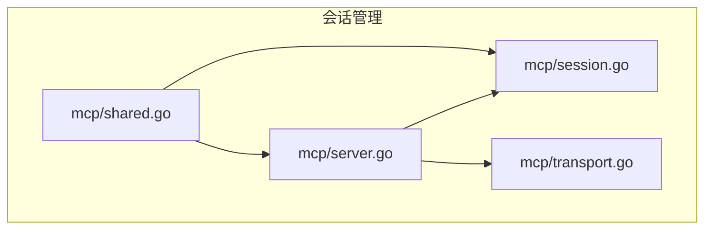
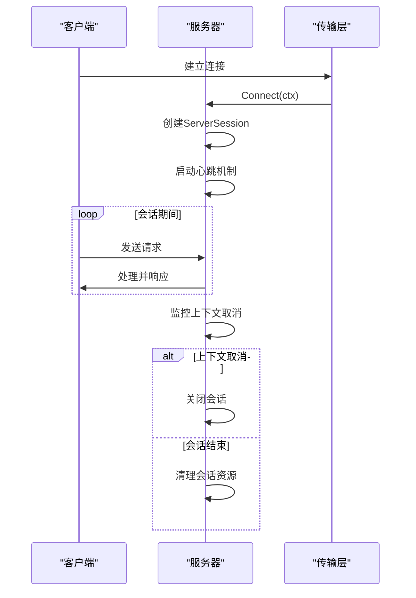
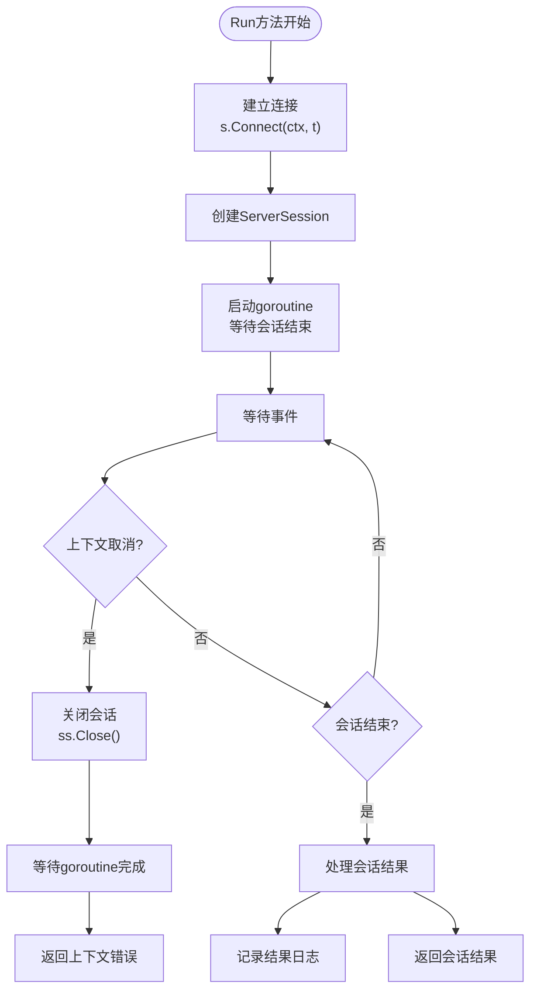
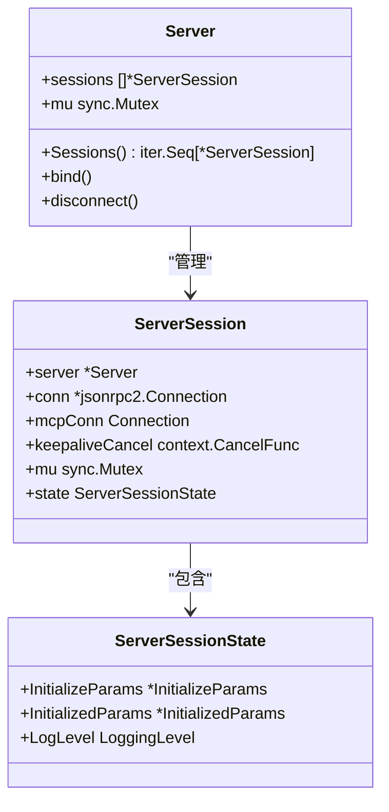
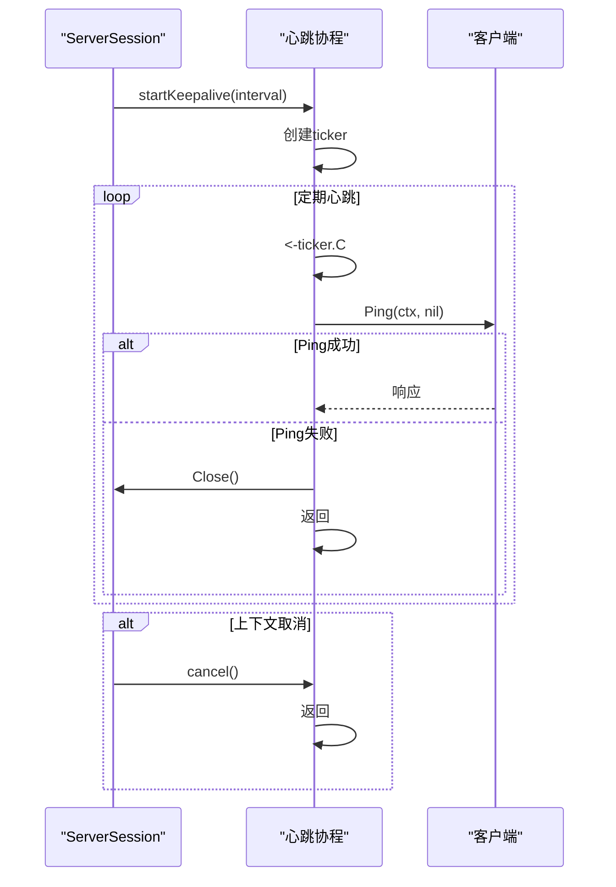
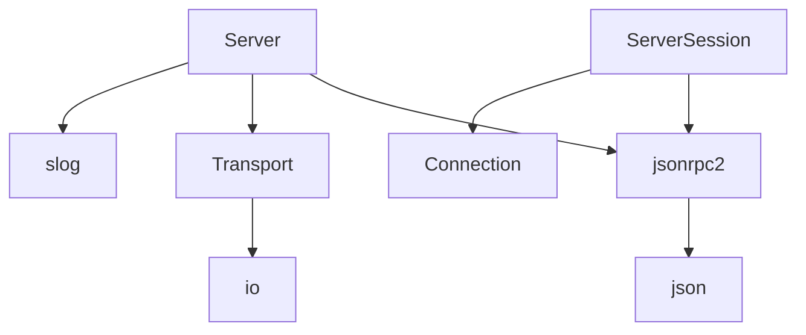

# 会话管理

<cite>
**Referenced Files in This Document**   
- [mcp/server.go](file://mcp/server.go)
- [mcp/session.go](file://mcp/session.go)
- [mcp/transport.go](file://mcp/transport.go)
- [mcp/shared.go](file://mcp/shared.go)
</cite>

## 目录
1. [简介](#简介)
2. [项目结构](#项目结构)
3. [核心组件](#核心组件)
4. [架构概述](#架构概述)
5. [详细组件分析](#详细组件分析)
6. [依赖分析](#依赖分析)
7. [性能考虑](#性能考虑)
8. [故障排除指南](#故障排除指南)
9. [结论](#结论)

## 简介
本文档详细阐述了MCP服务器的会话管理机制，重点覆盖Server.Run方法的执行流程、会话生命周期管理、并发控制以及KeepAlive心跳机制的实现原理。文档解释了服务器如何通过Transport建立持久化连接并处理客户端会话，详细说明了ServerSession的创建、维护和销毁过程，以及会话列表的并发安全访问机制。

## 项目结构
MCP服务器的会话管理功能主要分布在以下几个核心文件中：
- `mcp/server.go`：包含Server结构体和会话管理的核心逻辑
- `mcp/session.go`：定义ServerSession结构体和会话状态
- `mcp/transport.go`：处理传输层连接和消息传递
- `mcp/shared.go`：包含会话相关的共享功能和心跳机制

这些文件共同构成了MCP服务器的会话管理体系，实现了从连接建立到会话终止的完整生命周期管理。

**Diagram sources**
- [mcp/server.go](file://mcp/server.go)
- [mcp/session.go](file://mcp/session.go)
- [mcp/transport.go](file://mcp/transport.go)
- [mcp/shared.go](file://mcp/shared.go)

**Section sources**
- [mcp/server.go](file://mcp/server.go)
- [mcp/session.go](file://mcp/session.go)
- [mcp/transport.go](file://mcp/transport.go)

## 核心组件
MCP服务器的会话管理机制由Server和ServerSession两个核心组件构成。Server负责管理所有活动会话的生命周期，而ServerSession代表与单个客户端的逻辑连接。Server结构体通过sync.Mutex保护会话列表的并发访问，确保在多goroutine环境下的线程安全。

**Section sources**
- [mcp/server.go](file://mcp/server.go#L37-L51)
- [mcp/session.go](file://mcp/session.go#L30-L45)

## 架构概述
MCP服务器的会话管理架构采用客户端-服务器模式，通过Transport接口建立持久化连接。当客户端连接时，服务器创建ServerSession实例来管理该连接的生命周期。会话管理的核心是Server.Run方法，它负责启动服务器并处理客户端会话。

**Diagram sources**
- [mcp/server.go](file://mcp/server.go#L764-L791)
- [mcp/transport.go](file://mcp/transport.go#L100-L150)

## 详细组件分析

### Server.Run方法执行流程
Server.Run方法是MCP服务器的入口点，负责启动服务器并处理客户端会话。该方法首先通过Connect方法建立与客户端的连接，创建ServerSession实例。然后启动一个goroutine来等待会话结束，同时使用select语句监听上下文取消信号和会话关闭信号。

当上下文被取消时，服务器会主动关闭会话并等待goroutine完成；当会话正常结束时，服务器会记录相应的日志信息。这种设计确保了服务器能够优雅地处理各种终止情况。

**Diagram sources**
- [mcp/server.go](file://mcp/server.go#L764-L791)

**Section sources**
- [mcp/server.go](file://mcp/server.go#L764-L791)

### 会话生命周期管理
ServerSession的生命周期从Connect方法调用开始，到连接关闭结束。服务器通过bind方法将新创建的会话添加到会话列表中，并在disconnect方法中将其移除。会话状态通过ServerSessionState结构体维护，包括初始化参数、已初始化参数和日志级别等信息。

会话的并发安全访问通过Server结构体中的sync.Mutex实现。在添加或移除会话时，必须获取互斥锁以确保操作的原子性。Sessions方法通过克隆会话列表来提供迭代器，避免了在迭代过程中修改列表导致的数据竞争。

**Diagram sources**
- [mcp/server.go](file://mcp/server.go#L37-L51)
- [mcp/session.go](file://mcp/session.go#L30-L45)

**Section sources**
- [mcp/server.go](file://mcp/server.go#L37-L51)
- [mcp/session.go](file://mcp/session.go#L30-L45)

### 并发控制机制
会话列表的并发安全访问是通过Server结构体中的sync.Mutex实现的。Sessions方法在返回会话迭代器之前，会先获取互斥锁并克隆会话列表，确保返回的迭代器基于一个稳定的快照。这种设计允许在迭代会话的同时，其他goroutine可以安全地添加或移除会话。

bind和disconnect方法在修改会话列表时也必须获取互斥锁，确保操作的原子性。这种细粒度的锁机制平衡了并发性能和数据一致性，避免了在高并发场景下的数据竞争问题。

**Section sources**
- [mcp/server.go](file://mcp/server.go#L512-L517)

### KeepAlive心跳机制
KeepAlive心跳机制通过startKeepalive函数实现，该函数在独立的goroutine中运行。当服务器收到initialized通知且KeepAlive选项大于0时，会启动心跳机制。心跳机制使用time.Ticker定期发送ping请求，如果连续多次ping失败，则自动关闭会话。

心跳的超时时间设置为心跳间隔的一半，确保在网络延迟的情况下仍能及时检测到连接故障。这种设计提高了会话的稳定性，能够及时发现并处理网络异常情况。

**Diagram sources**
- [mcp/shared.go](file://mcp/shared.go#L513-L540)
- [mcp/server.go](file://mcp/server.go#L1211-L1213)

**Section sources**
- [mcp/shared.go](file://mcp/shared.go#L513-L540)
- [mcp/server.go](file://mcp/server.go#L1211-L1213)

## 依赖分析
会话管理组件依赖于多个内部模块，包括JSON-RPC协议处理、传输层抽象和日志记录等。Server依赖于jsonrpc2包处理底层消息传递，依赖于Transport接口实现传输层抽象，依赖于slog包进行日志记录。

这些依赖关系通过接口和组合的方式实现，确保了组件之间的松耦合。例如，Transport接口允许服务器使用不同的传输方式（如标准输入输出、内存管道等），而无需修改核心逻辑。

**Diagram sources**
- [mcp/server.go](file://mcp/server.go)
- [mcp/transport.go](file://mcp/transport.go)
- [internal/jsonrpc2/jsonrpc2.go](file://internal/jsonrpc2/jsonrpc2.go)

**Section sources**
- [mcp/server.go](file://mcp/server.go)
- [mcp/transport.go](file://mcp/transport.go)

## 性能考虑
会话管理机制在设计时考虑了性能因素。使用sync.Mutex保护会话列表的修改操作，而读取操作通过克隆列表实现，避免了读写冲突。心跳机制使用独立的goroutine运行，不会阻塞主处理流程。

对于大量会话的场景，建议合理设置KeepAlive间隔，避免过于频繁的心跳检测消耗过多网络资源。同时，通过PageSize选项控制列表方法的返回数量，防止一次性返回过多数据导致内存压力。

## 故障排除指南
常见问题包括会话无法建立、心跳超时和并发访问冲突等。对于会话无法建立的问题，应检查Transport实现是否正确，确保连接能够正常建立。对于心跳超时问题，可以适当增加KeepAlive间隔或调整ping超时时间。

在并发环境下，应确保所有会话列表的修改操作都通过Server的公共方法进行，避免直接操作内部字段导致数据竞争。使用Sessions方法获取会话迭代器时，应注意迭代器不保证反映实时的会话状态变化。

**Section sources**
- [mcp/server_test.go](file://mcp/server_test.go#L417-L450)

## 结论
MCP服务器的会话管理机制设计合理，通过Server和ServerSession组件实现了完整的会话生命周期管理。并发控制机制确保了在多goroutine环境下的线程安全，KeepAlive心跳机制提高了会话的稳定性。整体架构松耦合，易于扩展和维护，为构建可靠的MCP服务提供了坚实的基础。