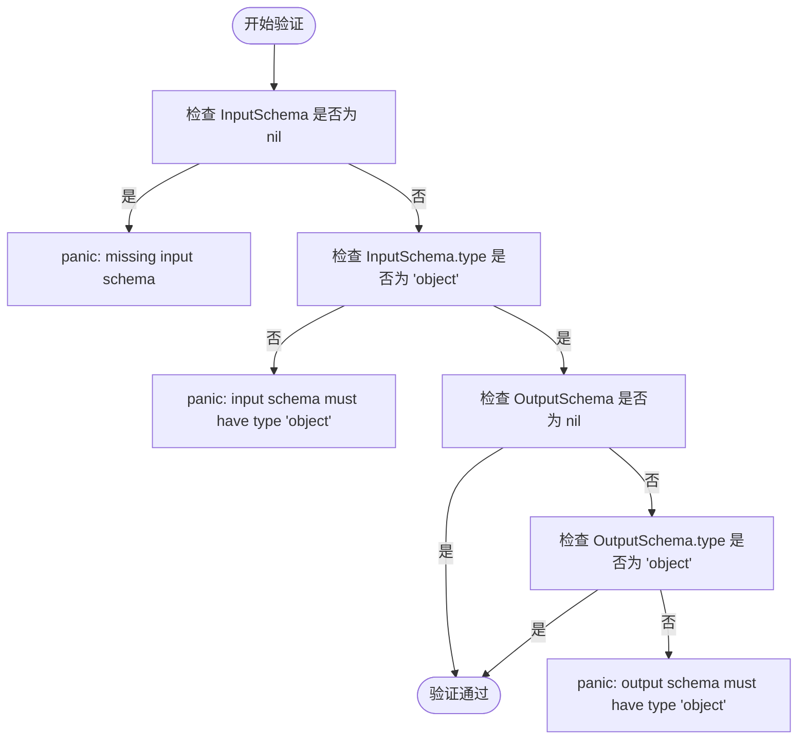
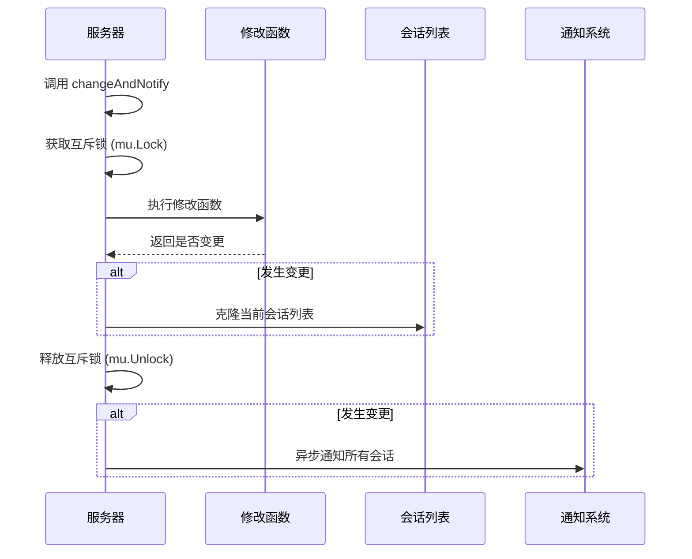
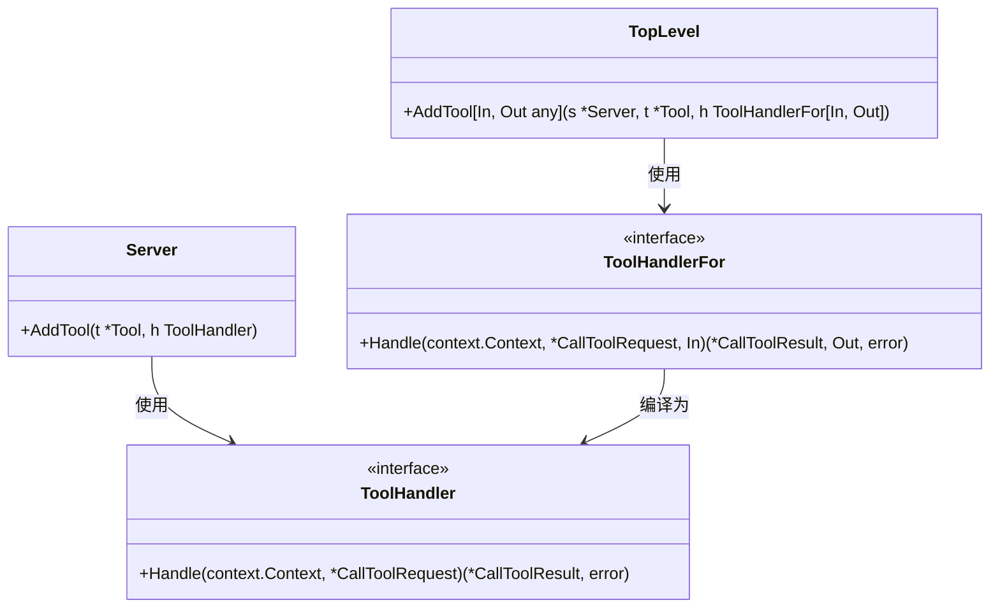

# 功能注册

<cite>
**本文档中引用的文件**   
- [server.go](file://mcp/server.go)
- [tool.go](file://mcp/tool.go)
- [prompt.go](file://mcp/prompt.go)
- [resource.go](file://mcp/resource.go)
- [protocol.go](file://mcp/protocol.go)
- [shared.go](file://mcp/shared.go)
- [util.go](file://mcp/util.go)
</cite>

## 目录
1. [简介](#简介)
2. [核心注册方法](#核心注册方法)
3. [参数约束与类型检查](#参数约束与类型检查)
4. [并发安全性与状态变更通知](#并发安全性与状态变更通知)
5. [Server.AddTool 与顶层 AddTool 函数对比](#serveraddtool-与顶层-addtool-函数对比)
6. [实际代码示例](#实际代码示例)
7. [最佳实践与常见陷阱](#最佳实践与常见陷阱)

## 简介
MCP（Model Context Protocol）服务器通过 `AddTool`、`AddPrompt` 和 `AddResource` 等核心方法实现功能组件的动态注册。这些方法允许服务器在运行时向客户端暴露工具、提示和资源，从而构建灵活的AI交互系统。本文档详细分析这些注册机制的实现细节，包括参数验证、并发控制和状态通知等关键方面。

## 核心注册方法

MCP服务器的核心功能注册机制由 `Server` 结构体提供，主要包含三个核心方法：`AddTool`、`AddPrompt` 和 `AddResource`。这些方法均采用统一的设计模式：通过 `changeAndNotify` 机制在修改内部状态后通知所有活跃会话。

### AddTool 方法
`AddTool` 方法用于向服务器注册一个工具。该方法首先对输入输出Schema进行严格验证，然后将工具及其处理器包装为 `serverTool` 结构体，并通过 `changeAndNotify` 机制更新状态。

**方法来源**
- [server.go](file://mcp/server.go#L191-L234)

### AddPrompt 方法
`AddPrompt` 方法用于注册提示（Prompt）。该方法相对简单，直接将提示及其处理器包装为 `serverPrompt` 结构体，并触发状态变更通知。

**方法来源**
- [server.go](file://mcp/server.go#L153-L160)

### AddResource 方法
`AddResource` 方法用于注册资源。该方法首先验证资源URI的有效性，然后将资源及其处理器包装为 `serverResource` 结构体，并触发状态变更通知。

**方法来源**
- [server.go](file://mcp/server.go#L422-L431)

## 参数约束与类型检查

### 输入输出Schema验证
`AddTool` 方法对输入输出Schema的验证是其核心安全机制。验证逻辑如下：

1. **输入Schema必须存在**：如果 `InputSchema` 为 `nil`，方法将直接panic，防止开发者忘记定义Schema。
2. **Schema类型必须为"object"**：无论是 `*jsonschema.Schema` 类型还是其他可序列化为JSON的对象，其 `type` 字段都必须是 `"object"`。
3. **输出Schema同理**：如果 `OutputSchema` 存在，其类型也必须是 `"object"`。

验证过程使用了 `remarshal` 辅助函数将任意Schema类型转换为标准的 `map[string]any` 格式进行检查。



**图示来源**
- [server.go](file://mcp/server.go#L191-L234)
- [util.go](file://mcp/util.go#L33-L42)

## 并发安全性与状态变更通知

### 并发安全机制
`Server` 结构体使用互斥锁 `sync.Mutex` 来保证所有状态变更操作的线程安全。所有对内部集合（如 `tools`、`prompts`、`resources`）的访问都必须在持有锁的情况下进行。

```go
s.mu.Lock()
// 修改状态
s.mu.Unlock()
```

### changeAndNotify 机制
`changeAndNotify` 是MCP服务器状态管理的核心。它采用"先修改后通知"的模式，确保状态变更的原子性。



**图示来源**
- [server.go](file://mcp/server.go#L497-L506)
- [shared.go](file://mcp/shared.go#L447-L468)

## Server.AddTool 与顶层 AddTool 函数对比

### Server.AddTool (低级API)
`Server.AddTool` 是低级API，要求调用者手动处理Schema验证和参数解码。它提供了最大的灵活性，但需要开发者承担更多责任。

**特点：**
- 不自动推断Schema
- 不自动验证输入参数
- 不自动处理输出结果
- 适用于需要完全控制的场景

### 顶层 AddTool (高级API)
顶层 `AddTool` 函数是泛型高级API，封装了大量自动化逻辑，强制工具符合MCP规范。



**图示来源**
- [server.go](file://mcp/server.go#L191-L234)
- [server.go](file://mcp/server.go#L405-L411)
- [tool.go](file://mcp/tool.go#L25-L45)

**优势：**
1. **自动Schema推断**：从Go类型自动推断输入输出Schema
2. **自动参数验证**：在调用处理器前自动验证输入参数
3. **自动结果处理**：自动将输出值填充到 `StructuredContent`
4. **错误处理标准化**：自动将处理器错误转换为工具错误而非协议错误

## 实际代码示例

### 注册简单工具
```go
// 定义工具处理器
toolHandler := func(ctx context.Context, req *mcp.CallToolRequest, input map[string]any) (*mcp.CallToolResult, any, error) {
    name, _ := input["name"].(string)
    return nil, fmt.Sprintf("Hello %s!", name), nil
}

// 创建工具定义
tool := &mcp.Tool{
    Name: "greet",
    Description: "Say hello to someone",
    InputSchema: &jsonschema.Schema{
        Type: "object",
        Properties: map[string]*jsonschema.Schema{
            "name": {Type: "string"},
        },
        Required: []string{"name"},
    },
}

// 注册工具
mcp.AddTool(server, tool, toolHandler)
```

### 注册带Schema推断的工具
```go
// 定义输入输出类型
type WeatherInput struct {
    Location string `json:"location"`
    Days     int    `json:"days"`
}

type WeatherOutput struct {
    Forecast string `json:"forecast"`
    Temp     int    `json:"temp"`
}

// 类型安全的处理器
weatherHandler := func(ctx context.Context, req *mcp.CallToolRequest, input WeatherInput) (*mcp.CallToolResult, WeatherOutput, error) {
    // 业务逻辑
    forecast := fmt.Sprintf("Sunny in %s for %d days", input.Location, input.Days)
    return nil, WeatherOutput{Forecast: forecast, Temp: 25}, nil
}

// 注册工具（自动推断Schema）
mcp.AddTool(server, &mcp.Tool{Name: "weather"}, weatherHandler)
```

**代码来源**
- [tool_example_test.go](file://mcp/tool_example_test.go#L190-L253)

## 最佳实践与常见陷阱

### 最佳实践
1. **使用高级API**：优先使用泛型 `AddTool` 函数而非低级 `Server.AddTool`
2. **定义清晰的Schema**：为所有工具明确定义输入输出Schema
3. **处理边界情况**：在处理器中妥善处理空值和异常情况
4. **保持处理器无状态**：避免在处理器中维护可变状态

### 常见陷阱
1. **忘记Schema**：使用 `Server.AddTool` 时忘记设置 `InputSchema`
2. **Schema类型错误**：将Schema的 `type` 设置为非 `"object"` 值
3. **并发修改**：在多个goroutine中同时调用注册方法而未正确同步
4. **资源泄漏**：注册的处理器持有大量内存或外部资源引用

**实践来源**
- [server_test.go](file://mcp/server_test.go#L58-L519)
- [conformance_test.go](file://mcp/conformance_test.go#L139-L331)