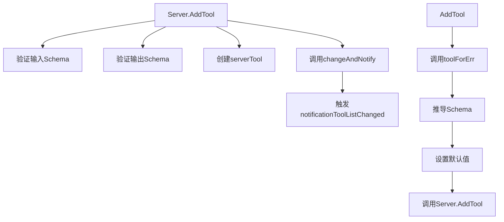
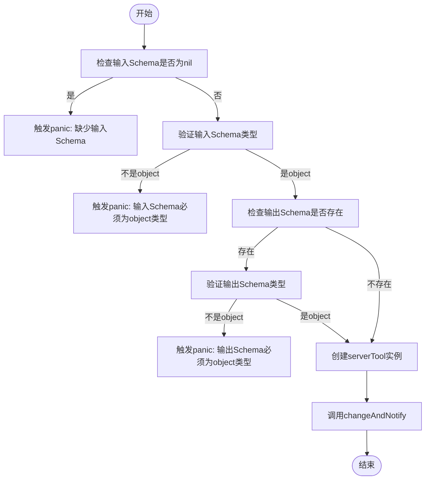
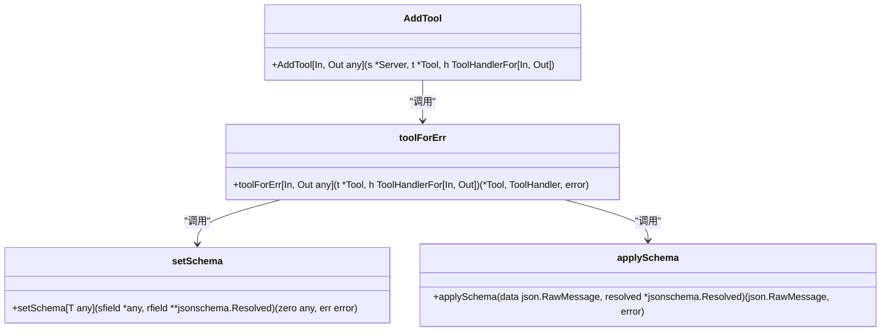
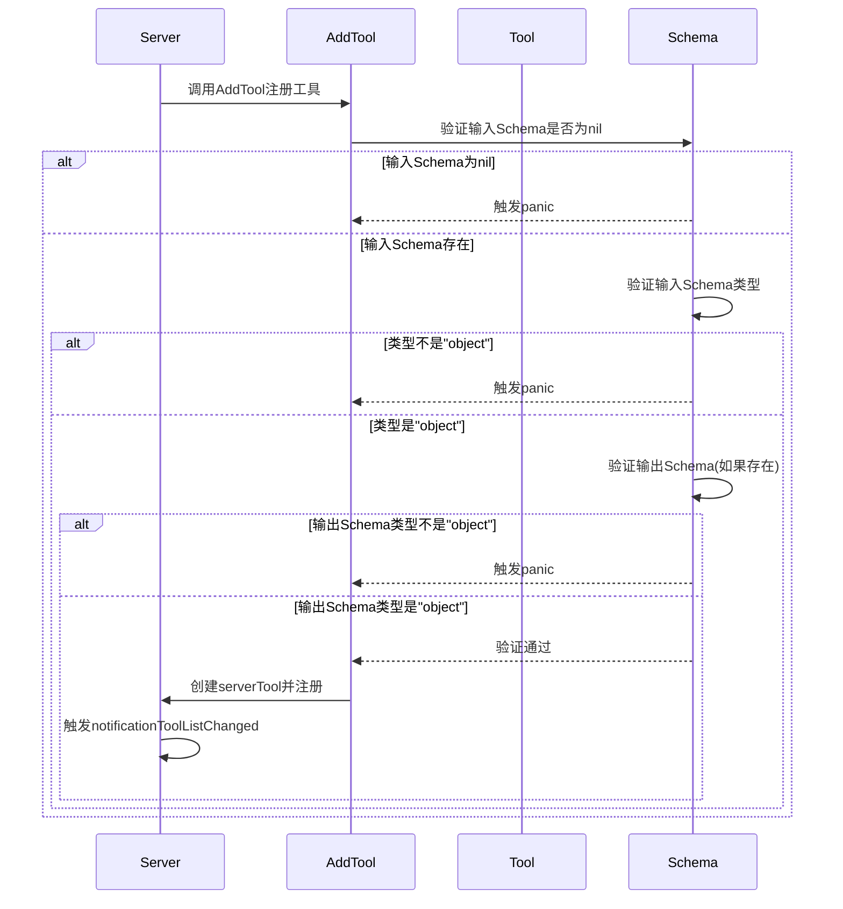
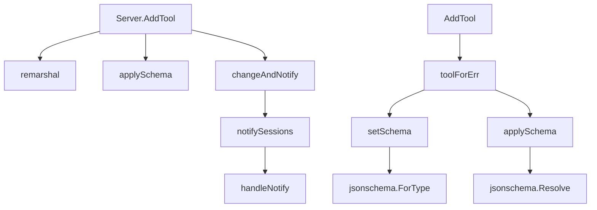

# 工具注册

<cite>
**本文档中引用的文件**  
- [server.go](file://mcp/server.go)
- [tool.go](file://mcp/tool.go)
- [protocol.go](file://mcp/protocol.go)
- [shared.go](file://mcp/shared.go)
- [main.go](file://examples/server/toolschemas/main.go)
</cite>

## 目录
1. [简介](#简介)
2. [核心组件](#核心组件)
3. [架构概述](#架构概述)
4. [详细组件分析](#详细组件分析)
5. [依赖分析](#依赖分析)
6. [性能考虑](#性能考虑)
7. [故障排除指南](#故障排除指南)
8. [结论](#结论)

## 简介
本文档详细介绍了MCP服务器中工具注册功能的实现机制，重点覆盖`Server.AddTool`方法和顶层`AddTool`泛型函数。文档解释了输入输出Schema的类型验证规则，特别是要求输入Schema必须为"object"类型的强制约束。同时说明了`Server.AddTool`与`AddTool`函数之间的关系：前者为底层注册接口，后者为泛型封装的高级API，能自动推导Go结构体对应的JSON Schema并处理参数解码与结果验证。提供了实际代码示例展示如何使用`AddTool`注册带结构化输入输出的工具，并说明在调用`AddTool`时如何正确设置Tool结构体字段。文档还包含错误处理场景，如Schema缺失或类型不匹配时的panic行为，以及并发注册时的线程安全保证（通过sync.Mutex实现）。同时说明工具注册后触发notificationToolListChanged通知的机制。

## 核心组件

`Server.AddTool`是MCP服务器中用于注册工具的核心方法，负责验证输入输出Schema的类型约束并确保其符合"object"类型要求。该方法在注册过程中执行严格的Schema验证，如果输入Schema为nil或类型不为"object"，将触发panic。`AddTool`泛型函数作为高级API封装了`Server.AddTool`，能够自动推导Go结构体对应的JSON Schema，处理参数解码与结果验证，简化了工具注册过程。`serverTool`结构体用于绑定工具定义与处理程序，`applySchema`函数负责验证数据是否符合提供的Schema并应用默认值。

**Section sources**
- [server.go](file://mcp/server.go#L191-L234)
- [tool.go](file://mcp/tool.go#L57-L60)
- [tool.go](file://mcp/tool.go#L57-L60)

## 架构概述

**Diagram sources**
- [server.go](file://mcp/server.go#L191-L234)
- [server.go](file://mcp/server.go#L405-L411)
- [server.go](file://mcp/server.go#L236-L347)

## 详细组件分析

### Server.AddTool方法分析

`Server.AddTool`方法是工具注册的底层接口，负责执行严格的Schema验证。该方法首先检查输入Schema是否为nil，如果是则触发panic，防止工具作者忘记提供必要的Schema。接着验证输入Schema的类型是否为"object"，如果不是则触发panic。对于输出Schema，如果存在则同样验证其类型是否为"object"。验证通过后，创建`serverTool`实例并调用`changeAndNotify`方法，该方法使用`sync.Mutex`保证并发注册时的线程安全，并在注册完成后触发`notificationToolListChanged`通知。

**Diagram sources**
- [server.go](file://mcp/server.go#L191-L234)

**Section sources**
- [server.go](file://mcp/server.go#L191-L234)

### AddTool泛型函数分析

`AddTool`泛型函数是工具注册的高级API，封装了`Server.AddTool`的复杂性。该函数接受两个类型参数`In`和`Out`，分别表示工具的输入和输出类型。函数内部调用`toolForErr`函数，该函数负责推导输入输出Schema、设置默认值并创建类型化的处理程序。`setSchema`函数用于设置与类型T对应的Schema和解析后的Schema，如果`sfield`为nil，则从T类型推导Schema。`toolForErr`函数返回的处理程序在调用时会自动验证输入、应用默认值、解码参数并验证输出，大大简化了工具开发者的负担。

**Diagram sources**
- [server.go](file://mcp/server.go#L405-L411)
- [server.go](file://mcp/server.go#L236-L347)
- [tool.go](file://mcp/tool.go#L57-L60)

**Section sources**
- [server.go](file://mcp/server.go#L405-L411)
- [server.go](file://mcp/server.go#L236-L347)

### Schema验证机制分析

Schema验证机制确保工具的输入输出符合MCP协议规范。`Server.AddTool`方法中的验证逻辑分为几个步骤：首先检查输入Schema是否为nil，然后验证其类型是否为"object"。验证过程支持两种Schema表示形式：`*jsonschema.Schema`类型和可序列化为JSON对象的任意类型。对于`*jsonschema.Schema`类型，直接检查其`Type`字段；对于其他类型，使用`remarshal`函数将其序列化为`map[string]any`后再检查`type`字段。输出Schema的验证逻辑类似，但仅在Schema存在时进行验证。这种双重验证机制确保了无论使用哪种Schema表示形式，都能正确执行类型检查。

**Diagram sources**
- [server.go](file://mcp/server.go#L191-L234)
- [util.go](file://mcp/util.go#L33-L42)

**Section sources**
- [server.go](file://mcp/server.go#L191-L234)

## 依赖分析

**Diagram sources**
- [server.go](file://mcp/server.go#L191-L234)
- [server.go](file://mcp/server.go#L405-L411)
- [server.go](file://mcp/server.go#L236-L347)
- [server.go](file://mcp/server.go#L497-L506)
- [util.go](file://mcp/util.go#L33-L42)
- [shared.go](file://mcp/shared.go#L535-L541)

**Section sources**
- [server.go](file://mcp/server.go#L191-L234)
- [server.go](file://mcp/server.go#L405-L411)
- [server.go](file://mcp/server.go#L236-L347)

## 性能考虑

工具注册操作的性能主要受Schema验证和并发控制的影响。`Server.AddTool`方法中的Schema验证是同步操作，对于复杂的Schema可能会有轻微的性能开销，但由于注册通常在服务器启动时完成，因此对运行时性能影响较小。并发注册通过`sync.Mutex`实现线程安全，确保在多goroutine环境下注册操作的原子性。`changeAndNotify`方法在持有锁的情况下执行注册操作，但仅在检测到变更时才克隆会话列表，减少了锁的持有时间。通知机制通过`notifySessions`函数异步发送，避免了阻塞注册操作。总体而言，工具注册的设计在保证正确性和线程安全的同时，也考虑了性能优化。

## 故障排除指南

### Schema验证错误
当工具的输入Schema为nil或类型不为"object"时，`Server.AddTool`方法会触发panic。解决方法是确保为工具提供有效的输入Schema，对于不需要输入的工具，应设置`InputSchema`为`{"type": "object"}`。如果使用自定义Schema，确保其`type`字段的值为"object"。

### 类型推导错误
使用`AddTool`泛型函数时，如果输入或输出类型无法正确推导Schema，`toolForErr`函数会返回错误并触发panic。确保输入输出类型为结构体或映射类型，以便能够推导出具有"type": "object"的Schema。对于指针类型，注意处理零值的情况。

### 并发注册问题
虽然`Server.AddTool`方法通过`sync.Mutex`保证了线程安全，但在高并发场景下可能会成为性能瓶颈。建议在服务器初始化阶段完成所有工具注册，避免在运行时频繁注册新工具。

### 通知机制失效
如果工具注册后未触发`notificationToolListChanged`通知，检查`changeAndNotify`方法的实现，确保在注册成功后正确调用了`notifySessions`函数。同时确认客户端已正确订阅相关通知。

**Section sources**
- [server.go](file://mcp/server.go#L191-L234)
- [server.go](file://mcp/server.go#L405-L411)
- [server.go](file://mcp/server.go#L236-L347)

## 结论
MCP服务器的工具注册功能通过`Server.AddTool`和`AddTool`两个层次的API提供了灵活而强大的工具管理能力。底层的`Server.AddTool`方法提供了精确的控制和严格的验证，确保工具符合协议规范；高级的`AddTool`泛型函数则通过类型推导和自动处理简化了开发流程。Schema验证机制强制要求输入输出Schema必须为"object"类型，保证了数据结构的一致性。并发控制通过`sync.Mutex`实现，确保了多goroutine环境下的线程安全。通知机制在工具列表变更时及时通知客户端，实现了动态工具管理。整体设计在保证正确性和安全性的同时，也考虑了易用性和性能，为构建可扩展的MCP服务器提供了坚实的基础。