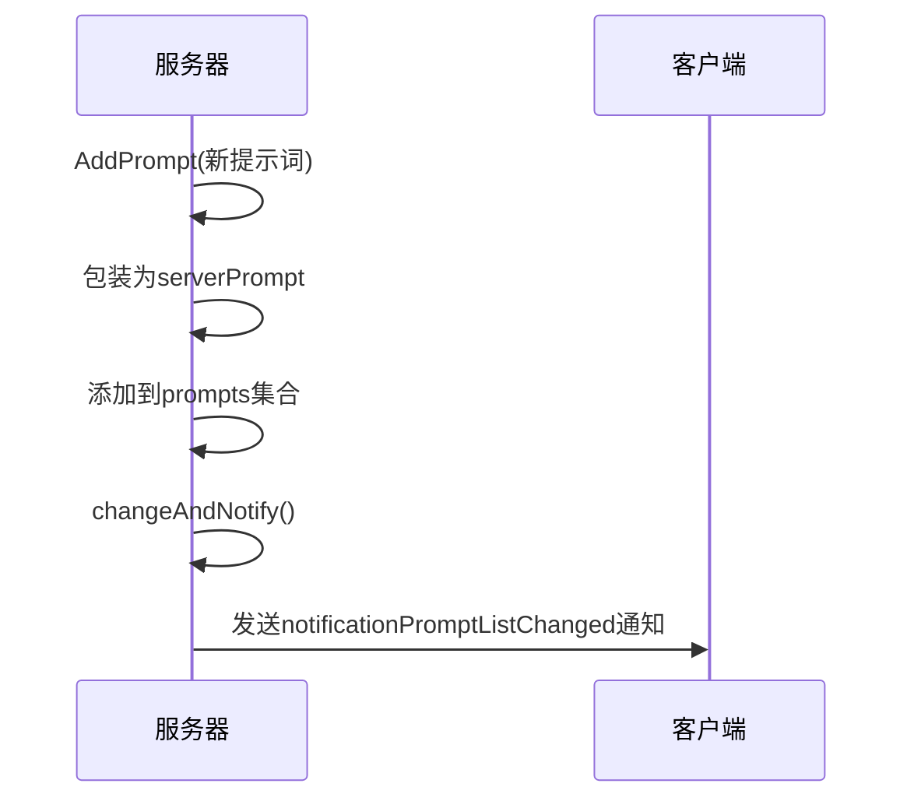
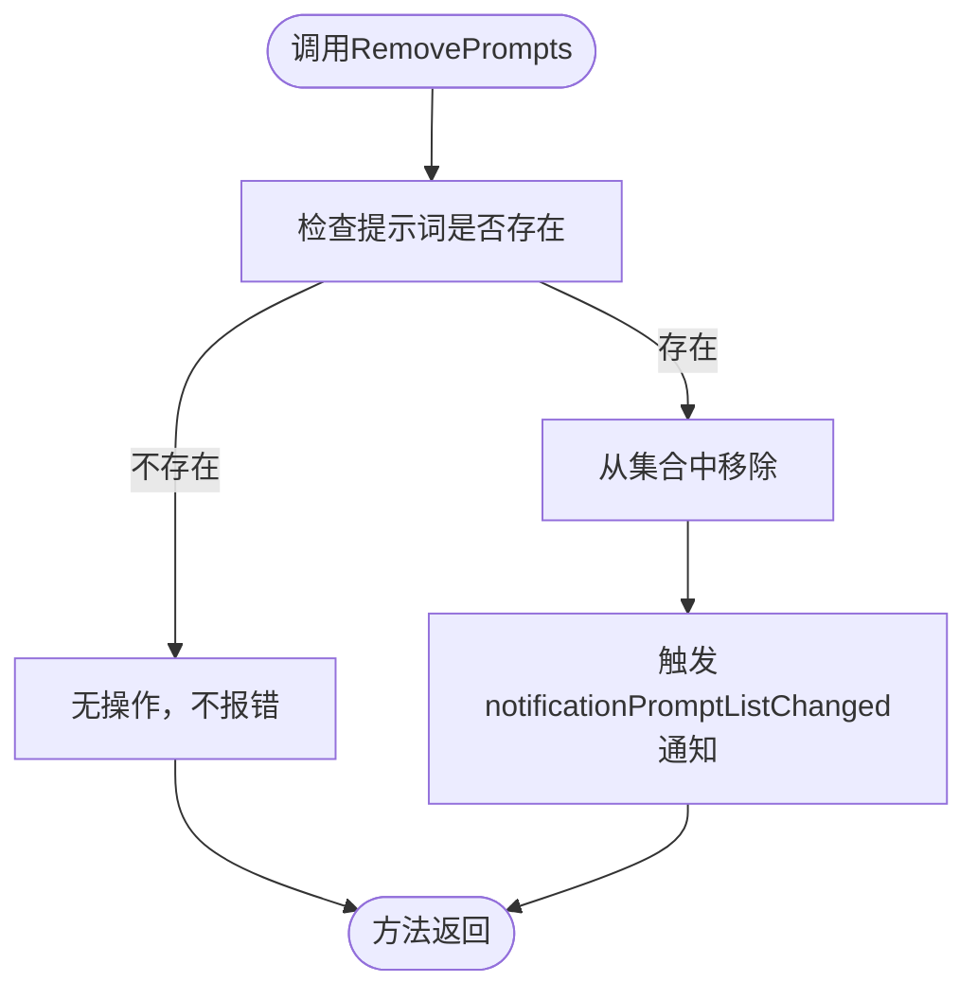
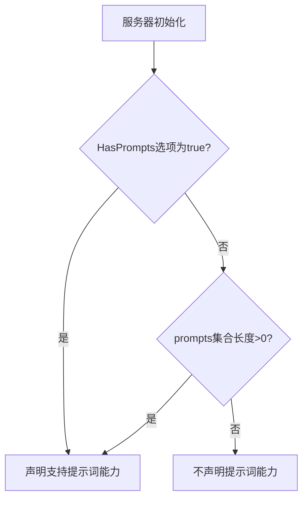
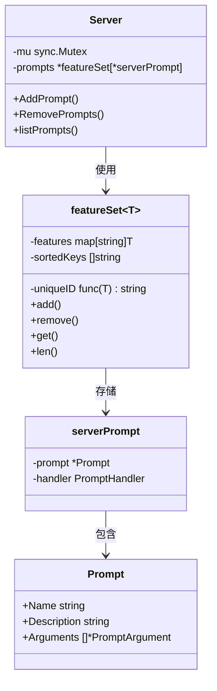

# 提示词注册

<cite>
**本文档中引用的文件**   
- [mcp/server.go](file://mcp/server.go)
- [mcp/prompt.go](file://mcp/prompt.go)
- [mcp/features.go](file://mcp/features.go)
- [mcp/protocol.go](file://mcp/protocol.go)
</cite>

## 目录
1. [简介](#简介)
2. [核心组件](#核心组件)
3. [AddPrompt方法行为语义](#addprompt方法行为语义)
4. [RemovePrompts方法幂等性设计](#removeprompts方法幂等性设计)
5. [提示词能力协商机制](#提示词能力协商机制)
6. [内部数据结构与并发安全](#内部数据结构与并发安全)
7. [代码示例](#代码示例)

## 简介
本文档详细说明了MCP服务器中提示词注册功能的实现机制，重点涵盖`AddPrompt`和`RemovePrompts`两个核心方法。文档解释了提示词注册时的行为语义、能力协商过程、内部数据结构设计以及并发访问控制策略，为开发者提供全面的技术参考。

## 核心组件

**Section sources**
- [mcp/server.go](file://mcp/server.go#L37-L51)
- [mcp/prompt.go](file://mcp/prompt.go#L13-L16)

## AddPrompt方法行为语义
`AddPrompt`方法用于向服务器注册一个提示词（Prompt）或替换同名的现有提示词。该方法接受一个`*Prompt`结构体和一个`PromptHandler`函数作为参数。

当调用`AddPrompt`时，系统会将提示词包装在一个`serverPrompt`结构体中，该结构体包含指向`Prompt`的指针和对应的处理函数。随后，通过`changeAndNotify`机制将这个`serverPrompt`实例添加到服务器的`prompts`功能集合中。

关键行为语义包括：
- **添加或替换**：如果注册的提示词名称已存在，新提示词将直接替换旧提示词，实现无缝更新。
- **变更通知**：无论是否发生实际替换，系统都假定有变更发生，并通过`changeAndNotify`机制触发`notificationPromptListChanged`通知。
- **客户端通知**：该通知会发送给所有已连接的客户端会话，告知它们提示词列表已变更，客户端可以据此刷新其本地缓存。



**Diagram sources**
- [mcp/server.go](file://mcp/server.go#L153-L160)
- [mcp/server.go](file://mcp/server.go#L497-L506)

**Section sources**
- [mcp/server.go](file://mcp/server.go#L153-L160)

## RemovePrompts方法幂等性设计
`RemovePrompts`方法用于移除一个或多个指定名称的提示词。该方法的设计遵循幂等性原则，即多次执行相同的操作具有相同的效果。

具体设计特点如下：
- **安全移除**：方法接受一个或多个提示词名称作为参数，尝试从内部集合中移除它们。
- **无错误容忍**：如果尝试移除的提示词不存在，该操作不会产生任何错误或异常。这是幂等性的核心体现，确保了调用者无需在移除前进行存在性检查。
- **变更检测**：内部的`featureSet.remove`方法会检测是否有实际的提示词被移除。只有在至少一个提示词被成功移除时，才会返回`true`，从而触发后续的变更通知。
- **通知机制**：与`AddPrompt`类似，只有在发生实际变更时，才会通过`changeAndNotify`机制向客户端发送`notificationPromptListChanged`通知。

这种设计简化了调用逻辑，提高了API的健壮性，允许开发者安全地执行“确保提示词不存在”的操作。



**Diagram sources**
- [mcp/server.go](file://mcp/server.go#L164-L167)
- [mcp/features.go](file://mcp/features.go#L49-L61)

**Section sources**
- [mcp/server.go](file://mcp/server.go#L164-L167)

## 提示词能力协商机制
服务器在与客户端建立连接的初始化阶段，会通过`capabilities`方法协商其支持的功能。提示词能力的声明取决于两个因素：

1.  **显式声明**：在创建服务器时，通过`ServerOptions`中的`HasPrompts`选项。如果此选项被设置为`true`，服务器将始终声明支持提示词能力，即使当前没有注册任何提示词。
2.  **动态检测**：如果`HasPrompts`为`false`（默认值），则服务器会检查内部`prompts`集合的长度。如果集合中至少有一个提示词（`s.prompts.len() > 0`），则声明支持提示词能力。

这种双重机制提供了灵活性：
- **预声明**：允许服务器在启动时就声明能力，即使提示词是动态加载的。
- **自动发现**：对于静态注册的提示词，服务器能自动根据注册情况决定是否声明能力。



**Diagram sources**
- [mcp/server.go](file://mcp/server.go#L462-L485)

**Section sources**
- [mcp/server.go](file://mcp/server.go#L462-L485)

## 内部数据结构与并发安全
提示词的内部管理依赖于一个泛型的`featureSet`数据结构，该结构使用`sync.Mutex`来保证并发访问的安全性。

### 数据结构
- **`featureSet[T]`**：一个泛型集合，用于管理特定类型的特性（如提示词、工具等）。
- **`features`**：一个`map[string]T`类型的哈希表，以特性的唯一ID（如提示词名称）为键，存储特性实例。这是核心的存储结构。
- **`uniqueID`**：一个函数指针，用于从特性实例中提取其唯一ID。
- **`sortedKeys`**：一个字符串切片，用于缓存已排序的键，以支持分页查询。

### 并发访问控制
- **互斥锁 (`sync.Mutex`)**：服务器的`mu`互斥锁保护所有对`prompts`、`tools`等`featureSet`实例的读写操作。
- **写操作**：`AddPrompt`和`RemovePrompts`等修改操作在执行时会获取锁，确保同一时间只有一个goroutine可以修改集合。
- **读操作**：`listPrompts`和`getPrompt`等查询操作同样需要获取锁，防止在读取过程中集合被修改，保证读取的一致性。
- **优化设计**：`changeAndNotify`方法采用“先修改后通知”的模式，锁的持有时间仅限于修改集合和克隆会话列表，通知操作在释放锁后进行，减少了锁的竞争。



**Diagram sources**
- [mcp/server.go](file://mcp/server.go#L43-L43)
- [mcp/features.go](file://mcp/features.go#L22-L26)
- [mcp/prompt.go](file://mcp/prompt.go#L13-L16)

**Section sources**
- [mcp/server.go](file://mcp/server.go#L42-L42)
- [mcp/features.go](file://mcp/features.go#L22-L26)

## 代码示例
以下是一个如何定义`Prompt`结构体并将其注册到服务器的代码示例：

```go
// 创建一个提示词处理函数
promptHandler := func(ctx context.Context, req *mcp.GetPromptRequest) (*mcp.GetPromptResult, error) {
    return &mcp.GetPromptResult{
        Description: "打招呼提示词",
        Messages: []*mcp.PromptMessage{
            {
                Role:    "user",
                Content: &mcp.TextContent{Text: "向 " + req.Params.Arguments["name"] + " 问好"},
            },
        },
    }, nil
}

// 定义一个Prompt结构体
prompt := &mcp.Prompt{
    Name: "greet",
    Title: "打招呼",
    Description: "生成一个友好的问候语",
    Arguments: []*mcp.PromptArgument{
        {
            Name:        "name",
            Title:       "姓名",
            Description: "要问候的人的名字",
            Required:    true,
        },
    },
}

// 将提示词和处理函数注册到服务器
server.AddPrompt(prompt, promptHandler)
```

**Section sources**
- [mcp/protocol.go](file://mcp/protocol.go#L661-L675)
- [mcp/server_example_test.go](file://mcp/server_example_test.go#L18-L83)