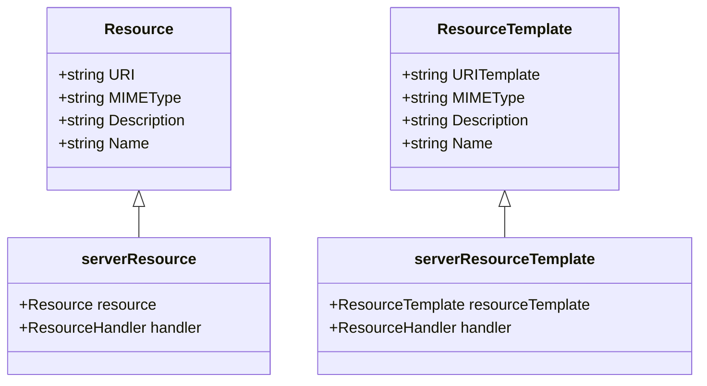
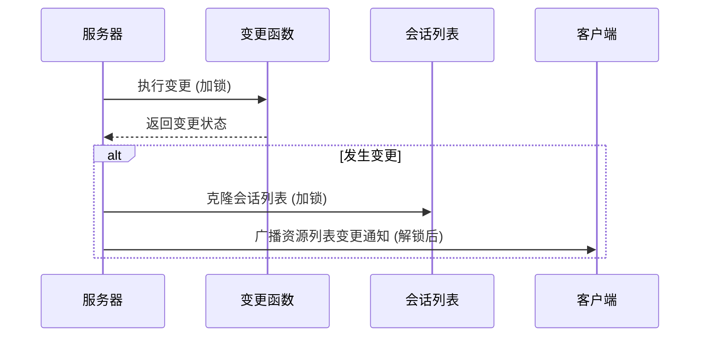
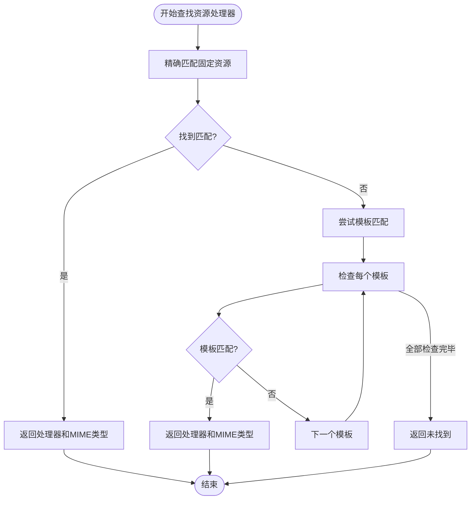

# 资源注册

<cite>
**本文档引用的文件**   
- [server.go](file://mcp/server.go)
- [resource.go](file://mcp/resource.go)
- [protocol.go](file://mcp/protocol.go)
</cite>

## 目录
1. [简介](#简介)
2. [核心注册方法](#核心注册方法)
3. [资源与资源模板的区别](#资源与资源模板的区别)
4. [变更通知机制](#变更通知机制)
5. [资源处理器注册示例](#资源处理器注册示例)
6. [移除操作的幂等性](#移除操作的幂等性)
7. [资源查找优先级](#资源查找优先级)

## 简介
本文档详细说明MCP服务器中资源注册功能的核心机制，重点涵盖`AddResource`和`AddResourceTemplate`两个核心方法的实现逻辑、校验规则和使用方式。文档将深入解析资源URI的校验机制、URI模板的语法验证、变更通知的触发流程，以及资源查找时的匹配优先级。

## 核心注册方法

### AddResource方法
`AddResource`方法用于向服务器注册一个固定URI的资源。该方法在注册前会对资源的URI进行严格校验。

**URI校验逻辑**：
- 方法内部调用`url.Parse(r.URI)`对传入的资源URI进行解析
- 如果解析失败（例如URI格式错误或不是绝对URI），`url.Parse`会返回错误
- 一旦校验失败，方法会立即触发`panic`，并携带详细的错误信息
- 校验的关键要求是：URI必须为绝对URI且scheme不能为空，否则将导致程序中断

**Section sources**
- [server.go](file://mcp/server.go#L422-L431)

### AddResourceTemplate方法
`AddResourceTemplate`方法用于向服务器注册一个支持模式匹配的资源模板。该方法通过`uritemplate`库对URI模板进行语法验证。

**URI模板语法验证机制**：
- 方法内部调用`uritemplate.New(t.URITemplate)`创建URI模板对象
- `uritemplate`库会根据RFC 6570标准对模板语法进行解析和验证
- 如果模板语法无效（例如包含非法字符或格式错误），`New`方法会返回错误
- 验证失败时，方法会触发`panic`，并提供包含模板内容和具体错误原因的详细错误信息
- 与`AddResource`类似，URI模板也必须是绝对URI且scheme非空

**Section sources**
- [server.go](file://mcp/server.go#L442-L453)

## 资源与资源模板的区别

### 固定资源 (Resource)
- 对应一个**固定、精确的URI**
- 适用于已知且不变的资源路径
- 注册后，只有完全匹配该URI的请求才能被处理
- 数据结构定义在`Resource`类型中，包含URI、MIME类型、描述等元数据

### 资源模板 (ResourceTemplate)
- 对应一个**URI模式或模板**
- 支持动态路径匹配，如`/files/{filename}`或`/users/{id}/profile`
- 适用于具有相同处理逻辑但路径不同的资源集合
- 使用RFC 6570标准的URI模板语法
- 数据结构定义在`ResourceTemplate`类型中，包含`URITemplate`字段而非固定URI



**Diagram sources **
- [protocol.go](file://mcp/protocol.go#L753-L784)
- [protocol.go](file://mcp/protocol.go#L797-L824)
- [resource.go](file://mcp/resource.go#L23-L26)
- [resource.go](file://mcp/resource.go#L29-L32)

## 变更通知机制

### changeAndNotify机制
当资源或资源模板发生变更时，系统通过`changeAndNotify`机制触发通知，以广播变更事件。

**工作流程**：
1. `AddResource`和`AddResourceTemplate`方法内部调用`changeAndNotify`
2. `changeAndNotify`接收三个参数：通知类型、参数对象和变更函数
3. 在互斥锁保护下执行变更函数（如添加资源到集合）
4. 如果变更函数返回`true`表示确实发生了变更
5. 收集当前所有会话的快照
6. 解锁后向所有会话异步发送`notificationResourceListChanged`通知

**通知类型**：
- 使用常量`notificationResourceListChanged`（值为`"notifications/resources/list_changed"`）
- 客户端收到此通知后，可刷新其资源列表缓存



**Diagram sources **
- [server.go](file://mcp/server.go#L497-L506)
- [protocol.go](file://mcp/protocol.go#L1157-L1157)

**Section sources**
- [server.go](file://mcp/server.go#L497-L506)

## 资源处理器注册示例

### 本地文件系统资源处理器
`fileResourceHandler`函数用于创建一个处理本地文件系统资源的处理器，可将其绑定到特定目录。

**使用示例**：
```go
// 创建一个绑定到"/var/data"目录的文件资源处理器
handler := fileResourceHandler("/var/data")

// 将处理器注册到特定URI
server.AddResource(&Resource{
    URI:   "file:///var/data/config.json",
    Name:  "配置文件",
}, handler)

// 或注册为模板，支持目录下所有文件
server.AddResourceTemplate(&ResourceTemplate{
    URITemplate: "file:///var/data/{filename}",
    Name:       "数据文件模板",
}, handler)
```

**安全特性**：
- 自动将传入的目录转换为绝对路径
- 防止路径遍历攻击（如`../`）
- 支持符号链接保护（Go 1.24+）
- 尊重客户端根目录限制

**Section sources**
- [server.go](file://mcp/server.go#L660-L695)

## 移除操作的幂等性

### RemoveResources和RemoveResourceTemplates
`RemoveResources`和`RemoveResourceTemplates`方法具有幂等性语义。

**幂等性保证**：
- 移除一个不存在的资源或资源模板**不会产生错误**
- 方法总是成功返回，无论目标是否存在
- 这种设计允许调用者无需事先检查资源是否存在
- 适用于清理操作和配置更新场景

**实现方式**：
- 两个方法都通过`featureSet.remove`方法实现移除逻辑
- `featureSet`内部集合操作天然支持幂等性
- 返回值`bool`表示是否实际发生了变更

**Section sources**
- [server.go](file://mcp/server.go#L435-L438)
- [server.go](file://mcp/server.go#L457-L460)

## 资源查找优先级

### lookupResourceHandler匹配逻辑
当读取资源时，`lookupResourceHandler`方法按照严格的优先级顺序进行匹配。

**优先级匹配流程**：
1. **精确匹配**：首先在`resources`集合中查找与请求URI完全匹配的固定资源
2. **模板匹配**：如果精确匹配失败，则遍历`resourceTemplates`集合
3. **逐个检查**：对每个资源模板调用`Matches`方法，使用`uritemplate`库的正则表达式进行模式匹配
4. **返回结果**：一旦找到匹配项，立即返回对应的处理器和MIME类型
5. **未找到**：如果两者都未匹配，则返回`nil`处理器和`false`标志

**匹配优先级**：
- **固定资源优先于模板匹配**
- 这确保了特定资源的配置不会被通用模板覆盖
- 避免了潜在的意外行为



**Diagram sources **
- [server.go](file://mcp/server.go#L640-L654)

**Section sources**
- [server.go](file://mcp/server.go#L640-L654)