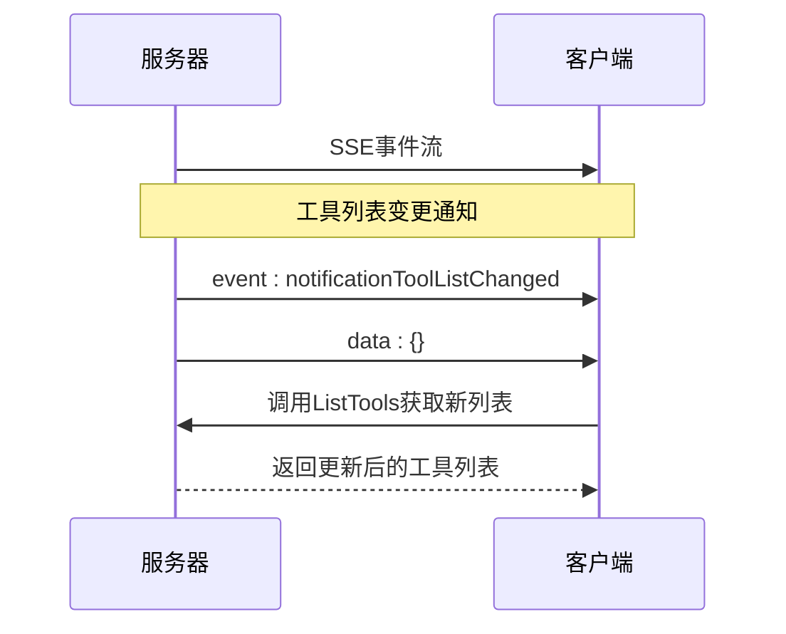
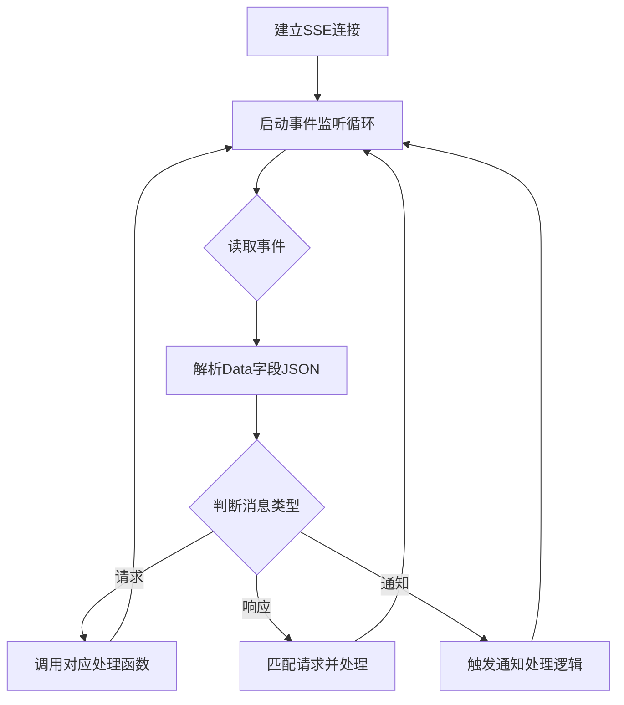

# 事件系统 API

<cite>
**本文档引用的文件**   
- [event.go](file://mcp/event.go)
- [sse.go](file://mcp/sse.go)
- [server.go](file://mcp/server.go)
- [client.go](file://mcp/client.go)
</cite>

## 目录
1. [简介](#简介)
2. [Event结构体核心字段语义](#event结构体核心字段语义)
3. [SSE传输机制与序列化格式](#sse传输机制与序列化格式)
4. [事件通知机制应用](#事件通知机制应用)
5. [事件监听与处理代码示例](#事件监听与处理代码示例)

## 简介
事件系统API基于服务器发送事件（SSE）协议，为MCP（Model Context Protocol）提供实时消息传输能力。该系统通过Event结构体封装消息内容，利用SSE的流式传输特性实现服务器到客户端的单向实时通信。事件系统在工具列表变更、资源更新等场景中发挥关键作用，确保客户端能够及时获取服务器状态变化。

**Section sources**
- [event.go](file://mcp/event.go#L30-L34)
- [sse.go](file://mcp/sse.go#L104-L124)

## Event结构体核心字段语义
Event结构体是事件系统的核心数据单元，包含三个关键字段：Name、ID和Data，分别对应SSE协议的event、id和data字段。

- **Name字段**：表示事件类型，用于标识事件的类别。例如，"message"表示普通消息事件，"endpoint"表示会话端点事件。客户端根据Name字段判断事件类型并进行相应处理。
- **ID字段**：表示事件的唯一标识符，用于事件追踪和断点续传。当客户端连接中断后重新连接时，可通过Last-Event-ID头信息指定从特定ID之后的事件开始接收，确保消息不丢失。
- **Data字段**：包含事件的实际数据内容，类型为字节切片。在MCP协议中，Data字段通常承载JSON-RPC格式的消息，实现结构化数据传输。

这三个字段共同构成了SSE协议的基本事件单元，为上层应用提供了可靠的消息传输基础。

**Section sources**
- [event.go](file://mcp/event.go#L30-L34)

## SSE传输机制与序列化格式
事件系统采用SSE（Server-Sent Events）作为传输协议，通过HTTP长连接实现服务器到客户端的单向实时消息推送。SSE的序列化格式严格遵循"key: value"的文本格式，每个事件由一个或多个字段组成，字段间以换行符分隔，事件间以两个连续换行符分隔。

```mermaid
flowchart TD
A[客户端发起GET请求] --> B[服务器建立长连接]
B --> C[服务器发送事件流]
C --> D[事件格式: event: message]
D --> E[事件格式: id: 1]
E --> F[事件格式: data: {JSON-RPC消息}]
F --> G[双换行符结束事件]
G --> C
```

**Diagram sources **
- [event.go](file://mcp/event.go#L42-L56)
- [sse.go](file://mcp/sse.go#L104-L124)

事件的序列化过程由`writeEvent`函数实现，该函数将Event结构体转换为符合SSE规范的文本格式。对于连续的data字段，SSE协议规定应使用换行符连接。服务器通过`http.Flusher`接口实时刷新缓冲区，确保事件能够及时送达客户端。客户端则通过`scanEvents`函数解析SSE流，将文本格式的事件重新构造成Event结构体实例。

## 事件通知机制应用
事件通知机制在MCP系统中广泛应用于动态状态同步场景，特别是在工具列表变更和资源更新等需要实时通知的场合。

当服务器端的工具列表发生变化时，系统会触发`notificationToolListChanged`事件，通知所有连接的客户端工具列表已更新。客户端收到该通知后，可主动调用`ListTools`方法获取最新的工具列表，确保工具调用的准确性和时效性。



**Diagram sources **
- [server.go](file://mcp/server.go#L100-L150)
- [client.go](file://mcp/client.go#L200-L250)

类似地，当服务器端的资源发生更新时，系统会触发`notificationResourceUpdated`事件。客户端在订阅了特定资源后，将收到此类通知，从而能够及时刷新本地缓存或重新读取资源内容。这种基于事件的主动通知机制相比轮询方式，显著降低了网络开销，提高了系统响应速度。

## 事件监听与处理代码示例
事件监听与处理主要通过客户端的事件循环实现。客户端从SSE流中读取事件，解析Data字段中的JSON-RPC消息，并根据消息类型进行相应处理。



**Diagram sources **
- [client.go](file://mcp/client.go#L500-L755)
- [sse.go](file://mcp/sse.go#L300-L400)

在代码实现中，客户端通过`Read`方法从连接中读取消息，该方法内部调用`scanEvents`解析SSE流。对于每个事件，首先将Data字段的JSON数据解码为`jsonrpc.Message`对象，然后根据消息类型分发到相应的处理函数。对于通知类消息，系统会调用预注册的处理函数；对于请求类消息，系统会生成响应并返回；对于响应类消息，系统会匹配对应的请求并完成调用。