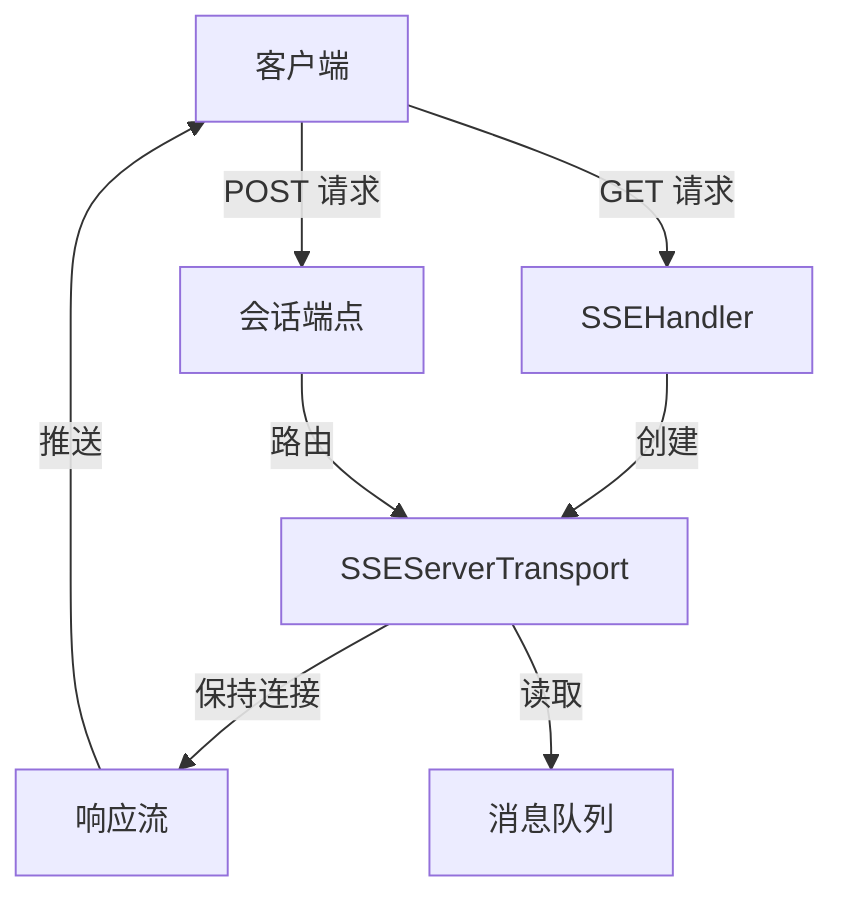
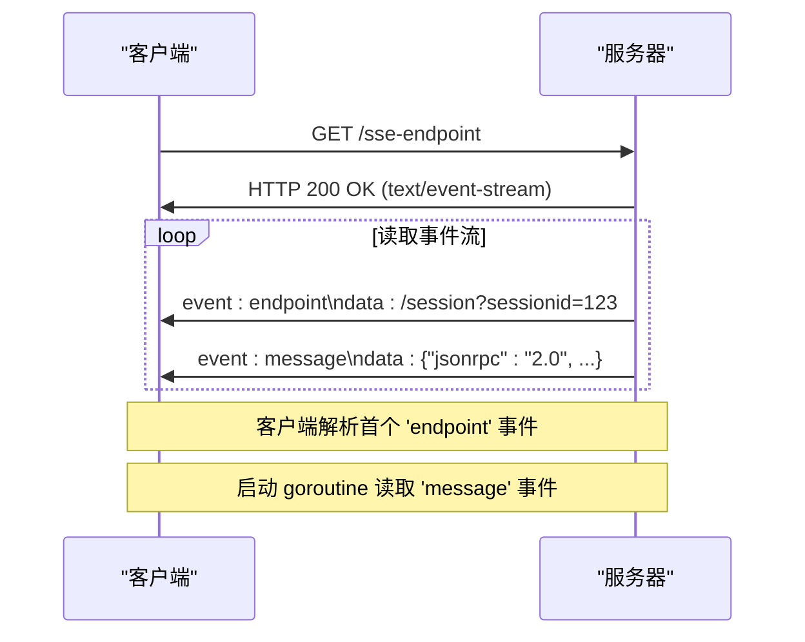
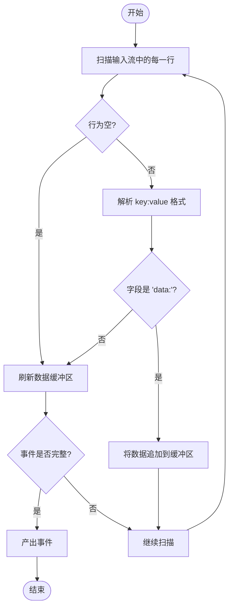
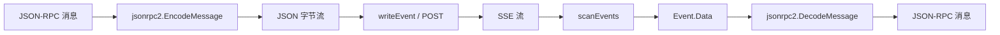

# SSE 传输 API

<cite>
**Referenced Files in This Document**   
- [mcp/sse.go](file://mcp/sse.go)
- [mcp/transport.go](file://mcp/transport.go)
- [mcp/event.go](file://mcp/event.go)
- [internal/jsonrpc2/frame.go](file://internal/jsonrpc2/frame.go)
</cite>

## 目录
1. [引言](#引言)
2. [SSE 传输架构概述](#sse-传输架构概述)
3. [SSEServerTransport 结构体分析](#sseservertransport-结构体分析)
4. [SSEClientTransport 连接流程](#sseclienttransport-连接流程)
5. [底层连接实现](#底层连接实现)
6. [SSE 事件处理](#sse-事件处理)
7. [与 JSON-RPC 协议栈的集成](#与-json-rpc-协议栈的集成)
8. [结论](#结论)

## 引言

SSE（Server-Sent Events）传输 API 提供了一种基于 HTTP 服务器发送事件的通信机制，用于在客户端和服务器之间建立持久的、单向的服务器到客户端的消息流。该机制遵循 MCP 规范的 2024-11-05 版本，通过简单的协议实现高效的消息传递。本技术文档将系统性地描述该传输机制的实现细节，包括核心结构体、连接流程、底层连接实现以及与 JSON-RPC 协议栈的集成方式。

**Section sources**
- [mcp/sse.go](file://mcp/sse.go#L1-L50)

## SSE 传输架构概述

SSE 传输机制的核心是通过一个持久的 GET 请求来建立服务器到客户端的消息流。客户端首先发起一个 GET 请求，服务器将此请求保持打开状态，并通过该连接将消息作为 SSE 'message' 事件推送给客户端。同时，服务器会通过一个 'endpoint' 事件告知客户端一个用于发送消息的端点，客户端通过向该端点发送 POST 请求来向服务器发送消息。

该架构主要由以下几个核心组件构成：
- **SSEHandler**：作为 `http.Handler`，负责处理所有传入的 HTTP 请求，管理会话的创建和消息的路由。
- **SSEServerTransport**：表示一个逻辑上的 SSE 会话，封装了服务器端的传输逻辑。
- **SSEClientTransport**：表示客户端的传输逻辑，负责发起连接并处理消息流。
- **sseServerConn 和 sseClientConn**：底层连接实现，分别封装了服务器和客户端的读写操作。



**Diagram sources**
- [mcp/sse.go](file://mcp/sse.go#L43-L50)
- [mcp/sse.go](file://mcp/sse.go#L104-L124)

**Section sources**
- [mcp/sse.go](file://mcp/sse.go#L1-L50)

## SSEServerTransport 结构体分析

`SSEServerTransport` 结构体是服务器端 SSE 会话的核心，它封装了会话所需的所有状态和同步原语。其字段定义如下：

- **Endpoint**：字符串类型，表示客户端用于发送消息的会话端点。
- **Response**：`http.ResponseWriter` 类型，表示用于向客户端推送消息的挂起 GET 请求的响应体。
- **incoming**：`chan jsonrpc.Message` 类型，是一个消息队列，用于存储从客户端 POST 请求接收到的传入消息。
- **mu**：`sync.Mutex` 类型，互斥锁，用于保护对 `incoming` 消息队列和 `Response` 响应写入器的并发访问。
- **closed**：布尔类型，标志位，当流关闭时设置为 `true`。
- **done**：`chan struct{}` 类型，通道，当连接关闭时被关闭，用于通知读取操作终止。

该结构体实现了 `http.Handler` 接口，通过 `ServeHTTP` 方法处理客户端的 POST 请求。当收到 POST 请求时，它会读取请求体，解析为 JSON-RPC 消息，并将其推入 `incoming` 通道。由于多个 POST 请求可能并发到达，因此必须使用 `mu` 互斥锁来确保对 `incoming` 通道和 `Response` 的安全访问。

```mermaid
classDiagram
class SSEServerTransport {
+string Endpoint
+http.ResponseWriter Response
+chan jsonrpc.Message incoming
+sync.Mutex mu
+bool closed
+chan struct{} done
+ServeHTTP(w http.ResponseWriter, req *http.Request)
+Connect(context.Context) (Connection, error)
}
```

**Diagram sources**
- [mcp/sse.go](file://mcp/sse.go#L104-L124)
- [mcp/sse.go](file://mcp/sse.go#L127-L159)

**Section sources**
- [mcp/sse.go](file://mcp/sse.go#L104-L124)

## SSEClientTransport 连接流程

`SSEClientTransport` 结构体负责客户端的连接流程。其连接过程如下：

1. **发起初始 GET 请求**：客户端调用 `Connect` 方法，首先向服务器的 `Endpoint` 发起一个 GET 请求，并在请求头中设置 `Accept: text/event-stream`，表明期望接收 SSE 流。
2. **解析 'endpoint' 事件**：客户端收到服务器的响应后，会立即读取 SSE 流中的第一个事件。该事件必须是名为 'endpoint' 的事件，其数据部分包含了客户端用于发送消息的会话端点 URL。
3. **启动消息读取 goroutine**：在成功解析 'endpoint' 事件后，客户端会启动一个 goroutine，持续从 SSE 流中读取后续的 'message' 事件，并将事件数据推入一个缓冲通道 `incoming` 中。
4. **返回连接**：最后，客户端创建并返回一个 `sseClientConn` 实例，该实例封装了与服务器的逻辑连接。



**Diagram sources**
- [mcp/sse.go](file://mcp/sse.go#L334-L397)

**Section sources**
- [mcp/sse.go](file://mcp/sse.go#L324-L331)

## 底层连接实现

底层连接由 `sseServerConn` 和 `sseClientConn` 两个结构体实现，它们都实现了 `Connection` 接口，封装了 JSON-RPC 2.0 消息的读写操作。

### sseServerConn

`sseServerConn` 代表服务器端的逻辑连接，其主要方法如下：
- **Read**：从 `SSEServerTransport` 的 `incoming` 通道中消费消息。它使用 `select` 语句监听上下文取消、消息到达和连接关闭三个通道。
- **Write**：将 JSON-RPC 消息编码为 SSE 'message' 事件，并写入 `Response` 响应体。在写入前会检查 `closed` 标志位，确保不会向已关闭的连接写入数据。
- **Close**：关闭连接，通过设置 `closed` 标志位并关闭 `done` 通道来通知所有相关操作终止。

### sseClientConn

`sseClientConn` 代表客户端的逻辑连接，其主要方法如下：
- **Read**：从内部的 `incoming` 通道中消费消息。该通道由读取 SSE 流的 goroutine 填充。
- **Write**：将 JSON-RPC 消息编码后，通过 POST 请求发送到 `msgEndpoint`（即从 'endpoint' 事件中解析出的会话端点）。
- **Close**：关闭连接，通过设置 `closed` 标志位、关闭底层响应体和 `done` 通道来终止所有操作。

```mermaid
classDiagram
class sseServerConn {
+t *SSEServerTransport
+Read(ctx context.Context) (jsonrpc.Message, error)
+Write(ctx context.Context, msg jsonrpc.Message) error
+Close() error
}
class sseClientConn {
+client *http.Client
+msgEndpoint *url.URL
+incoming chan []byte
+mu sync.Mutex
+body io.ReadCloser
+closed bool
+done chan struct{}
+Read(ctx context.Context) (jsonrpc.Message, error)
+Write(ctx context.Context, msg jsonrpc.Message) error
+Close() error
}
sseServerConn --> SSEServerTransport : "包含"
sseClientConn --> SSEClientTransport : "包含"
```

**Diagram sources**
- [mcp/sse.go](file://mcp/sse.go#L260-L262)
- [mcp/sse.go](file://mcp/sse.go#L404-L413)

**Section sources**
- [mcp/sse.go](file://mcp/sse.go#L260-L302)
- [mcp/sse.go](file://mcp/sse.go#L418-L467)

## SSE 事件处理

SSE 事件的处理依赖于 `mcp/event.go` 文件中定义的 `Event` 结构体和相关函数。

- **Event 结构体**：定义了 SSE 事件的三个核心字段：`Name`（事件类型，如 'message' 或 'endpoint'）、`ID`（事件 ID）和 `Data`（事件数据，字节切片）。
- **writeEvent 函数**：负责将 `Event` 实例格式化为符合 SSE 规范的文本，并写入 `io.Writer`。它会根据字段是否为空来决定是否输出 `event:`、`id:` 和 `data:` 行，并在最后添加两个换行符作为记录分隔符。如果写入器实现了 `http.Flusher` 接口，则会立即刷新缓冲区，确保消息能及时发送到客户端。
- **scanEvents 函数**：负责解析从客户端读取的 SSE 流。它使用 `bufio.Scanner` 逐行扫描输入流，并根据 SSE 规范解析 `event:`、`id:` 和 `data:` 字段。连续的 `data:` 行会被合并，并用换行符连接。



**Diagram sources**
- [mcp/event.go](file://mcp/event.go#L30-L34)
- [mcp/event.go](file://mcp/event.go#L42-L56)

**Section sources**
- [mcp/event.go](file://mcp/event.go#L30-L145)

## 与 JSON-RPC 协议栈的集成

SSE 传输机制与底层的 JSON-RPC 协议栈通过 `jsonrpc2.Reader` 和 `jsonrpc2.Writer` 接口进行集成。

- **Reader 接口**：`sseServerConn.Read` 和 `sseClientConn.Read` 方法都实现了 `jsonrpc2.Reader` 接口。它们从各自的通道中读取原始的字节数据，然后调用 `jsonrpc2.DecodeMessage` 函数将其解码为具体的 JSON-RPC 消息（如 `*jsonrpc.Request` 或 `*jsonrpc.Response`）。
- **Writer 接口**：`sseServerConn.Write` 和 `sseClientConn.Write` 方法都实现了 `jsonrpc2.Writer` 接口。它们首先调用 `jsonrpc2.EncodeMessage` 函数将 JSON-RPC 消息编码为 JSON 字节流，然后分别通过 `writeEvent` 函数（服务器端）或 POST 请求（客户端）将编码后的消息发送出去。

这种设计使得 SSE 传输层与 JSON-RPC 协议层完全解耦。传输层只负责消息的可靠传递，而协议层则专注于消息的序列化和反序列化。这为未来支持其他传输机制（如 WebSocket 或 gRPC）提供了良好的扩展性。



**Diagram sources**
- [internal/jsonrpc2/frame.go](file://internal/jsonrpc2/frame.go#L24-L27)
- [internal/jsonrpc2/frame.go](file://internal/jsonrpc2/frame.go#L36-L39)

**Section sources**
- [internal/jsonrpc2/frame.go](file://internal/jsonrpc2/frame.go#L24-L39)

## 结论

本文档详细描述了基于 HTTP 服务器发送事件（SSE）的传输机制。通过分析 `SSEServerTransport` 和 `SSEClientTransport` 的结构体字段、连接流程以及底层 `sseServerConn` 和 `sseClientConn` 的实现，我们理解了该机制如何利用 HTTP 的持久连接和事件流特性来实现高效的双向通信。同时，通过 `Event` 结构体和 `writeEvent`/`scanEvents` 函数，我们了解了 SSE 事件的编码和解码过程。最后，该机制通过实现 `jsonrpc2.Reader` 和 `jsonrpc2.Writer` 接口，与底层的 JSON-RPC 协议栈无缝集成，展示了清晰的分层架构和良好的可扩展性。