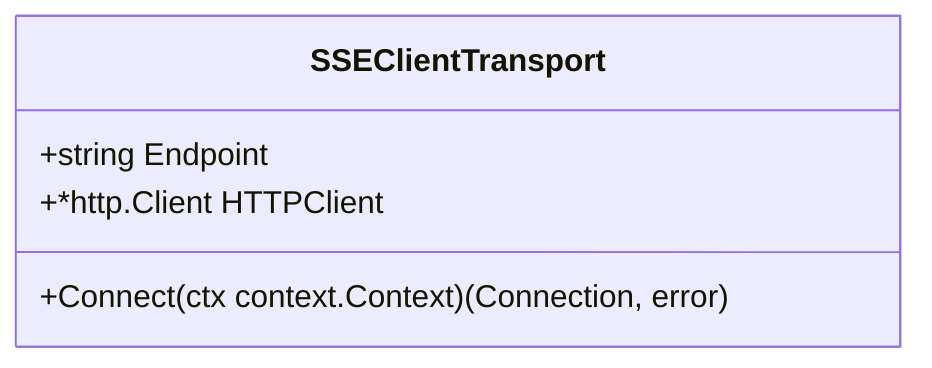
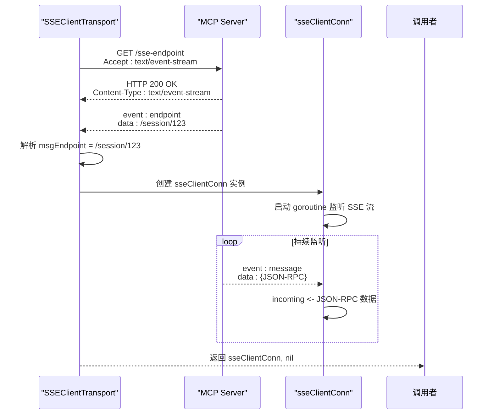
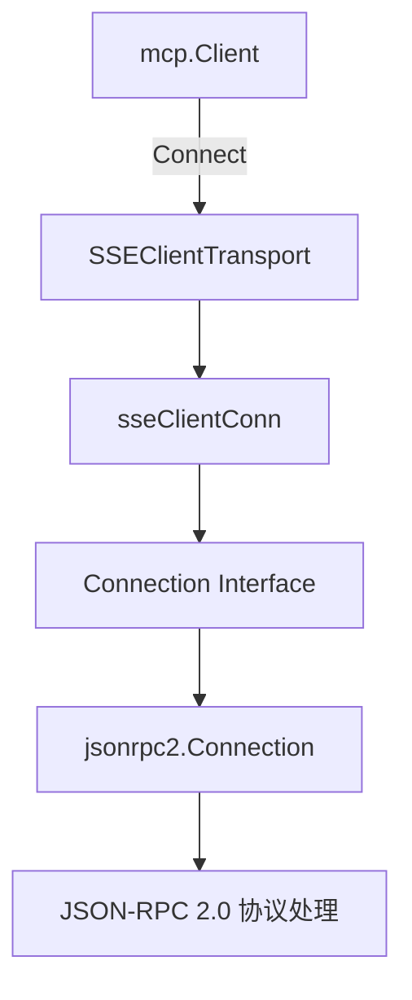

# SSE 客户端传输

<cite>
**Referenced Files in This Document**  
- [mcp/sse.go](file://mcp/sse.go)
- [mcp/transport.go](file://mcp/transport.go)
- [internal/jsonrpc2/conn.go](file://internal/jsonrpc2/conn.go)
- [examples/server/sse/main.go](file://examples/server/sse/main.go)
</cite>

## 目录
1. [简介](#简介)
2. [SSEClientTransport 结构体分析](#sseclienttransport-结构体分析)
3. [Connect 方法执行流程](#connect-方法执行流程)
4. [sseClientConn 连接实现解析](#sseclientconn-连接实现解析)
5. [与 JSON-RPC 协议栈的集成](#与-json-rpc-协议栈的集成)
6. [使用示例](#使用示例)
7. [错误处理](#错误处理)

## 简介
本文档系统性地描述了 MCP（Model Context Protocol）SDK 中 SSE（Server-Sent Events）客户端传输的实现细节。重点分析了 `SSEClientTransport` 结构体及其核心方法 `Connect` 的执行流程，深入解析了底层连接 `sseClientConn` 的工作机制，并说明了其如何与 `jsonrpc2.Connection` 接口无缝集成，为客户端提供可靠的双向通信能力。

**Section sources**
- [mcp/sse.go](file://mcp/sse.go#L324-L331)

## SSEClientTransport 结构体分析
`SSEClientTransport` 是一个实现了 `Transport` 接口的结构体，用于建立与 MCP 服务器的 SSE 连接。它包含两个核心字段：

- **Endpoint**: 一个字符串字段，指定要连接的 SSE 端点 URL。客户端将向此 URL 发起初始的 GET 请求以建立长连接。
- **HTTPClient**: 一个 `*http.Client` 类型的指针字段，用于自定义发起 HTTP 请求的客户端。如果此字段为 `nil`，则在连接时会默认使用 `http.DefaultClient`。

该结构体的设计允许用户灵活地配置连接的端点和底层 HTTP 客户端，例如可以注入自定义的超时、重试逻辑或中间件。



**Diagram sources**
- [mcp/sse.go](file://mcp/sse.go#L324-L331)

**Section sources**
- [mcp/sse.go](file://mcp/sse.go#L324-L331)

## Connect 方法执行流程
`Connect` 方法是 `SSEClientTransport` 的核心，负责建立与服务器的完整会话。其执行流程如下：

1.  **发起初始 GET 请求**：方法首先使用 `http.NewRequestWithContext` 创建一个针对 `Endpoint` 的 GET 请求。请求的 `Accept` 头被明确设置为 `text/event-stream`，以告知服务器客户端期望接收服务器发送的事件流。
2.  **处理 HTTP 客户端**：如果 `SSEClientTransport.HTTPClient` 字段不为 `nil`，则使用该自定义客户端；否则，使用 `http.DefaultClient` 来执行上述 GET 请求。
3.  **解析首个 'endpoint' 事件**：成功建立 GET 连接后，客户端会从响应体中读取服务器发送的第一个事件。根据 MCP 规范，这个事件的名称必须是 `endpoint`。该事件的数据部分包含了一个新的 URL，即会话专用的 POST 端点（`msgEndpoint`），客户端后续将通过此端点向服务器发送消息。
4.  **启动消息监听 goroutine**：在成功获取 `msgEndpoint` 后，方法会创建一个 `sseClientConn` 实例。随后，它会启动一个独立的 goroutine，该 goroutine 会持续调用 `scanEvents` 函数来监听服务器通过 SSE 流发送的后续事件（如 `message` 事件）。每当收到一个事件，其数据部分（即 JSON-RPC 消息）就会被放入 `sseClientConn.incoming` 通道中，供上层读取。

如果在上述任何步骤中发生错误（如网络问题、无效的端点或未收到预期的 `endpoint` 事件），`Connect` 方法都会返回相应的错误，并确保已打开的响应体被正确关闭。



**Diagram sources**
- [mcp/sse.go](file://mcp/sse.go#L334-L397)

**Section sources**
- [mcp/sse.go](file://mcp/sse.go#L334-L397)

## sseClientConn 连接实现解析
`sseClientConn` 是 `SSEClientTransport.Connect` 方法返回的实际连接对象，它实现了 `Connection` 接口，为上层提供了 `Read`、`Write` 和 `Close` 方法。

- **incoming 通道**：该结构体包含一个名为 `incoming` 的有缓冲通道（容量为100），用于异步地缓冲从服务器 SSE 流中接收到的入站消息。`Connect` 方法中启动的 goroutine 负责将解析出的事件数据推送到此通道。`Read` 方法则从此通道消费数据，实现了非阻塞的读取。
- **Write 方法**：`Write` 方法用于将 JSON-RPC 消息发送到服务器。它首先将 `jsonrpc.Message` 编码为 JSON 字节。然后，它会创建一个 POST 请求，目标 URL 为 `msgEndpoint`，请求体为编码后的 JSON，并设置 `Content-Type` 为 `application/json`。最后，使用 `sseClientConn.client`（即 `SSEClientTransport` 中指定的 HTTP 客户端）发送此请求。如果服务器返回的 HTTP 状态码不是 2xx，`Write` 方法会返回一个错误。
- **Read 方法**：`Read` 方法从 `incoming` 通道中取出一个 JSON 字节切片，然后使用 `jsonrpc2.DecodeMessage` 将其解码为 `jsonrpc.Message` 对象。该方法会处理上下文取消和连接关闭的情况。
- **Close 方法**：`Close` 方法是线程安全的，它通过 `sync.Mutex` 保护，确保连接只能被关闭一次。它会关闭底层的 SSE GET 请求的响应体（`body`），并关闭 `done` 通道，从而通知所有监听的 goroutine 终止。

```mermaid
classDiagram
class sseClientConn {
+*http.Client client
+*url.URL msgEndpoint
+chan []byte incoming
+sync.Mutex mu
+io.ReadCloser body
+bool closed
+chan struct{} done
+Read(ctx context.Context) (jsonrpc.Message, error)
+Write(ctx context.Context, msg jsonrpc.Message) error
+Close() error
+isDone() bool
}
```

**Diagram sources**
- [mcp/sse.go](file://mcp/sse.go#L404-L413)

**Section sources**
- [mcp/sse.go](file://mcp/sse.go#L404-L478)

## 与 JSON-RPC 协议栈的集成
`SSEClientTransport` 及其返回的 `sseClientConn` 实现了 `mcp.Connection` 接口，该接口定义了 `Read`、`Write` 和 `Close` 方法。这使得 SSE 传输层能够与上层的 JSON-RPC 协议栈无缝集成。

当 `mcp.Client` 调用 `Connect` 方法时，它会接收一个 `Connection` 对象。`Client` 内部会使用 `jsonrpc2.NewConnection` 函数，将这个 `Connection` 的 `Reader` 和 `Writer` 适配为 `jsonrpc2.Reader` 和 `jsonrpc2.Writer`。这样，`jsonrpc2` 包就能利用 `sseClientConn` 提供的读写能力，来处理 JSON-RPC 消息的编码、解码、请求/响应匹配和错误处理，而无需关心底层是通过 SSE 还是其他传输方式（如 stdio）进行通信的。



**Diagram sources**
- [mcp/transport.go](file://mcp/transport.go#L39-L60)
- [internal/jsonrpc2/conn.go](file://internal/jsonrpc2/conn.go#L60-L72)

**Section sources**
- [mcp/transport.go](file://mcp/transport.go#L39-L60)
- [internal/jsonrpc2/conn.go](file://internal/jsonrpc2/conn.go#L60-L72)

## 使用示例
以下是一个使用 `SSEClientTransport` 连接到 MCP 服务器的典型示例：

```go
// 创建 SSE 客户端传输，指定服务器的 SSE 端点
transport := &mcp.SSEClientTransport{
    Endpoint: "http://localhost:8080/greeter1",
    // 可选：使用自定义的 HTTP 客户端
    HTTPClient: &http.Client{Timeout: 30 * time.Second},
}

// 创建 MCP 客户端
client := mcp.NewClient(&mcp.Implementation{Name: "my-client", Version: "v1.0.0"}, nil)

// 建立连接
ctx := context.Background()
cs, err := client.Connect(ctx, transport, nil)
if err != nil {
    log.Fatal(err)
}
defer cs.Close()

// 使用连接调用工具
res, err := cs.CallTool(ctx, &mcp.CallToolParams{
    Name:      "greet1",
    Arguments: map[string]any{"Name": "Alice"},
})
if err != nil {
    log.Fatal(err)
}
fmt.Println(res.Content[0].(*mcp.TextContent).Text)
```

**Section sources**
- [examples/server/sse/main.go](file://examples/server/sse/main.go#L45-L70)

## 错误处理
在使用 SSE 客户端传输时，可能会遇到多种错误：
- **网络错误**：在 `Connect` 或 `Write` 过程中，由于网络问题（如连接超时、主机不可达）导致的错误，通常会由底层的 `http.Client` 抛出。
- **协议错误**：如果服务器返回的首个事件不是 `endpoint`，或者其数据无法解析为有效的 URL，`Connect` 方法会返回一个明确的错误。
- **连接关闭**：当调用 `Close` 方法或底层连接因错误而中断时，后续的 `Read` 和 `Write` 操作都会返回 `io.EOF` 或 `ErrConnectionClosed` 错误。

客户端代码应妥善处理这些错误，例如通过重试机制来应对临时的网络故障。

**Section sources**
- [mcp/sse.go](file://mcp/sse.go#L334-L397)
- [mcp/transport.go](file://mcp/transport.go#L22-L23)