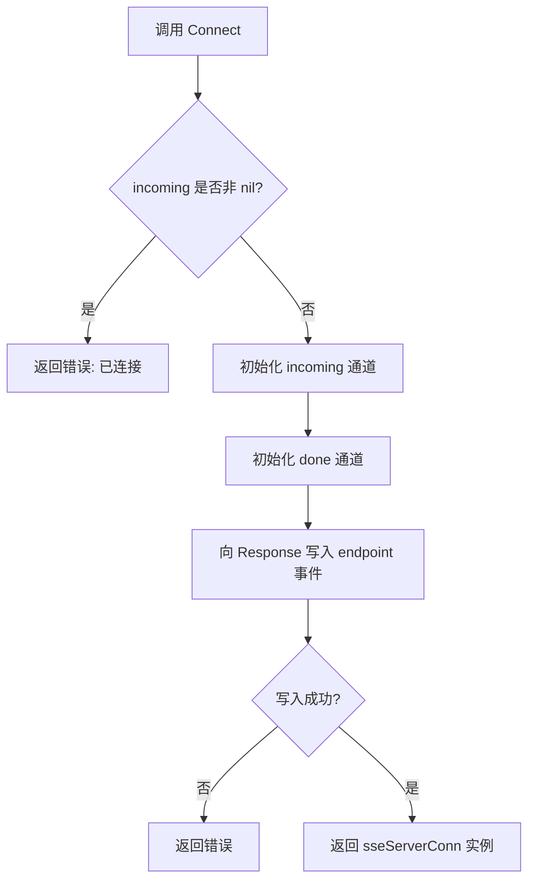
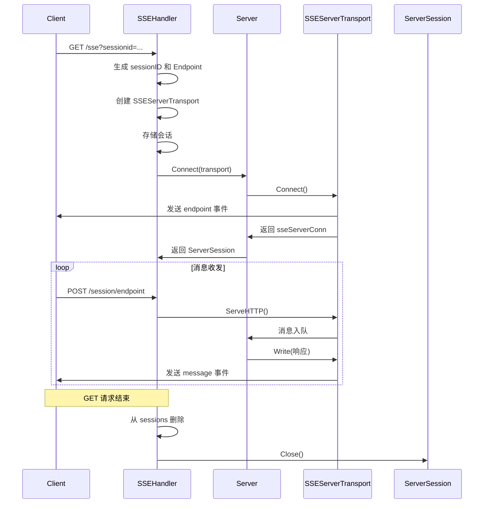

# SSE 服务器传输

<cite>
**Referenced Files in This Document**   
- [mcp/sse.go](file://mcp/sse.go)
- [mcp/transport.go](file://mcp/transport.go)
- [internal/jsonrpc2/jsonrpc2.go](file://internal/jsonrpc2/jsonrpc2.go)
- [mcp/server.go](file://mcp/server.go)
- [examples/server/sse/main.go](file://examples/server/sse/main.go)
</cite>

## 目录
1. [引言](#引言)
2. [SSEServerTransport 结构体设计](#sbservetransport-结构体设计)
3. [ServeHTTP 方法处理 POST 请求](#servehttp-方法处理-post-请求)
4. [Connect 方法建立会话](#connect-方法建立会话)
5. [SSEHandler 与会话生命周期管理](#ssehandler-与会话生命周期管理)
6. [MCP 服务器集成示例](#mcp-服务器集成示例)
7. [与 jsonrpc2 接口的集成](#与-jsonrpc2-接口的集成)

## 引言

SSE（Server-Sent Events）服务器传输机制是 MCP（Model Context Protocol）协议中一种基于 HTTP 的通信方式，它允许服务器向客户端单向推送事件流。在 Go MCP SDK 中，`SSEServerTransport` 结构体实现了这一机制的核心逻辑，作为 `http.Handler` 处理客户端的 POST 消息，并通过长轮询 GET 请求维持连接。本文档将深入解析 `SSEServerTransport` 的设计原理、字段职责、关键方法实现以及其在整个 MCP 会话生命周期中的作用。

## SSEServerTransport 结构体设计

`SSEServerTransport` 结构体是 SSE 传输机制的核心，它封装了会话所需的所有状态和控制逻辑。其设计遵循了并发安全和资源管理的最佳实践。

**Section sources**
- [mcp/sse.go](file://mcp/sse.go#L104-L124)

### 字段职责解析

- **Endpoint**: 一个字符串字段，表示客户端用于发送 POST 消息的目标地址。该地址在会话建立时动态生成，确保每个会话的独立性。
- **Response**: 一个 `http.ResponseWriter` 类型的字段，保存了长轮询 GET 请求的响应写入器。服务器通过此写入器向客户端发送事件流。
- **incoming**: 一个 `chan jsonrpc.Message` 类型的通道，作为入站消息队列。所有从客户端 POST 请求解析出的 JSON-RPC 消息都会被推入此队列，供上层应用消费。
- **mu**: 一个 `sync.Mutex` 互斥锁，用于同步控制。它保护对 `Response` 写入器和 `incoming` 通道的访问，防止在并发的 POST 请求和 GET 请求退出时发生竞态条件。
- **closed**: 一个布尔标志，当流被关闭时设置为 `true`。它与 `mu` 一起使用，确保在关闭后不再向 `Response` 写入数据。
- **done**: 一个 `chan struct{}` 通道，当连接关闭时被关闭。其他 goroutine 可以监听此通道来感知连接状态的变化。

```mermaid
classDiagram
class SSEServerTransport {
+string Endpoint
+http.ResponseWriter Response
+chan jsonrpc.Message incoming
-sync.Mutex mu
-bool closed
-chan struct{} done
+Connect(context.Context) (Connection, error)
+ServeHTTP(w http.ResponseWriter, req *http.Request)
}
```

**Diagram sources**
- [mcp/sse.go](file://mcp/sse.go#L104-L124)

## ServeHTTP 方法处理 POST 请求

`ServeHTTP` 方法实现了 `http.Handler` 接口，专门用于处理客户端发往 `Endpoint` 的 POST 请求。它负责消息的读取、解析、验证和入队。

**Section sources**
- [mcp/sse.go](file://mcp/sse.go#L127-L159)

### 处理流程

1.  **连接状态检查**: 首先检查 `t.incoming` 是否为 `nil`。如果为 `nil`，说明会话尚未通过 `Connect` 方法建立，返回 `500 Internal Server Error`。
2.  **消息读取**: 使用 `io.ReadAll(req.Body)` 读取 POST 请求的整个消息体。
3.  **JSON-RPC 解析**: 调用 `jsonrpc2.DecodeMessage(data)` 将原始字节数据解析为 `jsonrpc.Message` 对象。如果解析失败，返回 `400 Bad Request`。
4.  **请求验证**: 如果消息是 `*jsonrpc.Request` 类型，则调用 `checkRequest(req, serverMethodInfos)` 进行方法名和参数的验证。验证失败同样返回 `400 Bad Request`。
5.  **消息入队**: 使用 `select` 语句尝试将解析后的消息推入 `t.incoming` 通道。如果 `t.done` 通道已关闭（表示连接已终止），则返回 `400 Bad Request`。否则，成功入队后返回 `202 Accepted` 状态码。

```mermaid
sequenceDiagram
participant Client
participant SSEServerTransport
participant jsonrpc2
Client->>SSEServerTransport : POST /session/endpoint
SSEServerTransport->>SSEServerTransport : 检查连接状态
alt 会话未连接
SSEServerTransport-->>Client : 500 Internal Server Error
return
end
SSEServerTransport->>SSEServerTransport : 读取请求体
SSEServerTransport->>jsonrpc2 : DecodeMessage(数据)
alt 解析失败
SSEServerTransport-->>Client : 400 Bad Request
return
end
alt 是请求且验证失败
SSEServerTransport-->>Client : 400 Bad Request
return
end
SSEServerTransport->>SSEServerTransport : select {
alt 成功推入 incoming 通道
SSEServerTransport-->>Client : 202 Accepted
else done 通道关闭
SSEServerTransport-->>Client : 400 Bad Request
end
```

**Diagram sources**
- [mcp/sse.go](file://mcp/sse.go#L127-L159)

## Connect 方法建立会话

`Connect` 方法是 `Transport` 接口的一部分，用于启动会话流程。它负责初始化内部状态并向客户端发送首个事件。

**Section sources**
- [mcp/sse.go](file://mcp/sse.go#L163-L177)

### 建立流程

1.  **连接状态检查**: 检查 `t.incoming` 是否已存在。如果存在，说明该 `SSEServerTransport` 实例已被连接过，返回错误，确保每个实例只能连接一次。
2.  **初始化队列**: 创建容量为 100 的 `incoming` 消息通道和 `done` 信号通道。
3.  **发送 endpoint 事件**: 调用 `writeEvent(t.Response, Event{Name: "endpoint", Data: []byte(t.Endpoint)})`，向 `Response` 写入器发送一个名为 `endpoint` 的事件，其数据为 `Endpoint` 字符串。这使得客户端能够获知用于发送后续消息的 POST 地址。
4.  **返回连接实例**: 创建并返回一个 `sseServerConn` 实例，该实例封装了底层的通信逻辑，实现了 `Connection` 接口。



**Diagram sources**
- [mcp/sse.go](file://mcp/sse.go#L163-L177)

## SSEHandler 与会话生命周期管理

`SSEHandler` 是一个顶层的 `http.Handler`，它管理着所有 `SSEServerTransport` 会话的生命周期。它处理两种请求：创建新会话的 GET 请求和向现有会话发送消息的 POST 请求。

**Section sources**
- [mcp/sse.go](file://mcp/sse.go#L179-L256)

### 会话生命周期

1.  **会话创建 (Session Creation)**:
    *   客户端发起一个 `Accept: text/event-stream` 的 GET 请求。
    *   `SSEHandler.ServeHTTP` 生成一个唯一的 `sessionID` 和对应的 `Endpoint`。
    *   创建一个新的 `SSEServerTransport` 实例，并将其存储在 `sessions` 映射中。
2.  **连接建立 (Connection Establishment)**:
    *   调用 `server.Connect(req.Context(), transport, nil)`，将 `SSEServerTransport` 作为 `Transport` 参数。
    *   `SSEServerTransport.Connect` 方法被调用，向客户端发送 `endpoint` 事件，并返回 `sseServerConn`。
    *   `Server` 内部的 `jsonrpc2` 连接被建立，开始处理消息。
3.  **消息收发 (Message Exchange)**:
    *   **客户端 -> 服务器**: 客户端向 `Endpoint` 发送 POST 请求。`SSEHandler` 根据 `sessionid` 查找对应的 `SSEServerTransport`，并调用其 `ServeHTTP` 方法处理消息。
    *   **服务器 -> 客户端**: 服务器通过 `sseServerConn.Write` 方法将消息写入 `SSEServerTransport.Response`，以 `message` 事件的形式推送给客户端。
4.  **连接关闭 (Connection Closure)**:
    *   当 GET 请求结束（客户端断开或超时）时，`defer` 函数会从 `sessions` 映射中删除该会话。
    *   `defer ss.Close()` 会关闭 `jsonrpc2` 连接，进而触发 `sseServerConn.Close()`，关闭 `done` 通道并标记 `closed` 状态。



**Diagram sources**
- [mcp/sse.go](file://mcp/sse.go#L179-L256)

## MCP 服务器集成示例

以下是一个在 MCP 服务器中集成 SSE 传输的典型示例。

**Section sources**
- [examples/server/sse/main.go](file://examples/server/sse/main.go)

### 代码示例

```go
func main() {
    // 创建 MCP 服务器实例
    server := mcp.NewServer(&mcp.Implementation{Name: "greeter"}, nil)
    mcp.AddTool(server, &mcp.Tool{Name: "greet", Description: "say hi"}, SayHi)

    // 创建 SSEHandler
    handler := mcp.NewSSEHandler(func(request *http.Request) *mcp.Server {
        // 根据 URL 路径路由到不同的服务器
        switch request.URL.Path {
        case "/greeter":
            return server
        default:
            return nil
        }
    }, nil)

    // 启动 HTTP 服务器
    log.Fatal(http.ListenAndServe(":8080", handler))
}
```

此示例创建了一个 MCP 服务器，并使用 `NewSSEHandler` 将其暴露为 HTTP 服务。`getServer` 函数根据请求路径返回相应的服务器实例。

## 与 jsonrpc2 接口的集成

`SSEServerTransport` 通过 `sseServerConn` 结构体与 `jsonrpc2` 包的 `Reader` 和 `Writer` 接口无缝集成。

**Section sources**
- [mcp/sse.go](file://mcp/sse.go#L260-L317)

### Reader 接口实现

`sseServerConn.Read` 方法实现了 `jsonrpc2.Reader` 接口：
*   它从 `t.incoming` 通道接收消息。
*   支持通过 `context.Context` 取消读取操作。
*   当 `t.done` 通道关闭时，返回 `io.EOF`，表示连接已关闭。

### Writer 接口实现

`sseServerConn.Write` 方法实现了 `jsonrpc2.Writer` 接口：
*   它使用 `jsonrpc2.EncodeMessage(msg)` 将 `jsonrpc.Message` 编码为 JSON 字节。
*   在 `mu` 互斥锁的保护下，调用 `writeEvent` 将消息作为 `message` 事件写入 `t.Response`。
*   在写入前检查 `t.closed` 标志，确保不会向已关闭的连接写入数据。

```mermaid
classDiagram
class Connection {
<<interface>>
+Read(context.Context) (jsonrpc.Message, error)
+Write(context.Context, jsonrpc.Message) error
+Close() error
+SessionID() string
}
class sseServerConn {
-t *SSEServerTransport
+Read(context.Context) (jsonrpc.Message, error)
+Write(context.Context, jsonrpc.Message) error
+Close() error
+SessionID() string
}
class SSEServerTransport {
+Endpoint string
+Response http.ResponseWriter
+incoming chan jsonrpc.Message
-mu sync.Mutex
-closed bool
-done chan struct{}
}
sseServerConn ..|> Connection
sseServerConn --> SSEServerTransport : 使用
```

**Diagram sources**
- [mcp/sse.go](file://mcp/sse.go#L260-L317)
- [mcp/transport.go](file://mcp/transport.go#L39-L60)
- [internal/jsonrpc2/jsonrpc2.go](file://internal/jsonrpc2/jsonrpc2.go)