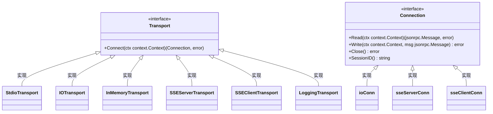
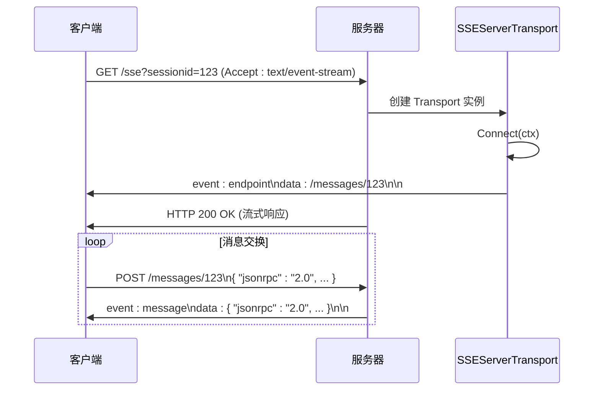

# 传输层 API

<cite>
**本文档中引用的文件**   
- [transport.go](file://mcp/transport.go)
- [sse.go](file://mcp/sse.go)
- [streamable.go](file://mcp/streamable.go)
- [cmd.go](file://mcp/cmd.go)
- [jsonrpc2/frame.go](file://internal/jsonrpc2/frame.go)
- [jsonrpc2/messages.go](file://internal/jsonrpc2/messages.go)
</cite>

## 目录
1. [引言](#引言)
2. [传输接口与连接契约](#传输接口与连接契约)
3. [具体传输类型实现](#具体传输类型实现)
4. [SSE 传输协议详解](#sse-传输协议详解)
5. [JSON-RPC 2.0 消息封装](#json-rpc-20-消息封装)
6. [错误处理机制](#错误处理机制)

## 引言

传输层 API 提供了一套标准化的接口，用于在 MCP（Model Context Protocol）客户端和服务器之间建立双向通信连接。该 API 的核心是 `Transport` 接口，它定义了创建逻辑 JSON-RPC 连接的方法。不同的传输实现（如 `StdioTransport`、`SSEServerTransport` 等）提供了多样化的通信方式，以适应从进程内通信到基于 HTTP 的服务器推送事件（SSE）等各种场景。本参考文档系统性地记录了所有传输类型的接口定义、配置参数、使用场景以及底层的消息封装和错误处理机制。

## 传输接口与连接契约

`Transport` 接口是所有传输实现的基础，它定义了创建连接的契约。该接口的核心方法是 `Connect`，它负责返回一个逻辑上的 JSON-RPC 连接。



**Diagram sources**
- [mcp@Transport](file://mcp/transport.go#L31-L36)
- [mcp@Connection](file://mcp/transport.go#L39-L60)

**Section sources**
- [mcp@Transport](file://mcp/transport.go#L31-L36)
- [mcp@Connection](file://mcp/transport.go#L39-L60)

### Connect 方法契约

`Connect` 方法是传输层的核心，其契约如下：
- **单次调用**：每个 `Transport` 实例应最多被调用一次 `Connect` 方法。该方法通常由 `Server.Connect` 或 `Client.Connect` 调用。
- **上下文管理**：方法接收一个 `context.Context` 参数，用于控制连接建立的生命周期。如果上下文被取消，`Connect` 应返回相应的错误。
- **返回连接**：成功时，返回一个实现了 `Connection` 接口的实例。该实例代表了客户端和服务器之间的逻辑通信通道。
- **错误处理**：如果连接建立失败，应返回一个非 `nil` 的错误。

## 具体传输类型实现

本节详细说明各种具体传输类型的配置参数和使用场景。

### StdioTransport

`StdioTransport` 是一种通过标准输入（stdin）和标准输出（stdout）进行通信的传输方式。它适用于命令行工具或进程间通过管道通信的场景。

- **结构体**：`type StdioTransport struct{}`，无配置参数。
- **使用场景**：当客户端和服务器运行在同一个终端会话中，或通过 shell 管道连接时使用。
- **连接过程**：`Connect` 方法内部使用 `os.Stdin` 和 `os.Stdout` 创建一个 `io.ReadWriteCloser`，并将其包装成 `ioConn`。

**Section sources**
- [mcp@StdioTransport](file://mcp/transport.go#L88-L88)
- [mcp@StdioTransport.Connect](file://mcp/transport.go#L91-L93)

### IOTransport

`IOTransport` 允许用户指定独立的 `io.ReadCloser` 和 `io.WriteCloser` 来进行通信，提供了比 `StdioTransport` 更大的灵活性。

- **结构体**：
  ```go
  type IOTransport struct {
      Reader io.ReadCloser
      Writer io.WriteCloser
  }
  ```
- **配置参数**：
  - `Reader`：用于读取来自对端的消息。
  - `Writer`：用于向对端写入消息。
- **使用场景**：适用于需要自定义 I/O 流的场景，例如与网络连接、文件或内存缓冲区进行通信。

**Section sources**
- [mcp@IOTransport](file://mcp/transport.go#L104-L107)
- [mcp@IOTransport.Connect](file://mcp/transport.go#L110-L112)

### InMemoryTransport

`InMemoryTransport` 用于在同一进程内的客户端和服务器之间进行通信，它使用内存中的网络连接（如 `net.Pipe`）。

- **结构体**：
  ```go
  type InMemoryTransport struct {
      rwc io.ReadWriteCloser
  }
  ```
- **配置参数**：
  - `rwc`：一个双向的 `io.ReadWriteCloser`，通常由 `net.Pipe()` 创建。
- **使用场景**：单元测试或需要高性能、低延迟的进程内通信。
- **辅助函数**：`NewInMemoryTransports()` 函数可以方便地创建一对相互连接的 `InMemoryTransport` 实例。

**Section sources**
- [mcp@InMemoryTransport](file://mcp/transport.go#L119-L121)
- [mcp@InMemoryTransport.Connect](file://mcp/transport.go#L124-L126)
- [mcp@NewInMemoryTransports](file://mcp/transport.go#L134-L137)

### SSEServerTransport

`SSEServerTransport` 实现了基于 HTTP 服务器发送事件（SSE）的服务器端传输。它处理一个长轮询的 GET 请求，并通过该连接向客户端推送消息。

- **结构体**：
  ```go
  type SSEServerTransport struct {
      Endpoint string
      Response http.ResponseWriter
      incoming chan jsonrpc.Message
      mu     sync.Mutex
      closed bool
      done   chan struct{}
  }
  ```
- **配置参数**：
  - `Endpoint`：客户端用于发送消息的 POST 端点。
  - `Response`：HTTP GET 请求的响应写入器，用于向客户端发送 SSE 事件。
- **使用场景**：构建基于 Web 的 MCP 服务器，支持浏览器或支持 SSE 的客户端。
- **连接过程**：`Connect` 方法首先检查是否已连接，然后初始化 `incoming` 消息队列和 `done` 通道。接着，它通过 `Response` 写入一个名为 `endpoint` 的 SSE 事件，告知客户端用于发送消息的端点。最后，它返回一个 `sseServerConn` 实例。

**Section sources**
- [mcp@SSEServerTransport](file://mcp/sse.go#L104-L124)
- [mcp@SSEServerTransport.Connect](file://mcp/sse.go#L163-L177)

### SSEClientTransport

`SSEClientTransport` 是 `SSEServerTransport` 的客户端对应实现，它负责连接到 SSE 服务器。

- **结构体**：
  ```go
  type SSEClientTransport struct {
      Endpoint string
      HTTPClient *http.Client
  }
  ```
- **配置参数**：
  - `Endpoint`：SSE 服务器的 GET 端点 URL。
  - `HTTPClient`：用于发起 HTTP 请求的客户端。如果为 `nil`，则使用 `http.DefaultClient`。
- **使用场景**：作为 MCP 客户端连接到基于 SSE 的服务器。
- **连接过程**：`Connect` 方法首先向 `Endpoint` 发起一个 `Accept: text/event-stream` 的 GET 请求。然后，它读取服务器返回的第一个 SSE 事件，该事件必须是 `endpoint` 事件，其中包含客户端用于发送消息的 POST 端点。之后，它启动一个 goroutine 来持续读取后续的 `message` 事件，并将解析出的 JSON-RPC 消息放入一个通道。最后，它返回一个 `sseClientConn` 实例。

**Section sources**
- [mcp@SSEClientTransport](file://mcp/sse.go#L324-L331)
- [mcp@SSEClientTransport.Connect](file://mcp/sse.go#L334-L397)

### LoggingTransport

`LoggingTransport` 是一个装饰器模式的传输，它包装另一个 `Transport` 并将所有进出的消息记录到指定的 `io.Writer` 中。

- **结构体**：
  ```go
  type LoggingTransport struct {
      Transport Transport
      Writer    io.Writer
  }
  ```
- **配置参数**：
  - `Transport`：被包装的底层传输。
  - `Writer`：用于写入日志的 `io.Writer`。
- **使用场景**：调试和监控，用于记录所有通过传输层的 JSON-RPC 消息。

**Section sources**
- [mcp@LoggingTransport](file://mcp/transport.go#L228-L231)
- [mcp@LoggingTransport.Connect](file://mcp/transport.go#L235-L241)

## SSE 传输协议详解

SSE（Server-Sent Events）传输协议定义了客户端和服务器之间基于 HTTP 的通信流程。

### 端点配置

- **GET 端点**：客户端通过发起一个 GET 请求来建立连接。服务器必须返回 `Content-Type: text/event-stream` 头。
- **POST 端点**：服务器在 `Connect` 时通过 `endpoint` 事件告知客户端一个唯一的 POST 端点。客户端通过向此端点 POST JSON-RPC 消息来与服务器通信。

### 事件流格式

SSE 消息由一系列以 `data:`、`event:` 等字段开头的文本行组成，以空行分隔。
- **`endpoint` 事件**：这是连接建立后服务器发送的第一个事件。其 `data` 字段包含客户端用于发送消息的 POST 端点的 URL。
- **`message` 事件**：服务器通过此事件向客户端推送 JSON-RPC 消息。其 `data` 字段包含一个完整的 JSON-RPC 消息的 JSON 字符串。

### 连接建立过程

1.  **客户端发起 GET**：客户端向服务器的 SSE 端点发起一个带有 `Accept: text/event-stream` 头的 GET 请求。
2.  **服务器响应并发送 `endpoint`**：服务器接受请求，创建一个 `SSEServerTransport` 实例，并调用其 `Connect` 方法。该方法会向客户端的响应流中写入一个 `endpoint` 事件。
3.  **客户端读取 `endpoint`**：客户端的 `SSEClientTransport.Connect` 方法读取到第一个 `endpoint` 事件，解析出 POST 端点。
4.  **建立逻辑连接**：客户端和服务器都返回了 `Connection` 实例，逻辑连接建立完成。之后，客户端通过 POST 端点发送消息，服务器通过 GET 响应流推送消息。



**Diagram sources**
- [mcp@SSEServerTransport](file://mcp/sse.go#L104-L124)
- [mcp@SSEClientTransport](file://mcp/sse.go#L324-L331)

## JSON-RPC 2.0 消息封装

底层的 JSON-RPC 2.0 协议通过 `internal/jsonrpc2` 包进行封装，不同的传输方式使用不同的 `Framer` 来处理消息的边界。

### 消息帧格式

- **`RawFramer`**：对于 `StdioTransport` 和 `IOTransport`，消息以换行符分隔。每个 JSON-RPC 消息是一个独立的 JSON 对象，后面紧跟一个换行符。这符合 [NDJSON](https://github.com/ndjson/ndjson-spec) 规范。
- **`HeaderFramer`**：虽然在当前代码中未直接使用，但 `HeaderFramer` 会为每个消息添加 `Content-Length` 头，这是 LSP 等协议的常见做法。

### 消息处理流程

1.  **编码**：当调用 `Connection.Write` 时，`jsonrpc2.EncodeMessage` 将 `Message`（`Request` 或 `Response`）序列化为 JSON 字节。
2.  **帧封装**：`Writer`（如 `rawWriter`）将编码后的 JSON 字节写入底层的 `io.Writer`。对于 `RawFramer`，它会在末尾添加一个换行符。
3.  **解码**：当调用 `Connection.Read` 时，`Reader`（如 `rawReader`）从 `io.Reader` 读取一个完整的 JSON 对象（直到换行符）。
4.  **反序列化**：`jsonrpc2.DecodeMessage` 将 JSON 字节反序列化为 `Message` 接口。

```mermaid
flowchart TD
A[Write(Message)] --> B[EncodeMessage]
B --> C[rawWriter.Write]
C --> D[写入 io.Writer + '\\n']
D --> E[网络/文件/管道]
E --> F[rawReader.Read]
F --> G[读取直到 '\\n']
G --> H[DecodeMessage]
H --> I[返回 Message]
```

**Diagram sources**
- [internal/jsonrpc2@Writer](file://internal/jsonrpc2/frame.go#L36-L39)
- [internal/jsonrpc2@Reader](file://internal/jsonrpc2/frame.go#L24-L27)
- [internal/jsonrpc2@EncodeMessage](file://internal/jsonrpc2/messages.go#L184-L194)
- [internal/jsonrpc2@DecodeMessage](file://internal/jsonrpc2/messages.go#L201-L212)

## 错误处理机制

传输层和 JSON-RPC 协议定义了多种错误类型，用于处理不同场景下的故障。

- **`ErrConnectionClosed`**：当尝试向一个已关闭或正在关闭的连接发送消息时返回。
- **`ErrRejected`**：由传输层返回，表示特定请求因当前上下文无效而被拒绝，但连接本身并未中断。
- **`ErrServerClosing` / `ErrClientClosing`**：分别表示服务器或客户端正在关闭，无法处理新的调用。
- **`ErrInvalidRequest`**：表示收到的 JSON-RPC 请求格式无效。
- **`ErrMethodNotFound`**：表示请求的方法在服务器端未找到。

这些错误在 `call` 函数中被统一处理，例如将 `ErrClientClosing` 或 `ErrServerClosing` 映射为 `ErrConnectionClosed`，以向调用者提供一致的错误体验。

**Section sources**
- [mcp@ErrConnectionClosed](file://mcp/transport.go#L15-L18)
- [internal/jsonrpc2@ErrRejected](file://internal/jsonrpc2/wire.go#L54-L59)
- [mcp@call](file://mcp/transport.go#L205-L224)