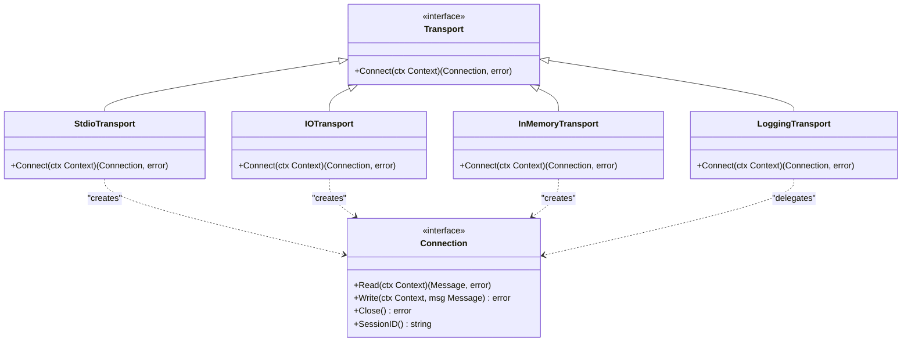
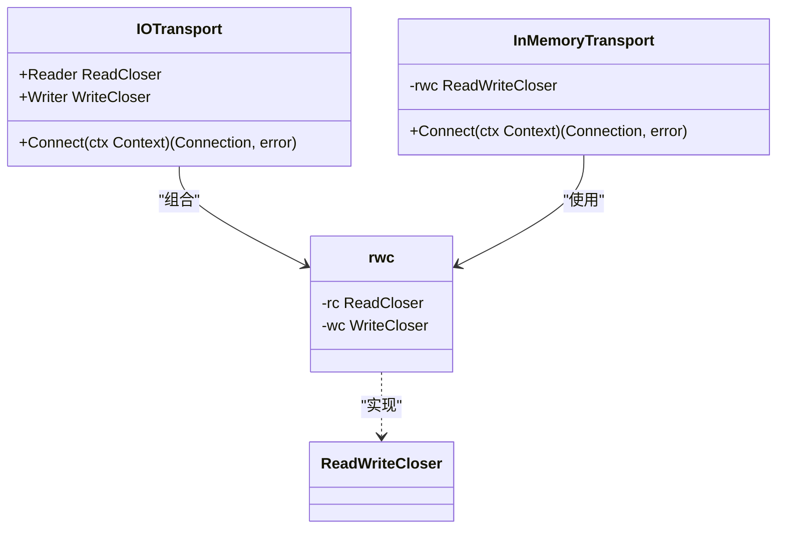
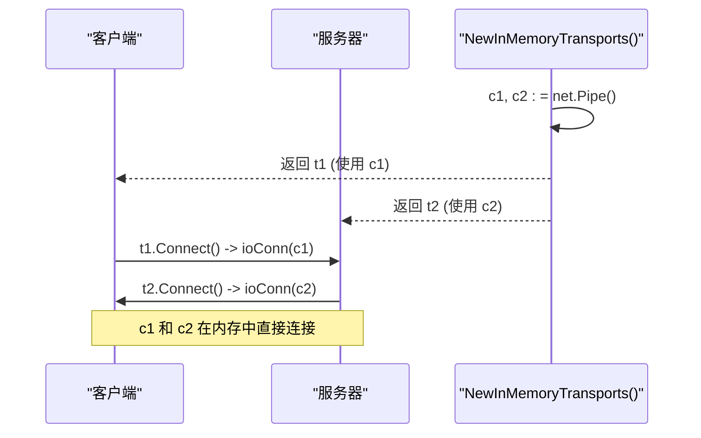
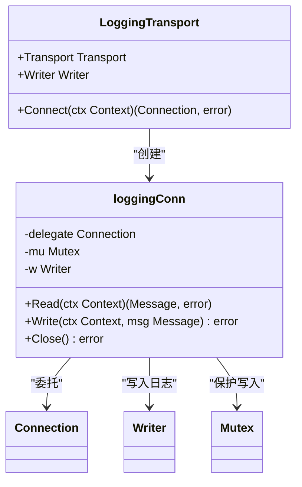

# 标准传输 API

<cite>
**Referenced Files in This Document**   
- [transport.go](file://mcp/transport.go)
- [client.go](file://mcp/client.go)
- [server.go](file://mcp/server.go)
- [examples/server/custom-transport/main.go](file://examples/server/custom-transport/main.go)
</cite>

## 目录
1. [引言](#引言)
2. [Transport 接口与 Connect 方法](#transport-接口与-connect-方法)
3. [标准传输类型实现](#标准传输类型实现)
4. [内存传输与 NewInMemoryTransports](#内存传输与-newinmemorytransports)
5. [LoggingTransport 装饰器模式](#loggingtransport-装饰器模式)
6. [使用示例与典型场景](#使用示例与典型场景)
7. [结论](#结论)

## 引言

标准传输 API 定义了 MCP（Model Context Protocol）客户端与服务器之间建立双向 JSON-RPC 连接的机制。该 API 的核心是 `Transport` 接口，它为不同类型的通信通道提供了统一的抽象。通过实现此接口，可以创建基于标准输入输出、内存管道或自定义 I/O 流的传输方式。本文档详细阐述了 `Transport` 接口的契约、其具体实现类的工作原理，以及如何利用这些组件构建可靠的通信链路。

**Section sources**
- [transport.go](file://mcp/transport.go#L31-L36)

## Transport 接口与 Connect 方法

`Transport` 接口是所有传输实现的基础，其核心方法 `Connect` 定义了建立逻辑 JSON-RPC 连接的契约。该方法接收一个 `context.Context` 参数，用于控制连接建立过程的生命周期，并返回一个 `Connection` 实例和一个可能的错误。`Connect` 方法保证仅被 `Server.Connect` 或 `Client.Connect` 调用一次。一旦连接建立，返回的 `Connection` 对象将负责后续的所有消息读写操作。此设计确保了连接的单一性和状态的清晰性。

**Diagram sources**
- [transport.go](file://mcp/transport.go#L31-L36)
- [transport.go](file://mcp/transport.go#L88-L93)
- [transport.go](file://mcp/transport.go#L104-L112)
- [transport.go](file://mcp/transport.go#L119-L126)
- [transport.go](file://mcp/transport.go#L228-L241)

**Section sources**
- [transport.go](file://mcp/transport.go#L31-L36)
- [client.go](file://mcp/client.go#L135-L170)
- [server.go](file://mcp/server.go#L838-L853)

## 标准传输类型实现

### StdioTransport
`StdioTransport` 是一种简单的传输实现，它通过标准输入（`os.Stdin`）和标准输出（`os.Stdout`）进行通信。其 `Connect` 方法创建一个内部的 `rwc` 结构，该结构将 `os.Stdin` 作为 `io.ReadCloser`，将 `os.Stdout` 作为 `io.WriteCloser`（并包装为 `nopCloserWriter` 以避免意外关闭标准输出）。这种方式适用于命令行工具或需要与 shell 环境集成的场景。

### IOTransport
`IOTransport` 提供了更灵活的 I/O 抽象，允许用户指定任意的 `io.ReadCloser` 和 `io.WriteCloser`。其结构体包含 `Reader` 和 `Writer` 两个字段，`Connect` 方法将这两个字段组合成一个 `rwc` 对象，并最终创建一个 `ioConn` 连接。这种设计使得 `IOTransport` 可以用于网络连接、文件流或任何实现了相应接口的 I/O 源。

### InMemoryTransport
`InMemoryTransport` 用于在内存中建立对等连接，特别适用于测试和嵌入式场景。它内部持有一个 `io.ReadWriteCloser`，该接口由 `net.Pipe()` 创建的管道实现。`Connect` 方法直接使用这个管道来创建连接，从而实现了两个 Go 程序或协程之间高效、低延迟的通信。

**Diagram sources**
- [transport.go](file://mcp/transport.go#L104-L107)
- [transport.go](file://mcp/transport.go#L119-L121)
- [transport.go](file://mcp/transport.go#L35-L60)

**Section sources**
- [transport.go](file://mcp/transport.go#L88-L93)
- [transport.go](file://mcp/transport.go#L104-L112)
- [transport.go](file://mcp/transport.go#L119-L126)

## 内存传输与 NewInMemoryTransports

`NewInMemoryTransports` 函数是创建配对内存传输实例的关键。它调用 `net.Pipe()` 创建一对连接的 `net.Conn`，然后将它们分别包装在两个 `InMemoryTransport` 实例中并返回。这两个返回的传输实例是相互对称的：可以将其中一个用于连接服务器，另一个用于连接客户端。这种机制在单元测试中极为有用，因为它允许在不依赖外部网络或 I/O 的情况下，完全在内存中模拟客户端与服务器的交互，从而实现快速、可重复的测试。

**Diagram sources**
- [transport.go](file://mcp/transport.go#L134-L137)

**Section sources**
- [transport.go](file://mcp/transport.go#L134-L137)

## LoggingTransport 装饰器模式

`LoggingTransport` 是装饰器模式的一个典型应用。它本身不直接处理 I/O，而是包装另一个 `Transport` 实例（`Transport` 字段），并在其基础上添加日志记录功能。其 `Connect` 方法首先调用被包装的 `Transport` 的 `Connect` 方法获取一个 `delegate` 连接，然后返回一个 `loggingConn` 对象。`loggingConn` 在 `Read` 和 `Write` 方法中，会先将消息内容写入其 `Writer` 字段（通常是一个 `io.Writer` 如 `os.Stdout` 或文件），然后再调用 `delegate` 的相应方法。为了保证并发安全，所有对 `Writer` 的写入操作都通过一个 `sync.Mutex`（`mu` 字段）进行同步，防止多个 goroutine 同时写入日志导致内容混乱。

**Diagram sources**
- [transport.go](file://mcp/transport.go#L228-L231)
- [transport.go](file://mcp/transport.go#L235-L241)

**Section sources**
- [transport.go](file://mcp/transport.go#L228-L241)

## 使用示例与典型场景

### 自定义传输实现
`examples/server/custom-transport/main.go` 文件提供了一个自定义传输的示例。它定义了一个 `IOTransport` 结构体，使用 `bufio.Reader` 来高效地读取以换行符分隔的 JSON 消息。这展示了如何根据特定需求（如性能优化或协议兼容性）实现 `Transport` 接口。

### 测试场景
在测试中，`NewInMemoryTransports` 是创建客户端-服务器对的首选方法。通过在内存中建立连接，可以避免网络延迟和外部依赖，使测试更加稳定和快速。

### 调试与监控
`LoggingTransport` 可以包装任何现有的传输，为 RPC 通信提供详细的日志记录。这对于调试通信问题、监控消息流量或分析性能瓶颈非常有价值。

**Section sources**
- [examples/server/custom-transport/main.go](file://examples/server/custom-transport/main.go#L21-L24)

## 结论

标准传输 API 通过 `Transport` 接口和 `Connect` 方法契约，为 MCP 通信提供了灵活且可扩展的基础。`StdioTransport`、`IOTransport` 和 `InMemoryTransport` 满足了从简单命令行交互到复杂内存测试的各种需求。`NewInMemoryTransports` 函数极大地简化了测试环境的搭建。而 `LoggingTransport` 则通过装饰器模式，在不修改核心逻辑的情况下，优雅地增强了系统的可观测性。这些组件共同构成了一个强大、健壮的通信框架。