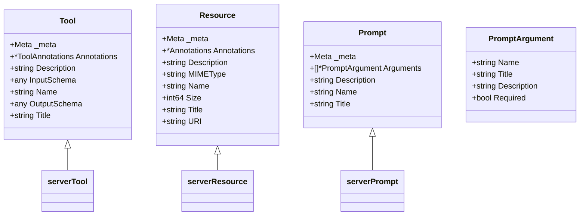

# 协议数据模型

<cite>
**本文档中引用的文件**  
- [protocol.go](file://mcp/protocol.go)
- [tool.go](file://mcp/tool.go)
- [prompt.go](file://mcp/prompt.go)
- [resource.go](file://mcp/resource.go)
- [tool_example_test.go](file://mcp/tool_example_test.go)
- [server.src.md](file://internal/docs/server.src.md)
- [design.md](file://design/design.md)
- [main.go](file://examples/server/toolschemas/main.go)
</cite>

## 目录
1. [简介](#简介)
2. [核心数据结构概述](#核心数据结构概述)
3. [Tool 数据模型](#tool-数据模型)
4. [Resource 数据模型](#resource-数据模型)
5. [Prompt 数据模型](#prompt-数据模型)
6. [InputSchema 与 OutputSchema 详解](#inputschema-与-outputschema-详解)
7. [显示字段优先级规则](#显示字段优先级规则)
8. [结构体实例化与序列化示例](#结构体实例化与序列化示例)
9. [结论](#结论)

## 简介
本协议数据模型文档系统性地记录了 Model Context Protocol (MCP) 中的核心数据结构，包括 `Tool`、`Resource` 和 `Prompt`。文档详细说明了每个字段的 JSON 序列化标签、可选性以及在 MCP 协议中的作用。特别关注 `InputSchema` 和 `OutputSchema` 对 JSON Schema 2020-12 草案的支持要求，以及 `Title`、`Name`、`Description` 等展示字段的优先级规则。通过提供结构体实例化示例和典型 JSON 序列化输出，帮助开发者理解数据在传输过程中的表现形式。

**Section sources**
- [protocol.go](file://mcp/protocol.go#L661-L950)

## 核心数据结构概述
MCP 协议定义了三个核心数据结构：`Tool`、`Resource` 和 `Prompt`，它们是服务器向客户端暴露功能的主要方式。这些结构体均包含通用字段（如 `_meta`）、用于程序逻辑的名称（`Name`）、用于用户界面的标题（`Title`）和描述（`Description`）。它们的定义位于 `mcp/protocol.go` 文件中，并通过 JSON-RPC 消息进行传输。



**Diagram sources**
- [protocol.go](file://mcp/protocol.go#L661-L950)

**Section sources**
- [protocol.go](file://mcp/protocol.go#L661-L950)

## Tool 数据模型
`Tool` 结构体定义了客户端可以调用的工具。其字段定义和语义含义如下：

- **`_meta`**: 保留字段，用于协议附加元数据。
- **`Annotations`**: 工具的可选附加信息，包含 `Title`、`ReadOnlyHint` 等提示。
- **`Description`**: 工具的人类可读描述，可作为对模型的“提示”。
- **`InputSchema`**: 定义工具期望参数的 JSON Schema 对象。
- **`Name`**: 用于程序逻辑的名称，或在 `Title` 缺失时作为显示名称。
- **`OutputSchema`**: 定义工具输出结构的可选 JSON Schema 对象。
- **`Title`**: 用于 UI 和最终用户上下文的标题，优先级最高。

**Section sources**
- [protocol.go](file://mcp/protocol.go#L900-L950)

## Resource 数据模型
`Resource` 结构体表示服务器能够读取的已知资源。其字段定义和语义含义如下：

- **`_meta`**: 保留字段，用于协议附加元数据。
- **`Annotations`**: 客户端的可选注解。
- **`Description`**: 资源的描述，可作为对模型的“提示”。
- **`MIMEType`**: 资源的 MIME 类型（如果已知）。
- **`Name`**: 用于程序逻辑的名称，或在 `Title` 缺失时作为显示名称。
- **`Size`**: 原始资源内容的大小（以字节为单位）。
- **`Title`**: 用于 UI 和最终用户上下文的标题。
- **`URI`**: 资源的 URI。

**Section sources**
- [protocol.go](file://mcp/protocol.go#L753-L784)

## Prompt 数据模型
`Prompt` 结构体表示服务器提供的提示或提示模板。其字段定义和语义含义如下：

- **`_meta`**: 保留字段，用于协议附加元数据。
- **`Arguments`**: 用于模板化提示的参数列表。
- **`Description`**: 提示的可选描述。
- **`Name`**: 用于程序逻辑的名称，或在 `Title` 缺失时作为显示名称。
- **`Title`**: 用于 UI 和最终用户上下文的标题。

`PromptArgument` 结构体描述了提示可以接受的参数：

- **`Name`**: 参数的程序名称。
- **`Title`**: 参数的 UI 标题。
- **`Description`**: 参数的人类可读描述。
- **`Required`**: 参数是否必须提供。

**Section sources**
- [protocol.go](file://mcp/protocol.go#L661-L689)

## InputSchema 与 OutputSchema 详解
`InputSchema` 和 `OutputSchema` 字段是 `Tool` 结构体的关键部分，它们使用 JSON Schema 来定义工具的输入和输出结构。

- **`InputSchema` (any `json:"inputSchema"`)**: 必需字段，持有定义工具期望参数的 JSON Schema 对象。当使用 `AddTool` 函数添加工具时，SDK 会自动验证输入。SDK 使用 `github.com/google/jsonschema-go` 进行推断和验证，目前仅支持 JSON Schema 的 2020-12 草案。服务器可以设置任何能 JSON 序列化的值（包括 `json.RawMessage`），但为了自动验证，必须使用 SDK 支持的草案。
- **`OutputSchema` (any `json:"outputSchema,omitempty"`)**: 可选字段，持有定义工具输出结构的 JSON Schema 对象。其使用规则与 `InputSchema` 相同。

从客户端角度看，这些字段将持有服务器输入/输出模式的默认 JSON 序列化（`map[string]any`）。

**Section sources**
- [protocol.go](file://mcp/protocol.go#L926-L944)
- [server.src.md](file://internal/docs/server.src.md#L133-L205)

## 显示字段优先级规则
MCP 协议为显示名称定义了明确的优先级规则，以确保在不同上下文中提供最佳的用户体验。

- **`Tool` 的显示名称优先级顺序为**：`title` > `annotations.title` > `name`。这意味着系统会首先尝试使用 `Title` 字段，如果不存在，则使用 `Annotations` 中的 `Title`，最后才使用 `Name`。
- **`Resource` 和 `Prompt` 的显示名称优先级顺序为**：`title` > `name`。如果 `Title` 未提供，则使用 `Name`。

这些规则在 `protocol.go` 文件的结构体注释中有明确说明。

**Section sources**
- [protocol.go](file://mcp/protocol.go#L900-L950)

## 结构体实例化与序列化示例
以下示例展示了如何在 Go 代码中实例化 `Tool` 结构体，并说明其在传输过程中的 JSON 序列化输出。

### Go 结构体实例化
```go
// 示例来自 examples/server/toolschemas/main.go
type Input struct {
    Name string `json:"name" jsonschema:"the person to greet"`
}

type Output struct {
    Greeting string `json:"greeting" jsonschema:"the greeting to send to the user"`
}

tool := &mcp.Tool{
    Name:        "greet",
    Description: "Say hello to a person",
    Title:       "Greet User",
    InputSchema: inputSchema, // 通过 jsonschema.For[Input] 推断
    OutputSchema: outputSchema, // 通过 jsonschema.For[Output] 推断
}
```

### 典型 JSON 序列化输出
当上述 `Tool` 实例通过网络传输时，其 JSON 序列化形式可能如下：
```json
{
  "name": "greet",
  "description": "Say hello to a person",
  "title": "Greet User",
  "inputSchema": {
    "type": "object",
    "properties": {
      "name": {
        "type": "string",
        "description": "the person to greet"
      }
    },
    "required": ["name"]
  },
  "outputSchema": {
    "type": "object",
    "properties": {
      "greeting": {
        "type": "string",
        "description": "the greeting to send to the user"
      }
    }
  }
}
```

此示例清晰地展示了 Go 结构体如何映射到符合 MCP 规范的 JSON 消息。

**Section sources**
- [main.go](file://examples/server/toolschemas/main.go#L0-L41)
- [tool_example_test.go](file://mcp/tool_example_test.go#L78-L130)

## 结论
本文档全面记录了 MCP 协议中的核心数据模型 `Tool`、`Resource` 和 `Prompt`。我们详细分析了每个字段的定义、JSON 序列化标签和语义含义，特别强调了 `InputSchema` 和 `OutputSchema` 对 JSON Schema 2020-12 草案的依赖，以及 `Title`、`Name` 等显示字段的优先级规则。通过提供结构体实例化和 JSON 序列化的具体示例，开发者可以清晰地理解这些数据结构在实际应用中的表现形式，从而正确地实现 MCP 服务器和客户端。