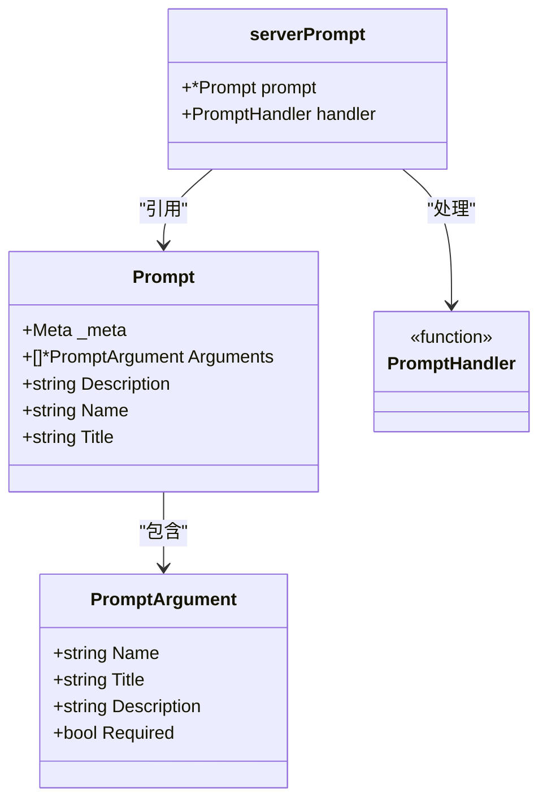
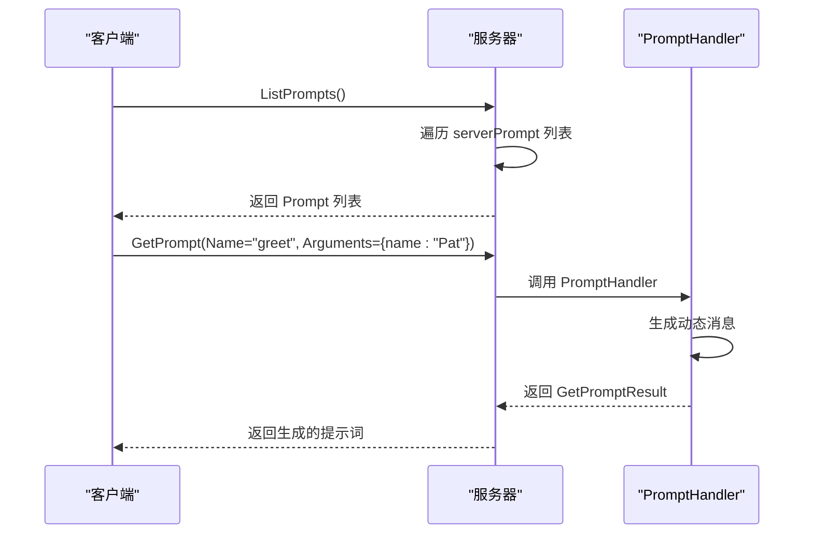

# 提示词模型

<cite>
**本文档中引用的文件**  
- [prompt.go](file://mcp/prompt.go)
- [server.go](file://mcp/server.go)
- [protocol.go](file://mcp/protocol.go)
- [shared.go](file://mcp/shared.go)
- [server_example_test.go](file://mcp/server_example_test.go)
</cite>

## 目录
1. [简介](#简介)
2. [核心结构体设计](#核心结构体设计)
3. [字段详解](#字段详解)
4. [提示词处理机制](#提示词处理机制)
5. [代码示例与序列化格式](#代码示例与序列化格式)
6. [总结](#总结)

## 简介
本文档详细阐述了 `mcp.Prompt` 结构体的设计与用途，重点分析其在程序化使用和用户界面展示中的不同角色。文档解释了 `Name` 和 `Title` 字段的显示优先级、`Description` 字段对LLM理解提示词的帮助，以及 `Arguments` 字段在动态提示词生成中的作用。结合 `PromptHandler` 和 `serverPrompt` 结构体，深入解析提示词处理的内部机制，并提供Go代码实例和JSON序列化输出，帮助开发者理解数据在协议传输中的格式。

## 核心结构体设计
`mcp.Prompt` 是MCP（Model Context Protocol）SDK中用于定义提示词的核心结构体，代表服务器提供的提示词或提示词模板。该结构体不仅包含提示词的基本信息，还支持参数化和元数据扩展，使其能够灵活适应不同的应用场景。



**图示来源**  
- [protocol.go](file://mcp/protocol.go#L661-L675)
- [prompt.go](file://mcp/prompt.go#L13-L16)

**本节来源**  
- [protocol.go](file://mcp/protocol.go#L661-L675)
- [prompt.go](file://mcp/prompt.go#L13-L16)

## 字段详解
### Name 与 Title 字段
`Name` 和 `Title` 字段在提示词模型中扮演着不同的角色，具有明确的使用场景和显示优先级。

- **Name 字段**：主要用于程序化或逻辑使用，作为提示词的唯一标识符。在协议通信和内部处理中，`Name` 是关键的查找键。当 `Title` 不存在时，`Name` 可作为备用显示名称。
- **Title 字段**：专为用户界面（UI）和最终用户上下文设计，优化为人类可读且易于理解的形式，即使是对领域特定术语不熟悉的用户也能轻松理解。

**显示优先级**：在用户界面展示时，系统优先使用 `Title` 字段；若 `Title` 为空，则回退到使用 `Name` 字段进行显示。

### Description 字段
`Description` 字段为提示词提供可选的描述信息，帮助LLM更好地理解该提示词的用途和上下文。此字段内容可用于增强模型对提示词意图的理解，从而生成更准确的响应。

### Arguments 字段
`Arguments` 字段是提示词实现动态生成的核心。它定义了一个参数列表，用于模板化提示词内容。每个参数由 `PromptArgument` 结构体表示，包含名称、标题、描述和是否必需等属性。

- **动态提示词生成**：通过在提示词模板中引用这些参数，可以在运行时根据用户输入动态生成具体的提示词内容。
- **参数验证**：`Required` 标志可用于验证必要参数是否已提供，确保提示词生成的完整性。

### Meta 字段
`Meta` 字段提供了一种通用且可选的机制，用于附加额外的元数据到提示词对象上。该字段类型为 `map[string]any`，允许开发者根据需要存储任意类型的附加信息，如自定义配置、调试信息或其他上下文数据。

**本节来源**  
- [protocol.go](file://mcp/protocol.go#L661-L675)
- [protocol.go](file://mcp/protocol.go#L679-L690)

## 提示词处理机制
提示词的处理机制基于 `PromptHandler` 函数类型和 `serverPrompt` 结构体协同工作，实现了提示词的注册、管理和响应。

### PromptHandler
`PromptHandler` 是一个函数类型，定义了处理 `prompts/get` 调用的接口。其签名如下：
```go
type PromptHandler func(context.Context, *GetPromptRequest) (*GetPromptResult, error)
```
该处理器接收上下文和请求参数，返回生成的提示词结果或错误。

### serverPrompt 结构体
`serverPrompt` 结构体封装了提示词定义及其对应的处理函数，是服务器内部管理提示词的核心单元：
```go
type serverPrompt struct {
    prompt  *Prompt
    handler PromptHandler
}
```
- `prompt`：指向具体的 `Prompt` 对象。
- `handler`：关联的 `PromptHandler`，负责实际的提示词生成逻辑。

### 内部处理流程
1. **注册提示词**：通过 `Server.AddPrompt` 方法将 `Prompt` 和 `PromptHandler` 注册到服务器。
2. **列表获取**：`Server.listPrompts` 方法遍历内部的 `serverPrompt` 列表，提取 `Prompt` 对象并返回给客户端。
3. **提示词获取**：客户端请求特定提示词时，服务器调用对应的 `PromptHandler` 生成结果。



**图示来源**  
- [prompt.go](file://mcp/prompt.go#L13-L16)
- [server.go](file://mcp/server.go#L153-L160)
- [server.go](file://mcp/server.go#L519-L531)

**本节来源**  
- [prompt.go](file://mcp/prompt.go#L13-L16)
- [server.go](file://mcp/server.go#L153-L160)
- [server.go](file://mcp/server.go#L519-L531)

## 代码示例与序列化格式
### Go代码实例
以下是一个典型的提示词定义和注册示例：

```go
// 创建提示处理器
promptHandler := func(ctx context.Context, req *mcp.GetPromptRequest) (*mcp.GetPromptResult, error) {
    return &mcp.GetPromptResult{
        Description: "Hi prompt",
        Messages: []*mcp.PromptMessage{
            {
                Role:    "user",
                Content: &mcp.TextContent{Text: "Say hi to " + req.Params.Arguments["name"]},
            },
        },
    }, nil
}

// 定义提示词
prompt := &mcp.Prompt{
    Name: "greet",
    Arguments: []*mcp.PromptArgument{
        {
            Name:        "name",
            Description: "the name of the person to greet",
            Required:    true,
        },
    },
}

// 注册到服务器
s.AddPrompt(prompt, promptHandler)
```

### JSON序列化输出
当提示词通过协议传输时，其JSON序列化格式如下：

```json
{
  "name": "greet",
  "arguments": [
    {
      "name": "name",
      "description": "the name of the person to greet",
      "required": true
    }
  ],
  "description": "An example greeting prompt",
  "title": "Greet User"
}
```

此格式确保了提示词定义在不同系统间的互操作性和一致性。

**本节来源**  
- [server_example_test.go](file://mcp/server_example_test.go#L18-L83)
- [protocol.go](file://mcp/protocol.go#L661-L675)

## 总结
`mcp.Prompt` 结构体是MCP SDK中实现提示词功能的核心组件，通过 `Name` 和 `Title` 字段区分程序化与用户界面用途，利用 `Arguments` 字段实现动态提示词生成，并通过 `Description` 字段增强LLM的理解能力。结合 `PromptHandler` 和 `serverPrompt`，形成了完整的提示词处理机制。`Meta` 字段提供了灵活的元数据扩展能力，使该模型能够适应各种复杂的应用场景。

**本节来源**  
- [protocol.go](file://mcp/protocol.go#L661-L675)
- [prompt.go](file://mcp/prompt.go#L13-L16)
- [server.go](file://mcp/server.go#L153-L160)