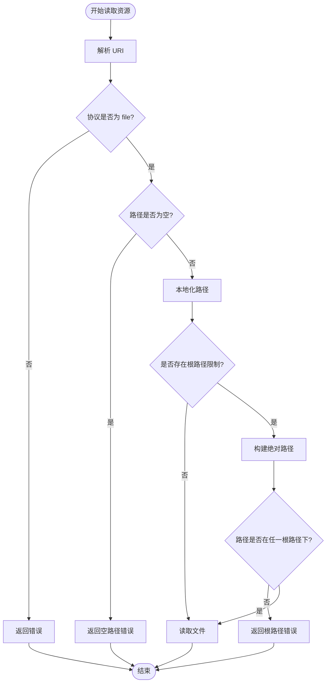

# 资源模型

<cite>
**本文档中引用的文件**  
- [resource.go](file://mcp/resource.go)
- [protocol.go](file://mcp/protocol.go)
- [server.go](file://mcp/server.go)
- [resource_test.go](file://mcp/resource_test.go)
- [resource_go124.go](file://mcp/resource_go124.go)
- [resource_pre_go124.go](file://mcp/resource_pre_go124.go)
- [server_example_test.go](file://mcp/server_example_test.go)
- [everything/main.go](file://examples/server/everything/main.go)
- [sequentialthinking/main.go](file://examples/server/sequentialthinking/main.go)
</cite>

## 目录
1. [简介](#简介)
2. [核心字段定义](#核心字段定义)
3. [显示逻辑与优先级](#显示逻辑与优先级)
4. [资源读取与安全机制](#资源读取与安全机制)
5. [代码示例与序列化](#代码示例与序列化)

## 简介
资源模型定义了 `mcp.Resource` 结构体，用于描述服务器上可访问的资源。该模型通过 URI 唯一标识资源，并提供元数据以支持客户端显示、上下文估算和 LLM 理解。资源可通过 `Server.AddResource` 方法注册，并由 `ResourceHandler` 处理读取请求。

**Section sources**
- [protocol.go](file://mcp/protocol.go#L753-L784)
- [server.go](file://mcp/server.go#L422-L431)

## 核心字段定义

### URI 字段
`URI` 字段是资源的唯一标识符，必须为绝对 URI。服务器在添加资源时会验证其有效性。该字段用于资源的定位和访问控制。

### MIMEType 与 Size 字段
- `MIMEType`：表示资源的 MIME 类型（如 `text/plain`），客户端可据此进行内容渲染。
- `Size`：表示原始内容的字节大小（未编码前），可用于显示文件大小和估算上下文窗口占用。

### Description 字段
`Description` 字段作为提示语，帮助 LLM 理解资源的用途和内容，提升模型对可用资源的认知能力。

**Section sources**
- [protocol.go](file://mcp/protocol.go#L753-L784)

## 显示逻辑与优先级

### Name、Title 与显示回退
- `Name`：用于程序化或逻辑用途，在无 `Title` 时作为显示名称的后备。
- `Title`：专为 UI 和最终用户设计，应优先用于显示。
- 显示回退逻辑：若 `Title` 不存在，则使用 `Name` 进行显示。

### 与工具模型的标题优先级差异
在工具模型中，标题显示优先级为：`Title` > `Annotations.Title` > `Name`。而在资源模型中，仅当 `Title` 缺失时才回退到 `Name`，不涉及 `Annotations.Title` 的优先级判断。

**Section sources**
- [protocol.go](file://mcp/protocol.go#L753-L784)

## 资源读取与安全机制

### readFileResource 函数
`readFileResource` 函数负责从文件系统读取资源内容。它接收原始 URI、目录路径和根路径列表，确保读取操作受限于指定的根路径。

### computeURIFilepath 函数
`computeURIFilepath` 函数计算相对于 `dirFilepath` 的文件路径，并执行以下安全检查：
1. 验证 URI 是否为 `file` 协议。
2. 检查路径是否为空。
3. 使用 `filepath.Localize` 防止路径逃逸。
4. 若存在 `rootFilepaths`，验证目标路径是否位于任一根路径之下。

### 根路径限制
通过 `rootFilepaths` 参数限制资源访问范围，防止越权访问。只有当请求路径相对于某个根路径为本地路径时，才允许访问。



**Diagram sources**
- [resource.go](file://mcp/resource.go#L52-L68)
- [resource.go](file://mcp/resource.go#L72-L113)

**Section sources**
- [resource.go](file://mcp/resource.go#L52-L68)
- [resource.go](file://mcp/resource.go#L72-L113)
- [resource_test.go](file://mcp/resource_test.go#L48-L132)

## 代码示例与序列化

### 资源定义示例
以下示例展示了如何定义一个嵌入式资源：

```go
server.AddResource(&mcp.Resource{
    Name:        "info",
    MIMEType:    "text/plain",
    URI:         "embedded:info",
}, embeddedResource)
```

### JSON 序列化样例
资源的 JSON 序列化形式如下：

```json
{
  "name": "info",
  "mimeType": "text/plain",
  "uri": "embedded:info",
  "description": "Access thinking session data and history"
}
```

**Section sources**
- [everything/main.go](file://examples/server/everything/main.go#L78-L83)
- [sequentialthinking/main.go](file://examples/server/sequentialthinking/main.go#L496-L501)
- [protocol.go](file://mcp/protocol.go#L753-L784)