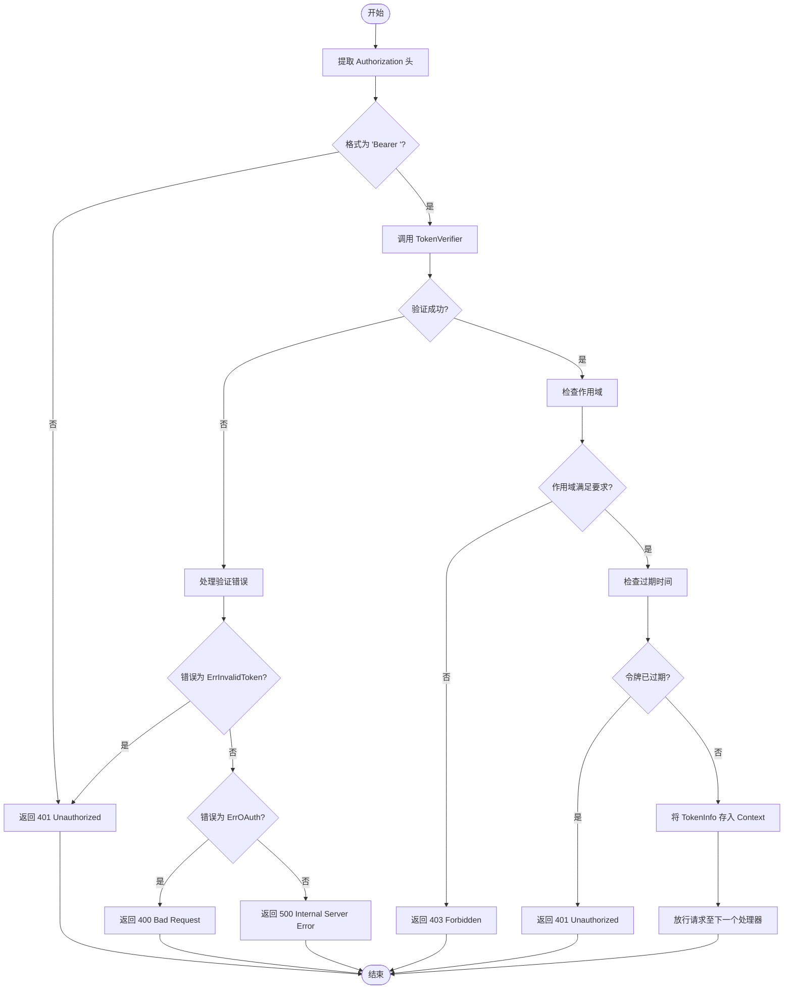
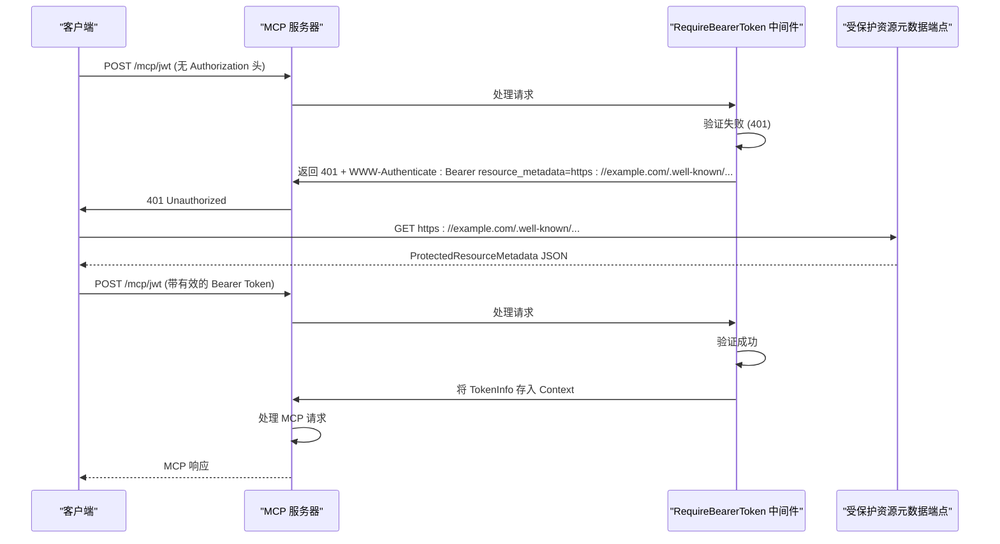

# Bearer Token 认证 API

<cite>
**Referenced Files in This Document**   
- [auth.go](file://auth/auth.go)
- [main.go](file://examples/server/auth-middleware/main.go)
- [shared.go](file://mcp/shared.go)
- [streamable.go](file://mcp/streamable.go)
- [resource_meta.go](file://oauthex/resource_meta.go)
</cite>

## 目录
1. [简介](#简介)
2. [核心组件](#核心组件)
3. [认证流程](#认证流程)
4. [TokenInfo 结构体与上下文存储](#tokeninfo-结构体与上下文存储)
5. [错误处理与 WWW-Authenticate 头](#错误处理与-www-authenticate-头)
6. [与 MCP 协议的集成](#与-mcp-协议的集成)
7. [代码示例](#代码示例)

## 简介
本文档详细介绍了 `go-sdk` 项目中 `auth` 包的 Bearer Token 认证机制。核心是 `RequireBearerToken` 中间件，它为 MCP（Model Context Protocol）服务器提供了一种灵活且安全的认证方式。该中间件负责从 HTTP 请求头中提取 Bearer Token，通过用户提供的验证器进行验证，并将解析出的令牌信息（如作用域和过期时间）存储在请求上下文中，供后续的业务逻辑使用。文档将深入解析其函数签名、参数配置、数据结构以及与 MCP 协议中受保护资源元数据（RFC 9728）的集成方式。

## 核心组件

`auth` 包的核心是 `RequireBearerToken` 函数，它是一个符合 Go 标准库 `net/http` 的中间件（Middleware）。该函数接收一个 `TokenVerifier` 验证器和一组 `RequireBearerTokenOptions` 选项，返回一个新的 `http.Handler`。

**函数签名与参数**
```go
func RequireBearerToken(verifier TokenVerifier, opts *RequireBearerTokenOptions) func(http.Handler) http.Handler
```
- **`verifier TokenVerifier`**: 这是一个函数类型，定义了如何验证令牌。它接收上下文、令牌字符串和 HTTP 请求，返回 `TokenInfo` 和错误。开发者需要实现此函数来对接 JWT、API Key 或其他认证系统。
- **`opts *RequireBearerTokenOptions`**: 这是一个可选的配置结构体，用于指定额外的认证要求。

**RequireBearerTokenOptions 结构体**
该结构体定义了认证过程中的附加选项。
- **`ResourceMetadataURL string`**: 当认证失败时，此 URL 会被包含在 `WWW-Authenticate` 响应头中，指向受保护资源的元数据端点，符合 RFC 9728 规范。
- **`Scopes []string`**: 一个字符串切片，列出了访问受保护资源所必需的作用域。中间件会检查令牌中的作用域是否包含所有必需的作用域。

**Section sources**
- [auth.go](file://auth/auth.go#L60-L79)
- [auth.go](file://auth/auth.go#L35-L41)

## 认证流程

`RequireBearerToken` 中间件的工作流程如下：

1.  **提取令牌**：中间件首先从 HTTP 请求的 `Authorization` 头中提取令牌。它会检查头的格式是否为 `Bearer <token>`。如果格式不正确或缺少令牌，认证将立即失败。
2.  **验证令牌**：提取出的令牌字符串会被传递给用户提供的 `TokenVerifier` 函数。该函数负责实际的验证逻辑（如 JWT 签名验证、数据库查询 API Key 等）。
3.  **检查作用域**：如果 `RequireBearerTokenOptions` 中指定了 `Scopes`，中间件会检查 `TokenInfo` 结构体中的 `Scopes` 切片是否包含了所有必需的作用域。如果缺少任何作用域，认证失败。
4.  **检查过期时间**：中间件会检查 `TokenInfo.Expiration` 字段。如果该字段为零值（表示令牌未提供过期时间）或当前时间已超过过期时间，认证失败。
5.  **存储信息并放行**：如果所有检查都通过，`TokenInfo` 对象会被存储在请求的 `context.Context` 中。随后，请求会被传递给下一个处理器（即被保护的 MCP 服务器处理器）。

这个流程由 `verify` 函数具体实现，`RequireBearerToken` 中间件在内部调用它。



**Diagram sources **
- [auth.go](file://auth/auth.go#L81-L119)

**Section sources**
- [auth.go](file://auth/auth.go#L81-L119)

## TokenInfo 结构体与上下文存储

`TokenInfo` 结构体是认证成功后，从令牌中提取出的关键信息的载体。

**TokenInfo 结构体**
```go
type TokenInfo struct {
    Scopes     []string
    Expiration time.Time
    Extra      map[string]any
}
```
- **`Scopes []string`**: 一个字符串切片，表示该令牌被授予的权限或角色。这是进行基于角色的访问控制（RBAC）的基础。
- **`Expiration time.Time`**: 一个 `time.Time` 类型的字段，表示令牌的过期时间。中间件会利用此字段来判断令牌是否有效。
- **`Extra map[string]any`**: 一个通用的映射，用于存储任何其他与令牌相关的自定义信息。例如，在 JWT 中，可以将 `sub`（用户ID）、`iss`（签发者）等标准声明或自定义声明存入此字段。

**上下文存储与访问**
为了在后续的请求处理器中安全地访问 `TokenInfo`，中间件使用了一个不导出的类型 `tokenInfoKey` 作为键，将 `TokenInfo` 对象存储在 `http.Request` 的 `Context` 中。

为了方便访问，`auth` 包提供了 `TokenInfoFromContext` 函数。该函数接受一个 `context.Context`，并尝试从中检索 `TokenInfo`。如果未找到，则返回 `nil`。

```go
func TokenInfoFromContext(ctx context.Context) *TokenInfo
```

在 MCP 服务器的业务逻辑中，可以通过 `req.Extra.TokenInfo` 来获取此信息，因为 `mcp` 包在处理请求时会自动将 `TokenInfo` 从 `Context` 中提取并填充到 `RequestExtra` 结构体中。

```mermaid
classDiagram
class TokenInfo {
+[]string Scopes
+time.Time Expiration
+map[string]any Extra
}
class tokenInfoKey {
<<struct>>
}
class RequestExtra {
+*TokenInfo TokenInfo
+http.Header Header
}
TokenInfoFromContext(ctx Context) *TokenInfo
TokenInfo <-- TokenInfoFromContext : "返回"
TokenInfo <-- tokenInfoKey : "作为值存储"
tokenInfoKey <-- Context : "作为键存储"
RequestExtra <-- TokenInfo : "包含"
```

**Diagram sources **
- [auth.go](file://auth/auth.go#L16-L21)
- [auth.go](file://auth/auth.go#L46-L52)
- [shared.go](file://mcp/shared.go#L426-L429)

**Section sources**
- [auth.go](file://auth/auth.go#L16-L21)
- [auth.go](file://auth/auth.go#L46-L52)
- [shared.go](file://mcp/shared.go#L426-L429)

## 错误处理与 WWW-Authenticate 头

当认证失败时，`RequireBearerToken` 中间件会根据不同的错误类型返回相应的 HTTP 状态码，并设置 `WWW-Authenticate` 响应头以提供错误详情。

**错误处理流程**
- **`401 Unauthorized`**: 在以下情况下返回：
  - `Authorization` 头缺失或格式错误。
  - `TokenVerifier` 返回 `ErrInvalidToken` 错误。
  - 令牌缺少过期时间或已过期。
- **`403 Forbidden`**: 当令牌有效，但其作用域不足以访问请求的资源时返回。
- **`400 Bad Request`**: 当 `TokenVerifier` 返回 `ErrOAuth` 错误时返回，这通常表示 OAuth 协议层面的错误。
- **`500 Internal Server Error`**: 当 `TokenVerifier` 返回其他未知错误时返回。

**WWW-Authenticate 头的生成**
当返回 `401` 或 `403` 状态码时，如果 `RequireBearerTokenOptions.ResourceMetadataURL` 被设置，中间件会生成一个 `WWW-Authenticate` 头。其值为 `Bearer resource_metadata=<ResourceMetadataURL>`。这个头是 RFC 9728 规范的一部分，它告诉客户端（或用户）如何获取关于此受保护资源的更多信息，例如支持的授权服务器和作用域。

**Section sources**
- [auth.go](file://auth/auth.go#L60-L79)
- [auth.go](file://auth/auth.go#L81-L119)

## 与 MCP 协议的集成

`RequireBearerToken` 中间件的设计与 MCP 协议紧密集成，主要体现在两个方面：

1.  **与 `mcp.StreamableHTTPHandler` 的集成**：MCP 服务器通常通过 `mcp.NewStreamableHTTPHandler` 创建一个 HTTP 处理器。`RequireBearerToken` 中间件可以被应用于此处理器之上，从而为整个 MCP 服务提供认证保护。在 `examples/server/auth-middleware/main.go` 的 `main` 函数中，可以看到 `jwtAuth` 和 `apiKeyAuth` 这两个中间件被应用到 `handler` 上，创建了 `authenticatedHandler`。

2.  **与受保护资源元数据（RFC 9728）的集成**：如前所述，`ResourceMetadataURL` 选项直接支持 RFC 9728。当客户端收到带有 `WWW-Authenticate` 头的 `401` 响应时，它可以解析出 `resource_metadata` 参数的 URL，并向该 URL 发起 GET 请求，以获取 `ProtectedResourceMetadata` 对象。这个对象包含了关于资源服务器的详细信息，帮助客户端理解如何正确地进行认证。

`oauthex` 包中的 `GetProtectedResourceMetadataFromHeader` 函数正是用于此目的。它可以从 `WWW-Authenticate` 头中解析出 `resource_metadata` URL，然后获取并验证元数据。



**Diagram sources **
- [main.go](file://examples/server/auth-middleware/main.go#L231-L377)
- [resource_meta.go](file://oauthex/resource_meta.go#L59-L74)
- [streamable.go](file://mcp/streamable.go#L743-L931)

**Section sources**
- [main.go](file://examples/server/auth-middleware/main.go#L231-L377)
- [resource_meta.go](file://oauthex/resource_meta.go#L59-L74)

## 代码示例

以下代码片段展示了如何在 MCP 服务器中集成 `RequireBearerToken` 中间件。

**1. 创建 JWT 验证器**
首先，实现一个 `TokenVerifier` 来验证 JWT 令牌。
```go
func verifyJWT(ctx context.Context, tokenString string, _ *http.Request) (*auth.TokenInfo, error) {
    // 使用 jwt 库解析和验证 JWT
    token, err := jwt.ParseWithClaims(tokenString, &JWTClaims{}, func(token *jwt.Token) (any, error) {
        return jwtSecret, nil // 返回签名密钥
    })
    if err != nil {
        return nil, fmt.Errorf("%w: %v", auth.ErrInvalidToken, err)
    }

    if claims, ok := token.Claims.(*JWTClaims); ok && token.Valid {
        return &auth.TokenInfo{
            Scopes:     claims.Scopes,
            Expiration: claims.ExpiresAt.Time,
        }, nil
    }
    return nil, fmt.Errorf("%w: invalid token claims", auth.ErrInvalidToken)
}
```

**2. 应用认证中间件**
在创建 MCP 服务器后，使用 `RequireBearerToken` 创建中间件并将其应用到 HTTP 处理器上。
```go
// 创建 MCP 服务器
server := createMCPServer()

// 创建认证中间件
jwtAuth := auth.RequireBearerToken(verifyJWT, &auth.RequireBearerTokenOptions{
    Scopes: []string{"read"}, // 要求 "read" 作用域
})

// 创建 HTTP 处理器
handler := mcp.NewStreamableHTTPHandler(func(r *http.Request) *mcp.Server { return server }, nil)

// 应用中间件
authenticatedHandler := jwtAuth(handler)

// 注册路由
http.HandleFunc("/mcp/jwt", authenticatedHandler.ServeHTTP)
```

**3. 在工具中使用 TokenInfo**
在 MCP 工具的实现中，可以通过 `req.Extra.TokenInfo` 访问认证信息。
```go
func GetUserInfo(ctx context.Context, req *mcp.CallToolRequest, args getUserInfoArgs) (*mcp.CallToolResult, any, error) {
    userInfo := req.Extra.TokenInfo // 获取 TokenInfo
    if !slices.Contains(userInfo.Scopes, "read") {
        return nil, nil, fmt.Errorf("insufficient permissions")
    }
    // ... 业务逻辑
}
```

**Section sources**
- [main.go](file://examples/server/auth-middleware/main.go#L85-L108)
- [main.go](file://examples/server/auth-middleware/main.go#L231-L377)
- [main.go](file://examples/server/auth-middleware/main.go#L148-L178)