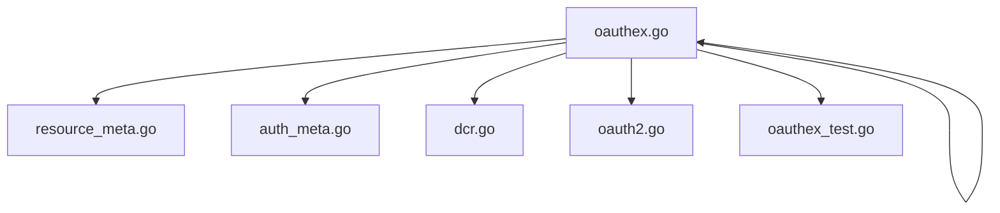
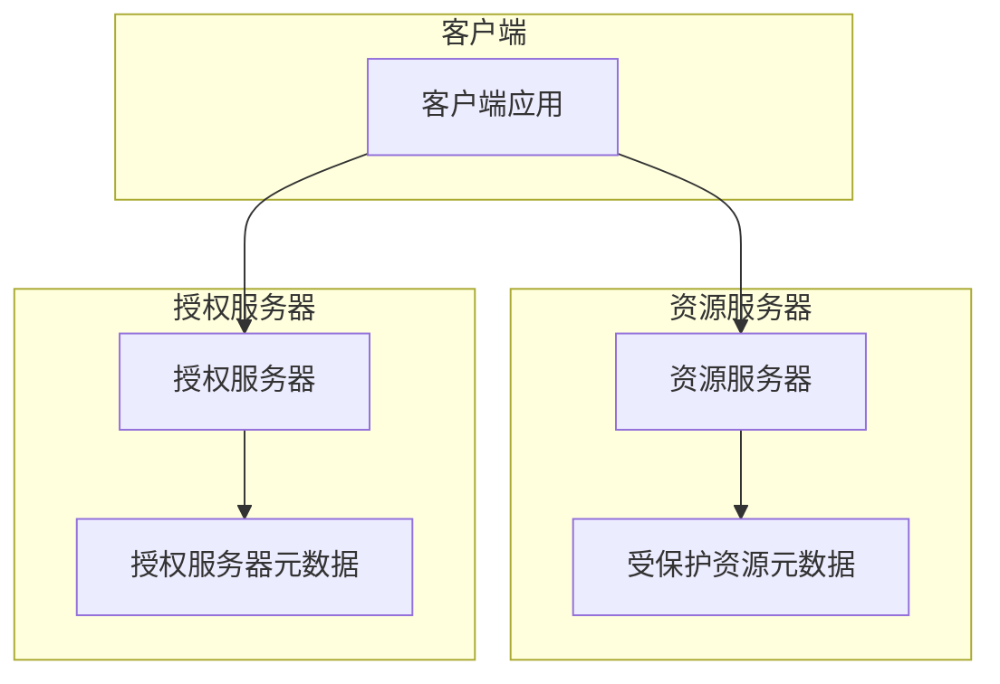
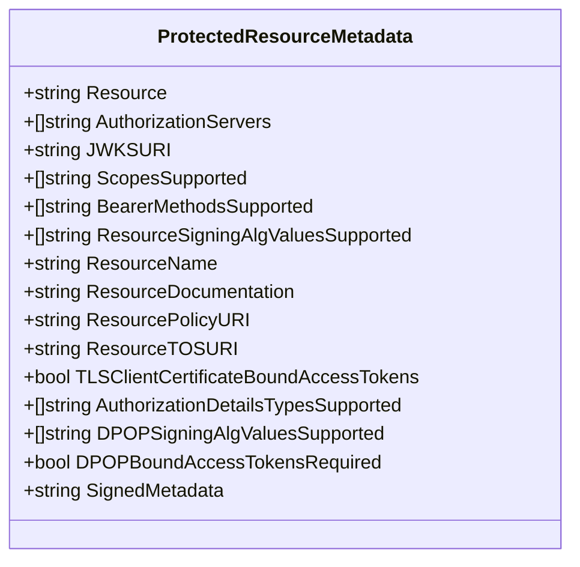
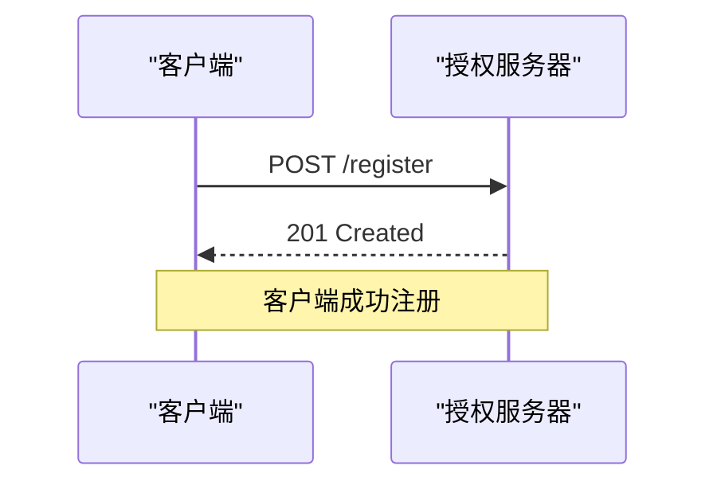
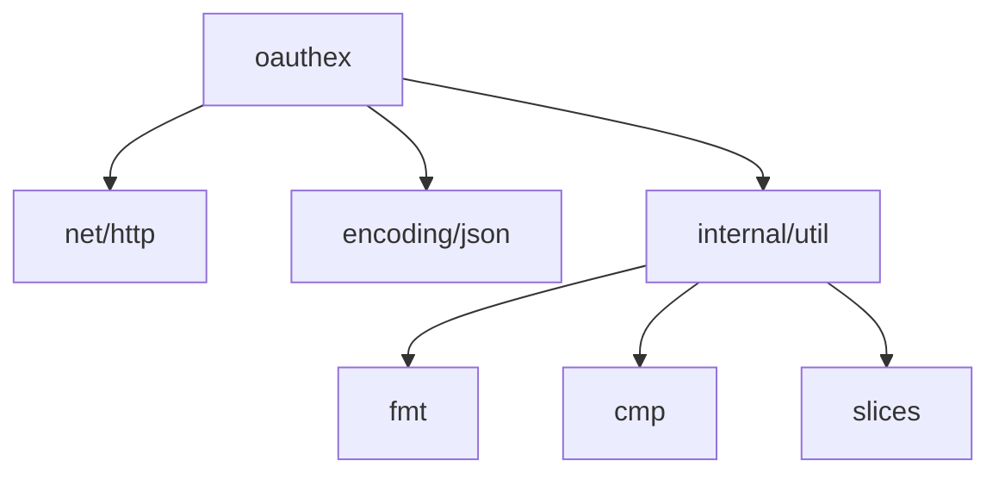

# OAuth 扩展 API

<cite>
**本文档中引用的文件**  
- [oauthex.go](file://oauthex/oauthex.go)
- [resource_meta.go](file://oauthex/resource_meta.go)
- [auth_meta.go](file://oauthex/auth_meta.go)
- [dcr.go](file://oauthex/dcr.go)
- [oauth2.go](file://oauthex/oauth2.go)
- [oauthex_test.go](file://oauthex/oauthex_test.go)
</cite>

## 目录
1. [简介](#简介)
2. [项目结构](#项目结构)
3. [核心组件](#核心组件)
4. [架构概述](#架构概述)
5. [详细组件分析](#详细组件分析)
6. [依赖分析](#依赖分析)
7. [性能考虑](#性能考虑)
8. [故障排除指南](#故障排除指南)
9. [结论](#结论)

## 简介
本文档详细介绍了 `ProtectedResourceMetadata` 结构体的实现，该结构体遵循 RFC 9728 标准定义受保护资源的元数据。文档将逐字段解释其语义、使用场景和 JSON 序列化规则，并阐述其在动态客户端注册（DCR）和资源服务器发现中的作用。同时，文档还将说明当前未实现的功能及其未来扩展方向。

## 项目结构
项目结构遵循典型的 Go 项目布局，主要功能集中在 `oauthex` 目录下。该目录包含实现 OAuth 扩展功能的核心文件，包括受保护资源元数据、授权服务器元数据和动态客户端注册等功能。

**图示来源**  
- [resource_meta.go](file://oauthex/resource_meta.go)
- [oauthex.go](file://oauthex/oauthex.go)
- [auth_meta.go](file://oauthex/auth_meta.go)
- [dcr.go](file://oauthex/dcr.go)
- [oauth2.go](file://oauthex/oauth2.go)
- [oauthex_test.go](file://oauthex/oauthex_test.go)

**节来源**  
- [oauthex.go](file://oauthex/oauthex.go)
- [resource_meta.go](file://oauthex/resource_meta.go)

## 核心组件
`ProtectedResourceMetadata` 结构体是本项目的核心组件，用于定义受保护资源的元数据。该结构体实现了 RFC 9728 标准，支持多种安全特性，如 DPoP 绑定令牌和 TLS 客户端证书绑定。

**节来源**  
- [oauthex.go](file://oauthex/oauthex.go#L14-L91)
- [resource_meta.go](file://oauthex/resource_meta.go#L40-L67)

## 架构概述
系统架构基于 OAuth 2.0 扩展标准，主要包括受保护资源元数据、授权服务器元数据和动态客户端注册三个核心模块。这些模块通过标准的 HTTP 接口进行通信，实现了安全的资源访问控制。

**图示来源**  
- [oauthex.go](file://oauthex/oauthex.go)
- [resource_meta.go](file://oauthex/resource_meta.go)
- [auth_meta.go](file://oauthex/auth_meta.go)

## 详细组件分析
### ProtectedResourceMetadata 结构体分析
`ProtectedResourceMetadata` 结构体定义了受保护资源的元数据，包含 20 个字段，每个字段都有特定的语义和使用场景。

#### 字段说明
- **Resource (resource)**: 受保护资源的标识符，必需字段。
- **AuthorizationServers (authorization_servers)**: 可与此受保护资源一起使用的 OAuth 授权服务器发行者标识符列表。
- **JWKSURI (jwks_uri)**: 受保护资源的 JSON Web Key (JWK) 集文档的可选 URL。
- **ScopesSupported (scopes_supported)**: 推荐的范围值列表，用于请求访问此受保护资源。
- **BearerMethodsSupported (bearer_methods_supported)**: 支持的 OAuth 2.0 持有者令牌发送方法列表。
- **ResourceSigningAlgValuesSupported (resource_signing_alg_values_supported)**: 受保护资源支持的 JWS 签名算法列表。
- **ResourceName (resource_name)**: 受保护资源的人类可读名称。
- **ResourceDocumentation (resource_documentation)**: 包含开发者使用信息的页面 URL。
- **ResourcePolicyURI (resource_policy_uri)**: 包含客户端使用数据策略信息的页面 URL。
- **ResourceTOSURI (resource_tos_uri)**: 包含受保护资源服务条款的页面 URL。
- **TLSClientCertificateBoundAccessTokens (tls_client_certificate_bound_access_tokens)**: 指示是否支持相互 TLS 客户端证书绑定访问令牌的可选布尔值。
- **AuthorizationDetailsTypesSupported (authorization_details_types_supported)**: 资源服务器支持的 'authorization_details' 参数类型值列表。
- **DPOPSigningAlgValuesSupported (dpop_signing_alg_values_supported)**: 资源服务器支持的 JWS 签名算法列表，用于验证 DPoP 证明 JWT。
- **DPOPBoundAccessTokensRequired (dpop_bound_access_tokens_required)**: 指定受保护资源是否始终需要使用 DPoP 绑定访问令牌的可选布尔值。
- **SignedMetadata (signed_metadata)**: 包含受保护资源元数据参数的可选 JWT。

#### JSON 序列化规则
所有字段均使用 `json` 标签进行序列化，可选字段使用 `omitempty` 标志，确保在值为空时不会出现在 JSON 输出中。

**图示来源**  
- [oauthex.go](file://oauthex/oauthex.go#L14-L91)

**节来源**  
- [oauthex.go](file://oauthex/oauthex.go#L14-L91)
- [resource_meta.go](file://oauthex/resource_meta.go#L40-L67)

### 动态客户端注册（DCR）分析
动态客户端注册功能允许客户端在运行时向授权服务器注册自身。该功能通过 `RegisterClient` 函数实现，遵循 RFC 7591 标准。

**图示来源**  
- [dcr.go](file://oauthex/dcr.go#L140-L223)

**节来源**  
- [dcr.go](file://oauthex/dcr.go#L140-L223)

## 依赖分析
项目依赖关系清晰，核心功能模块之间耦合度低。`oauthex` 模块依赖于标准库和内部工具模块，确保了代码的可维护性和可测试性。

**图示来源**  
- [oauthex.go](file://oauthex/oauthex.go)
- [resource_meta.go](file://oauthex/resource_meta.go)
- [internal/util/util.go](file://internal/util/util.go)

**节来源**  
- [oauthex.go](file://oauthex/oauthex.go)
- [resource_meta.go](file://oauthex/resource_meta.go)
- [internal/util/util.go](file://internal/util/util.go)

## 性能考虑
系统在设计时考虑了性能因素，如使用高效的 JSON 解码器和限制响应体大小，以防止潜在的拒绝服务攻击。此外，所有网络请求都使用上下文进行超时控制，确保系统的响应性。

## 故障排除指南
在使用本 API 时，可能会遇到以下常见问题：
- **元数据验证失败**: 确保 `Resource` 字段与请求的资源标识符匹配。
- **HTTPS 要求**: 所有元数据 URL 必须使用 HTTPS 协议。
- **XSS 攻击防护**: 系统会验证授权服务器 URL 的方案，防止 javascript 或 data 方案的 XSS 攻击。

**节来源**  
- [resource_meta.go](file://oauthex/resource_meta.go#L70-L100)
- [oauth2.go](file://oauthex/oauth2.go#L70-L88)

## 结论
`ProtectedResourceMetadata` 结构体的实现为 OAuth 2.0 增强安全特性提供了坚实的基础。通过遵循 RFC 9728 标准，该实现支持现代安全需求，如 DPoP 和 TLS 客户端证书绑定。未来可以考虑实现 `signed_metadata` 功能，以提供更强的元数据完整性保证。