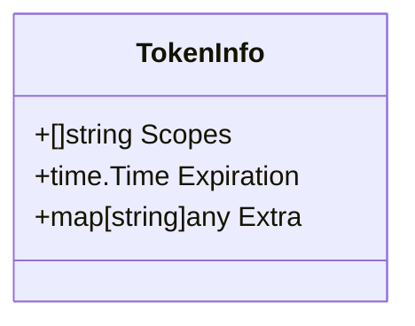
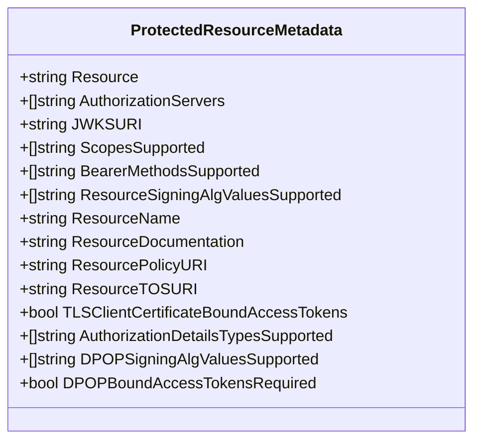
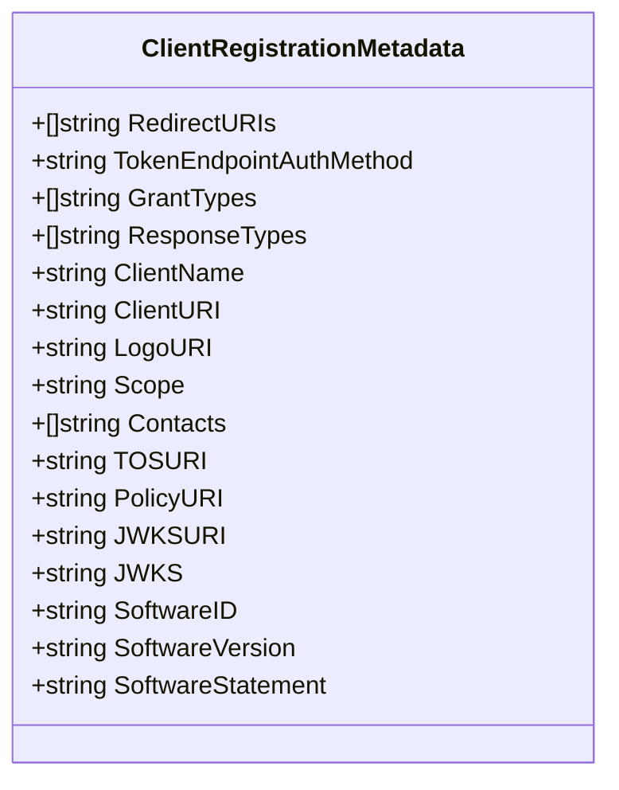
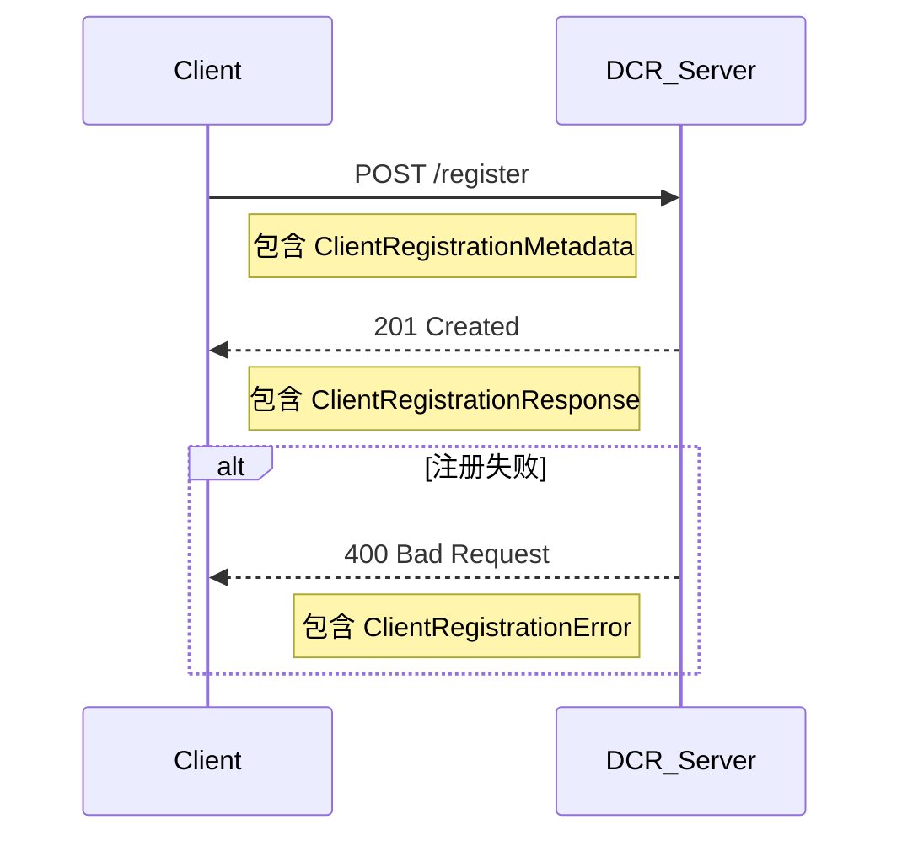

# 认证与安全 API

<cite>
**Referenced Files in This Document**   
- [auth.go](file://auth/auth.go)
- [oauthex.go](file://oauthex/oauthex.go)
- [resource_meta.go](file://oauthex/resource_meta.go)
- [dcr.go](file://oauthex/dcr.go)
- [oauth2.go](file://oauthex/oauth2.go)
- [auth_meta.go](file://oauthex/auth_meta.go)
- [main.go](file://examples/server/auth-middleware/main.go)
</cite>

## 目录
1. [简介](#简介)
2. [认证中间件](#认证中间件)
3. [令牌信息](#令牌信息)
4. [受保护资源元数据](#受保护资源元数据)
5. [动态客户端注册](#动态客户端注册)
6. [JWT集成示例](#jwt集成示例)
7. [错误处理](#错误处理)

## 简介
本文档详细介绍了Go MCP SDK中认证与安全相关的API，重点涵盖`auth`和`oauthex`两个包的核心功能。文档旨在为开发者提供清晰的指导，说明如何使用`RequireBearerToken`中间件实现API认证，如何利用`TokenInfo`结构体在请求上下文中传递认证信息，以及如何通过`oauthex`包实现OAuth 2.0扩展功能，包括受保护资源元数据和动态客户端注册。文档还提供了JWT令牌验证的集成示例和错误处理策略。

## 认证中间件

`auth`包提供了`RequireBearerToken`中间件函数，用于保护HTTP端点，确保只有持有有效Bearer令牌的客户端才能访问。该中间件遵循RFC 6750标准，通过检查`Authorization`头来验证令牌。

`RequireBearerToken`函数接收一个`TokenVerifier`函数和一个`RequireBearerTokenOptions`结构体作为参数。`TokenVerifier`负责实际的令牌验证逻辑（例如，验证JWT签名或查询API密钥数据库），而`RequireBearerTokenOptions`则用于配置中间件的行为，如指定必需的权限范围（scopes）和资源元数据URL。

**Section sources**
- [auth.go](file://auth/auth.go#L60-L79)
- [auth.go](file://auth/auth.go#L81-L119)

## 令牌信息

`TokenInfo`结构体是认证流程中的核心数据载体，用于存储从有效令牌中提取出的信息。该结构体被设计为可存储在HTTP请求的上下文（context）中，以便在后续的处理链中访问。

**Diagram sources**
- [auth.go](file://auth/auth.go#L16-L21)

`TokenInfo`包含以下关键字段：
- **Scopes**: 一个字符串切片，表示该令牌被授予的权限范围。这些范围可用于实现基于角色的访问控制（RBAC）。
- **Expiration**: 一个`time.Time`类型的值，表示令牌的过期时间。中间件会自动检查此时间，拒绝已过期的令牌。
- **Extra**: 一个`map[string]any`类型的字段，用于存储任何额外的、非标准的令牌信息。这为扩展功能提供了灵活性。

通过`TokenInfoFromContext`函数，可以在任何处理HTTP请求的函数中轻松地从上下文中检索`TokenInfo`对象。

**Section sources**
- [auth.go](file://auth/auth.go#L17-L20)
- [auth.go](file://auth/auth.go#L46-L52)

## 受保护资源元数据

`oauthex`包实现了RFC 9728中定义的“受保护资源元数据”（Protected Resource Metadata）功能。该功能允许资源服务器向客户端提供关于其自身配置和要求的元数据，从而实现更智能和自动化的客户端交互。

`ProtectedResourceMetadata`结构体定义了资源服务器可以公开的元数据。`RequireBearerToken`中间件可以通过设置`RequireBearerTokenOptions`中的`ResourceMetadataURL`字段，将此元数据的URL包含在`WWW-Authenticate`响应头中。

**Diagram sources**
- [oauthex.go](file://oauthex/oauthex.go#L14-L91)

`oauthex`包提供了两个主要函数来获取这些元数据：
- **GetProtectedResourceMetadataFromID**: 当客户端已知资源服务器的ID（一个URL）时，此函数会自动构造元数据的发现URL（通常为`https://<resource-id>/.well-known/oauth-protected-resource`）并发起HTTP GET请求来获取元数据。
- **GetProtectedResourceMetadataFromHeader**: 当客户端收到一个带有`WWW-Authenticate`头的401响应时，此函数会解析该头，提取出`resource_metadata`参数中的URL，然后获取并验证元数据。

这两个函数都依赖于`getPRM`内部函数，该函数负责执行HTTP请求、验证响应内容类型、检查HTTPS协议以及验证返回的`Resource`字段是否与预期一致。

**Section sources**
- [oauthex.go](file://oauthex/oauthex.go#L19-L83)
- [resource_meta.go](file://oauthex/resource_meta.go#L40-L74)
- [oauth2.go](file://oauthex/oauth2.go#L40-L69)
- [oauth2.go](file://oauthex/oauth2.go#L74-L87)

## 动态客户端注册

`oauthex`包还支持RFC 7591中定义的“动态客户端注册”（Dynamic Client Registration, DCR）功能。这允许客户端在运行时向授权服务器注册自身，而无需手动配置。

`ClientRegistrationMetadata`结构体定义了客户端在注册时需要提供的信息，例如重定向URI、客户端名称、联系方式等。

**Diagram sources**
- [dcr.go](file://oauthex/dcr.go#L22-L87)

`RegisterClient`函数是执行动态注册的核心。它接收一个`ClientRegistrationMetadata`对象和授权服务器的注册端点URL，然后构造一个POST请求并发送。根据响应状态码，它会解析成功响应（HTTP 201）或错误响应（HTTP 400）。

**Diagram sources**
- [dcr.go](file://oauthex/dcr.go#L169-L222)

## JWT集成示例

`examples/server/auth-middleware/main.go`文件提供了一个完整的集成示例，展示了如何将`RequireBearerToken`中间件与JWT令牌验证结合使用。

该示例创建了一个MCP服务器，并使用`RequireBearerToken`为不同的端点（如`/mcp/jwt`）应用认证。它定义了一个`verifyJWT`函数作为`TokenVerifier`，该函数使用`golang-jwt`库来解析和验证JWT令牌的签名和声明。验证成功后，`verifyJWT`函数会创建一个`TokenInfo`对象，其中包含从JWT声明中提取的`scopes`和`expiration`信息，并将其返回给中间件。

此外，示例还提供了一个`/generate-token`端点，用于生成测试用的JWT令牌，方便开发者进行测试。

**Section sources**
- [main.go](file://examples/server/auth-middleware/main.go#L85-L108)
- [main.go](file://examples/server/auth-middleware/main.go#L231-L377)

## 错误处理

该SDK在认证和安全功能中采用了清晰的错误处理策略。

- **令牌验证错误**: `TokenVerifier`函数应返回一个包装了`auth.ErrInvalidToken`的错误，以指示令牌无效。`RequireBearerToken`中间件会将其转换为HTTP 401状态码。
- **OAuth协议错误**: 对于OAuth特定的协议错误（如无效的请求参数），应返回包装了`auth.ErrOAuth`的错误，中间件会将其转换为HTTP 400状态码。
- **内部错误**: 其他任何错误都会被转换为HTTP 500状态码。
- **DCR错误**: `RegisterClient`函数会解析RFC 7591定义的`ClientRegistrationError`，该错误包含`error`和`error_description`字段，为客户端提供了明确的失败原因。

**Section sources**
- [auth.go](file://auth/auth.go#L22-L23)
- [dcr.go](file://oauthex/dcr.go#L100-L114)
- [auth.go](file://auth/auth.go#L95-L102)