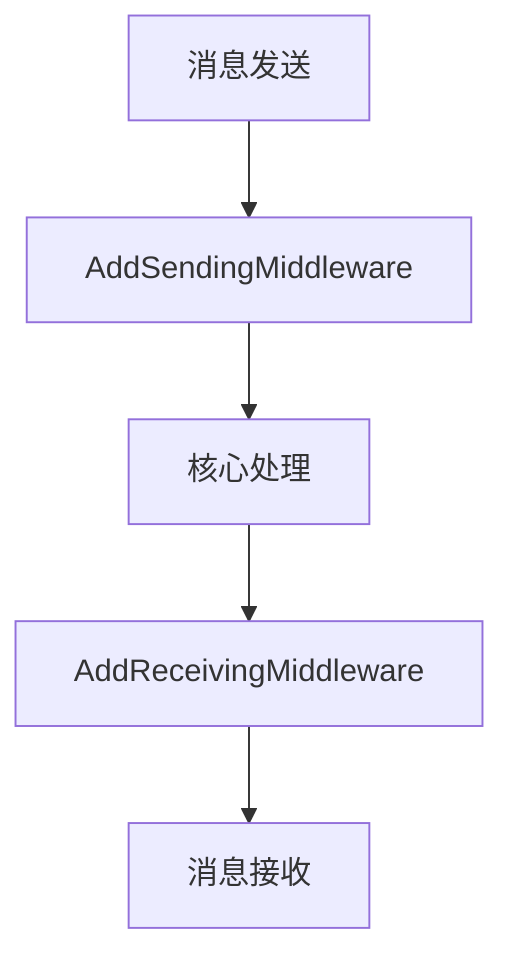
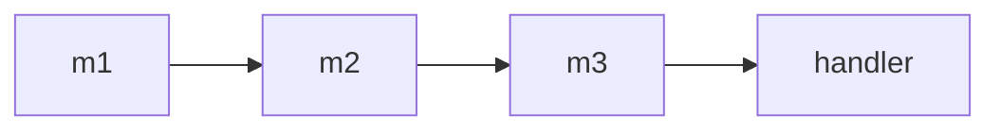
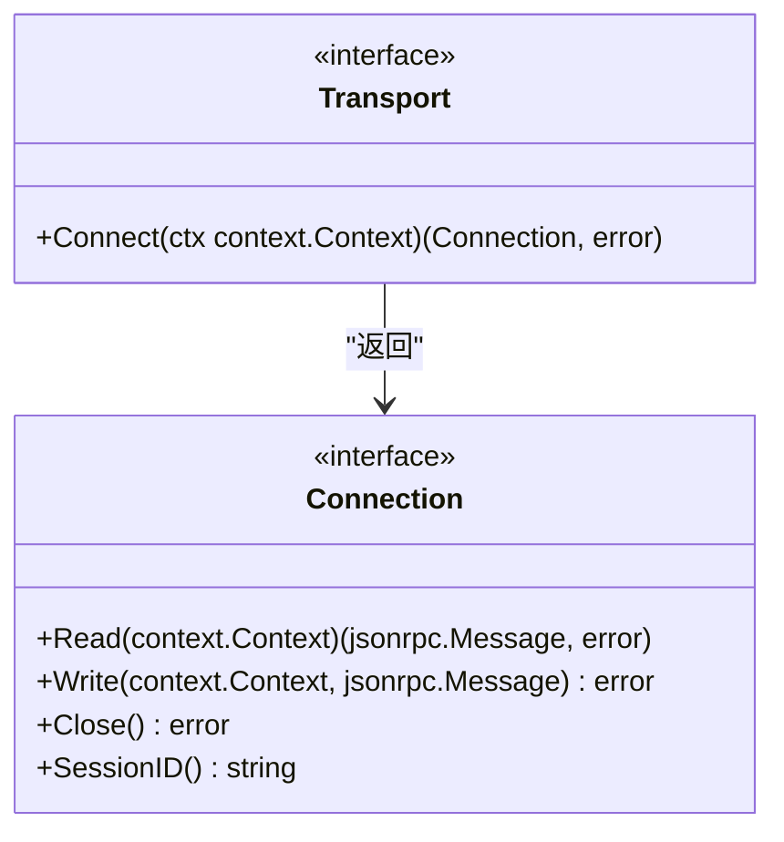
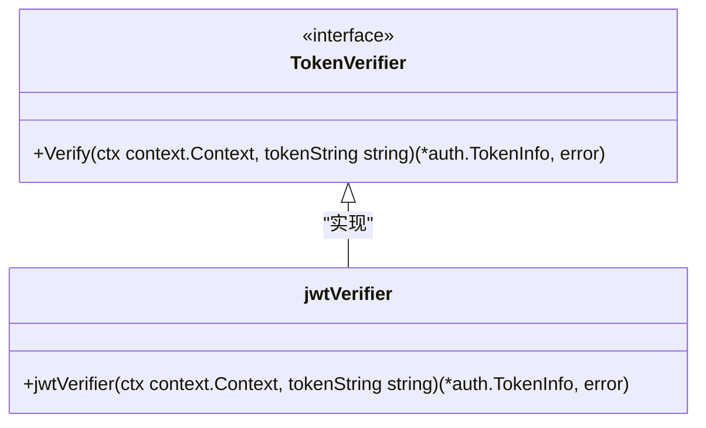

# 中间件与扩展

<cite>
**本文档中引用的文件**   
- [client.go](file://mcp/client.go)
- [server.go](file://mcp/server.go)
- [transport.go](file://mcp/transport.go)
- [xcontext.go](file://internal/xcontext/xcontext.go)
- [main.go](file://examples/server/middleware/main.go)
- [main.go](file://examples/server/custom-transport/main.go)
</cite>

## 目录
1. [简介](#简介)
2. [中间件系统](#中间件系统)
3. [中间件链的构建与执行顺序](#中间件链的构建与执行顺序)
4. [上下文增强：xcontext包的使用](#上下文增强xcontext包的使用)
5. [自定义Transport接口](#自定义transport接口)
6. [TokenVerifier接口实现](#tokenverifier接口实现)
7. [总结](#总结)

## 简介
本SDK提供了强大的扩展机制，允许开发者在不修改核心逻辑的情况下，通过中间件系统和自定义接口来增强功能。本文档将详细介绍如何使用`AddSendingMiddleware`和`AddReceivingMiddleware`在消息发送前和接收后插入自定义逻辑，以及如何实现自定义Transport和TokenVerifier接口。

**Section sources**
- [client.go](file://mcp/client.go#L470-L489)
- [server.go](file://mcp/server.go#L1043-L1062)

## 中间件系统
SDK的中间件系统允许开发者在消息发送和接收过程中插入自定义逻辑。通过`AddSendingMiddleware`和`AddReceivingMiddleware`方法，可以在消息发送前和接收后执行日志记录、指标收集、请求转换、错误重试等操作。



**Diagram sources**
- [client.go](file://mcp/client.go#L470-L489)
- [server.go](file://mcp/server.go#L1043-L1062)

**Section sources**
- [client.go](file://mcp/client.go#L470-L489)
- [server.go](file://mcp/server.go#L1043-L1062)

## 中间件链的构建与执行顺序
中间件链的构建遵循从右到左的顺序，即最先添加的中间件最先执行。例如，`AddSendingMiddleware(m1, m2, m3)`会将中间件处理链构建为`m1(m2(m3(handler)))`。



**Diagram sources**
- [examples/server/middleware/main.go](file://examples/server/middleware/main.go#L20-L60)

**Section sources**
- [examples/server/middleware/main.go](file://examples/server/middleware/main.go#L20-L60)

## 上下文增强：xcontext包的使用
`xcontext`包提供了从标准context包中无法获得的额外功能。通过`Detach`方法，可以返回一个保持父context所有值但脱离取消和错误处理的context。

```mermaid
classDiagram
class detachedContext {
+parent context.Context
+Deadline() (time.Time, bool)
+Done() <-chan struct{}
+Err() error
+Value(key any) any
}
class Detach {
+Detach(ctx context.Context) context.Context
}
Detach --> detachedContext : "返回"
```

**Diagram sources**
- [xcontext.go](file://internal/xcontext/xcontext.go#L1-L23)

**Section sources**
- [xcontext.go](file://internal/xcontext/xcontext.go#L1-L23)

## 自定义Transport接口
通过实现`Transport`接口，可以支持新的通信协议。`Transport`接口定义了`Connect`方法，用于创建逻辑JSON-RPC连接。



**Diagram sources**
- [transport.go](file://mcp/transport.go#L31-L36)

**Section sources**
- [transport.go](file://mcp/transport.go#L31-L36)

## TokenVerifier接口实现
通过实现`TokenVerifier`接口，可以集成非标准认证方案。`TokenVerifier`接口定义了`Verify`方法，用于验证JWT令牌。



**Diagram sources**
- [examples/server/auth-middleware/README.md](file://examples/server/auth-middleware/README.md#L183-L192)

**Section sources**
- [examples/server/auth-middleware/README.md](file://examples/server/auth-middleware/README.md#L183-L192)

## 总结
本文档详细介绍了SDK提供的扩展机制，包括中间件系统的使用、自定义Transport接口的实现以及TokenVerifier接口的集成。通过这些扩展点，开发者可以灵活地增强SDK功能，满足各种复杂场景的需求。