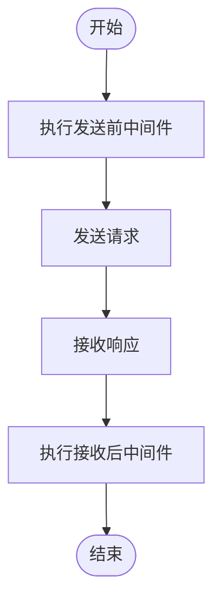
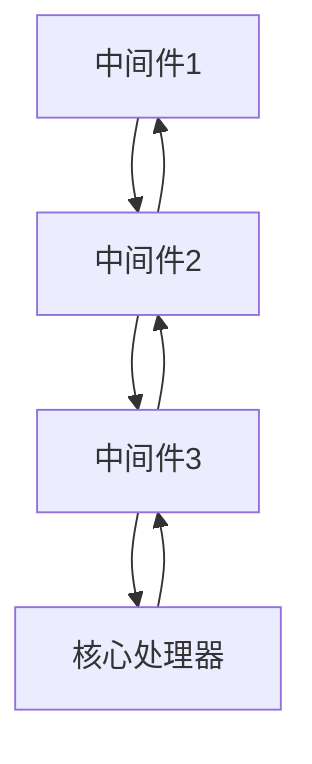
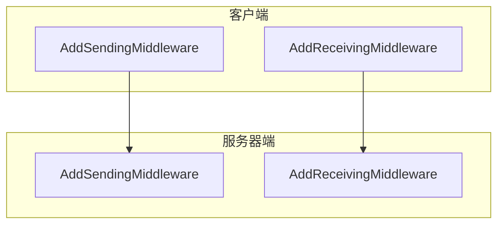

# 中间件系统

<cite>
**本文档中引用的文件**   
- [examples/server/middleware/main.go](file://examples/server/middleware/main.go)
- [mcp/server.go](file://mcp/server.go#L1043-L1062)
- [mcp/client.go](file://mcp/client.go#L470-L489)
- [mcp/shared.go](file://mcp/shared.go#L82-L86)
- [mcp/shared.go](file://mcp/shared.go#L64)
</cite>

## 目录
1. [简介](#简介)
2. [核心组件](#核心组件)
3. [中间件执行流程](#中间件执行流程)
4. [客户端与服务器端对称设计](#客户端与服务器端对称设计)
5. [最佳实践](#最佳实践)

## 简介
中间件系统是SDK中用于在消息发送前和接收后拦截并处理请求与响应的核心机制。通过`AddSendingMiddleware`和`AddReceivingMiddleware`方法，开发者可以实现日志记录、性能监控、请求转换、错误重试等多种功能。该系统在客户端和服务器端均提供对称的API，确保双向通信中的统一处理逻辑。

## 核心组件

中间件系统的核心在于`MethodHandler`函数类型和`Middleware`函数类型。`MethodHandler`定义了处理MCP消息的函数签名，接收上下文、方法名和请求对象，返回结果和错误。`Middleware`则是将一个`MethodHandler`包装为另一个`MethodHandler`的函数，形成处理链。

`AddSendingMiddleware`和`AddReceivingMiddleware`方法分别用于添加发送前和接收后的中间件。这些方法接受一个或多个`Middleware`函数，并通过`addMiddleware`函数将它们按从右到左的顺序组合到处理链中。

**中间件执行流程**

**Diagram sources**
- [mcp/shared.go](file://mcp/shared.go#L82-L86)
- [mcp/server.go](file://mcp/server.go#L1043-L1062)

**Section sources**
- [mcp/shared.go](file://mcp/shared.go#L64)
- [mcp/server.go](file://mcp/server.go#L1043-L1062)

## 中间件执行流程

中间件的执行遵循责任链模式。当调用`AddSendingMiddleware`或`AddReceivingMiddleware`时，提供的中间件函数会被依次包装到现有的`MethodHandler`上。由于包装顺序是从右到左，因此最先添加的中间件会最先执行。

以`examples/server/middleware/main.go`中的日志中间件为例，它在处理请求前记录方法开始信息，在处理完成后记录持续时间和结果。这种设计允许开发者在不修改核心业务逻辑的情况下，透明地添加横切关注点。

中间件函数通过闭包捕获`next`处理器，形成递归调用链。每个中间件可以选择在调用`next`前后执行逻辑，或者完全阻止请求的继续传递。

**Diagram sources**
- [examples/server/middleware/main.go](file://examples/server/middleware/main.go#L25-L75)

**Section sources**
- [examples/server/middleware/main.go](file://examples/server/middleware/main.go#L25-L75)

## 客户端与服务器端对称设计

SDK在客户端和服务器端提供了对称的中间件API。`Client`和`Server`结构体都包含`sendingMethodHandler_`和`receivingMethodHandler_`字段，并提供`AddSendingMiddleware`和`AddReceivingMiddleware`方法。这种对称设计使得开发者可以使用相同的编程模型来处理双向通信。

客户端的中间件主要用于在发送请求前添加认证信息、在接收响应后进行解密等操作。服务器端的中间件则常用于身份验证、速率限制和日志记录。尽管应用场景不同，但它们的实现方式和调用流程完全一致。

**Diagram sources**
- [mcp/client.go](file://mcp/client.go#L470-L489)
- [mcp/server.go](file://mcp/server.go#L1043-L1062)

**Section sources**
- [mcp/client.go](file://mcp/client.go#L470-L489)
- [mcp/server.go](file://mcp/server.go#L1043-L1062)

## 最佳实践

编写高效、可复用的中间件时，应遵循以下最佳实践：

1. **避免阻塞**：中间件函数应在合理时间内完成，避免长时间运行的操作阻塞整个处理链。
2. **正确处理上下文超时**：始终检查上下文的`Done()`通道，及时响应取消信号。
3. **错误传播**：正确处理和传播错误，确保调用链中的每个环节都能获得必要的错误信息。
4. **上下文传递**：利用上下文传递请求范围的数据，而不是依赖全局变量。
5. **幂等性**：设计中间件时考虑幂等性，确保重复执行不会产生副作用。

通过遵循这些实践，开发者可以创建出既强大又可靠的中间件，为应用程序提供灵活的扩展能力。

**Section sources**
- [mcp/shared.go](file://mcp/shared.go#L64)
- [examples/server/middleware/main.go](file://examples/server/middleware/main.go#L25-L75)