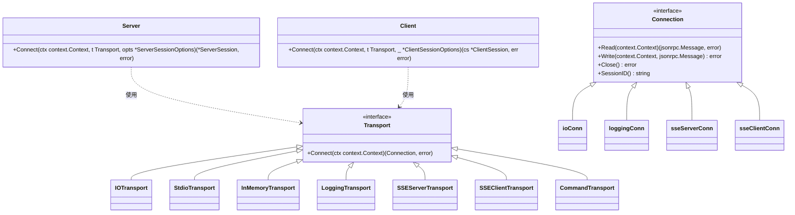
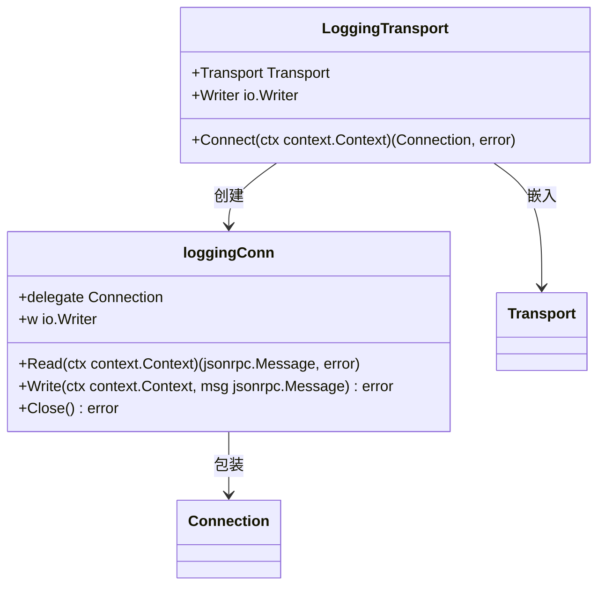
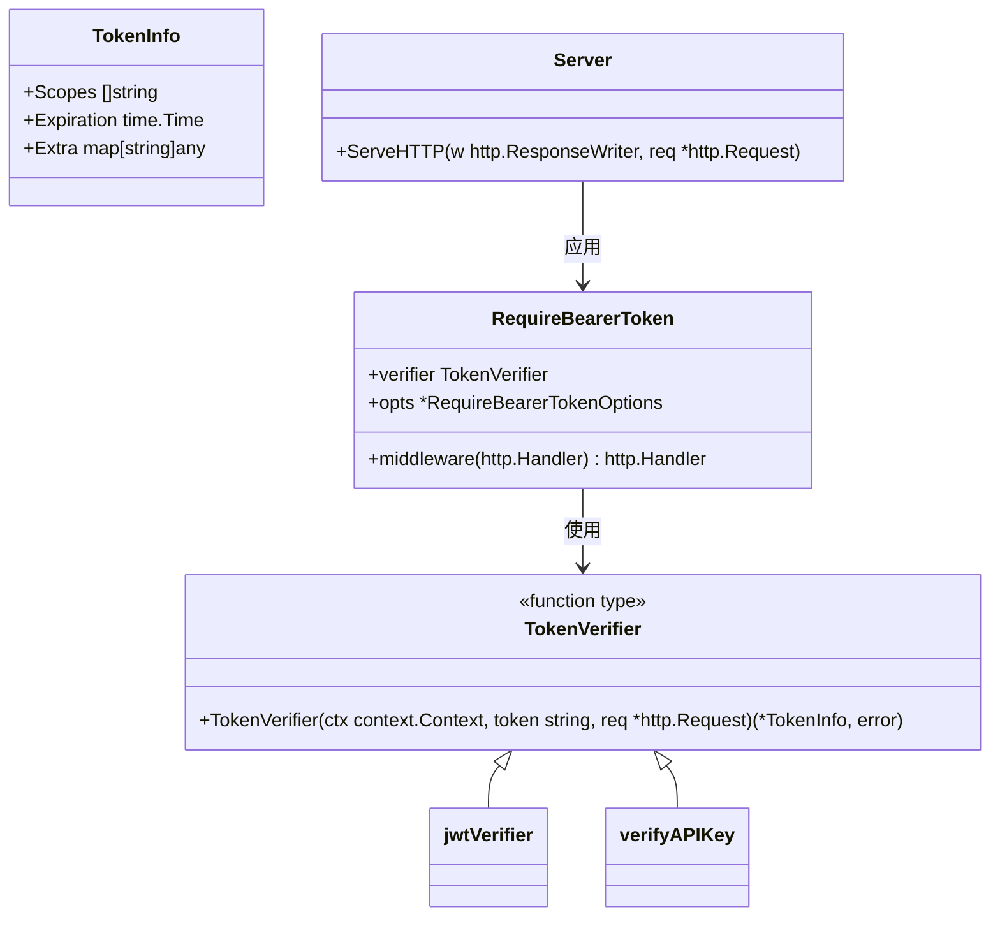

# 自定义扩展点

<cite>
**本文档中引用的文件**   
- [transport.go](file://mcp/transport.go)
- [auth.go](file://auth/auth.go)
- [custom-transport/main.go](file://examples/server/custom-transport/main.go)
- [auth-middleware/main.go](file://examples/server/auth-middleware/main.go)
</cite>

## 目录
1. [引言](#引言)
2. [核心扩展机制概述](#核心扩展机制概述)
3. [通过Transport接口扩展通信协议](#通过transport接口扩展通信协议)
4. [LoggingTransport的嵌入式结构设计](#loggingtransport的嵌入式结构设计)
5. [通过TokenVerifier扩展认证逻辑](#通过tokenverifier扩展认证逻辑)
6. [集成指导与最佳实践](#集成指导与最佳实践)
7. [结论](#结论)

## 引言
本技术文档旨在为框架集成者提供关于Go MCP SDK核心扩展机制的深入指导。文档重点阐述了如何通过实现Transport接口来扩展通信协议，以及如何利用TokenVerifier函数类型来自定义认证逻辑。通过分析SDK的接口契约、错误处理规范和线程安全要求，本文档为开发者提供了构建自定义传输方式（如WebSocket、gRPC）和集成非JWT令牌验证方案的技术蓝图。

## 核心扩展机制概述
Go MCP SDK设计了灵活的扩展点，允许开发者在不修改核心框架的情况下，集成新的功能和协议。主要扩展机制包括：
- **中间件**：用于在请求处理流程中插入自定义逻辑。
- **Transport接口**：用于扩展通信协议，支持自定义的传输方式。
- **TokenVerifier函数类型**：用于自定义认证逻辑，支持JWT以外的令牌验证方案。

这些扩展点共同构成了SDK的可扩展性基础，使得开发者能够根据具体需求定制化SDK的行为。

## 通过Transport接口扩展通信协议

### Transport接口与Connect方法
`Transport`接口是SDK中用于创建MCP客户端与服务器之间双向连接的核心接口。该接口定义了一个`Connect`方法，该方法在`Server.Connect`或`Client.Connect`调用时被精确执行一次，返回一个逻辑上的JSON-RPC连接。



**图示来源**
- [transport.go](file://mcp/transport.go#L31-L36)
- [server.go](file://mcp/server.go#L838-L853)
- [client.go](file://mcp/client.go#L135-L170)

`Connect`方法的作用是建立底层通信连接，并返回一个实现了`Connection`接口的实例。`Connection`接口定义了读取、写入和关闭连接的方法，是所有传输方式的基础。

### 自定义Transport实现
开发者可以通过实现`Transport`接口来创建新的传输方式。例如，`IOTransport`通过`io.ReadCloser`和`io.WriteCloser`进行通信，`StdioTransport`则使用标准输入输出流。`SSEServerTransport`和`SSEClientTransport`分别实现了服务器端和客户端的SSE（Server-Sent Events）传输。

**自定义Transport实现示例**
```go
type IOTransport struct {
	r *bufio.Reader
	w io.Writer
}

func (t *IOTransport) Connect(ctx context.Context) (mcp.Connection, error) {
	return &ioConn{
		r: t.r,
		w: t.w,
	}, nil
}
```

此示例展示了如何通过简单的IO流实现自定义传输，开发者可以基于此模式扩展WebSocket、gRPC等更复杂的协议。

**本节来源**
- [transport.go](file://mcp/transport.go#L110-L112)
- [transport.go](file://mcp/transport.go#L91-L93)
- [sse.go](file://mcp/sse.go#L163-L177)
- [sse.go](file://mcp/sse.go#L334-L397)
- [cmd.go](file://mcp/cmd.go#L28-L46)

## LoggingTransport的嵌入式结构设计
`LoggingTransport`是一种特殊的传输实现，它通过嵌入式结构设计，将日志记录功能与现有传输方式结合。`LoggingTransport`包含一个`Transport`字段，通过调用其`Connect`方法获取底层连接，然后返回一个包装了日志记录功能的`Connection`实例。



**图示来源**
- [transport.go](file://mcp/transport.go#L229-L229)
- [transport.go](file://mcp/transport.go#L235-L241)

这种设计模式推荐用于扩展已有传输功能，通过组合而非继承的方式，实现功能的灵活扩展。例如，开发者可以创建`MetricsTransport`来记录传输性能指标，或`CompressionTransport`来实现数据压缩。

**本节来源**
- [transport.go](file://mcp/transport.go#L229-L241)

## 通过TokenVerifier扩展认证逻辑

### TokenVerifier函数类型
`TokenVerifier`是一个函数类型，用于验证Bearer令牌的有效性并从中提取信息。该函数在验证失败时应返回一个可解包为`ErrInvalidToken`的错误。`RequireBearerToken`中间件使用`TokenVerifier`来验证令牌，并在验证成功后将`TokenInfo`添加到请求上下文中。



**图示来源**
- [auth.go](file://auth/auth.go#L27-L31)
- [auth.go](file://auth/auth.go#L57-L64)

### 集成自定义验证逻辑
在`auth-middleware`示例中，`jwtVerifier`函数实现了JWT令牌的验证逻辑。该函数解析并验证JWT令牌，提取用户权限和过期时间，并返回`TokenInfo`。通过将此函数作为`TokenVerifier`传递给`RequireBearerToken`，可以将自定义验证逻辑集成到服务器认证流程中。

```go
func verifyJWT(ctx context.Context, tokenString string, _ *http.Request) (*auth.TokenInfo, error) {
	// JWT令牌验证逻辑
	// 成功时：返回TokenInfo
	// 失败时：返回auth.ErrInvalidToken
}
```

此模式允许开发者集成OAuth、API密钥等其他认证方案，只需实现相应的`TokenVerifier`函数即可。

**本节来源**
- [auth-middleware/main.go](file://examples/server/auth-middleware/main.go#L74-L109)
- [auth.go](file://auth/auth.go#L27-L31)

## 集成指导与最佳实践

### 接口契约
- **Transport接口**：`Connect`方法必须返回一个实现了`Connection`接口的实例，且在连接失败时返回错误。
- **TokenVerifier函数**：必须在验证失败时返回可解包为`ErrInvalidToken`的错误，以确保中间件能正确处理认证失败。

### 错误处理规范
- 所有扩展点应遵循SDK的错误处理规范，使用`errors.Is`和`errors.As`来检查和转换错误。
- 在自定义传输中，`Read`和`Write`方法应在连接关闭时返回`io.EOF`或`ErrConnectionClosed`。

### 线程安全要求
- `Connection`的`Write`方法必须支持并发调用，因为调用或响应可能在用户代码中并发发生。
- `Close`方法可以被多次调用，包括并发调用，因此必须是幂等的。

### 推荐模式
- 使用嵌入式结构设计来扩展已有功能，如`LoggingTransport`所示。
- 在实现自定义`TokenVerifier`时，确保处理所有可能的错误情况，并返回适当的错误类型。

## 结论
Go MCP SDK通过`Transport`接口和`TokenVerifier`函数类型提供了强大的扩展能力。开发者可以利用这些机制来实现自定义通信协议和认证逻辑，满足特定应用场景的需求。通过遵循接口契约、错误处理规范和线程安全要求，可以确保扩展功能的稳定性和可靠性。本文档为框架集成者提供了全面的技术指导，帮助他们充分利用SDK的扩展点，构建高效、安全的应用。