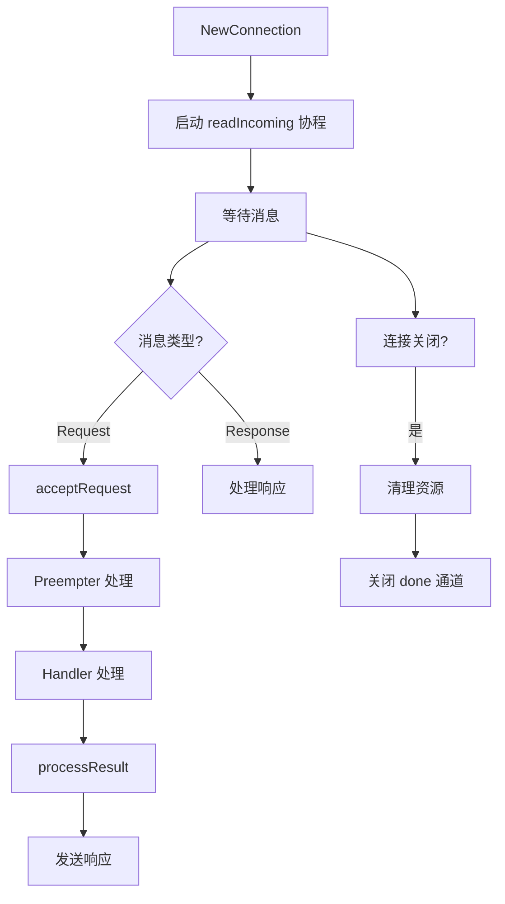
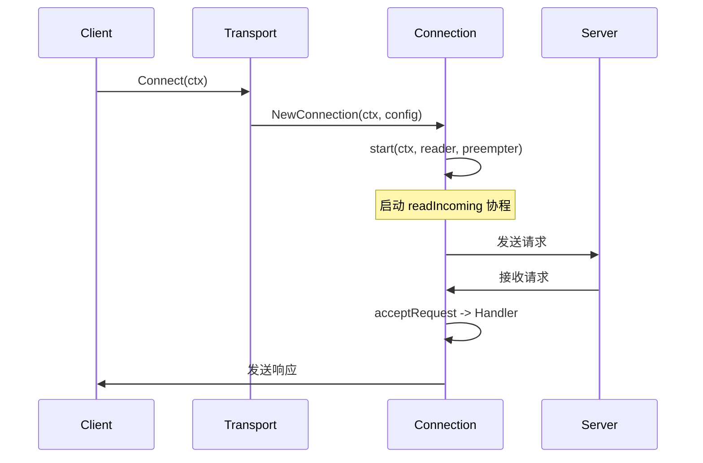

# JSON-RPC 2.0协议

<cite>
**Referenced Files in This Document**   
- [wire.go](file://internal/jsonrpc2/wire.go)
- [conn.go](file://internal/jsonrpc2/conn.go)
- [messages.go](file://internal/jsonrpc2/messages.go)
- [jsonrpc2.go](file://internal/jsonrpc2/jsonrpc2.go)
- [frame.go](file://internal/jsonrpc2/frame.go)
- [serve.go](file://internal/jsonrpc2/serve.go)
- [net.go](file://internal/jsonrpc2/net.go)
- [transport.go](file://mcp/transport.go)
</cite>

## 目录
1. [简介](#简介)
2. [消息格式与编码解码](#消息格式与编码解码)
3. [连接管理与并发控制](#连接管理与并发控制)
4. [请求路由与处理机制](#请求路由与处理机制)
5. [服务端与客户端连接流程](#服务端与客户端连接流程)
6. [异步响应与错误传播](#异步响应与错误传播)
7. [协议兼容性与调试技巧](#协议兼容性与调试技巧)

## 简介
本文档深入解析了SDK中`internal/jsonrpc2`包实现的JSON-RPC 2.0协议栈。该协议栈为MCP（Model Context Protocol）提供了底层通信基础，实现了完整的JSON-RPC 2.0规范，支持请求、响应、通知等消息类型，并通过高效的连接管理和请求路由机制确保了通信的可靠性和性能。文档将详细阐述协议的消息格式、编码解码过程、连接生命周期、并发控制以及请求处理流程。

## 消息格式与编码解码
JSON-RPC 2.0协议栈的核心是消息的序列化与反序列化。协议栈通过`wire.go`和`messages.go`文件中的结构体和函数来定义和处理网络上的消息格式。

### 消息格式
协议栈定义了两种核心消息类型：`Request`和`Response`，它们都实现了`Message`接口。`Request`用于发起调用或通知，包含`Method`（方法名）、`Params`（参数）和可选的`ID`（标识符）。当`ID`为`nil`时，该请求被视为通知（Notification），不需要响应。`Response`则用于回复一个调用请求，包含对应的`ID`、`Result`（结果）和`Error`（错误信息）。所有消息都必须包含`jsonrpc`字段，其值固定为`"2.0"`，以确保版本兼容性。

### 编码解码机制
编码和解码由`messages.go`中的`EncodeMessage`和`DecodeMessage`函数实现。`EncodeMessage`函数接收一个`Message`接口，将其转换为`wireCombined`结构体，然后使用`json.Marshal`序列化为字节流。`DecodeMessage`函数则执行相反的操作，它首先将字节流反序列化为`wireCombined`结构体，然后根据`Method`字段判断是`Request`还是`Response`，并创建相应的消息对象。此过程确保了与MCP规范的严格兼容。

**Section sources**
- [wire.go](file://internal/jsonrpc2/wire.go#L1-L98)
- [messages.go](file://internal/jsonrpc2/messages.go#L1-L213)

## 连接管理与并发控制
`Connection`结构体是整个协议栈的核心，它管理着一个双向的JSON-RPC连接，负责处理消息的发送、接收以及连接的生命周期。

### Connection结构体
`Connection`结构体通过`sync.Mutex`（`stateMu`）和原子操作（`seq`）来保证并发安全。`seq`字段用于生成唯一的请求ID。`state`字段是一个`inFlightState`结构体，它记录了所有正在进行的调用和通知的状态，是实现并发控制的关键。

### 生命周期管理
`Connection`的生命周期由`NewConnection`或`bindConnection`函数启动。`Close`方法用于优雅地关闭连接。调用`Close`后，`state.connClosing`标志被设置，阻止新的请求被处理。`updateInFlight`方法是状态更新的唯一入口，它通过`stateMu`加锁，确保对`inFlightState`的修改是原子的。当所有进行中的请求和通知都完成后，`done`通道被关闭，标志着连接的完全终止。

**Diagram sources**
- [conn.go](file://internal/jsonrpc2/conn.go#L60-L826)

**Section sources**
- [conn.go](file://internal/jsonrpc2/conn.go#L60-L826)

## 请求路由与处理机制
协议栈通过`Handler`和`Preempter`接口实现了灵活的请求路由机制，允许在请求被正式处理前进行拦截。

### Handler与Preempter接口
`Handler`接口的`Handle`方法是处理请求的主要入口，它按顺序处理每个未被拦截的请求。`Preempter`接口的`Preempt`方法则在请求入队前被调用，用于处理那些可以立即响应或需要特殊处理的请求，例如取消通知。如果`Preempt`返回`ErrNotHandled`，请求将被交给`Handler`处理。

### 请求处理流程
当`readIncoming`协程从`Reader`读取到一个`Request`时，它会调用`acceptRequest`。该方法首先为请求创建一个带取消功能的上下文，然后检查连接状态。如果`Preempter`存在，它会优先调用`Preempt`。如果`Preempt`没有处理该请求，请求将被加入`handlerQueue`队列，并启动`handleAsync`协程来处理队列中的请求。`handleAsync`会从队列中取出请求，调用`Handler.Handle`，并将结果通过`processResult`发送出去。

**Section sources**
- [conn.go](file://internal/jsonrpc2/conn.go#L574-L757)
- [jsonrpc2.go](file://internal/jsonrpc2/jsonrpc2.go#L30-L67)

## 服务端与客户端连接流程
`serve.go`文件提供了构建服务端和客户端的高级API。

### 服务端流程
`NewServer`函数创建一个服务器，它监听一个`Listener`（如TCP或管道）。当有新的连接到来时，`run`方法会调用`bindConnection`，为每个连接创建一个`Connection`实例。`Binder`接口允许为每个连接定制`ConnectionOptions`，从而实现灵活的配置。

### 客户端流程
`Dial`函数用于客户端连接。它接收一个`Dialer`（如`NetDialer`），通过`Dialer.Dial`建立底层的`io.ReadWriteCloser`，然后同样调用`bindConnection`来创建一个`Connection`。`mcp/transport.go`中的`StdioTransport`和`IOTransport`等实现了`Transport`接口，它们封装了底层的I/O，并通过`jsonrpc2.NewConnection`来建立最终的JSON-RPC连接。

**Diagram sources**
- [serve.go](file://internal/jsonrpc2/serve.go#L74-L82)
- [serve.go](file://internal/jsonrpc2/serve.go#L58-L65)
- [transport.go](file://mcp/transport.go#L1-L644)

**Section sources**
- [serve.go](file://internal/jsonrpc2/serve.go#L35-L331)
- [net.go](file://internal/jsonrpc2/net.go#L1-L139)
- [transport.go](file://mcp/transport.go#L1-L644)

## 异步响应与错误传播
协议栈支持异步响应和完善的错误传播机制。

### 异步响应
`Async`函数允许处理程序将请求标记为异步。当`Handle`函数返回`ErrAsyncResponse`时，请求的上下文不会被取消，直到调用`Cancel`或`Respond`。这使得处理程序可以在后台完成工作，并在完成后手动发送响应。

### 错误传播
错误通过`WireError`结构体在网络上传输。`processResult`方法负责处理`Handle`返回的结果和错误。对于调用请求，如果返回`nil`结果和`nil`错误，会触发内部错误。错误会被转换为`WireError`并发送给客户端。对于通知，错误会被记录但不会返回给发送方。`onInternalError`回调函数用于处理协议栈内部的错误。

**Section sources**
- [conn.go](file://internal/jsonrpc2/conn.go#L703-L757)
- [conn.go](file://internal/jsonrpc2/conn.go#L381-L385)

## 协议兼容性与调试技巧
该实现严格遵循JSON-RPC 2.0规范，并通过`frame.go`中的`Framer`接口支持不同的传输格式，如`RawFramer`和`HeaderFramer`（用于LSP）。

### 调试技巧
开发者可以通过注入`onInternalError`回调来捕获内部错误。此外，`mcp/transport.go`中的`LoggingTransport`提供了一个很好的调试示例，它通过包装`Connection`来记录所有进出的消息，这对于调试通信问题非常有帮助。

**Section sources**
- [frame.go](file://internal/jsonrpc2/frame.go#L1-L209)
- [transport.go](file://mcp/transport.go#L1-L644)