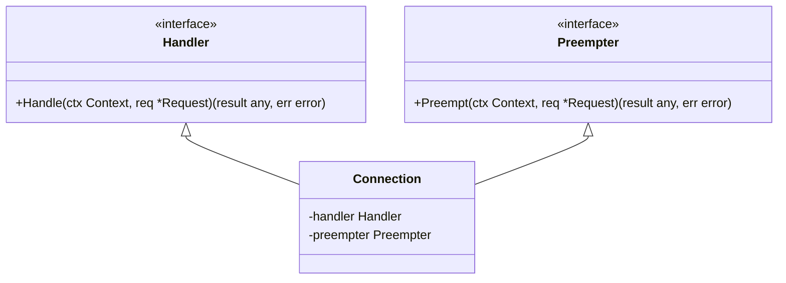
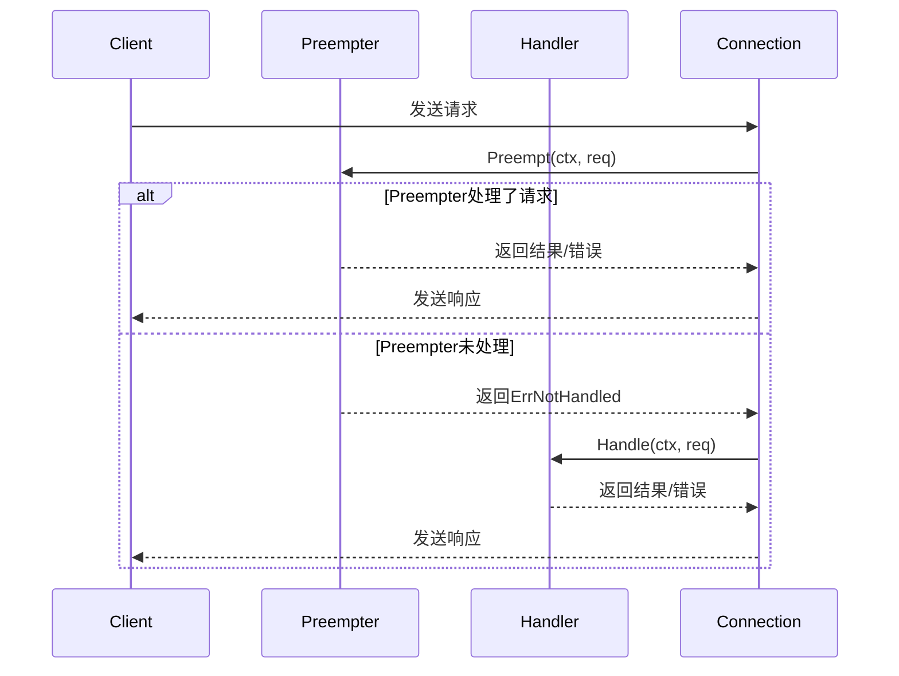
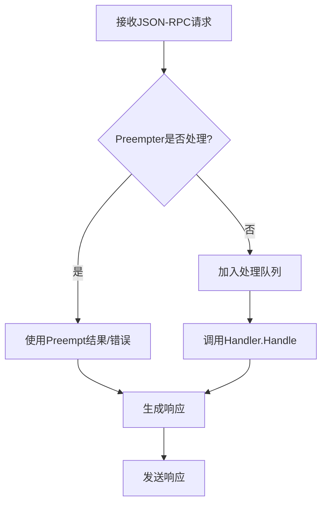
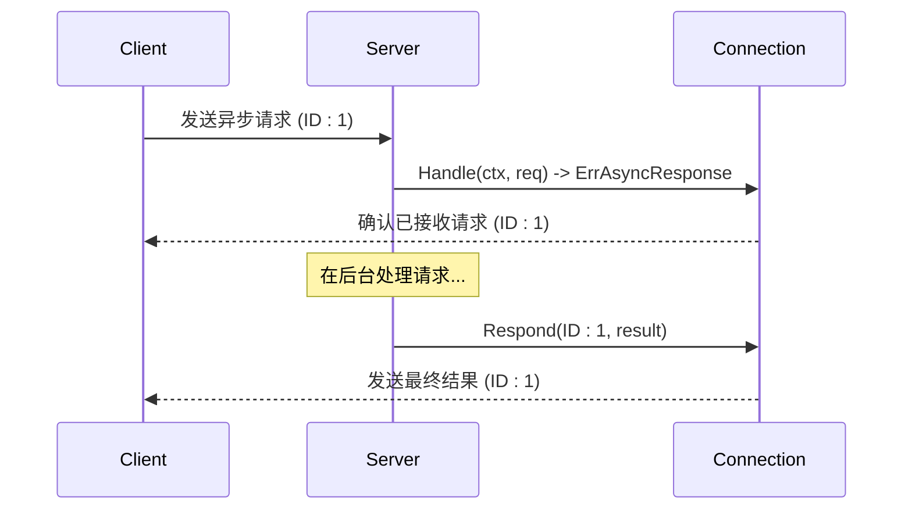

# 请求处理与路由

<cite>
**Referenced Files in This Document**   
- [serve.go](file://internal/jsonrpc2/serve.go)
- [server.go](file://mcp/server.go)
- [jsonrpc2.go](file://internal/jsonrpc2/jsonrpc2.go)
- [conn.go](file://internal/jsonrpc2/conn.go)
</cite>

## 目录
1. [引言](#引言)
2. [核心接口设计](#核心接口设计)
3. [请求分发机制](#请求分发机制)
4. [MCP方法映射](#mcp方法映射)
5. [同步与异步响应](#同步与异步响应)
6. [客户端请求与响应匹配](#客户端请求与响应匹配)
7. [错误处理流程](#错误处理流程)

## 引言
本文档深入解析Go MCP SDK中的请求路由与处理机制。系统基于JSON-RPC 2.0协议，通过`Handler`和`Preempter`接口实现请求的分层处理。`Preempter`用于处理优先级通知，确保关键操作（如取消请求）能立即执行；`Handler`则负责常规请求的顺序处理。服务器通过方法名分发请求，并支持同步与异步响应模式。MCP协议方法（如`callTool`、`readResource`）被映射为JSON-RPC调用，客户端通过ID关联请求与响应。

## 核心接口设计

`Handler`和`Preempter`是请求处理的核心接口，定义了服务器如何响应客户端请求。

### Handler接口
`Handler`接口负责处理常规的、需要顺序执行的请求。对于有ID的请求，必须返回可JSON序列化的结果或错误；对于无ID的通知，返回结果将被忽略。



**Diagram sources**
- [jsonrpc2.go](file://internal/jsonrpc2/jsonrpc2.go#L52-L67)
- [conn.go](file://internal/jsonrpc2/conn.go#L49)

**Section sources**
- [jsonrpc2.go](file://internal/jsonrpc2/jsonrpc2.go#L52-L67)

### Preempter接口
`Preempter`接口用于处理高优先级或需要立即响应的请求，如取消通知。它在请求被加入处理队列前调用，必须是非阻塞的。如果`Preempt`返回`ErrNotHandled`，请求将被传递给`Handler`处理。



**Diagram sources**
- [jsonrpc2.go](file://internal/jsonrpc2/jsonrpc2.go#L30-L40)
- [conn.go](file://internal/jsonrpc2/conn.go#L201)

**Section sources**
- [jsonrpc2.go](file://internal/jsonrpc2/jsonrpc2.go#L30-L40)

## 请求分发机制

服务器接收器（`Serve`）根据请求的`Method`字段进行分发。分发逻辑由`Connection`的`handler`和`preempter`字段驱动。

### 分发流程
1.  **接收请求**：连接从底层读取器接收到一个JSON-RPC请求。
2.  **预处理**：`Connection`首先调用`preempter.Preempt`方法。
3.  **分发决策**：
    *   如果`Preempt`返回`ErrNotHandled`，请求被加入内部队列。
    *   如果`Preempt`返回结果或错误，该结果/错误被立即处理，请求分发结束。
4.  **主处理**：对于加入队列的请求，`Connection`的内部处理器会调用`handler.Handle`方法。
5.  **响应生成**：`Handle`方法的返回值被序列化为JSON-RPC响应并发送回客户端。



**Diagram sources**
- [conn.go](file://internal/jsonrpc2/conn.go#L46)
- [serve.go](file://internal/jsonrpc2/serve.go#L1-L330)

**Section sources**
- [conn.go](file://internal/jsonrpc2/conn.go#L45-L244)

## MCP方法映射

MCP协议定义的方法（如`callTool`、`readResource`）通过`serverMethodInfos`映射到具体的Go方法，实现了JSON-RPC调用。

### 映射实现
在`mcp/server.go`中，`serverMethodInfos`是一个全局映射，将MCP方法名（字符串）映射到`methodInfo`结构体。该结构体包含了处理该方法所需的所有信息，包括：
*   `handleMethod`：指向实际处理函数的指针。
*   `unmarshalParams`：将JSON参数反序列化为Go结构体的函数。
*   `newResult`：创建结果结构体的函数。

```go
// serverMethodInfos maps from the RPC method name to serverMethodInfos.
var serverMethodInfos = map[string]methodInfo{
    methodCallTool: newServerMethodInfo(serverMethod((*Server).callTool), 0),
    methodReadResource: newServerMethodInfo(serverMethod((*Server).readResource), 0),
    // ... 其他方法
}
```

当一个`callTool`请求到达时，系统会查找`serverMethodInfos["callTool"]`，获取`handleMethod`字段，该字段指向`Server.callTool`方法，从而完成映射。

**Section sources**
- [server.go](file://mcp/server.go#L800-L1290)

## 同步与异步响应

系统支持同步和异步两种响应模式，以适应不同场景的需求。

### 同步响应
对于大多数请求，服务器采用同步处理模式。`Handle`方法在返回前完成所有计算，并直接返回结果。这是最简单和最直接的模式。

### 异步响应
对于耗时较长的操作，服务器可以返回`ErrAsyncResponse`。这会告诉连接层，该请求的结果将在未来某个时刻通过`Respond`方法提供。这允许服务器在处理长时间运行的任务时，释放处理线程，避免阻塞。



**Section sources**
- [jsonrpc2.go](file://internal/jsonrpc2/jsonrpc2.go#L67)

## 客户端请求与响应匹配

客户端通过请求中的`ID`字段来匹配响应。这是一个JSON-RPC 2.0协议的核心机制。

### 匹配流程
1.  **发起请求**：客户端发送一个带有唯一`ID`的JSON-RPC请求。
2.  **服务器处理**：服务器处理请求，无论成功与否，都会生成一个包含相同`ID`的响应。
3.  **发送响应**：服务器将响应发送回客户端。
4.  **客户端匹配**：客户端收到响应后，根据`ID`找到对应的请求，并将响应结果传递给该请求的回调函数。

这种机制确保了在并发请求环境下，客户端能够准确地将响应与原始请求关联起来。

**Section sources**
- [jsonrpc2.go](file://internal/jsonrpc2/jsonrpc2.go#L52-L67)

## 错误处理流程

系统实现了标准化的错误码返回机制，以处理各种异常情况。

### 标准化错误码
系统定义了一系列标准错误码，用于向客户端报告错误：
*   **-32700 (parse error)**：接收到的JSON无效。
*   **-32600 (invalid request)**：发送的JSON不是有效的请求对象。
*   **-32601 (method not found)**：请求的方法不存在。
*   **-32602 (invalid params)**：请求的参数无效。
*   **-32603 (internal error)**：内部错误。

### 错误处理示例
当客户端调用一个不存在的工具时，`Server.callTool`方法会返回一个`*jsonrpc2.WireError`，其代码为`codeInvalidParams`（即`-32602`），消息为“unknown tool”。

```go
func (s *Server) callTool(ctx context.Context, req *CallToolRequest) (*CallToolResult, error) {
    // ...
    if !ok {
        return nil, &jsonrpc2.WireError{
            Code:    codeInvalidParams,
            Message: fmt.Sprintf("unknown tool %q", req.Params.Name),
        }
    }
    // ...
}
```

**Section sources**
- [wire.go](file://internal/jsonrpc2/wire.go#L0-L32)
- [server.go](file://mcp/server.go#L561-L578)