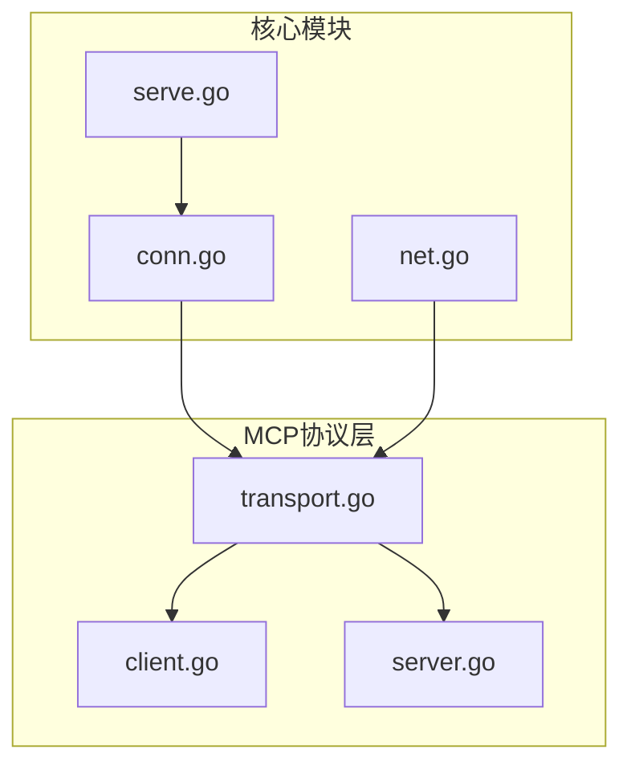
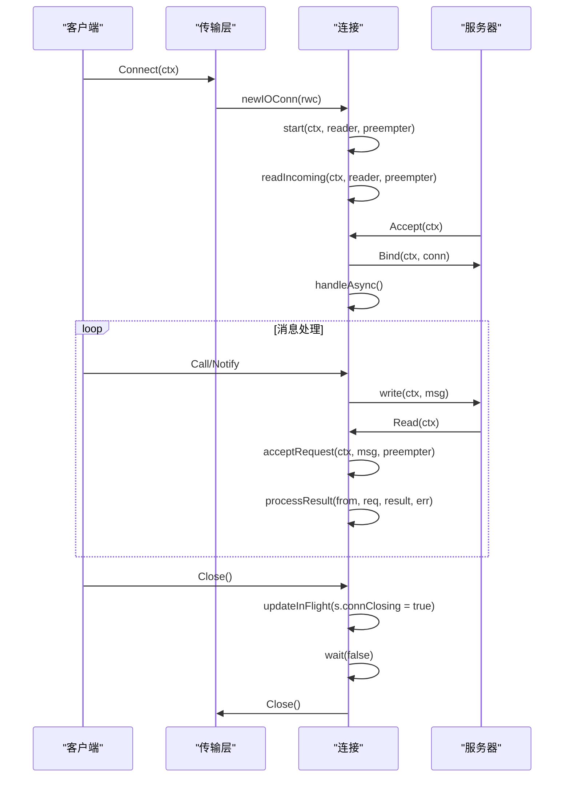
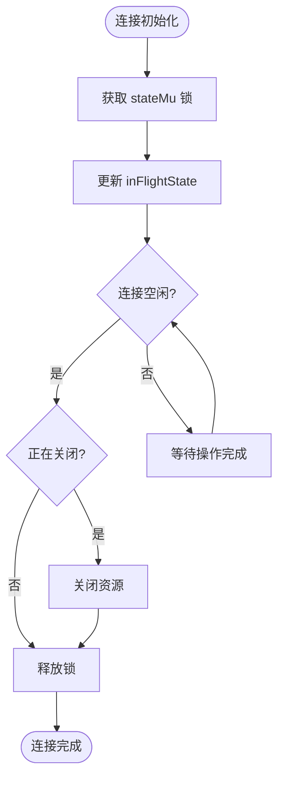
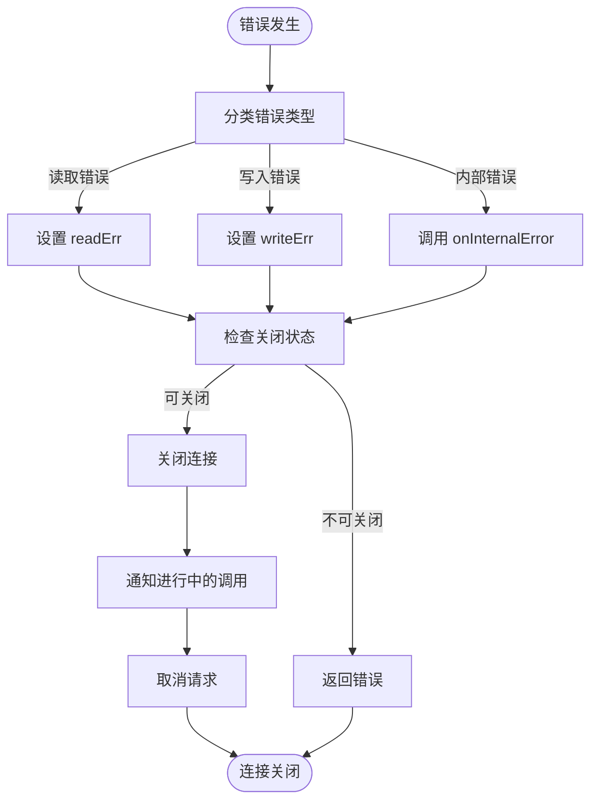
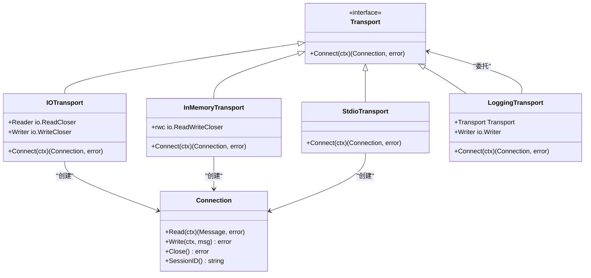
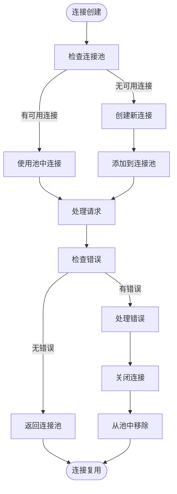

# 连接生命周期管理

<cite>
**本文档引用的文件**   
- [conn.go](file://internal/jsonrpc2/conn.go)
- [net.go](file://internal/jsonrpc2/net.go)
- [transport.go](file://mcp/transport.go)
- [serve.go](file://internal/jsonrpc2/serve.go)
- [client.go](file://mcp/client.go)
- [server.go](file://mcp/server.go)
</cite>

## 目录
1. [项目结构](#项目结构)
2. [核心组件分析](#核心组件分析)
3. [连接管理架构](#连接管理架构)
4. [连接生命周期](#连接生命周期)
5. [并发安全机制](#并发安全机制)
6. [错误传播策略](#错误传播策略)
7. [传输层实现](#传输层实现)
8. [连接池与资源泄漏预防](#连接池与资源泄漏预防)
9. [最佳实践](#最佳实践)

## 项目结构



**图源**
- [conn.go](file://internal/jsonrpc2/conn.go#L60-L72)
- [net.go](file://internal/jsonrpc2/net.go#L20-L25)
- [transport.go](file://mcp/transport.go#L31-L36)

## 核心组件分析

**组件关系**
- `Connection` 结构体是核心连接管理单元
- `Transport` 接口定义了连接建立的抽象
- `Binder` 接口用于连接配置的动态绑定
- `Handler` 接口处理消息的分发

**状态管理**
- 使用 `inFlightState` 结构体跟踪连接状态
- 通过 `sync.Mutex` 保护状态变更
- 使用 `chan struct{}` 实现连接完成通知

**消息处理**
- `Reader` 和 `Writer` 接口处理消息的读写
- `Framer` 接口控制消息的编码和分帧
- `Preempter` 接口允许预处理消息

**组件源码**
- [conn.go](file://internal/jsonrpc2/conn.go#L60-L72)
- [transport.go](file://mcp/transport.go#L39-L60)
- [serve.go](file://internal/jsonrpc2/serve.go#L30-L35)

## 连接管理架构

```mermaid
classDiagram
class Connection {
+seq int64
+stateMu sync.Mutex
+state inFlightState
+done chan struct{}
+writer Writer
+handler Handler
+onInternalError func(error)
+onDone func()
+Call(ctx, method, params) *AsyncCall
+Notify(ctx, method, params) error
+Close() error
+Wait() error
}
class inFlightState {
+connClosing bool
+reading bool
+readErr error
+writeErr error
+closer io.Closer
+closeErr error
+outgoingCalls map[ID]*AsyncCall
+outgoingNotifications int
+incoming int
+incomingByID map[ID]*incomingRequest
+handlerQueue []*incomingRequest
+handlerRunning bool
}
class AsyncCall {
+id ID
+ready chan struct{}
+response *Response
+Await(ctx, result) error
+IsReady() bool
}
class incomingRequest {
+Request *Request
+ctx context.Context
+cancel context.CancelFunc
}
Connection --> inFlightState : "包含"
Connection --> AsyncCall : "管理"
Connection --> incomingRequest : "处理"
inFlightState --> AsyncCall : "存储"
inFlightState --> incomingRequest : "存储"
```

**图源**
- [conn.go](file://internal/jsonrpc2/conn.go#L60-L72)
- [conn.go](file://internal/jsonrpc2/conn.go#L152-L180)

## 连接生命周期



**图源**
- [conn.go](file://internal/jsonrpc2/conn.go#L209-L222)
- [transport.go](file://mcp/transport.go#L110-L112)
- [serve.go](file://internal/jsonrpc2/serve.go#L58-L65)

## 并发安全机制



**同步原语**
- `sync.Mutex`：保护 `inFlightState` 的并发访问
- `atomic.AddInt64`：原子操作序列号
- `chan struct{}`：信号通知机制
- `context.WithCancel`：请求取消机制

**关键操作**
- `updateInFlight`：原子更新连接状态
- `start`：启动读取协程
- `handleAsync`：异步处理请求
- `write`：线程安全的消息写入

**源码位置**
- [conn.go](file://internal/jsonrpc2/conn.go#L111-L150)
- [conn.go](file://internal/jsonrpc2/conn.go#L264-L280)
- [conn.go](file://internal/jsonrpc2/conn.go#L664-L700)

## 错误传播策略



**错误处理机制**
- 读取错误：设置 `readErr` 并关闭连接
- 写入错误：设置 `writeErr` 并取消进行中的请求
- 内部错误：调用 `onInternalError` 回调
- 连接关闭：清理所有资源并通知完成

**错误传播**
- 通过 `updateInFlight` 统一处理状态变更
- 使用 `wait` 方法聚合错误信息
- 通过 `processResult` 处理单个请求的错误
- 利用 `context` 传播取消信号

**源码位置**
- [conn.go](file://internal/jsonrpc2/conn.go#L531-L570)
- [conn.go](file://internal/jsonrpc2/conn.go#L703-L757)
- [conn.go](file://internal/jsonrpc2/conn.go#L496-L513)

## 传输层实现



**传输类型**
- `StdioTransport`：标准输入输出传输
- `IOTransport`：分离的读写器传输
- `InMemoryTransport`：内存管道传输
- `LoggingTransport`：带日志的传输装饰器

**连接创建**
- `newIOConn`：创建基于 `io.ReadWriteCloser` 的连接
- `rwc` 结构体：组合 `io.ReadCloser` 和 `io.WriteCloser`
- `msgOrErr` 结构体：封装消息和错误

**源码位置**
- [transport.go](file://mcp/transport.go#L31-L36)
- [transport.go](file://mcp/transport.go#L88-L88)
- [transport.go](file://mcp/transport.go#L104-L107)

## 连接池与资源泄漏预防



**资源管理**
- 使用 `sync.Once` 确保连接只关闭一次
- 通过 `defer` 语句确保资源释放
- 利用 `context` 控制连接生命周期
- 监控连接状态防止泄漏

**最佳实践**
- 及时关闭不再使用的连接
- 使用连接池复用连接
- 设置合理的超时时间
- 监控连接状态和性能

**源码位置**
- [transport.go](file://mcp/transport.go#L329-L354)
- [conn.go](file://internal/jsonrpc2/conn.go#L522-L527)

## 最佳实践

### 连接配置
- 使用 `ConnectionOptions` 进行连接配置
- 设置合适的 `Framer` 处理消息编码
- 配置 `Preempter` 进行消息预处理
- 实现 `Handler` 处理业务逻辑

### 错误处理
- 实现 `onInternalError` 回调处理内部错误
- 使用 `Wait` 方法获取连接终止原因
- 正确处理 `Close` 返回的错误
- 记录关键错误日志

### 性能优化
- 复用连接减少创建开销
- 使用连接池管理连接生命周期
- 优化消息处理逻辑
- 监控连接性能指标

### 安全考虑
- 验证输入参数防止注入攻击
- 限制连接数量防止资源耗尽
- 设置合理的超时时间
- 加密敏感数据传输

**源码位置**
- [conn.go](file://internal/jsonrpc2/conn.go#L192-L194)
- [conn.go](file://internal/jsonrpc2/conn.go#L209-L222)
- [transport.go](file://mcp/transport.go#L235-L241)