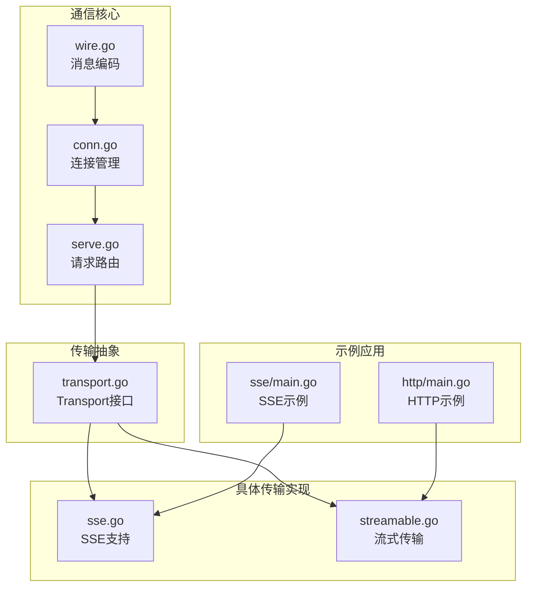
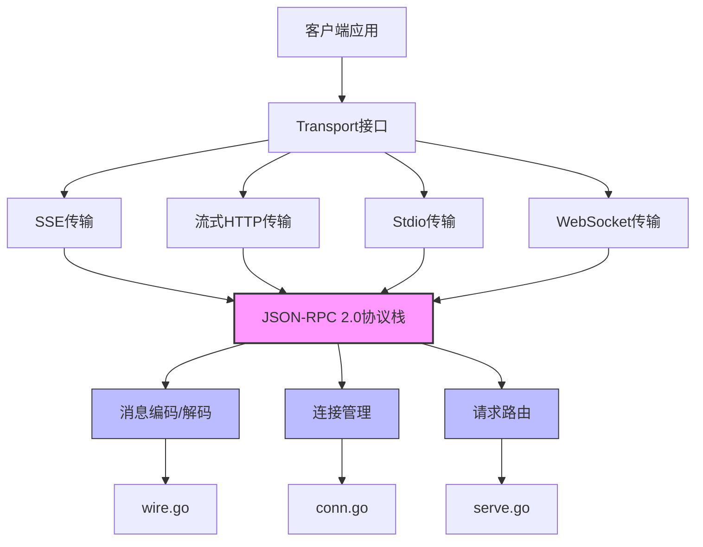
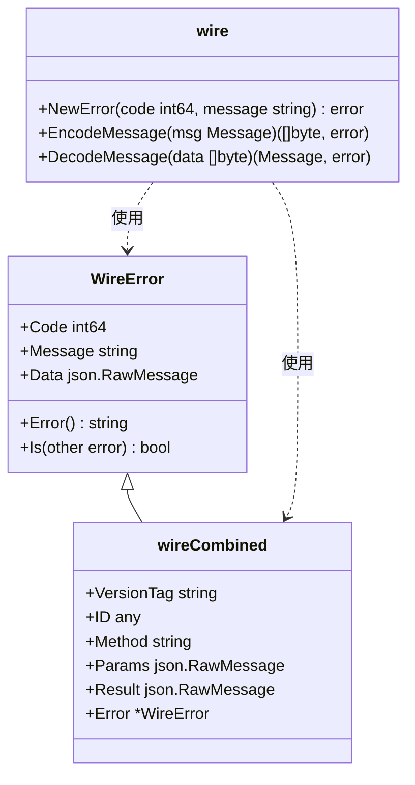
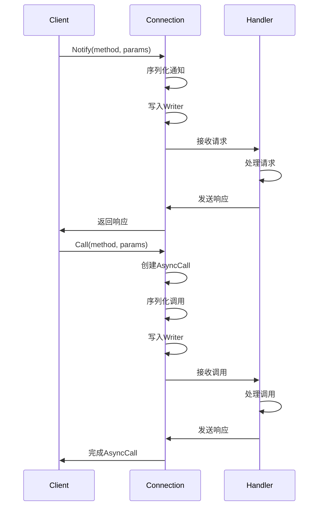
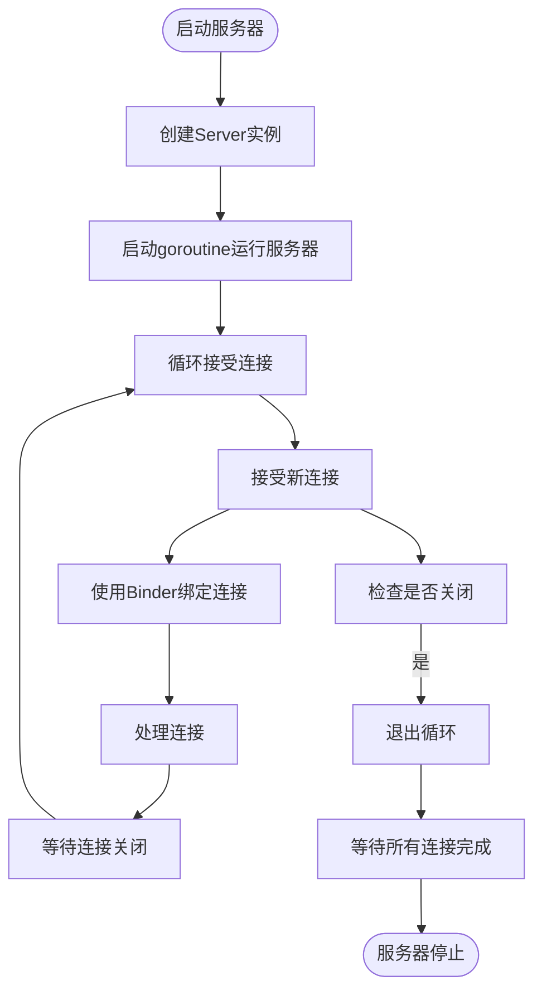
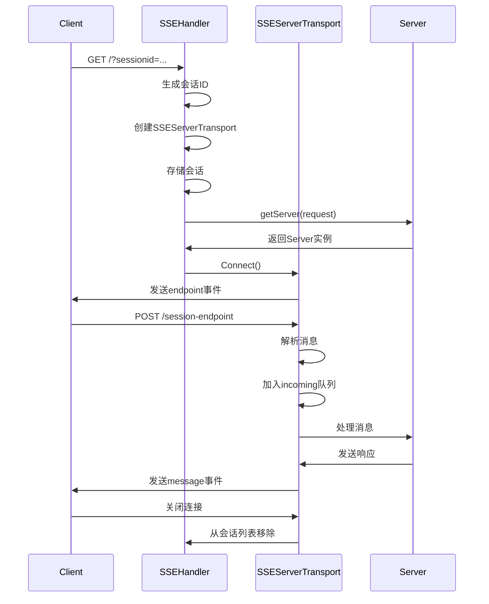
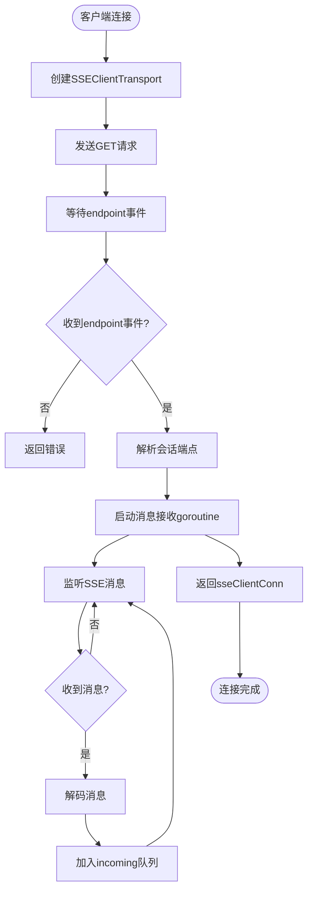
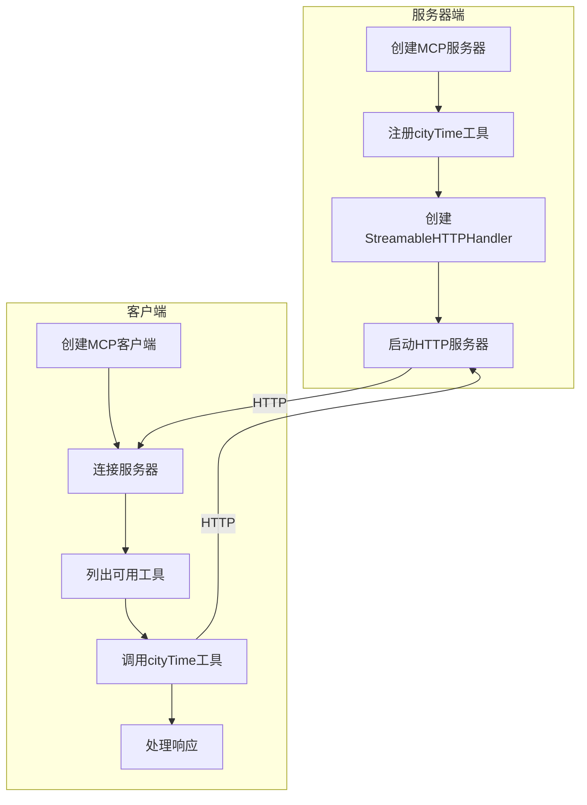
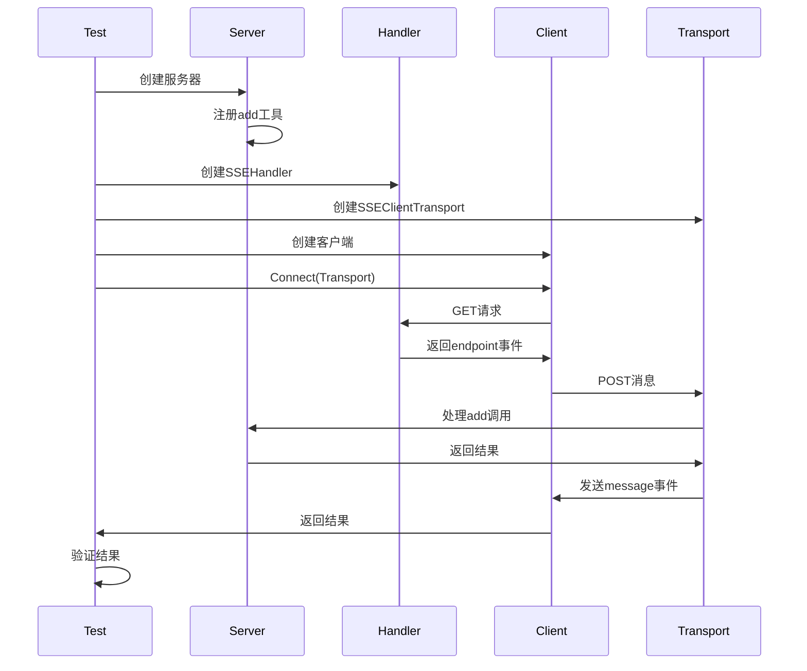
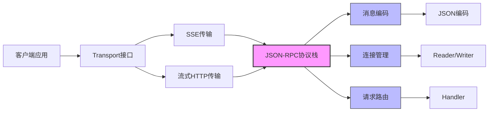

# 传输与通信

<cite>
**本文档中引用的文件**  
- [wire.go](file://internal/jsonrpc2/wire.go)
- [conn.go](file://internal/jsonrpc2/conn.go)
- [serve.go](file://internal/jsonrpc2/serve.go)
- [sse.go](file://mcp/sse.go)
- [sse_example_test.go](file://mcp/sse_example_test.go)
- [transport.go](file://mcp/transport.go)
- [http/main.go](file://examples/http/main.go)
- [sse/main.go](file://examples/sse/main.go)
</cite>

## 目录
1. [简介](#简介)
2. [项目结构](#项目结构)
3. [核心组件](#核心组件)
4. [架构概述](#架构概述)
5. [详细组件分析](#详细组件分析)
6. [依赖分析](#依赖分析)
7. [性能考虑](#性能考虑)
8. [故障排除指南](#故障排除指南)
9. [结论](#结论)

## 简介
本文档深入解析SDK的底层通信机制，重点描述基于`internal/jsonrpc2`包实现的JSON-RPC 2.0协议栈。涵盖消息编码、连接管理、请求路由和错误处理等核心功能。详细说明`Transport`接口的抽象设计如何统一Stdio、HTTP、WebSocket等多种传输方式，并重点分析HTTP/1.1与Server-Sent Events (SSE)的支持机制，特别是如何通过SSE实现服务器到客户端的异步通知。结合示例代码展示不同传输方式的配置与性能特征，为高级用户提供自定义传输的实现指南。

## 项目结构
SDK的通信架构主要由`internal/jsonrpc2`包提供底层协议支持，`mcp`包在此基础上构建传输抽象和具体实现。`examples`目录下的示例代码展示了不同传输方式的实际应用。



**图示来源**  
- [wire.go](file://internal/jsonrpc2/wire.go#L1-L98)
- [conn.go](file://internal/jsonrpc2/conn.go#L1-L826)
- [serve.go](file://internal/jsonrpc2/serve.go#L1-L331)
- [sse.go](file://mcp/sse.go#L1-L480)
- [transport.go](file://mcp/transport.go#L1-L229)

**节来源**  
- [internal/jsonrpc2](file://internal/jsonrpc2)
- [mcp](file://mcp)
- [examples](file://examples)

## 核心组件
SDK的通信机制由四个核心部分构成：基于`internal/jsonrpc2/wire.go`的消息编码、`conn.go`的连接管理、`serve.go`的请求路由以及`mcp/transport.go`的传输抽象。这些组件共同实现了JSON-RPC 2.0协议栈，支持多种传输方式。

**节来源**  
- [wire.go](file://internal/jsonrpc2/wire.go#L1-L98)
- [conn.go](file://internal/jsonrpc2/conn.go#L1-L826)
- [serve.go](file://internal/jsonrpc2/serve.go#L1-L331)
- [transport.go](file://mcp/transport.go#L1-L229)

## 架构概述
SDK采用分层架构设计，底层`internal/jsonrpc2`包实现JSON-RPC 2.0协议规范，上层`mcp`包通过`Transport`接口抽象各种传输方式。这种设计实现了协议逻辑与传输方式的解耦，使得新增传输方式变得简单而安全。



**图示来源**  
- [transport.go](file://mcp/transport.go#L31-L36)
- [wire.go](file://internal/jsonrpc2/wire.go#L1-L98)
- [conn.go](file://internal/jsonrpc2/conn.go#L1-L826)
- [serve.go](file://internal/jsonrpc2/serve.go#L1-L331)

## 详细组件分析

### JSON-RPC 2.0协议栈分析

#### 消息编码（wire.go）
`wire.go`文件定义了JSON-RPC 2.0协议的消息格式，包括请求、响应和错误的结构体定义。它实现了消息的编码与解码功能，确保数据在传输过程中的正确性。



**图示来源**  
- [wire.go](file://internal/jsonrpc2/wire.go#L1-L98)

**节来源**  
- [wire.go](file://internal/jsonrpc2/wire.go#L1-L98)

#### 连接管理（conn.go）
`conn.go`实现了JSON-RPC连接的完整生命周期管理，包括连接建立、消息收发、异步调用处理和连接关闭。它通过`Connection`结构体维护连接状态，确保消息的有序处理。



**图示来源**  
- [conn.go](file://internal/jsonrpc2/conn.go#L1-L826)

**节来源**  
- [conn.go](file://internal/jsonrpc2/conn.go#L1-L826)

#### 请求路由（serve.go）
`serve.go`提供了服务器端的连接监听和路由功能。它通过`Server`结构体管理监听器，接受新连接并使用`Binder`配置连接选项，实现请求的分发处理。



**图示来源**  
- [serve.go](file://internal/jsonrpc2/serve.go#L1-L331)

**节来源**  
- [serve.go](file://internal/jsonrpc2/serve.go#L1-L331)

### 传输抽象设计

#### Transport接口
`Transport`接口是SDK传输机制的核心抽象，定义了连接建立的统一方式。所有具体传输实现都必须实现此接口，确保了API的一致性。

```mermaid
classDiagram
class Transport {
<<interface>>
+Connect(ctx context.Context) (Connection, error)
}
class SSEClientTransport {
+Endpoint string
+HTTPClient *http.Client
+Connect(ctx context.Context) (Connection, error)
}
class SSEServerTransport {
+Endpoint string
+Response http.ResponseWriter
+incoming chan jsonrpc.Message
+mu sync.Mutex
+closed bool
+done chan struct{}
+ServeHTTP(w http.ResponseWriter, req *http.Request)
+Connect(ctx context.Context) (Connection, error)
}
class SSEHandler {
+getServer func(request *http.Request) *Server
+opts SSEOptions
+onConnection func(*ServerSession)
+mu sync.Mutex
+sessions map[string]*SSEServerTransport
+ServeHTTP(w http.ResponseWriter, req *http.Request)
}
Transport <|-- SSEClientTransport
Transport <|-- SSEServerTransport
SSEHandler --> SSEServerTransport : 创建
```

**图示来源**  
- [transport.go](file://mcp/transport.go#L31-L36)
- [sse.go](file://mcp/sse.go#L43-L124)

**节来源**  
- [transport.go](file://mcp/transport.go#L31-L36)
- [sse.go](file://mcp/sse.go#L1-L480)

### SSE传输机制

#### SSE服务端实现
SSE服务端通过`SSEHandler`处理客户端的长轮询连接，为每个会话创建独立的`SSEServerTransport`实例，实现消息的双向传输。



**图示来源**  
- [sse.go](file://mcp/sse.go#L1-L480)

**节来源**  
- [sse.go](file://mcp/sse.go#L1-L480)

#### SSE客户端实现
SSE客户端通过`SSEClientTransport`连接服务端，首先建立长轮询连接获取会话端点，然后通过POST请求发送消息，实现双向通信。



**图示来源**  
- [sse.go](file://mcp/sse.go#L324-L445)

**节来源**  
- [sse.go](file://mcp/sse.go#L324-L445)

### 示例应用分析

#### HTTP示例分析
`examples/http/main.go`展示了流式HTTP传输的完整应用，包括服务器和客户端的实现，演示了工具注册、连接建立和远程调用的全过程。



**图示来源**  
- [http/main.go](file://examples/http/main.go#L1-L201)

**节来源**  
- [http/main.go](file://examples/http/main.go#L1-L201)

#### SSE示例分析
`sse_example_test.go`提供了SSE传输的测试示例，展示了如何使用`SSEHandler`和`SSEClientTransport`实现简单的加法工具调用。



**图示来源**  
- [sse_example_test.go](file://mcp/sse_example_test.go#L1-L58)

**节来源**  
- [sse_example_test.go](file://mcp/sse_example_test.go#L1-L58)

## 依赖分析
SDK的通信组件之间存在清晰的依赖关系，底层协议实现独立于上层传输抽象，使得系统具有良好的可扩展性和可维护性。



**图示来源**  
- [transport.go](file://mcp/transport.go#L31-L36)
- [sse.go](file://mcp/sse.go#L1-L480)
- [wire.go](file://internal/jsonrpc2/wire.go#L1-L98)
- [conn.go](file://internal/jsonrpc2/conn.go#L1-L826)
- [serve.go](file://internal/jsonrpc2/serve.go#L1-L331)

**节来源**  
- [go.mod](file://go.mod#L1-L10)
- [go.sum](file://go.sum#L1-L50)

## 性能考虑
不同的传输方式具有不同的性能特征。SSE传输适合服务器向客户端的异步通知，而流式HTTP传输在双向通信效率上表现更优。连接复用和消息批处理是提升性能的关键策略。

## 故障排除指南
当遇到通信问题时，首先检查传输实现是否正确实现了`Transport`接口，确保`Connect`方法能正确建立连接。对于SSE传输，特别注意长轮询连接的超时设置和会话管理。

**节来源**  
- [sse.go](file://mcp/sse.go#L1-L480)
- [transport.go](file://mcp/transport.go#L31-L36)

## 结论
SDK通过分层设计和接口抽象，实现了灵活可靠的通信机制。`Transport`接口的设计使得新增传输方式变得简单，而底层JSON-RPC协议栈的稳定实现确保了通信的可靠性。开发者可以根据具体需求选择合适的传输方式，或实现自定义传输以满足特殊场景的需求。