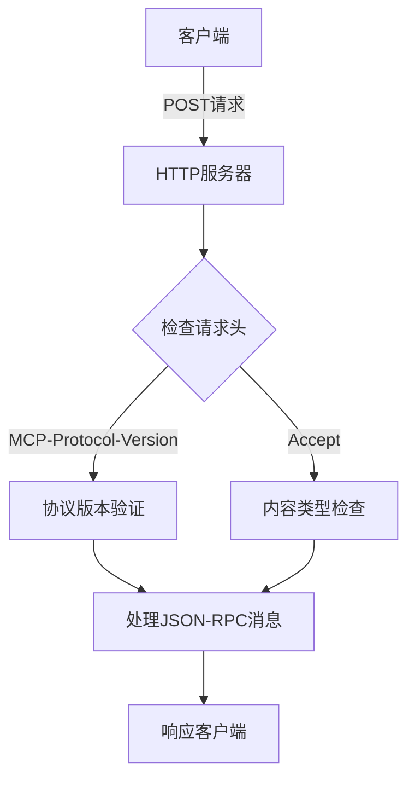
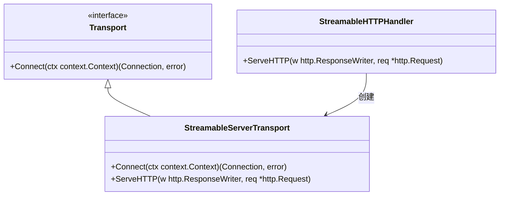

# HTTP/1.1传输

<cite>
**本文档中引用的文件**   
- [main.go](file://examples/http/main.go)
- [streamable.go](file://mcp/streamable.go)
- [transport.go](file://mcp/transport.go)
- [logging_middleware.go](file://examples/http/logging_middleware.go)
</cite>

## 目录
1. [简介](#简介)
2. [HTTP传输配置与请求头设置](#http传输配置与请求头设置)
3. [服务端监听与连接处理](#服务端监听与连接处理)
4. [客户端连接发起机制](#客户端连接发起机制)
5. [Transport接口与HTTP服务集成](#transport接口与http服务集成)
6. [底层io.ReadWriteCloser封装机制](#底层iowritecloser封装机制)
7. [连接生命周期管理](#连接生命周期管理)
8. [生产环境适用场景与性能优化](#生产环境适用场景与性能优化)

## 简介
本文档详细阐述了基于net/http的HTTP/1.1传输实现机制，重点分析如何通过标准HTTP协议承载JSON-RPC 2.0消息流。文档结合examples/http/main.go中的代码示例，展示HTTP传输的配置方式、请求头设置、连接生命周期管理，并讨论其在生产环境中的适用场景和性能优化建议。

**Section sources**
- [main.go](file://examples/http/main.go#L1-L201)

## HTTP传输配置与请求头设置
HTTP传输配置主要通过NewStreamableHTTPHandler函数实现，该函数接受一个getServer回调函数和可选的StreamableHTTPOptions配置。在服务端，通过创建StreamableHTTPHandler实例并将其注册到HTTP服务器来配置传输。请求头设置方面，客户端必须包含MCP-Protocol-Version头来指定协议版本，服务器根据此头信息来响应。此外，Accept头用于指定客户端接受的内容类型，如application/json或text/event-stream。

**Diagram sources**
- [streamable.go](file://mcp/streamable.go#L86-L100)
- [main.go](file://examples/http/main.go#L112-L139)

## 服务端监听与连接处理
服务端通过http.ListenAndServe函数监听指定的HTTP端点。当客户端发起连接请求时，服务端的StreamableHTTPHandler会处理该请求。处理流程包括验证请求方法（GET、POST、DELETE）、检查会话ID、处理协议版本等。对于POST请求，服务端读取请求体中的JSON-RPC消息并进行处理；对于GET请求，服务端启动一个长轮询连接，用于向客户端推送服务器发起的消息。

**Section sources**
- [main.go](file://examples/http/main.go#L112-L139)
- [streamable.go](file://mcp/streamable.go#L118-L332)

## 客户端连接发起机制
客户端通过创建StreamableClientTransport实例并调用Client.Connect方法来发起连接。连接过程中，客户端首先发送initialize请求以初始化会话，然后发送initialized通知表示初始化完成。之后，客户端可以调用ListTools方法获取可用工具列表，并通过CallTool方法调用具体工具。客户端使用http.Client来发送HTTP请求，并处理服务器的响应。

**Section sources**
- [main.go](file://examples/http/main.go#L141-L199)
- [streamable.go](file://mcp/streamable.go#L1115-L1129)

## Transport接口与HTTP服务集成
Transport接口定义了Connect方法，用于创建逻辑上的JSON-RPC连接。StreamableHTTPHandler实现了http.Handler接口，可以作为HTTP处理器使用。当HTTP服务器收到请求时，会调用StreamableHTTPHandler的ServeHTTP方法。该方法根据请求方法和头信息来决定如何处理请求，并最终通过Transport接口的Connect方法建立连接。这种设计使得Transport接口与HTTP服务无缝集成。

**Diagram sources**
- [transport.go](file://mcp/transport.go#L31-L36)
- [streamable.go](file://mcp/streamable.go#L38-L48)

## 底层io.ReadWriteCloser封装机制
底层的io.ReadWriteCloser被封装在rwc结构体中，该结构体实现了io.ReadWriteCloser接口。ioConn结构体使用rwc来读写数据，并通过json.NewDecoder和json.Marshal来处理JSON格式的消息。消息以换行符分隔，确保了消息的边界清晰。当写入消息时，会自动添加换行符；读取消息时，会按行读取并解析JSON内容。

**Section sources**
- [transport.go](file://mcp/transport.go#L250-L255)
- [transport.go](file://mcp/transport.go#L398-L421)

## 连接生命周期管理
连接的生命周期从客户端发起连接请求开始，到连接被关闭结束。服务端通过StreamableHTTPHandler的transports映射来管理活动的连接，使用会话ID作为键。当连接不再需要时，可以通过发送DELETE请求来显式关闭连接，或者等待连接超时自动关闭。closeAll方法可以关闭所有活动的连接，用于服务端优雅关闭的场景。

**Section sources**
- [streamable.go](file://mcp/streamable.go#L109-L116)
- [streamable.go](file://mcp/streamable.go#L118-L332)

## 生产环境适用场景与性能优化
在生产环境中，HTTP/1.1传输适用于需要通过标准HTTP协议进行通信的场景，特别是在存在防火墙或代理服务器限制的情况下。性能优化方面，建议使用连接池来复用HTTP连接，减少连接建立的开销。此外，可以通过启用HTTP压缩来减少网络传输的数据量。对于高并发场景，应考虑使用HTTP/2或WebSocket等更高效的传输协议。

**Section sources**
- [main.go](file://examples/http/main.go#L1-L201)
- [streamable.go](file://mcp/streamable.go#L86-L100)