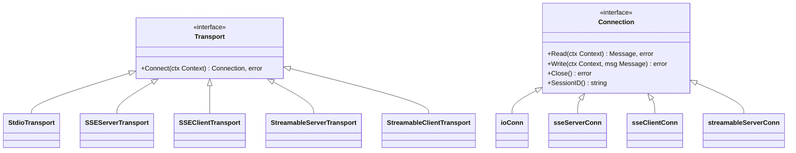
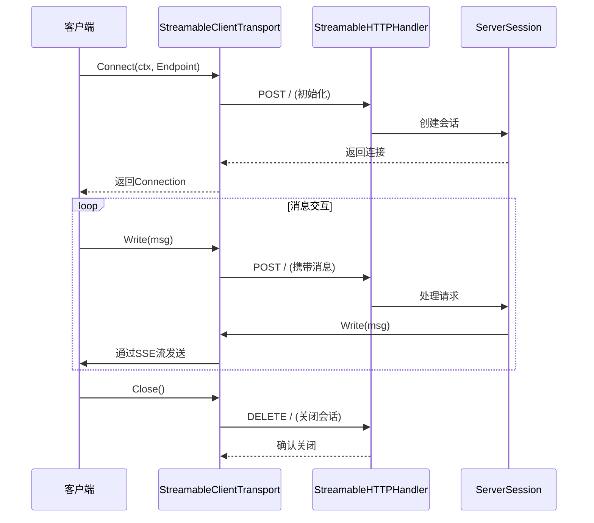
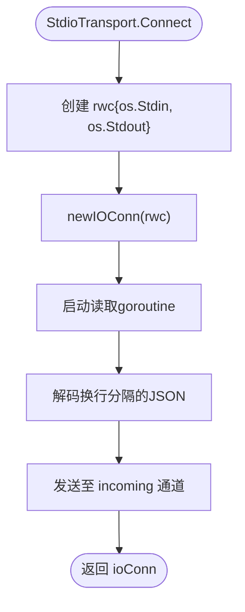
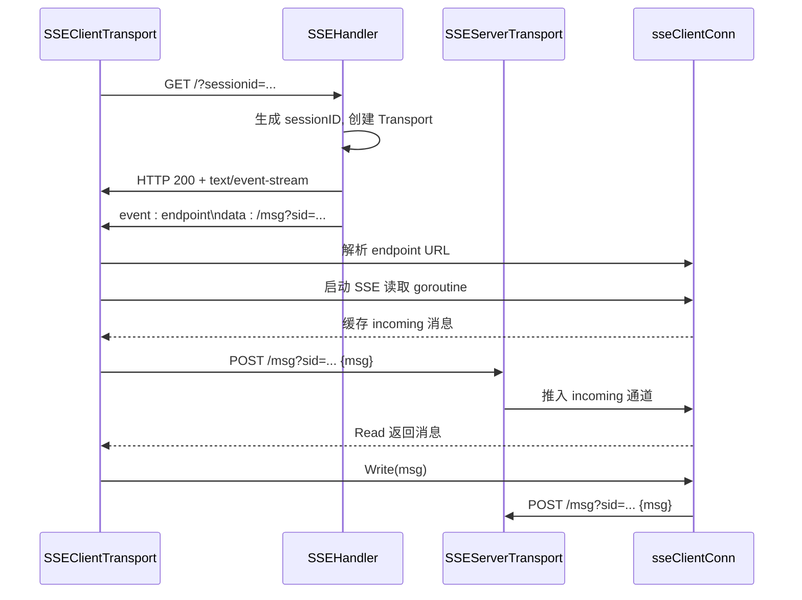

# 传输方式实现

<cite>
**本文档中引用的文件**  
- [mcp/transport.go](file://mcp/transport.go)
- [mcp/sse.go](file://mcp/sse.go)
- [mcp/streamable.go](file://mcp/streamable.go)
- [examples/server/sse/main.go](file://examples/server/sse/main.go)
- [examples/http/main.go](file://examples/http/main.go)
</cite>

## 目录
1. [引言](#引言)
2. [核心接口设计](#核心接口设计)
3. [HTTP/1.1 传输实现](#http11-传输实现)
4. [Stdio 传输实现](#stdio-传输实现)
5. [Server-Sent Events (SSE) 传输实现](#server-sent-events-sse-传输实现)
6. [配置示例与使用场景](#配置示例与使用场景)
7. [性能考量](#性能考量)
8. [总结](#总结)

## 引言
本SDK支持多种传输方式，用于在MCP（Model Context Protocol）客户端与服务器之间建立通信。这些传输方式包括基于HTTP/1.1的流式传输、标准输入输出（Stdio）传输以及Server-Sent Events（SSE）传输。所有传输机制均通过统一的`Transport`和`Connection`接口进行抽象，确保不同传输方式之间的差异被封装，从而提供一致的编程模型。本文将深入分析这些接口的设计原理，并详细讲解每种传输方式的具体实现机制。

## 核心接口设计

SDK通过两个核心接口`Transport`和`Connection`实现了传输层的抽象，使得上层逻辑无需关心底层通信细节。



**接口来源**
- [mcp/transport.go](file://mcp/transport.go#L31-L60)

### Transport 接口
`Transport`接口定义了创建连接的能力，其核心方法为`Connect`，该方法接收一个上下文并返回一个`Connection`实例。此接口允许不同的传输方式（如HTTP、SSE、Stdio等）以统一的方式初始化通信链路。

### Connection 接口
`Connection`接口代表一个双向JSON-RPC连接，包含四个主要方法：
- `Read`：从连接中读取下一条待处理的消息。
- `Write`：向连接写入一条新消息。
- `Close`：关闭连接，可在读写失败时自动触发。
- `SessionID`：获取当前会话的唯一标识符。

该接口的设计支持并发读写操作，并确保`Close`调用能够解除阻塞的`Read`操作，从而实现优雅的连接终止。

**接口来源**
- [mcp/transport.go](file://mcp/transport.go#L39-L60)

## HTTP/1.1 传输实现

HTTP/1.1传输基于`StreamableHTTPHandler`和`StreamableClientTransport`实现，遵循MCP规范中的流式HTTP传输协议。该传输方式利用HTTP长轮询和服务器发送事件（SSE）实现双向通信。

### 服务器端实现
`StreamableHTTPHandler`是一个HTTP处理器，负责管理多个MCP会话。每个会话由唯一的`Mcp-Session-Id`标识。服务器支持三种HTTP方法：
- **GET**：用于建立SSE流，接收服务器推送的消息。
- **POST**：用于客户端向服务器发送JSON-RPC请求。
- **DELETE**：用于显式关闭会话。

服务器通过`transports`映射维护活动会话，并在收到DELETE请求或连接关闭时清理资源。

### 客户端实现
`StreamableClientTransport`作为客户端传输层，封装了与服务器的交互逻辑。客户端通过`Connect`方法发起连接，内部创建`streamableClientConn`实例处理消息收发。该连接支持自动重试机制（可通过`MaxRetries`配置），并在网络中断后尝试恢复会话。

数据流采用分块处理，支持单条消息和批量消息的编码与解码。消息通过`text/event-stream`内容类型以SSE格式传输，确保低延迟和高吞吐量。



**实现来源**
- [mcp/streamable.go](file://mcp/streamable.go#L38-L1129)

## Stdio 传输实现

Stdio传输是一种简单的基于标准输入输出的通信方式，适用于在同一进程中运行客户端和服务器的场景。

### 实现机制
`StdioTransport`结构体实现了`Transport`接口，其`Connect`方法返回一个基于`os.Stdin`和`os.Stdout`的`ioConn`实例。消息通过换行符分隔的JSON格式进行传输，即每条消息独立成行，便于解析。

底层使用`rwc`结构体将`io.ReadCloser`和`io.WriteCloser`组合为`io.ReadWriteCloser`，从而适配`ioConn`的需求。`ioConn`内部通过goroutine异步读取输入流，并将解析后的消息放入通道供上层消费。

该传输方式无需网络支持，适合本地调试或嵌入式场景，但不具备跨进程通信能力。



**实现来源**
- [mcp/transport.go](file://mcp/transport.go#L88-L88)

## Server-Sent Events (SSE) 传输实现

SSE传输是一种基于HTTP的单向推送协议，SDK通过扩展使其支持双向通信，适用于浏览器环境或需要服务器主动推送的场景。

### SSEHandler 会话管理
`SSEHandler`是HTTP处理器，负责管理SSE会话。它维护一个`sessions`映射，键为会话ID，值为`SSEServerTransport`实例。当客户端发起GET请求时，处理器生成唯一会话ID，创建`SSEServerTransport`，并将其加入映射。随后调用`getServer`函数获取对应的`Server`实例并建立连接。

对于POST请求，处理器根据`sessionid`查询对应传输实例，并委托其`ServeHTTP`方法处理消息。

### SSEServerTransport 桥接机制
`SSEServerTransport`桥接HTTP请求与JSON-RPC连接。其`Connect`方法返回一个`sseServerConn`实例，该实例实现`Connection`接口：
- `Write`：将消息编码为SSE的`message`事件，写入GET响应流。
- `Read`：从`incoming`通道读取消息，该通道由`ServeHTTP`方法填充。
- `Close`：关闭`done`通道，终止GET请求。

`ServeHTTP`方法处理客户端POST请求，解析JSON-RPC消息并推入`incoming`通道，实现反向通信。

### SSEClientTransport 双向通信
`SSEClientTransport`实现客户端逻辑。`Connect`方法首先发起GET请求，等待服务器发送首个`endpoint`事件，获取消息端点URL。随后启动goroutine持续读取SSE流，将`message`事件解码为JSON-RPC消息并缓存。

`Write`操作通过POST请求将消息发送至`msgEndpoint`，完成客户端到服务器的通信闭环。



**实现来源**
- [mcp/sse.go](file://mcp/sse.go#L43-L331)

## 配置示例与使用场景

### SSE 服务器配置示例
```go
// 示例代码路径: examples/server/sse/main.go
server1 := mcp.NewServer(&mcp.Implementation{Name: "greeter1"}, nil)
mcp.AddTool(server1, &mcp.Tool{Name: "greet1"}, SayHi)

handler := mcp.NewSSEHandler(func(request *http.Request) *mcp.Server {
    switch request.URL.Path {
    case "/greeter1": return server1
    default: return nil
    }
}, nil)
http.ListenAndServe(":8080", handler)
```
此配置创建一个SSE服务器，根据URL路径路由到不同服务实例，适用于多租户或微服务架构。

### HTTP 流式传输配置示例
```go
// 示例代码路径: examples/http/main.go
// 服务器端
handler := mcp.NewStreamableHTTPHandler(func(req *http.Request) *mcp.Server {
    return server
}, nil)
http.ListenAndServe(url, handler)

// 客户端
session, err := client.Connect(ctx, &mcp.StreamableClientTransport{Endpoint: url}, nil)
```
此配置适用于需要高并发、低延迟的生产环境，支持会话恢复和事件持久化。

## 性能考量

| 传输方式 | 延迟 | 吞吐量 | 连接开销 | 适用场景 |
|---------|------|--------|----------|----------|
| HTTP/1.1 流式 | 低 | 高 | 中等 | 生产环境、Web API |
| SSE | 中等 | 中等 | 高 | 浏览器客户端、推送服务 |
| Stdio | 极低 | 高 | 无 | 本地调试、嵌入式 |

- **HTTP/1.1 流式传输**：性能最优，支持批量消息和连接复用，适合高负载场景。
- **SSE 传输**：受限于HTTP长轮询，连接管理开销较大，但兼容性好，适合前端集成。
- **Stdio 传输**：无网络开销，性能最高，但仅限于进程内通信。

## 总结
SDK通过`Transport`和`Connection`接口实现了传输层的统一抽象，支持HTTP/1.1、SSE和Stdio等多种传输方式。HTTP/1.1流式传输提供最佳性能和功能完整性，SSE传输确保良好的浏览器兼容性，而Stdio传输则适用于本地调试和嵌入式场景。开发者可根据具体需求选择合适的传输方式，并通过简洁的API实现高效通信。