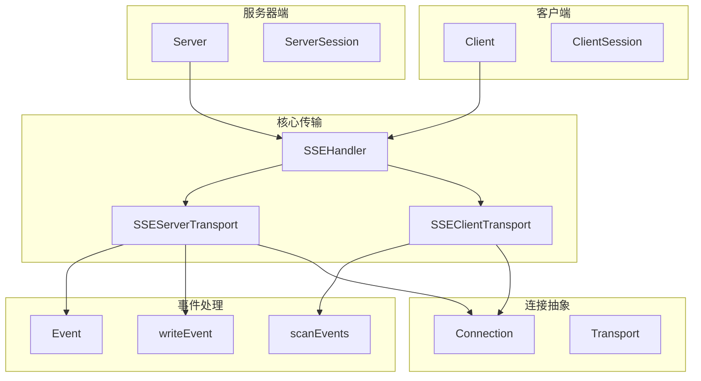
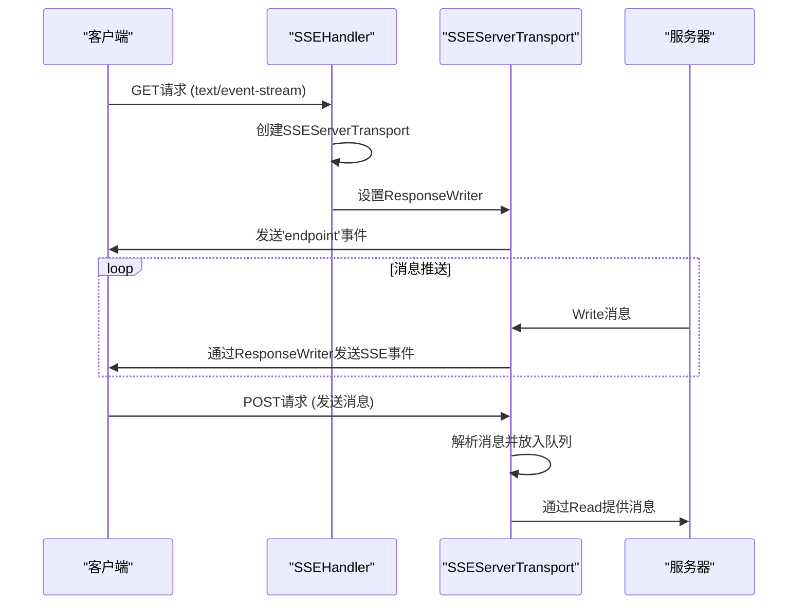
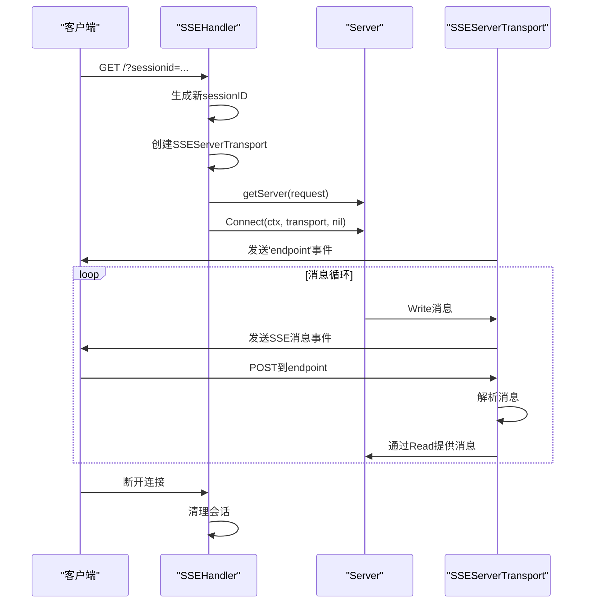
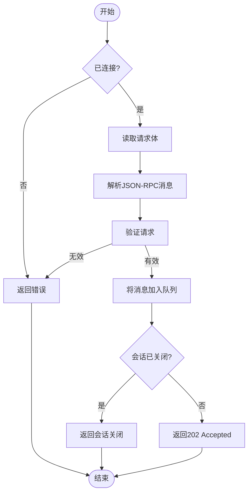
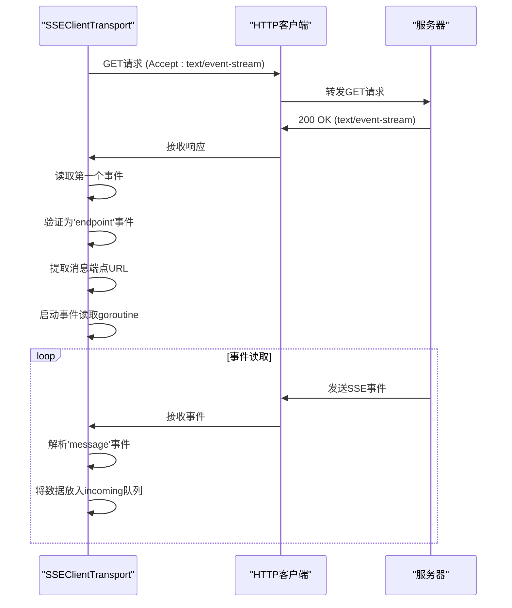
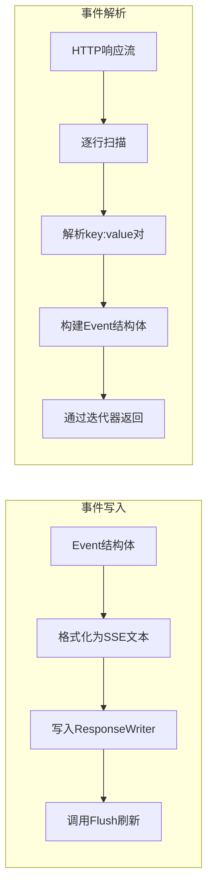
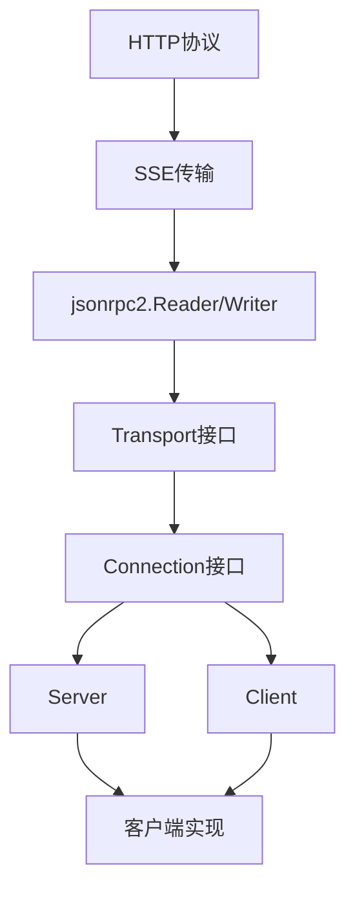

# 服务器发送事件(SSE)传输

<cite>
**本文档引用的文件**   
- [sse.go](file://mcp\sse.go)
- [event.go](file://mcp\event.go)
- [transport.go](file://mcp\transport.go)
- [streamable.go](file://mcp\streamable.go)
- [server.go](file://mcp\server.go)
- [client.go](file://mcp\client.go)
- [jsonrpc2/frame.go](file://internal\jsonrpc2\frame.go)
- [jsonrpc2/messages.go](file://internal\jsonrpc2\messages.go)
- [sse.go](file://examples\server\sse\main.go)
</cite>

## 目录
1. [引言](#引言)
2. [项目结构](#项目结构)
3. [核心组件](#核心组件)
4. [架构概述](#架构概述)
5. [详细组件分析](#详细组件分析)
6. [依赖分析](#依赖分析)
7. [性能考虑](#性能考虑)
8. [故障排除指南](#故障排除指南)
9. [结论](#结论)

## 引言
本文档全面解析了服务器发送事件（SSE）传输的双向通信机制。重点讲解了SSEHandler如何通过长轮询GET请求建立会话，首次响应必须发送'endpoint'事件以告知客户端消息推送地址。深入分析了SSEServerTransport如何将HTTP响应写入器（ResponseWriter）转换为Write操作，将POST请求体解析为Read输入，实现半双工通信。剖析了sseServerConn和sseClientConn的实现细节，包括消息队列管理、并发安全控制和连接关闭机制。结合SSE示例代码，说明其在浏览器兼容性场景下的优势，并讨论其相对于WebSocket的局限性及适用边界。

## 项目结构
项目结构展示了SSE相关组件的组织方式，包括核心传输实现、事件处理、服务器和客户端处理等模块。



**图表来源**
- [sse.go](file://mcp\sse.go#L43-L49)
- [event.go](file://mcp\event.go#L30-L34)
- [transport.go](file://mcp\transport.go#L39-L60)

**章节来源**
- [sse.go](file://mcp\sse.go#L1-L479)
- [event.go](file://mcp\event.go#L1-L426)

## 核心组件
SSE传输的核心组件包括SSEHandler、SSEServerTransport和SSEClientTransport，它们共同实现了基于HTTP的服务器发送事件机制。SSEHandler作为HTTP处理器，管理SSE会话的生命周期，处理GET和POST请求。SSEServerTransport代表一个逻辑SSE会话，通过长轮询GET请求建立，将HTTP响应写入器转换为Write操作。SSEClientTransport则实现了客户端的连接逻辑，通过GET请求连接到SSE端点，并处理服务器发送的事件。

**章节来源**
- [sse.go](file://mcp\sse.go#L43-L49)
- [sse.go](file://mcp\sse.go#L104-L124)

## 架构概述
SSE传输架构基于HTTP协议实现服务器到客户端的单向消息推送，同时通过POST请求实现客户端到服务器的反向通信，形成半双工通信模式。该架构的核心是SSEHandler，它作为HTTP处理器接收客户端的GET和POST请求。当客户端发起GET请求时，SSEHandler创建一个新的SSEServerTransport实例，该实例持有HTTP响应写入器并开始监听消息。首次响应必须发送一个'endpoint'事件，告知客户端用于发送消息的POST端点。客户端收到此事件后，即可通过该端点发送POST请求，这些请求由SSEServerTransport的ServeHTTP方法处理，将消息放入内部队列。服务器通过Write方法将消息写入HTTP响应流，客户端通过Read方法从事件流中读取消息。



**图表来源**
- [sse.go](file://mcp\sse.go#L179-L256)
- [sse.go](file://mcp\sse.go#L127-L159)

## 详细组件分析

### SSEHandler分析
SSEHandler是SSE传输的核心HTTP处理器，负责管理SSE会话的整个生命周期。它通过ServeHTTP方法处理客户端的GET和POST请求。对于GET请求，它创建一个新的SSEServerTransport实例，生成唯一的会话ID，并将响应头设置为text/event-stream以启用SSE。然后，它调用getServer函数获取服务器实例，并通过Server.Connect方法建立连接。对于POST请求，它根据sessionid查找对应的SSEServerTransport，并委托其处理消息。

#### SSEHandler类图
```mermaid
classDiagram
class SSEHandler {
+getServer func(*http.Request) *Server
+opts SSEOptions
+onConnection func(*ServerSession)
+mu sync.Mutex
+sessions map[string]*SSEServerTransport
+ServeHTTP(w http.ResponseWriter, req *http.Request)
}
class SSEServerTransport {
+Endpoint string
+Response http.ResponseWriter
+incoming chan jsonrpc.Message
+mu sync.Mutex
+closed bool
+done chan struct{}
+ServeHTTP(w http.ResponseWriter, req *http.Request)
+Connect(context.Context) (Connection, error)
}
SSEHandler --> SSEServerTransport : "管理"
SSEHandler --> Server : "通过getServer获取"
```

**图表来源**
- [sse.go](file://mcp\sse.go#L43-L49)
- [sse.go](file://mcp\sse.go#L104-L124)

#### SSEHandler请求处理序列图


**图表来源**
- [sse.go](file://mcp\sse.go#L179-L256)

### SSEServerTransport分析
SSEServerTransport是SSE会话的核心实现，它将HTTP长轮询连接抽象为一个双向通信通道。它通过Connect方法建立连接，首次调用时发送'endpoint'事件，然后返回一个sseServerConn实例，该实例实现了Connection接口。SSEServerTransport的ServeHTTP方法处理客户端通过POST端点发送的消息，将其解析并放入incoming消息队列。Write操作通过writeEvent函数将消息作为SSE 'message'事件写入HTTP响应流，而Read操作则从incoming队列中读取消息。

#### SSEServerTransport类图
```mermaid
classDiagram
class SSEServerTransport {
+Endpoint string
+Response http.ResponseWriter
+incoming chan jsonrpc.Message
+mu sync.Mutex
+closed bool
+done chan struct{}
+ServeHTTP(w http.ResponseWriter, req *http.Request)
+Connect(context.Context) (Connection, error)
}
class sseServerConn {
+t *SSEServerTransport
+Read(ctx context.Context) (jsonrpc.Message, error)
+Write(ctx context.Context, msg jsonrpc.Message) error
+Close() error
}
SSEServerTransport --> sseServerConn : "创建"
sseServerConn --> SSEServerTransport : "使用"
```

**图表来源**
- [sse.go](file://mcp\sse.go#L104-L124)
- [sse.go](file://mcp\sse.go#L260-L262)

#### SSEServerTransport消息处理流程图


**图表来源**
- [sse.go](file://mcp\sse.go#L127-L159)

### SSEClientTransport分析
SSEClientTransport实现了SSE协议的客户端部分，它通过GET请求连接到SSE端点，并处理服务器发送的事件流。Connect方法首先发起GET请求，然后读取第一个事件，验证其为'endpoint'事件，并从中提取消息端点URL。之后，它启动一个goroutine来持续读取事件流，将'message'事件的数据解析为JSON-RPC消息并放入incoming队列。Write操作通过POST请求将消息发送到消息端点，而Read操作则从incoming队列中读取消息。

#### SSEClientTransport类图
```mermaid
classDiagram
class SSEClientTransport {
+Endpoint string
+HTTPClient *http.Client
+Connect(ctx context.Context) (Connection, error)
}
class sseClientConn {
+client *http.Client
+msgEndpoint *url.URL
+incoming chan []byte
+mu sync.Mutex
+body io.ReadCloser
+closed bool
+done chan struct{}
+Read(ctx context.Context) (jsonrpc.Message, error)
+Write(ctx context.Context, msg jsonrpc.Message) error
+Close() error
}
SSEClientTransport --> sseClientConn : "创建"
sseClientConn --> SSEClientTransport : "使用"
```

**图表来源**
- [sse.go](file://mcp\sse.go#L324-L331)
- [sse.go](file://mcp\sse.go#L404-L413)

#### SSEClientTransport连接序列图


**图表来源**
- [sse.go](file://mcp\sse.go#L334-L397)

### 事件处理机制分析
SSE协议依赖于事件流的正确处理，包括事件的写入和解析。writeEvent函数负责将Event结构体格式化为SSE协议规定的文本格式，并写入响应流。scanEvents函数则是一个生成器，它从HTTP响应流中逐行读取数据，解析SSE事件，并将解析结果通过迭代器返回。这种设计确保了事件处理的高效性和内存友好性。

#### 事件处理流程图


**图表来源**
- [event.go](file://mcp\event.go#L42-L56)
- [event.go](file://mcp\event.go#L64-L145)

## 依赖分析
SSE传输机制依赖于多个核心组件和接口，形成了一个完整的通信栈。最底层是HTTP协议，SSE基于HTTP长轮询实现。上层是jsonrpc2包提供的Reader和Writer接口，SSEServerTransport和SSEClientTransport通过sseServerConn和sseClientConn实现了这些接口，将HTTP通信抽象为消息通道。Transport接口定义了连接的建立，而Connection接口定义了消息的读写和关闭。Server和Client组件通过这些抽象与SSE传输交互，实现了MCP协议的通信。



**图表来源**
- [transport.go](file://mcp\transport.go#L31-L36)
- [jsonrpc2/frame.go](file://internal\jsonrpc2\frame.go#L24-L39)

## 性能考虑
SSE传输的性能主要受HTTP长轮询机制的影响。优点是兼容性好，几乎所有现代浏览器都支持，且实现简单。缺点是每个客户端连接都会占用一个服务器线程或goroutine，可能导致服务器资源消耗较大。消息队列使用带缓冲的channel，可以有效处理突发消息。并发安全通过sync.Mutex保护共享资源，避免竞态条件。连接关闭机制确保资源及时释放，防止内存泄漏。

## 故障排除指南
常见问题包括连接超时、消息丢失和并发错误。连接超时通常由于网络问题或服务器负载过高，可通过增加超时时间解决。消息丢失可能由于客户端未正确处理事件流，应确保客户端正确实现scanEvents。并发错误通常由于未正确使用锁，应检查所有共享资源的访问是否都受到sync.Mutex保护。连接关闭后继续写入会导致io.EOF错误，应在Write方法中检查closed标志。

**章节来源**
- [sse.go](file://mcp\sse.go#L280-L302)
- [sse.go](file://mcp\sse.go#L445-L467)

## 结论
SSE传输提供了一种简单有效的服务器到客户端消息推送机制，特别适合浏览器兼容性要求高的场景。通过将HTTP响应写入器转换为Write操作，将POST请求体解析为Read输入，实现了半双工通信。sseServerConn和sseClientConn的实现细节展示了如何在Go中高效地管理消息队列、并发安全和连接生命周期。虽然SSE在资源消耗上不如WebSocket高效，但其简单性和广泛兼容性使其在许多场景下仍然是一个优秀的选择。