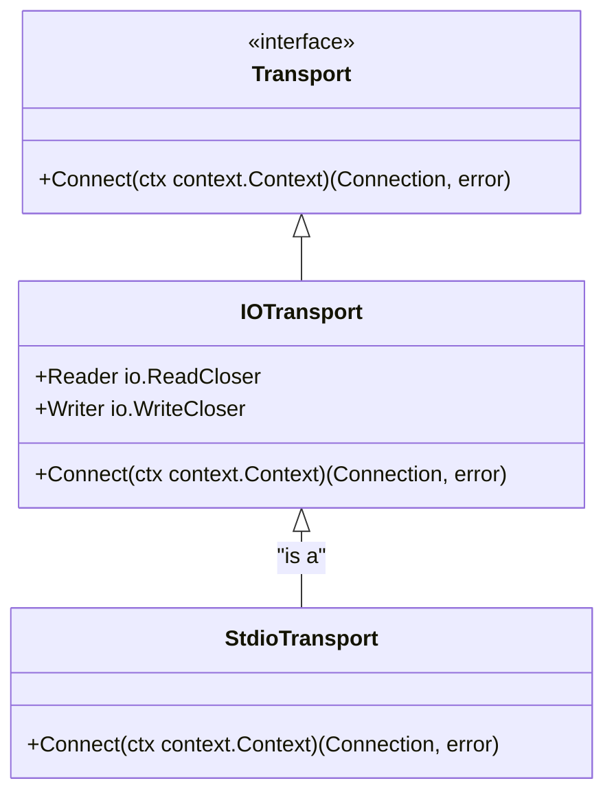
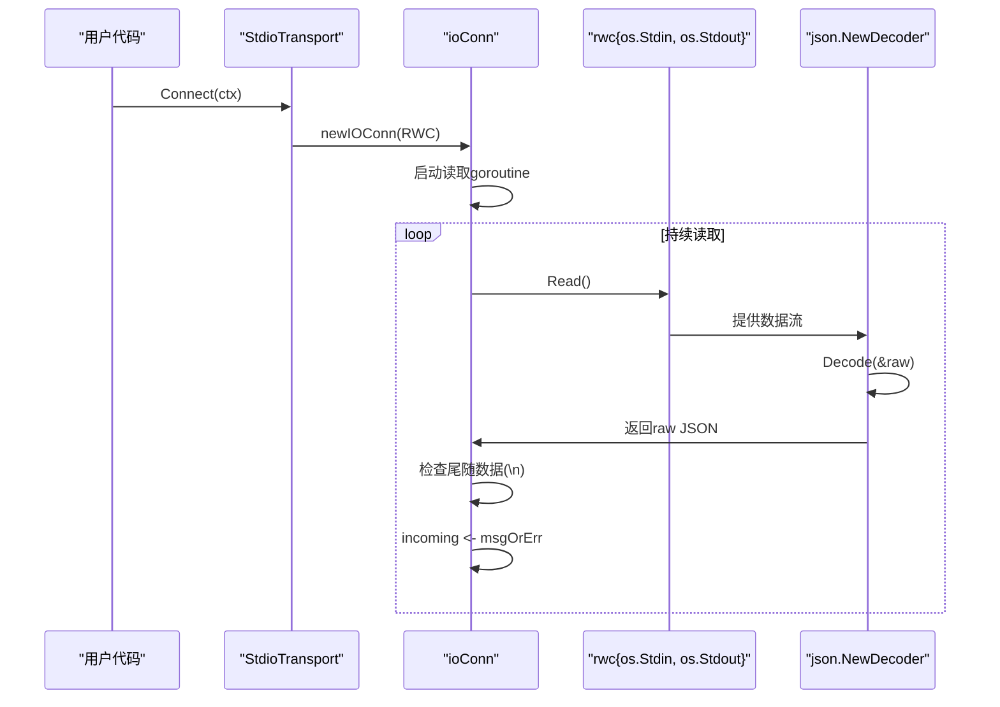
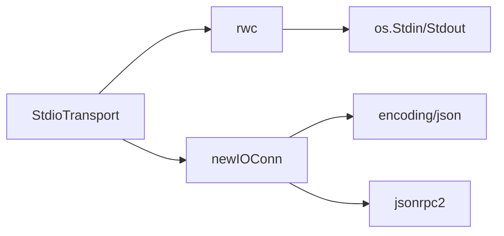

# 标准输入输出(Stdio)传输

<cite>
**Referenced Files in This Document**   
- [mcp/transport.go](file://mcp/transport.go)
- [examples/server/hello/main.go](file://examples/server/hello/main.go)
- [examples/server/toolschemas/main.go](file://examples/server/toolschemas/main.go)
- [mcp/cmd.go](file://mcp/cmd.go)
</cite>

## 目录
1. [简介](#简介)
2. [核心组件](#核心组件)
3. [架构概述](#架构概述)
4. [详细组件分析](#详细组件分析)
5. [依赖分析](#依赖分析)
6. [性能考量](#性能考量)
7. [故障排除指南](#故障排除指南)
8. [结论](#结论)

## 简介
`StdioTransport` 是 Go MCP SDK 中一种轻量级的通信传输机制，它利用操作系统的标准输入（stdin）和标准输出（stdout）作为双向通信通道。该传输方式专为命令行工具、子进程通信等场景设计，通过换行符分隔的 JSON 消息（newline-delimited JSON）格式进行数据交换。本文档将深入解析 `StdioTransport` 的实现原理，阐述其抽象设计，并结合实际示例展示其典型用法。

## 核心组件
`StdioTransport` 的核心在于其对 `os.Stdin` 和 `os.Stdout` 的封装，以及对 `IOTransport` 和 `newIOConn` 抽象的复用。它通过 `newIOConn` 函数构建一个基于 `io.ReadWriteCloser` 接口的连接，实现了高效、低延迟的进程间通信。

**Section sources**
- [mcp/transport.go](file://mcp/transport.go#L88-L93)
- [mcp/transport.go](file://mcp/transport.go#L104-L107)

## 架构概述
`StdioTransport` 的架构建立在 MCP 协议的 `Transport` 接口之上。当 `Connect` 方法被调用时，它会创建一个 `rwc` 结构体，该结构体将 `os.Stdin` 作为读取器（`io.ReadCloser`），将 `os.Stdout` 作为写入器（`io.WriteCloser`）。这个 `rwc` 实例随后被传递给 `newIOConn` 函数，生成一个符合 `Connection` 接口的 `ioConn` 对象，从而完成整个通信链路的建立。

```mermaid
graph TB
subgraph "StdioTransport"
ST[StdioTransport]
ST --> |Connect| RWC[rwc{os.Stdin, os.Stdout}]
RWC --> |newIOConn| IOC[ioConn]
IOC --> |实现| C[Connection]
end
```

**Diagram sources**
- [mcp/transport.go](file://mcp/transport.go#L88-L93)
- [mcp/transport.go](file://mcp/transport.go#L361-L405)

## 详细组件分析

### StdioTransport 与 IOTransport 抽象设计
`StdioTransport` 是 `IOTransport` 模式的一个特例。`IOTransport` 提供了一个通用的抽象，允许用户指定任意的 `io.ReadCloser` 和 `io.WriteCloser` 作为通信端点。而 `StdioTransport` 则是将这个通用模式具体化，固定使用 `os.Stdin` 和 `os.Stdout`。



**Diagram sources**
- [mcp/transport.go](file://mcp/transport.go#L31-L36)
- [mcp/transport.go](file://mcp/transport.go#L104-L107)
- [mcp/transport.go](file://mcp/transport.go#L88-L88)

#### newIOConn 连接封装
`newIOConn` 函数是整个通信机制的核心。它接收一个 `io.ReadWriteCloser`，并返回一个 `*ioConn` 实例。`ioConn` 内部启动一个 goroutine 来持续从底层流中读取数据。它使用 `json.NewDecoder` 来解析换行符分隔的 JSON 消息，并通过一个 `incoming` 通道将解析后的消息传递给 `Read` 方法。这种设计确保了 `Read` 调用可以被 `Close` 操作及时中断。



**Diagram sources**
- [mcp/transport.go](file://mcp/transport.go#L361-L405)
- [mcp/transport.go](file://mcp/transport.go#L329-L354)

### 典型用法示例
`StdioTransport` 在 `examples/server/hello` 和 `examples/server/toolschemas` 等示例中得到了典型应用。服务器通过调用 `server.Run(context.Background(), &mcp.StdioTransport{})` 来启动，并监听来自标准输入的 MCP 协议消息。这使得该服务器可以作为一个独立的命令行工具运行，其输入和输出可以被其他程序通过管道（pipe）轻松地重定向和处理。

**Section sources**
- [examples/server/hello/main.go](file://examples/server/hello/main.go#L41-L45)
- [examples/server/toolschemas/main.go](file://examples/server/toolschemas/main.go#L179-L184)

## 依赖分析
`StdioTransport` 的实现依赖于 Go 标准库中的 `os`、`io` 和 `encoding/json` 包，以及项目内部的 `jsonrpc2` 模块来处理 JSON-RPC 协议的编解码。其设计与 `CommandTransport` 有相似之处，后者也使用 `newIOConn` 来连接子进程的 stdin/stdout，这体现了 `newIOConn` 抽象的通用性。



**Diagram sources**
- [mcp/transport.go](file://mcp/transport.go#L88-L93)
- [mcp/transport.go](file://mcp/transport.go#L361-L405)
- [mcp/cmd.go](file://mcp/cmd.go#L42-L86)

## 性能考量
`StdioTransport` 具有轻量级和低延迟的特点。由于它直接操作操作系统级别的文件描述符，避免了网络协议栈的开销。其基于 goroutine 的异步读取模型也保证了良好的响应性。然而，需要注意的是，`stdin` 的读取在某些平台上可能不会在关闭时立即解除阻塞，这可能导致一个 goroutine 的泄漏，但这是 Go 标准库中一个已知且难以完全避免的问题。

## 故障排除指南
在使用 `StdioTransport` 时，常见的问题包括：
- **消息格式错误**：确保发送的 JSON 消息以换行符 `\n` 结尾，否则 `json.NewDecoder` 会将其视为不完整的流。
- **进程挂起**：如果客户端没有正确关闭其输出流（即服务器的输入流），服务器可能会在 `Read` 调用上无限期阻塞。
- **跨平台兼容性**：虽然 `os.Stdin` 和 `os.Stdout` 在所有主流平台上都可用，但子进程的信号处理（如 `SIGTERM`）在 Windows 上的行为可能与 Unix-like 系统不同。

**Section sources**
- [mcp/transport.go](file://mcp/transport.go#L361-L405)
- [mcp/cmd.go](file://mcp/cmd.go#L80-L108)

## 结论
`StdioTransport` 是一个简洁而强大的工具，它通过复用 `IOTransport` 抽象和 `newIOConn` 封装，实现了基于标准输入输出的高效进程间通信。其设计充分利用了 Go 语言的并发特性，为构建命令行工具和微服务提供了坚实的基础。开发者在使用时应关注消息格式的正确性和进程生命周期的管理，以确保通信的稳定可靠。