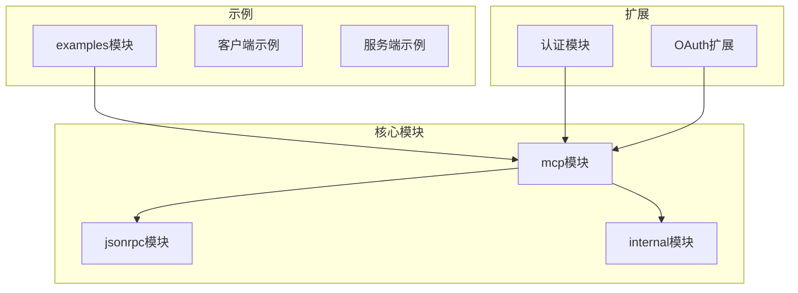
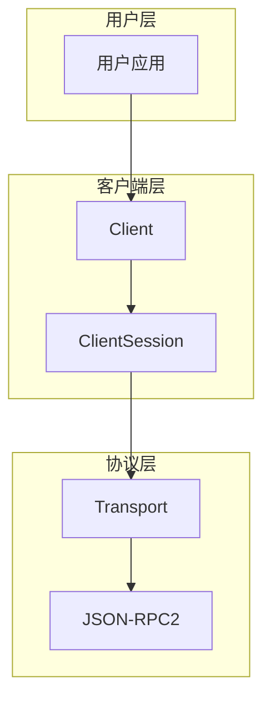
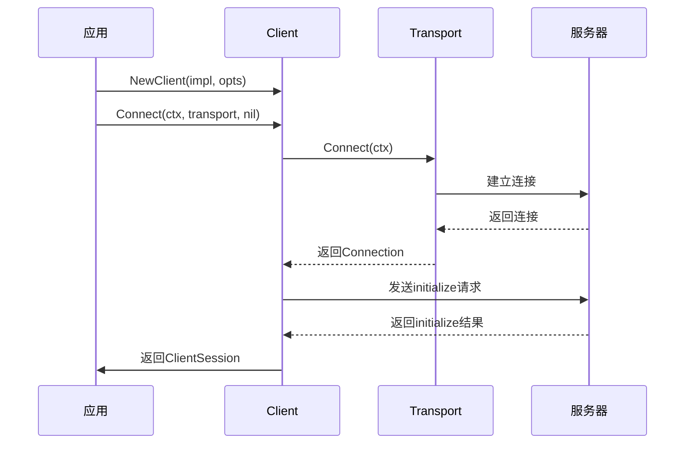
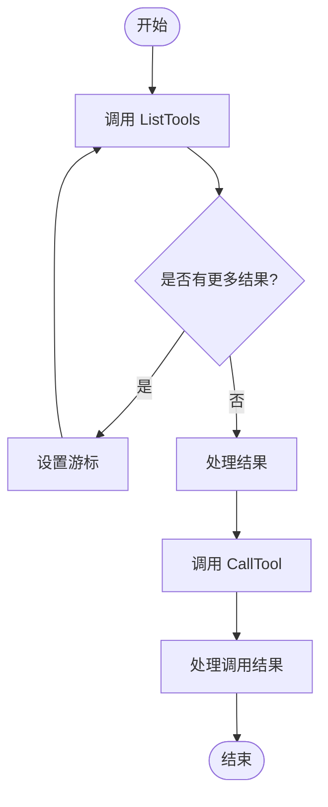
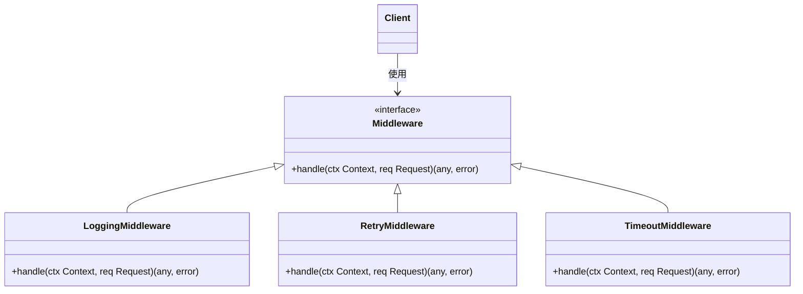
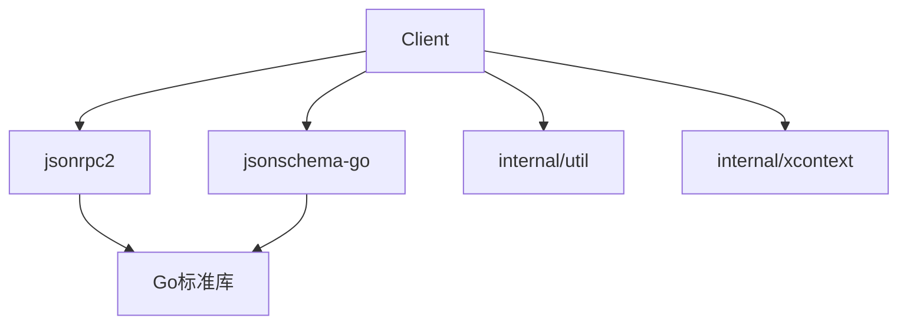

# 客户端功能

<cite>
**本文档中引用的文件**  
- [client.go](file://mcp/client.go)
- [transport.go](file://mcp/transport.go)
- [session.go](file://mcp/session.go)
- [features.go](file://mcp/features.go)
- [tool.go](file://mcp/tool.go)
- [resource.go](file://mcp/resource.go)
- [logging.go](file://mcp/logging.go)
- [loadtest/main.go](file://examples/client/loadtest/main.go)
</cite>

## 目录
1. [简介](#简介)
2. [项目结构](#项目结构)
3. [核心组件](#核心组件)
4. [架构概述](#架构概述)
5. [详细组件分析](#详细组件分析)
6. [依赖分析](#依赖分析)
7. [性能考虑](#性能考虑)
8. [故障排除指南](#故障排除指南)
9. [结论](#结论)

## 简介
本文档全面介绍了如何使用Go MCP SDK构建MCP客户端，以连接和调用远程服务器。涵盖了客户端初始化、会话建立、功能发现与调用、生命周期管理、流式响应处理、通知机制、中间件应用及错误处理等关键主题。通过示例代码和架构图，帮助开发者高效构建稳定、高性能的MCP客户端应用。

## 项目结构
本项目采用模块化设计，主要分为认证、示例、内部工具、JSON-RPC协议、MCP核心功能和OAuth扩展等模块。MCP核心模块（`mcp/`）包含客户端、服务端、会话、传输、功能（工具、资源、提示等）的完整实现。示例目录（`examples/`）提供了丰富的使用案例，包括客户端功能演示、负载测试和中间件应用。

**Diagram sources**
- [mcp/client.go](file://mcp/client.go#L1-L755)
- [examples/client/loadtest/main.go](file://examples/client/loadtest/main.go#L1-L125)

**Section sources**
- [mcp/client.go](file://mcp/client.go#L1-L755)
- [mcp/transport.go](file://mcp/transport.go#L1-L643)

## 核心组件
MCP客户端的核心组件包括`Client`、`ClientSession`、`Transport`和各种功能接口（如工具、资源）。`Client`负责管理多个会话和根路径，`ClientSession`代表与服务器的单个逻辑连接，`Transport`负责底层通信。功能发现和调用通过会话对象的方法实现，如`ListTools`、`CallTool`、`ReadResource`等。

**Section sources**
- [mcp/client.go](file://mcp/client.go#L1-L755)
- [mcp/session.go](file://mcp/session.go#L1-L29)

## 架构概述
MCP客户端采用分层架构，上层为用户API，中层为会话和功能管理，底层为传输和协议处理。客户端通过`Transport`建立连接，创建`ClientSession`进行通信。所有RPC调用都通过`ClientSession`发起，并由`jsonrpc2`库处理消息的序列化和传输。中间件机制允许在请求发送和接收时插入自定义逻辑。

**Diagram sources**
- [mcp/client.go](file://mcp/client.go#L1-L755)
- [mcp/transport.go](file://mcp/transport.go#L1-L643)

## 详细组件分析

### 客户端初始化与会话建立
客户端通过`NewClient`函数创建，需要提供`Implementation`信息和可选的`ClientOptions`。连接通过`Client.Connect`方法建立，该方法接受一个`Transport`实例。连接成功后，返回一个`ClientSession`对象，可用于后续的所有操作。

**Diagram sources**
- [mcp/client.go](file://mcp/client.go#L100-L150)
- [mcp/transport.go](file://mcp/transport.go#L200-L250)

**Section sources**
- [mcp/client.go](file://mcp/client.go#L1-L755)
- [mcp/transport.go](file://mcp/transport.go#L1-L643)

### 功能发现与调用
客户端通过`ClientSession`提供的方法发现和调用服务器功能。`ListTools`、`ListResources`等方法用于获取可用功能列表。`CallTool`和`ReadResource`用于调用具体功能。SDK还提供了`Tools`、`Resources`等迭代器方法，支持分页和游标管理。

**Diagram sources**
- [mcp/client.go](file://mcp/client.go#L500-L550)
- [mcp/features.go](file://mcp/features.go#L1-L114)

**Section sources**
- [mcp/client.go](file://mcp/client.go#L1-L755)
- [mcp/features.go](file://mcp/features.go#L1-L114)

### 生命周期与流式响应
`ClientSession`的生命周期由`Connect`创建，通过`Close`或`Wait`方法结束。对于流式响应，SDK通过`iter.Seq2`接口提供支持，允许客户端以拉取方式处理连续的数据流。服务器推送的通知通过在`ClientOptions`中注册相应的处理函数来接收。

**Section sources**
- [mcp/session.go](file://mcp/session.go#L1-L29)
- [mcp/client.go](file://mcp/client.go#L1-L755)

### 中间件应用
客户端中间件通过`AddSendingMiddleware`和`AddReceivingMiddleware`方法添加。中间件以函数链的形式应用，允许在请求发送前和接收后执行自定义逻辑，如日志记录、重试、超时控制等。中间件按添加顺序从右到左执行。

**Diagram sources**
- [mcp/client.go](file://mcp/client.go#L300-L350)
- [examples/http/logging_middleware.go](file://examples/http/logging_middleware.go)

**Section sources**
- [mcp/client.go](file://mcp/client.go#L1-L755)

## 依赖分析
MCP客户端依赖于`jsonrpc2`库进行底层通信，依赖`jsonschema-go`进行模式验证。内部模块`internal/util`和`internal/xcontext`提供通用工具函数。客户端与服务器通过定义良好的接口进行交互，降低了耦合度。

**Diagram sources**
- [go.mod](file://go.mod#L1-L20)
- [mcp/client.go](file://mcp/client.go#L1-L755)

**Section sources**
- [go.mod](file://go.mod#L1-L30)
- [mcp/client.go](file://mcp/client.go#L1-L755)

## 性能考虑
在高并发场景下，性能优化至关重要。`loadtest/main.go`示例展示了如何通过多协程和限流机制进行负载测试。建议使用连接池复用会话，合理设置请求超时，并利用流式API处理大数据量响应，避免内存溢出。

**Section sources**
- [examples/client/loadtest/main.go](file://examples/client/loadtest/main.go#L1-L125)

## 故障排除指南
常见错误包括网络中断、方法未找到、参数验证失败等。网络错误通常返回`ErrConnectionClosed`。方法未找到应检查服务器是否正确注册了功能。参数验证失败需确保请求参数符合服务器定义的JSON Schema。启用日志中间件有助于调试通信问题。

**Section sources**
- [mcp/client.go](file://mcp/client.go#L1-L755)
- [mcp/logging.go](file://mcp/logging.go#L1-L207)

## 结论
Go MCP SDK提供了一套完整、易用的API来构建MCP客户端。通过理解客户端初始化、会话管理、功能调用和错误处理等核心概念，开发者可以快速构建出稳定高效的客户端应用。合理利用中间件和性能优化技巧，可以进一步提升应用的健壮性和用户体验。