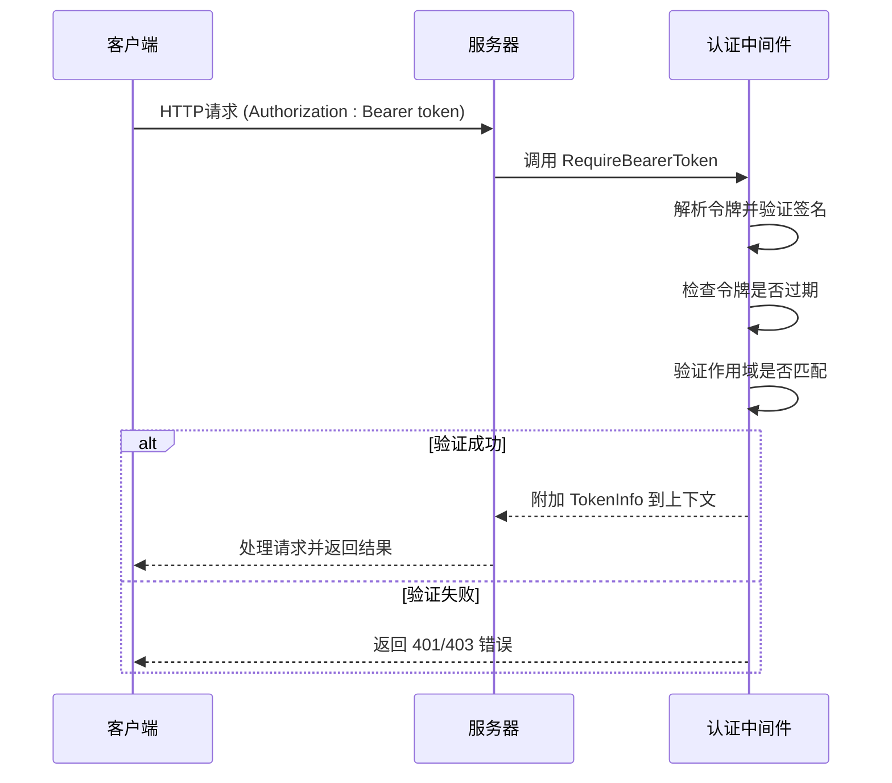
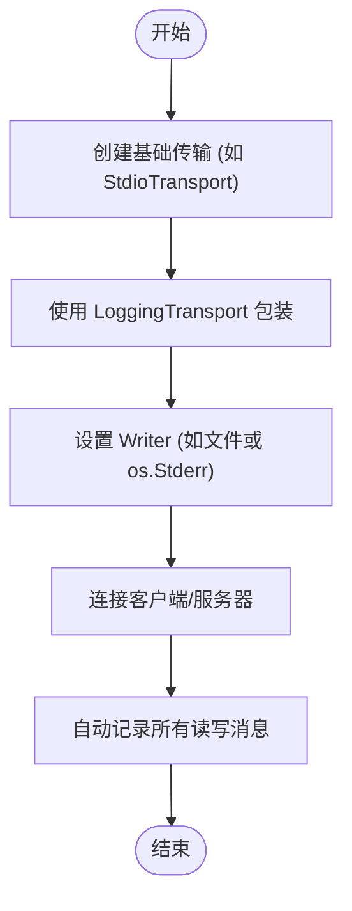

# 故障排除与最佳实践

<cite>
**本文档引用的文件**  
- [troubleshooting.src.md](file://internal/docs/troubleshooting.src.md)
- [conformance_test.go](file://mcp/conformance_test.go)
- [logging.go](file://mcp/logging.go)
- [transport.go](file://mcp/transport.go)
- [streamable.go](file://mcp/streamable.go)
- [auth.go](file://auth/auth.go)
- [CONTRIBUTING.md](file://CONTRIBUTING.md)
</cite>

## 目录
1. [简介](#简介)
2. [常见问题分类与诊断](#常见问题分类与诊断)
3. [日志分析方法](#日志分析方法)
4. [服务器合规性验证](#服务器合规性验证)
5. [生产环境部署最佳实践](#生产环境部署最佳实践)
6. [团队协作开发规范](#团队协作开发规范)

## 简介
本文档旨在为开发者提供一套完整的运维指南，帮助诊断和解决在使用 Go MCP SDK 过程中可能遇到的各类问题。文档基于项目中的 `troubleshooting.src.md` 文件整理，系统性地分类了连接失败、认证错误、性能瓶颈和协议不一致等常见故障，并提供详细的日志分析方法和合规性验证手段。最后，总结了生产环境部署的最佳实践和团队协作的开发规范，以确保系统的稳定性和可维护性。

## 常见问题分类与诊断

### 连接失败
连接失败通常与传输配置或网络防火墙设置有关。

- **传输配置检查**：确保客户端和服务器使用的传输方式（如 `stdio`、`streamable`）配置正确。例如，`stdio` 传输依赖于子进程的 `stdin/stdout`，而 `streamable` 传输则基于 HTTP 协议。
- **防火墙检查**：对于基于 HTTP 的 `streamable` 传输，确认服务器端口（如 8080）已在防火墙中开放，并且客户端能够访问该端口。

**Section sources**
- [protocol.src.md](file://internal/docs/protocol.src.md#transports)
- [transport.go](file://mcp/transport.go#L228-L231)

### 认证错误
认证错误主要涉及令牌格式不正确或作用域（scopes）不匹配。

- **令牌格式**：确保客户端在请求头中正确设置了 `Authorization: Bearer <token>`。令牌本身应由有效的认证服务签发。
- **作用域检查**：服务器端通过 `RequireBearerToken` 中间件验证令牌。如果指定了 `RequireBearerTokenOptions.Scopes`，则令牌中的 `scopes` 必须包含所有必需的作用域，否则将返回 `403 Forbidden` 错误。

**Diagram sources**
- [auth.go](file://auth/auth.go#L60-L79)
- [protocol.src.md](file://internal/docs/protocol.src.md#authorization)

### 性能瓶颈
性能瓶颈可能源于分页设置不当或并发控制不足。

- **分页设置**：对于返回大量数据的接口，应实现分页机制，避免单次请求加载过多数据导致内存溢出或响应延迟。
- **并发控制**：服务器应合理设置并发连接数和处理任务的 goroutine 数量，防止因资源耗尽而导致服务不可用。可以使用 `StreamableHTTPOptions` 中的配置来管理连接。

**Section sources**
- [streamable.go](file://mcp/streamable.go#L86-L100)
- [protocol.src.md](file://internal/docs/protocol.src.md#concurrency)

### 协议不一致
协议不一致问题通常出现在版本兼容性上。

- **版本协商**：客户端在请求中通过 `MCP-Protocol-Version` 头部指定协议版本。服务器必须支持该版本，否则应返回 `400 Bad Request`。
- **向后兼容**：如果服务器未收到 `MCP-Protocol-Version` 头部，则应默认使用 `2025-03-26` 版本以保证向后兼容性。

**Section sources**
- [streamable.go](file://mcp/streamable.go#L86-L100)
- [protocol.src.md](file://internal/docs/protocol.src.md#protocol-version-header)

## 日志分析方法
利用 SDK 内置的 `Logger` 接口可以有效定位问题。

- **启用日志记录**：通过 `LoggingTransport` 包装底层传输，可以将所有进出的 JSON-RPC 消息记录到 `io.Writer`（如文件或 `os.Stderr`）。
- **日志级别控制**：SDK 支持多种日志级别（如 `debug`, `info`, `error`）。可以通过 `LoggingHandlerOptions` 设置日志级别和速率限制，避免日志文件过大。

**Diagram sources**
- [logging.go](file://mcp/logging.go#L228-L231)
- [transport.go](file://mcp/transport.go#L228-L231)

## 服务器合规性验证
通过 `conformance_test.go` 文件可以验证服务器是否符合 MCP 规范。

- **测试原理**：合规性测试通过加载 `txtar` 格式的测试数据文件，模拟客户端发送一系列 JSON-RPC 消息，并验证服务器返回的消息是否符合预期。
- **测试执行**：运行 `go test` 并使用 `-update` 标志可以更新预期的输出文件，便于在实现变更后快速调整测试基准。

**Section sources**
- [conformance_test.go](file://mcp/conformance_test.go#L1-L408)

## 生产环境部署最佳实践

### 资源监控
部署后应持续监控 CPU、内存、网络 I/O 等关键资源的使用情况，及时发现潜在的性能瓶颈。

### 错误恢复
实现健壮的错误处理和自动恢复机制，例如使用 `KeepAlive` 心跳检测连接状态，并在连接断开后尝试自动重连。

### 安全加固
- **令牌验证**：始终使用 `RequireBearerToken` 中间件验证所有传入请求。
- **会话保护**：生成加密安全的会话 ID，并考虑将会话 ID 与用户信息绑定，防止会话劫持。

### 版本升级策略
采用灰度发布策略，先在小范围用户中验证新版本的稳定性，再逐步扩大范围，确保升级过程平滑无感。

**Section sources**
- [protocol.src.md](file://internal/docs/protocol.src.md#security)
- [streamable.go](file://mcp/streamable.go#L86-L100)

## 团队协作开发规范
遵循 `CONTRIBUTING.md` 中的开发规范，确保代码质量和协作效率。

- **代码贡献流程**：任何重大变更都应关联一个 GitHub Issue。对于标记为 "Help Wanted" 的问题，可直接参与；对于其他问题，建议先在 Issue 中确认后再开始工作。
- **代码质量**：提交的代码应高质量且经过充分测试，遵循 [Google Go 风格指南](https://google.github.io/styleguide/go/)。
- **文档更新**：修改 `README.md` 时，应先编辑 `internal/readme/README.src.md`，然后运行 `go generate ./internal/readme` 重新生成。

**Section sources**
- [CONTRIBUTING.md](file://CONTRIBUTING.md#L1-L293)