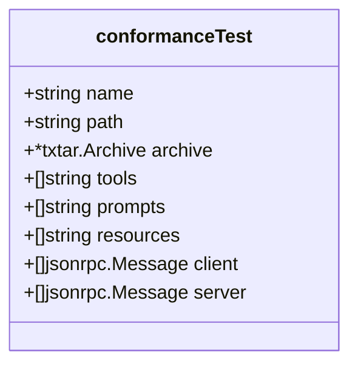
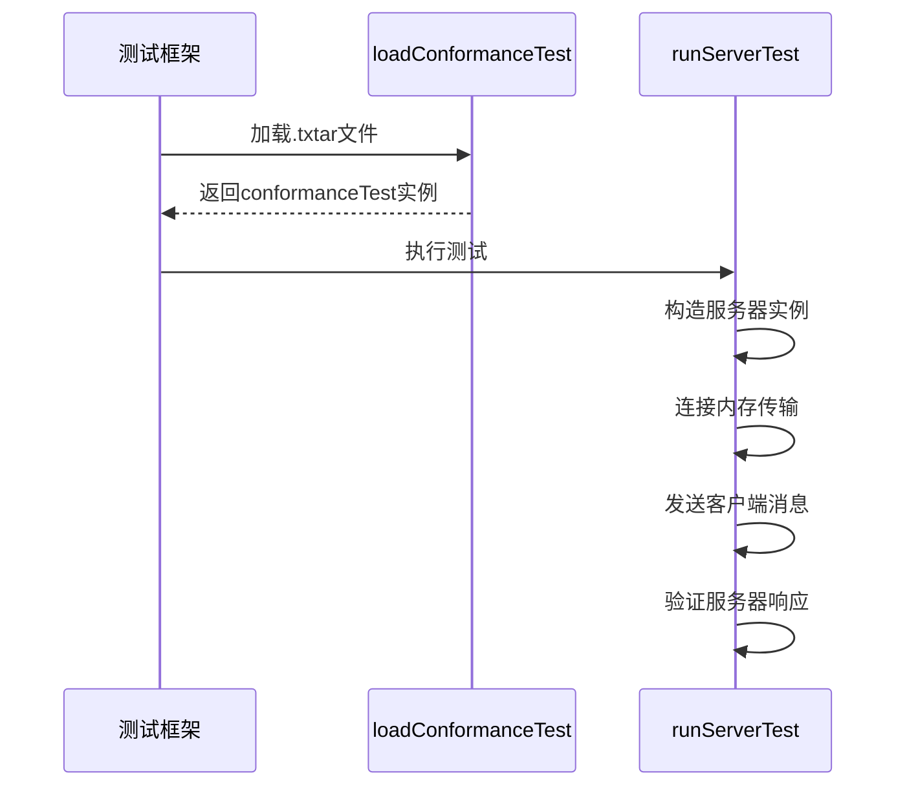
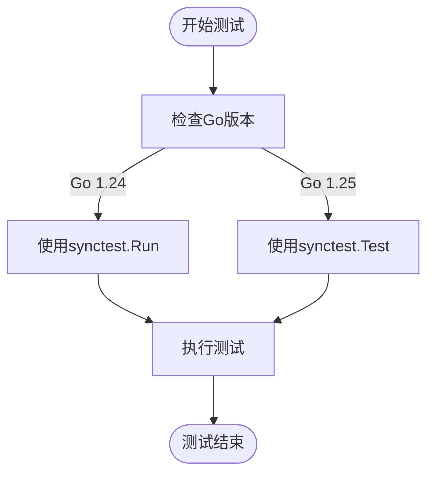
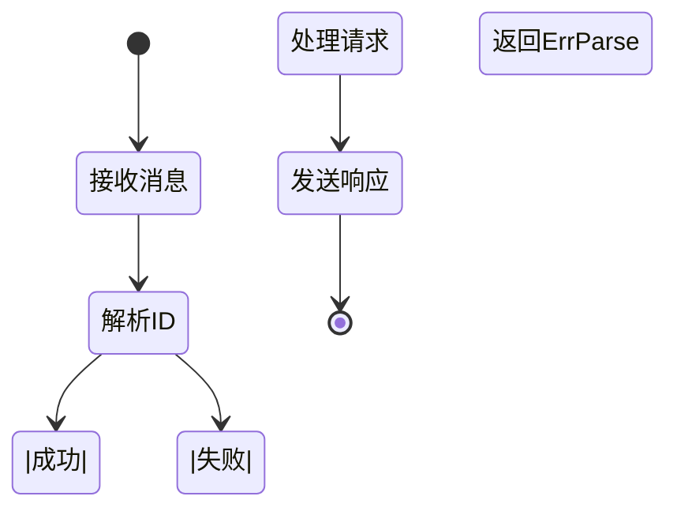

# 协议不一致

<cite>
**本文档中引用的文件**  
- [conformance_test.go](file://mcp/conformance_test.go)
- [protocol.go](file://mcp/protocol.go)
- [messages.go](file://internal/jsonrpc2/messages.go)
- [wire.go](file://internal/jsonrpc2/wire.go)
- [conformance_go124_test.go](file://mcp/conformance_go124_test.go)
- [conformance_go125_test.go](file://mcp/conformance_go125_test.go)
</cite>

## 目录
1. [引言](#引言)
2. [协议兼容性问题概述](#协议兼容性问题概述)
3. [合规性测试框架分析](#合规性测试框架分析)
4. [txtar测试档案结构](#txtar测试档案结构)
5. [运行与更新合规性测试](#运行与更新合规性测试)
6. [典型消息编码/解码错误分析](#典型消息编码解码错误分析)
7. [Wire层调试技巧](#wire层调试技巧)
8. [结论](#结论)

## 引言
本文档旨在为开发者提供一份深度排查MCP协议兼容性问题的指南。重点解决由于MCP版本差异、JSON-RPC 2.0消息格式偏差以及可选字段处理不一致所引发的难题。通过分析`conformance_test.go`中的合成测试框架，展示如何验证服务器对标准协议的遵循程度。同时，详细解释txtar测试档案的结构，并指导开发者如何运行和更新合规性测试以捕获意外的行为变更。

## 协议兼容性问题概述
在多客户端多服务器（MCP）环境中，确保不同实现之间的协议兼容性至关重要。主要挑战包括：
- **MCP版本差异**：不同版本的MCP协议可能引入新的字段或修改现有字段的语义。
- **JSON-RPC 2.0消息格式偏差**：消息的编码和解码必须严格遵循JSON-RPC 2.0规范。
- **可选字段处理不一致**：对于可选字段的处理方式不一致可能导致互操作性问题。

这些问题可能导致消息解析失败、功能异常或安全漏洞。因此，建立一个健壮的合规性测试框架是确保系统稳定性的关键。

## 合规性测试框架分析
合规性测试框架的核心是`conformance_test.go`文件，它定义了一个用于检查JSON级别合规性的测试结构。

### 测试结构
`conformanceTest`结构体定义了测试的基本组成部分：
- **name**：测试名称
- **path**：测试文件路径
- **archive**：原始归档，用于更新
- **tools, prompts, resources**：包含的命名功能列表
- **client**：客户端消息序列
- **server**：服务器消息序列



**Diagram sources**
- [conformance_test.go](file://mcp/conformance_test.go#L51-L58)

### 服务器合规性测试
`TestServerConformance`函数负责加载并执行所有服务器合规性测试。它遍历`testdata/conformance/server`目录下的所有`.txtar`文件，并为每个文件创建一个测试用例。



**Diagram sources**
- [conformance_test.go](file://mcp/conformance_test.go#L62-L99)
- [conformance_test.go](file://mcp/conformance_test.go#L139-L331)

**Section sources**
- [conformance_test.go](file://mcp/conformance_test.go#L62-L99)
- [conformance_test.go](file://mcp/conformance_test.go#L139-L331)

## txtar测试档案结构
txtar是一种简单的归档格式，用于存储多个文件在一个文本文件中。每个测试档案包含以下几个部分：

### 文件结构
- **tools**：列出要包含的工具名称
- **prompts**：列出要包含的提示名称
- **resources**：列出要包含的资源名称
- **client**：客户端发送的消息序列
- **server**：期望从服务器接收的消息序列

### 示例结构
```
-- tools --
greet
structured

-- client --
{"jsonrpc":"2.0","method":"tools/call","params":{...},"id":1}

-- server --
{"jsonrpc":"2.0","result":{...},"id":1}
```

这种结构使得测试数据易于阅读和维护，同时也方便自动化工具进行处理。

**Section sources**
- [conformance_test.go](file://mcp/conformance_test.go#L335-L406)

## 运行与更新合规性测试
### 运行测试
使用标准的Go测试命令即可运行合规性测试：
```bash
go test ./mcp -run TestServerConformance
```

### 更新测试数据
当需要更新期望的输出时，可以使用`-update`标志：
```bash
go test ./mcp -run TestServerConformance -update
```
此标志会更新`server`文件中的内容，将其替换为实际的服务器响应。

### 版本兼容性处理
为了支持不同的Go版本，项目中包含了两个条件编译文件：
- `conformance_go124_test.go`：针对Go 1.24版本使用`synctest.Run`
- `conformance_go125_test.go`：针对Go 1.25版本使用`synctest.Test`



**Diagram sources**
- [conformance_go124_test.go](file://mcp/conformance_go124_test.go#L1-L16)
- [conformance_go125_test.go](file://mcp/conformance_go125_test.go#L1-L16)

**Section sources**
- [conformance_go124_test.go](file://mcp/conformance_go124_test.go#L1-L16)
- [conformance_go125_test.go](file://mcp/conformance_go125_test.go#L1-L16)

## 典型消息编码/解码错误分析
### ID类型不匹配
根据JSON-RPC 2.0规范，请求ID可以是字符串、整数或null。`ID`结构体通过`MakeID`函数确保类型正确性。



**Diagram sources**
- [messages.go](file://internal/jsonrpc2/messages.go#L13-L45)

### 通知与请求混淆
区分通知和请求的关键在于ID字段是否存在。`IsCall`方法通过检查ID的有效性来判断是否为调用请求。

### 批量请求处理缺陷
虽然当前代码未直接展示批量请求处理，但`DecodeMessage`函数的设计支持逐个解析消息，为批量处理提供了基础。

**Section sources**
- [messages.go](file://internal/jsonrpc2/messages.go#L13-L212)

## Wire层调试技巧
### 消息编码与解码
`EncodeMessage`和`DecodeMessage`函数是Wire层的核心，负责消息的序列化和反序列化。

### 错误处理
预定义的错误码如`ErrParse`、`ErrInvalidRequest`等提供了标准化的错误报告机制。

### 调试建议
1. 使用`EncodeIndent`生成格式化的JSON输出，便于人工检查。
2. 在关键路径上添加日志记录，跟踪消息流转。
3. 利用`synctest`框架检测服务器处理完成状态。

```mermaid
erDiagram
MESSAGE ||--o{ WIRE_COMBINED : "编码/解码"
WIRE_COMBINED {
string jsonrpc
any id
string method
json.RawMessage params
json.RawMessage result
WireError error
}
MESSAGE {
*Request request
*Response response
}
WireError {
int64 code
string message
json.RawMessage data
}
```

**Diagram sources**
- [wire.go](file://internal/jsonrpc2/wire.go#L0-L97)
- [messages.go](file://internal/jsonrpc2/messages.go#L13-L212)

**Section sources**
- [wire.go](file://internal/jsonrpc2/wire.go#L0-L97)
- [messages.go](file://internal/jsonrpc2/messages.go#L13-L212)

## 结论
通过深入分析`conformance_test.go`中的合成测试框架，我们展示了如何系统性地验证MCP协议的合规性。利用txtar测试档案结构，开发者可以清晰地定义客户端和服务器之间的消息交互。运行和更新合规性测试的能力使得捕获意外行为变更成为可能。针对常见的消息编码/解码错误，提供了具体的调试技巧。这些方法共同构成了一个强大的工具集，帮助开发者确保其MCP实现的稳定性和互操作性。