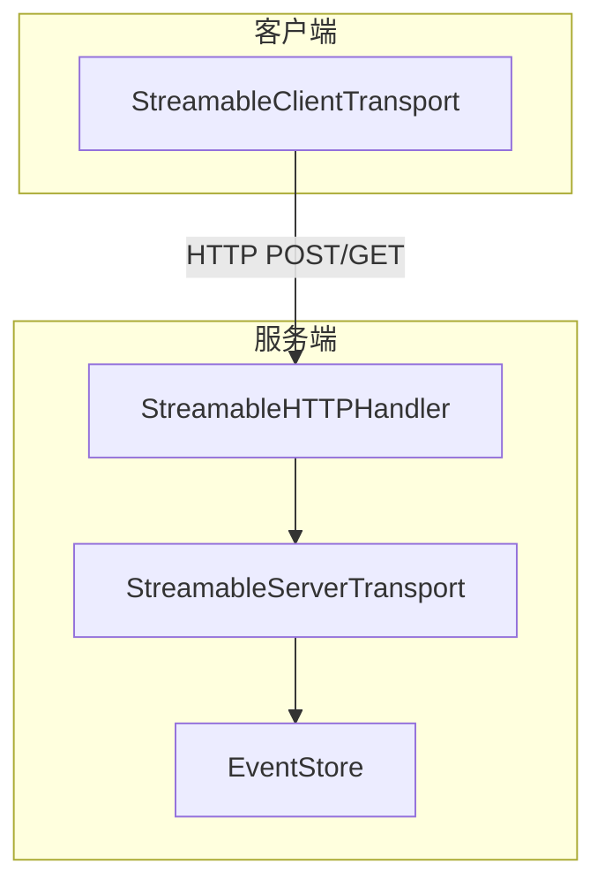
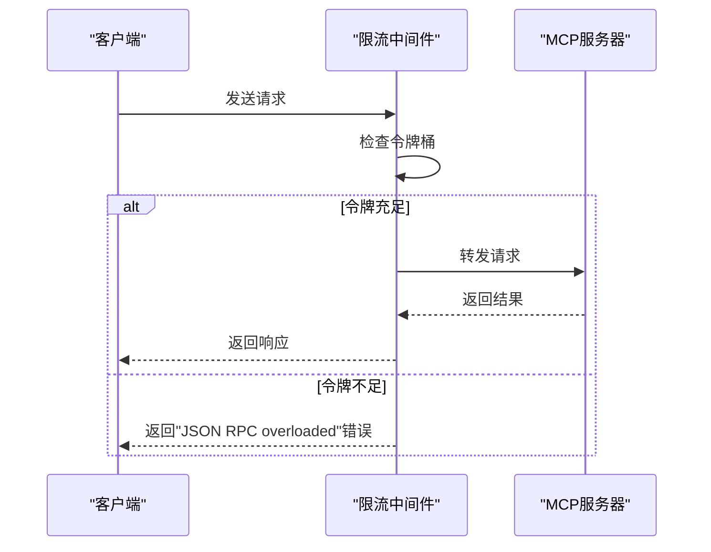
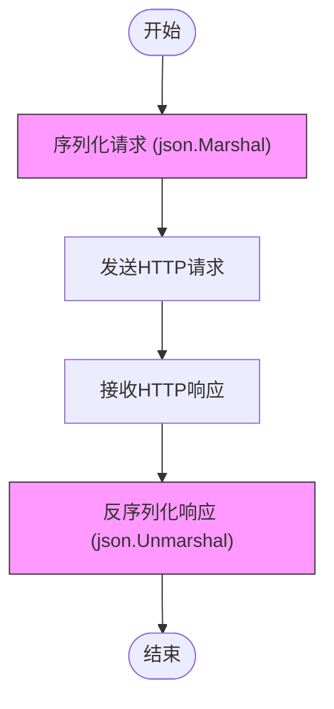

# 性能瓶颈

<cite>
**本文档中引用的文件**  
- [main.go](file://examples/server/rate-limiting/main.go)
- [streamable.go](file://mcp/streamable.go)
- [streamable_bench_test.go](file://mcp/streamable_bench_test.go)
- [wire.go](file://internal/jsonrpc2/wire.go)
- [jsonrpc2.go](file://internal/jsonrpc2/jsonrpc2.go)
- [protocol.src.md](file://internal/docs/protocol.src.md)
</cite>

## 目录
1. [简介](#简介)
2. [高并发场景下的性能问题](#高并发场景下的性能问题)
3. [流式传输与内存压力](#流式传输与内存压力)
4. [分页策略优化](#分页策略优化)
5. [限流中间件实现](#限流中间件实现)
6. [JSON-RPC序列化开销与缓冲技术](#json-rpc序列化开销与缓冲技术)
7. [基准测试编写方法](#基准测试编写方法)
8. [使用pprof进行性能分析](#使用pprof进行性能分析)
9. [典型瓶颈解决模式](#典型瓶颈解决模式)
10. [结论](#结论)

## 简介
本文档旨在为Go MCP SDK在高并发场景下的性能问题提供诊断与优化指南。重点分析响应延迟、资源读取效率低下及流控缺失等问题，并结合代码库中的实际实现，提出针对性的优化建议。通过分析流式传输模式、限流中间件、JSON-RPC序列化及基准测试等关键组件，帮助开发者构建高性能、高可靠的服务。

## 高并发场景下的性能问题
在高并发环境下，系统可能面临响应延迟增加、资源消耗过快、服务过载等挑战。这些问题通常由不合理的资源管理、缺乏有效的流量控制以及序列化/反序列化开销过大引起。Go MCP SDK通过多种机制应对这些挑战，包括流式传输、中间件架构和高效的JSON-RPC处理。

**Section sources**
- [protocol.src.md](file://internal/docs/protocol.src.md#L44-L237)
- [wire.go](file://internal/jsonrpc2/wire.go#L0-L32)

## 流式传输与内存压力
流式传输（Streamable Transport）是MCP协议中用于处理大量数据的核心机制。它通过`StreamableHTTPHandler`、`StreamableServerTransport`和`StreamableClientTransport`三个类型实现，支持在HTTP上进行双向JSON-RPC消息通信。

然而，流式传输在处理大量数据时可能带来显著的内存占用和GC压力。特别是在`StreamableServerTransport`中，每个会话都维护一个逻辑连接，若未妥善管理，可能导致内存泄漏。此外，频繁的JSON-RPC消息编解码会增加GC负担。

**Diagram sources**
- [streamable.go](file://mcp/streamable.go#L0-L799)

**Section sources**
- [streamable.go](file://mcp/streamable.go#L0-L799)
- [protocol.src.md](file://internal/docs/protocol.src.md#L79-L135)

## 分页策略优化
对于资源密集型操作（如`ListResources`），应采用分页策略以减少单次请求的数据量。虽然代码库中未直接展示分页参数的使用，但可通过自定义工具方法实现`limit`和`offset`参数来控制返回结果的数量。

推荐做法是在工具方法的输入参数中定义分页字段，并在服务端逻辑中根据这些参数查询数据库或数据源，从而避免一次性加载过多数据导致内存溢出。

**Section sources**
- [streamable.go](file://mcp/streamable.go#L0-L799)

## 限流中间件实现
为防止服务过载，Go MCP SDK提供了灵活的限流中间件机制。示例代码展示了三种限流策略：全局限流、按方法限流和按会话限流。

- **全局限流**：使用`GlobalRateLimiterMiddleware`对所有请求应用统一的速率限制。
- **按方法限流**：使用`PerMethodRateLimiterMiddleware`为不同方法配置不同的限流规则。
- **按会话限流**：使用`PerSessionRateLimiterMiddleware`为每个会话独立维护限流器，避免单个会话耗尽系统资源。

**Diagram sources**
- [main.go](file://examples/server/rate-limiting/main.go#L0-L96)

**Section sources**
- [main.go](file://examples/server/rate-limiting/main.go#L0-L96)

## JSON-RPC序列化开销与缓冲技术
JSON-RPC消息的序列化和反序列化是性能瓶颈之一。每次请求和响应都需要进行JSON编解码，频繁的内存分配会增加GC压力。

为减少分配，推荐使用缓冲和复用技术：
- 使用`sync.Pool`复用`json.RawMessage`对象。
- 在`wireCombined`结构体中复用字段，避免重复分配。
- 对于高频调用的方法，预分配常用的数据结构。

**Diagram sources**
- [wire.go](file://internal/jsonrpc2/wire.go#L31-L60)
- [jsonrpc2.go](file://internal/jsonrpc2/jsonrpc2.go#L34-L68)

**Section sources**
- [wire.go](file://internal/jsonrpc2/wire.go#L0-L97)
- [jsonrpc2.go](file://internal/jsonrpc2/jsonrpc2.go#L0-L68)

## 基准测试编写方法
基准测试是量化性能改进的关键。`streamable_bench_test.go`中的`BenchmarkStreamableServing`展示了如何编写有效的基准测试。

关键步骤包括：
1. 初始化服务器和客户端。
2. 建立连接并预热。
3. 使用`b.ResetTimer()`重置计时器。
4. 在循环中执行目标操作。
5. 报告每秒处理的请求数（QPS）或每操作耗时。

通过对比优化前后的基准测试结果，可以客观评估性能改进效果。

**Section sources**
- [streamable_bench_test.go](file://mcp/streamable_bench_test.go#L0-L67)

## 使用pprof进行性能分析
`pprof`是Go语言内置的强大性能分析工具。在`examples/server/everything/main.go`中，通过导入`_ "net/http/pprof"`并启动pprof服务器，可以收集CPU和内存热点数据。

分析步骤：
1. 启动服务并访问`/debug/pprof/`端点。
2. 使用`go tool pprof`分析CPU或内存配置文件。
3. 识别耗时最长的函数或内存分配最多的代码路径。
4. 针对性优化并重新测试。

**Section sources**
- [everything/main.go](file://examples/server/everything/main.go#L0-L48)

## 典型瓶颈解决模式
1. **内存泄漏**：检查`StreamableServerTransport`的生命周期管理，确保会话关闭时正确释放资源。
2. **GC压力过大**：使用`sync.Pool`复用对象，减少短生命周期对象的分配。
3. **响应延迟高**：引入缓存机制，对频繁访问的数据进行缓存。
4. **服务过载**：部署多级限流策略，结合熔断和降级机制。
5. **序列化开销大**：优化JSON编解码逻辑，考虑使用更高效的序列化格式（如Protobuf）。

## 结论
通过对Go MCP SDK的深入分析，本文档提供了针对高并发场景下性能问题的全面诊断与优化指南。从流式传输的内存管理到限流中间件的实现，再到JSON-RPC序列化的优化和基准测试的编写，每一步都至关重要。结合`pprof`等分析工具，开发者可以精准定位瓶颈并实施有效的解决方案，从而构建出高性能、高可靠的服务体系。