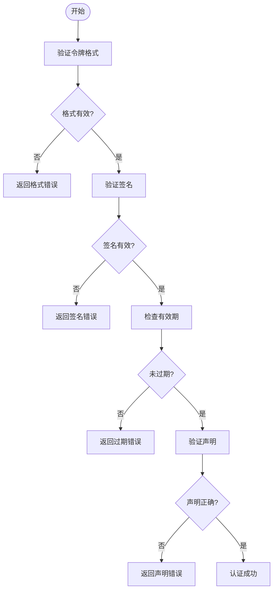

# 故障排除指南

<cite>
**本文档中引用的文件**  
- [troubleshooting.src.md](file://internal/docs/troubleshooting.src.md)
- [conformance_test.go](file://mcp/conformance_test.go)
- [transport_example_test.go](file://mcp/transport_example_test.go)
- [streamable_example_test.go](file://mcp/streamable_example_test.go)
- [logging.go](file://mcp/logging.go)
- [transport.go](file://mcp/transport.go)
- [protocol.go](file://mcp/protocol.go)
- [client.go](file://mcp/client.go)
- [server.go](file://mcp/server.go)
- [streamable.go](file://mcp/streamable.go)
- [auth.go](file://auth/auth.go)
- [auth_test.go](file://auth/auth_test.go)
</cite>

## 目录
1. [简介](#简介)
2. [连接失败](#连接失败)
3. [认证错误](#认证错误)
4. [协议不一致](#协议不一致)
5. [性能瓶颈](#性能瓶颈)
6. [日志分析方法](#日志分析方法)
7. [合规性测试](#合规性测试)
8. [调试工具推荐](#调试工具推荐)

## 简介

在使用Go SDK进行Model Context Protocol（MCP）开发时，可能会遇到各种问题。本指南旨在帮助开发者系统性地诊断和解决常见故障，包括连接失败、认证错误、协议不一致以及性能瓶颈等问题。通过详细的日志分析方法和合规性测试手段，开发者可以快速定位问题根源并采取有效措施。

## 连接失败

连接失败通常由传输配置错误、防火墙设置或stdio/HTTP传输问题引起。

### 检查传输配置

确保客户端和服务器使用兼容的传输方式。对于stdio传输，确认标准输入输出流正确配置；对于HTTP传输，验证端点URL和协议版本。

**解决方案：**
- 验证传输配置是否匹配
- 检查网络可达性和端口开放状态
- 确认防火墙规则允许相应流量

**验证步骤：**
1. 使用`netstat`或`telnet`测试端口连通性
2. 检查服务器日志中的连接尝试记录
3. 验证传输层配置参数

**Section sources**
- [transport.go](file://mcp/transport.go#L228-L231)
- [client.go](file://mcp/client.go#L135-L170)
- [server.go](file://mcp/server.go#L838-L853)

## 认证错误

认证错误主要包括令牌格式错误、作用域缺失和JWT验证失败等情况。

### 令牌格式错误

确保提供的认证令牌符合预期格式。Bearer令牌应以"Bearer "前缀开头，且后续部分为有效的JWT或API密钥。

### 作用域缺失

检查请求中包含的作用域是否满足服务器要求。某些API端点可能需要特定权限才能访问。

### JWT验证失败

JWT验证失败可能由以下原因导致：
- 签名无效
- 令牌已过期
- 签发者不被信任
- 受众不匹配

**解决方案：**
- 验证令牌签名密钥
- 检查令牌有效期
- 确认签发者和受众设置正确

**验证步骤：**
1. 使用在线JWT解码工具检查令牌内容
2. 验证时间戳在有效范围内
3. 确认所有声明字段正确无误



**Diagram sources**
- [auth.go](file://auth/auth.go)
- [auth_test.go](file://auth/auth_test.go)

**Section sources**
- [auth.go](file://auth/auth.go)
- [auth_test.go](file://auth/auth_test.go)

## 协议不一致

协议不一致问题主要涉及MCP版本兼容性和JSON-RPC消息格式偏差。

### MCP版本兼容性

确保客户端和服务器协商使用相同的协议版本。当前支持的版本包括2025-03-26和2025-06-18。

**处理策略：**
- 客户端应在初始化时声明支持的最新版本
- 服务器应响应实际使用的版本
- 双方必须处理版本不匹配的情况

### JSON-RPC消息格式偏差

检查JSON-RPC消息是否符合规范要求：
- 正确的消息ID管理
- 符合规范的请求/响应结构
- 正确的错误码使用

**验证方法：**
- 使用`conformance_test.go`中的测试用例验证实现
- 检查消息编码和解码过程

**Section sources**
- [protocol.go](file://mcp/protocol.go)
- [conformance_test.go](file://mcp/conformance_test.go)

## 性能瓶颈

性能瓶颈通常表现为高并发下的响应延迟或资源读取分页不当。

### 高并发响应延迟

优化建议：
- 实现适当的连接池
- 调整keep-alive设置
- 优化内部处理逻辑

### 资源读取分页

确保分页参数正确设置：
- 合理的页面大小
- 正确的游标管理
- 及时的资源释放

**优化措施：**
- 监控系统资源使用情况
- 实施缓存策略
- 优化数据库查询

**Section sources**
- [client.go](file://mcp/client.go#L135-L170)
- [server.go](file://mcp/server.go#L838-L853)

## 日志分析方法

有效的日志分析是诊断问题的关键。

### 使用LoggingTransport捕获MCP通信流量

通过`LoggingTransport`包装实际传输层来记录通信数据：

```go
var b bytes.Buffer
logTransport := &mcp.LoggingTransport{Transport: t2, Writer: &b}
```

此方法可用于stdio和HTTP传输，帮助捕获完整的MCP通信流量。

### HTTP中间件拦截请求

对于HTTP传输，可以使用中间件拦截和记录请求：

```go
loggingHandler := http.HandlerFunc(func(w http.ResponseWriter, req *http.Request) {
    body, err := io.ReadAll(req.Body)
    if err != nil {
        log.Fatal(err)
    }
    req.Body.Close()
    req.Body = io.NopCloser(bytes.NewBuffer(body))
    fmt.Println(req.Method, string(body))
    handler.ServeHTTP(w, req)
})
```

**Section sources**
- [transport_example_test.go](file://mcp/transport_example_test.go)
- [streamable_example_test.go](file://mcp/streamable_example_test.go)
- [logging.go](file://mcp/logging.go)

## 合规性测试

使用`conformance_test.go`验证服务器行为是否符合规范。

### 合成测试验证

合成测试通过模拟客户端-服务器交互来验证实现的正确性：

1. 构造测试服务器实例
2. 定义预期的请求-响应序列
3. 执行测试并比较实际输出与期望输出

### 更新测试数据

运行测试时使用`-update`标志可自动更新期望的输出数据，便于维护测试用例。

**验证流程：**
- 加载测试数据文件（txtar格式）
- 解码JSON-RPC消息
- 执行服务器处理
- 比较实际输出与期望输出

**Section sources**
- [conformance_test.go](file://mcp/conformance_test.go)

## 调试工具推荐

### MCP Inspector工具

使用[MCP Inspector](https://modelcontextprotocol.io/legacy/tools/inspector)调试MCP服务器，该工具可用于：
- 测试服务器功能
- 验证与TypeScript SDK的兼容性
- 检查MCP流量

### 通用网络分析工具

推荐使用以下工具分析HTTP/SSE流量：
- [Wireshark](https://www.wireshark.org/)：强大的网络协议分析器
- [tcpdump](https://linux.die.net/man/8/tcpdump)：命令行网络抓包工具

这些工具可以帮助深入分析底层网络通信，识别传输层问题。

**Section sources**
- [troubleshooting.src.md](file://internal/docs/troubleshooting.src.md)