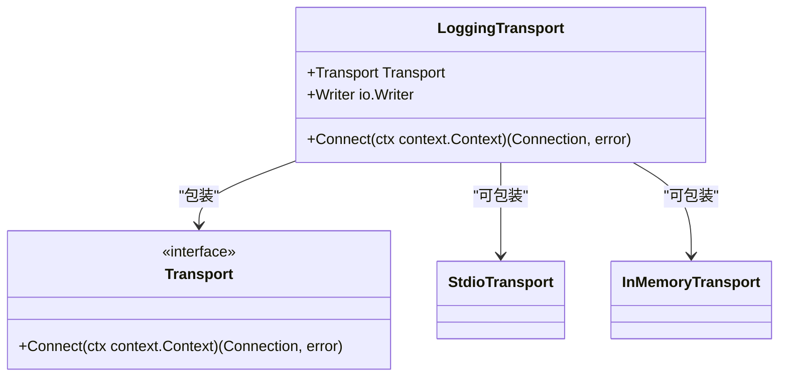
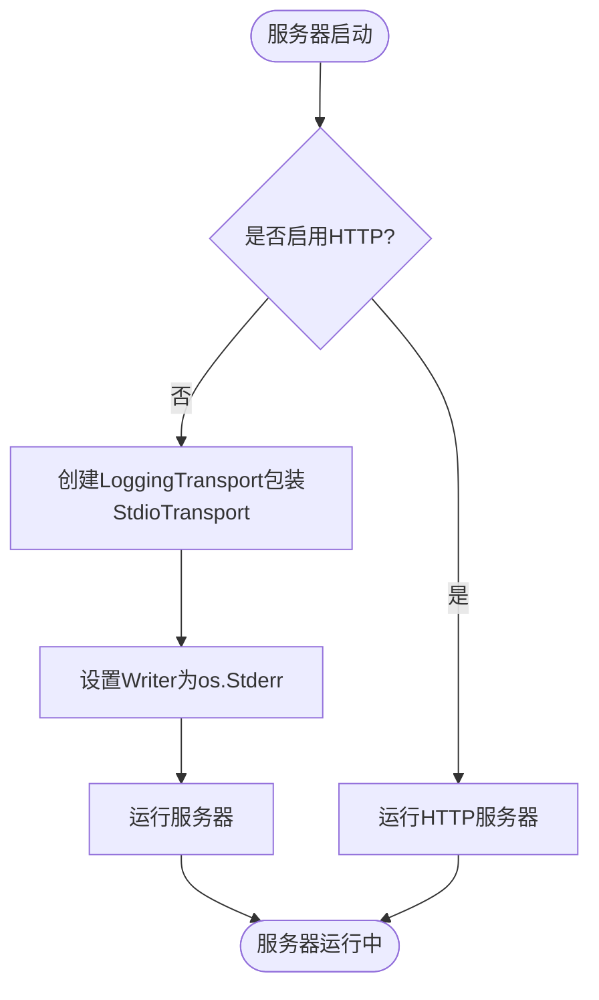
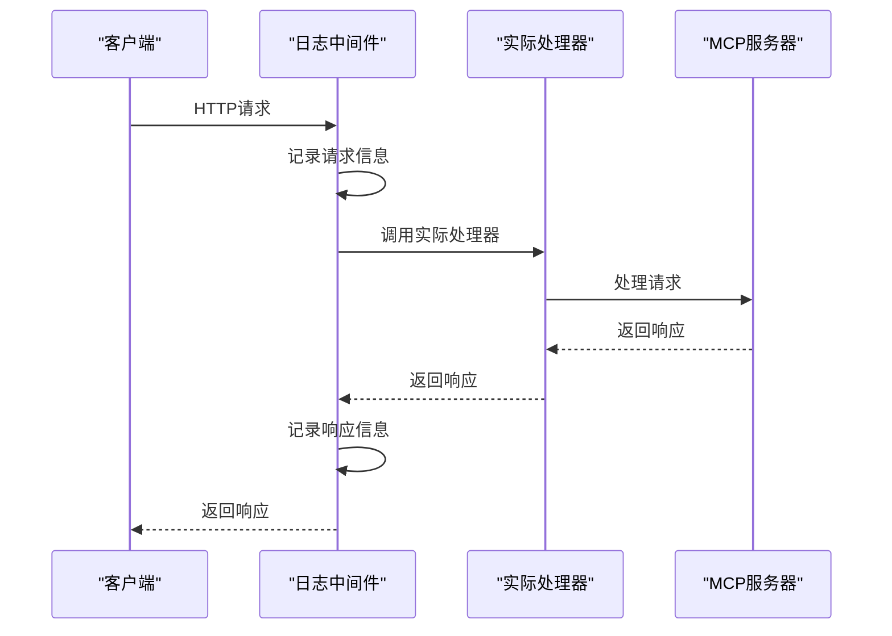

# 日志记录与流量检测

<cite>
**本文档中引用的文件**   
- [troubleshooting.src.md](file://internal/docs/troubleshooting.src.md)
- [transport.go](file://mcp/transport.go)
- [transport_example_test.go](file://mcp/transport_example_test.go)
- [streamable.go](file://mcp/streamable.go)
- [streamable_example_test.go](file://mcp/streamable_example_test.go)
- [logging.go](file://mcp/logging.go)
- [logging_middleware.go](file://examples/http/logging_middleware.go)
- [everything\main.go](file://examples/server/everything/main.go)
- [memory\main.go](file://examples/server/memory/main.go)
- [sequentialthinking\main.go](file://examples/server/sequentialthinking/main.go)
</cite>

## 目录
1. [简介](#简介)
2. [集成LoggingTransport进行流量捕获](#集成loggingtransport进行流量捕获)
3. [HTTP中间件进行请求响应拦截](#http中间件进行请求响应拦截)
4. [MCP Inspector工具使用](#mcp-inspector工具使用)
5. [外部抓包工具分析](#外部抓包工具分析)
6. [完整代码示例](#完整代码示例)
7. [结论](#结论)

## 简介
本指南旨在为开发者提供一套完整的日志记录与流量检测方案，用于监控MCP（Model Context Protocol）通信过程。通过本指南，开发者将学习如何集成`LoggingTransport`到stdio或HTTP传输链路中，使用`bytes.Buffer`或`os.Stderr`捕获原始JSON-RPC消息流。同时，指南将展示如何通过HTTP中间件拦截和记录请求/响应头与体，以便分析认证令牌、内容类型等关键信息。此外，还将介绍MCP Inspector工具的使用方法，以及推荐使用Wireshark和tcpdump等外部工具对SSE或HTTP长连接进行底层抓包分析。

**Section sources**
- [troubleshooting.src.md](file://internal/docs/troubleshooting.src.md#L1-L43)

## 集成LoggingTransport进行流量捕获
`LoggingTransport`是MCP SDK提供的一个关键组件，用于在传输层捕获和记录原始的JSON-RPC消息流。它通过包装现有的传输层（如`StdioTransport`或`InMemoryTransport`），在消息读写时将其内容输出到指定的`io.Writer`。

### LoggingTransport结构
`LoggingTransport`结构包含两个主要字段：
- `Transport`: 被包装的底层传输层实例
- `Writer`: 用于输出日志的`io.Writer`接口



**Diagram sources **
- [transport.go](file://mcp/transport.go#L228-L231)

### 捕获到内存缓冲区
开发者可以使用`bytes.Buffer`作为`Writer`，将所有通信消息捕获到内存中，便于后续分析。以下示例展示了如何创建一个使用`bytes.Buffer`的`LoggingTransport`：

```go
var b bytes.Buffer
logTransport := &mcp.LoggingTransport{Transport: t2, Writer: &b}
```

捕获的消息会以"read:"和"write:"前缀区分，便于识别消息方向。

### 捕获到标准错误输出
对于生产环境或需要实时监控的场景，可以将日志输出到`os.Stderr`，这样消息会直接显示在控制台或被重定向到日志文件。

```go
t := &mcp.LoggingTransport{Transport: &mcp.StdioTransport{}, Writer: os.Stderr}
```

### 实际应用示例
在多个示例服务器中，都采用了将`LoggingTransport`与`StdioTransport`结合的方式，将MCP通信日志输出到标准错误流：



**Diagram sources **
- [everything\main.go](file://examples/server/everything/main.go#L81-L89)
- [memory\main.go](file://examples/server/memory/main.go#L137-L144)
- [sequentialthinking\main.go](file://examples/server/sequentialthinking/main.go#L529-L537)

**Section sources**
- [transport.go](file://mcp/transport.go#L228-L241)
- [transport_example_test.go](file://mcp/transport_example_test.go#L22-L50)

## HTTP中间件进行请求响应拦截
对于使用HTTP传输的MCP服务器，可以通过HTTP中间件来拦截和记录请求/响应的详细信息，包括头信息和消息体。

### HTTP中间件实现
`logging_middleware.go`文件提供了一个完整的HTTP中间件实现，可以记录请求和响应的详细信息：



**Diagram sources **
- [logging_middleware.go](file://examples/http/logging_middleware.go#L1-L51)

### 中间件功能
该中间件的主要功能包括：
- 记录请求时间、客户端地址、HTTP方法和URL路径
- 记录响应状态码和处理时长
- 捕获响应状态码，通过包装`http.ResponseWriter`

### 实际应用示例
在`streamable_example_test.go`中，展示了如何使用HTTP中间件来记录MCP通信：

```go
loggingHandler := http.HandlerFunc(func(w http.ResponseWriter, req *http.Request) {
    body, err := io.ReadAll(req.Body)
    if err != nil {
        log.Fatal(err)
    }
    req.Body.Close()
    req.Body = io.NopCloser(bytes.NewBuffer(body))
    fmt.Println(req.Method, string(body))
    handler.ServeHTTP(w, req)
})
```

**Section sources**
- [streamable_example_test.go](file://mcp/streamable_example_test.go#L54-L87)
- [logging_middleware.go](file://examples/http/logging_middleware.go#L1-L51)

## MCP Inspector工具使用
MCP Inspector是一个专门用于调试MCP服务器的工具，可以帮助开发者测试服务器并验证其与TypeScript SDK的兼容性，同时可以检查MCP流量。

### 工具功能
- 可视化调试服务器行为
- 检查MCP通信流量
- 验证服务器与客户端的交互

### 使用方法
开发者可以通过访问[MCP Inspector](https://modelcontextprotocol.io/legacy/tools/inspector)来使用该工具。该工具特别适用于：
- 测试新开发的MCP服务器
- 验证服务器与不同客户端SDK的兼容性
- 调试复杂的MCP通信问题

**Section sources**
- [troubleshooting.src.md](file://internal/docs/troubleshooting.src.md#L15-L20)

## 外部抓包工具分析
除了SDK内置的检测机制，开发者还可以使用专业的网络抓包工具对MCP通信进行底层分析。

### Wireshark
Wireshark是一个功能强大的网络协议分析工具，可以：
- 捕获和分析网络数据包
- 解析HTTP和SSE协议
- 查看详细的请求/响应头信息
- 分析网络延迟和性能问题

### tcpdump
tcpdump是一个命令行网络抓包工具，适合在服务器环境中使用：
- 轻量级，资源占用少
- 可以在生产环境中运行
- 支持复杂的过滤规则
- 可以将捕获的数据保存为文件供后续分析

### 适用场景
这些外部工具特别适用于分析SSE（Server-Sent Events）或HTTP长连接的底层通信，可以帮助开发者：
- 诊断网络层面的问题
- 分析连接建立和关闭过程
- 检查数据包丢失或重传
- 评估网络性能

**Section sources**
- [troubleshooting.src.md](file://internal/docs/troubleshooting.src.md#L40-L43)

## 完整代码示例
以下是一个完整的代码示例，展示了如何在不同场景下集成日志记录和流量检测功能：

### Stdio传输场景
```go
t := &mcp.LoggingTransport{Transport: &mcp.StdioTransport{}, Writer: os.Stderr}
if err := server.Run(context.Background(), t); err != nil {
    log.Printf("Server failed: %v", err)
}
```

### 内存缓冲区捕获
```go
var b bytes.Buffer
logTransport := &mcp.LoggingTransport{Transport: t2, Writer: &b}
clientSession, err := client.Connect(ctx, logTransport, nil)
// 处理通信后，可以分析b.String()中的内容
```

### HTTP中间件集成
```go
handler := mcp.NewStreamableHTTPHandler(func(*http.Request) *mcp.Server {
    return server
}, nil)
loggingHandler := loggingHandler(handler) // 使用自定义日志中间件
log.Fatal(http.ListenAndServe(*httpAddr, loggingHandler))
```

这些示例展示了如何灵活地将日志记录功能集成到不同的MCP应用场景中。

**Section sources**
- [everything\main.go](file://examples/server/everything/main.go#L81-L89)
- [transport_example_test.go](file://mcp/transport_example_test.go#L22-L50)
- [streamable_example_test.go](file://mcp/streamable_example_test.go#L54-L87)

## 结论
本指南详细介绍了多种监控MCP通信过程的方法，从SDK内置的`LoggingTransport`到HTTP中间件，再到专业的外部抓包工具。开发者可以根据具体需求选择合适的检测手段：

- 对于简单的调试和开发，使用`LoggingTransport`配合`bytes.Buffer`或`os.Stderr`是最直接有效的方法
- 对于HTTP传输场景，HTTP中间件可以提供更详细的请求/响应信息
- 对于复杂的网络问题，MCP Inspector和外部抓包工具提供了更深入的分析能力

通过合理组合这些工具和技术，开发者可以全面监控和分析MCP通信过程，快速定位和解决潜在问题，确保MCP服务器的稳定性和可靠性。