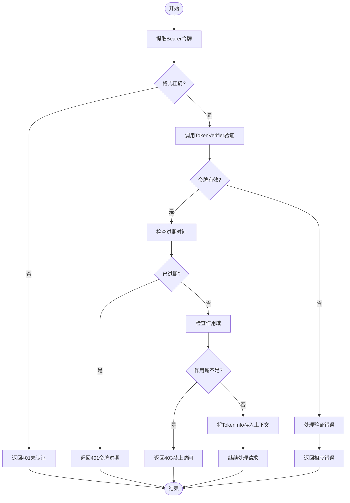
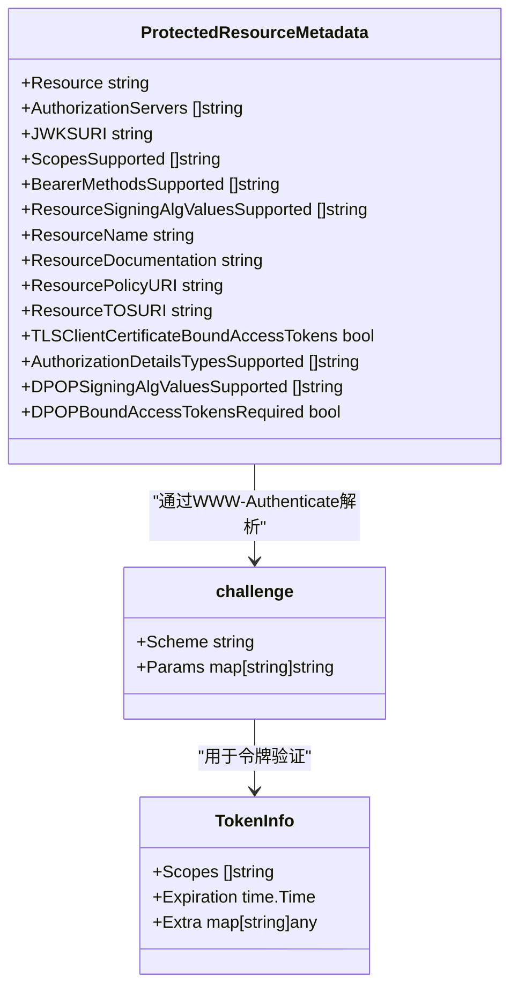

# 认证错误

<cite>
**本文档中引用的文件**   
- [auth.go](file://auth/auth.go)
- [oauthex.go](file://oauthex/oauthex.go)
- [resource_meta.go](file://oauthex/resource_meta.go)
- [dcr.go](file://oauthex/dcr.go)
- [conformance_test.go](file://mcp/conformance_test.go)
- [main.go](file://examples/server/auth-middleware/main.go)
</cite>

## 目录
1. [介绍](#介绍)
2. [Bearer Token验证失败](#bearer-token验证失败)
3. [JWT签名错误](#jwt签名错误)
4. [作用域缺失](#作用域缺失)
5. [OAuth 2.0元数据配置不当](#oauth-20元数据配置不当)
6. [auth.RequireBearerToken中间件工作流程](#authrequirebearertoken中间件工作流程)
7. [TokenInfo上下文传递](#tokeninfo上下文传递)
8. [受保护资源元数据验证](#受保护资源元数据验证)
9. [动态客户端注册验证](#动态客户端注册验证)
10. [JWT令牌生成与解析](#jwt令牌生成与解析)
11. [调试日志启用](#调试日志启用)
12. [自定义TokenVerifier](#自定义tokenverifier)
13. [MCP消息交互测试](#mcp消息交互测试)

## 介绍
本指南旨在为Go MCP SDK中的认证系统提供全面的错误排查方案。文档涵盖了从Bearer Token验证到OAuth 2.0元数据配置的各种常见问题，并详细解释了认证中间件的工作机制。通过分析`auth`和`oauthex`包的实现，我们将指导开发者如何正确处理认证错误、验证令牌信息以及配置受保护资源。本指南还包含了JWT令牌处理的最佳实践和测试策略，帮助开发者构建安全可靠的MCP服务。

## Bearer Token验证失败
Bearer Token验证失败通常由以下几种情况引起：请求头格式不正确、令牌缺失或无效、令牌过期以及作用域不足。当客户端发送的Authorization头不符合`Bearer <token>`格式时，系统会返回401未认证错误。令牌验证过程由`TokenVerifier`函数执行，如果验证失败，会根据错误类型返回相应的HTTP状态码。例如，无效令牌返回401，OAuth协议错误返回400，其他错误返回500。令牌过期检查是验证过程的重要组成部分，系统会检查`TokenInfo`中的`Expiration`字段是否早于当前时间。

**Section sources**
- [auth.go](file://auth/auth.go#L81-L119)

## JWT签名错误
JWT签名错误发生在令牌的数字签名验证失败时。在`verifyJWT`函数实现中，首先检查JWT的签名方法是否为预期的HMAC算法，如果不是，则返回签名方法不匹配的错误。验证过程使用预共享密钥（如示例中的`jwtSecret`）来验证令牌的完整性。如果签名验证失败，`jwt.ParseWithClaims`函数会返回错误，此时应返回`ErrInvalidToken`错误。开发者需要确保客户端和服务器使用相同的密钥和签名算法，否则会导致签名验证失败。在生产环境中，建议使用环境变量存储密钥，并定期轮换以提高安全性。

**Section sources**
- [main.go](file://examples/server/auth-middleware/main.go#L74-L109)

## 作用域缺失
作用域缺失错误发生在客户端请求的操作需要特定权限，但提供的令牌不包含相应作用域时。`RequireBearerToken`中间件会检查`RequireBearerTokenOptions`中的`Scopes`字段，如果指定了必需的作用域，则会验证令牌的`TokenInfo.Scopes`是否包含所有必需的作用域。此检查使用`strings.Contains`函数进行，虽然时间复杂度为O(n²)，但由于作用域数量通常很小，性能影响可以忽略。如果缺少任何必需作用域，中间件会返回403禁止访问错误。开发者应确保在注册MCP工具时正确声明所需作用域，并在客户端请求时提供包含所有必需作用域的令牌。

**Section sources**
- [auth.go](file://auth/auth.go#L102-L119)

## OAuth 2.0元数据配置不当
OAuth 2.0元数据配置不当可能导致客户端无法正确发现认证服务。受保护资源元数据（Protected Resource Metadata）遵循RFC 9728规范，通过`.well-known/oauth-protected-resource`端点提供。如果元数据URL配置错误，客户端将无法获取必要的认证信息。`GetProtectedResourceMetadataFromID`函数负责从资源ID构建元数据URL，它会在资源ID的主机名后插入默认的well-known路径。元数据验证包括检查`Resource`字段是否与请求的服务器URL匹配，以及验证授权服务器URL的HTTPS协议。动态客户端注册元数据遵循RFC 8414规范，包含重定向URI、认证方法等关键信息。

**Section sources**
- [oauthex.go](file://oauthex/oauthex.go#L14-L91)
- [resource_meta.go](file://oauthex/resource_meta.go#L40-L50)

## auth.RequireBearerToken中间件工作流程
`auth.RequireBearerToken`中间件是MCP服务器认证的核心组件，它实现了标准的Bearer Token认证流程。该中间件接收一个`TokenVerifier`函数和`RequireBearerTokenOptions`选项作为参数，返回一个包装了HTTP处理器的函数。工作流程如下：首先从请求头中提取Authorization头，验证其格式是否为`Bearer <token>`；然后调用`TokenVerifier`函数验证令牌并获取`TokenInfo`；接着检查令牌是否过期和是否包含必需的作用域；最后将`TokenInfo`存储在请求上下文中并继续处理请求。如果任何步骤失败，中间件会返回相应的HTTP错误，并在必要时设置WWW-Authenticate头以支持受保护资源元数据。

**Diagram sources **
- [auth.go](file://auth/auth.go#L60-L79)

**Section sources**
- [auth.go](file://auth/auth.go#L60-L79)

## TokenInfo上下文传递
`TokenInfo`通过Go语言的`context`包在请求处理链中传递。`RequireBearerToken`中间件在验证成功后，使用`context.WithValue`将`TokenInfo`实例存储在请求上下文中，使用的键为私有的`tokenInfoKey{}`类型以避免命名冲突。后续的HTTP处理器可以通过`TokenInfoFromContext`函数从上下文中提取`TokenInfo`。在MCP工具处理器中，`TokenInfo`也可以通过`req.Extra.TokenInfo`访问，其中`req`是`CallToolRequest`等请求对象。这种双重传递机制确保了认证信息可以在不同层次的处理器中被访问，同时保持了类型安全和封装性。

**Section sources**
- [auth.go](file://auth/auth.go#L50-L58)
- [protocol.src.md](file://internal/docs/protocol.src.md#L164-L181)

## 受保护资源元数据验证
受保护资源元数据验证是确保客户端与服务器正确交互的关键步骤。`GetProtectedResourceMetadataFromHeader`函数从WWW-Authenticate头中解析元数据URL，然后获取并验证元数据。验证过程包括：检查元数据URL是否使用HTTPS协议、验证返回的`Resource`字段是否与请求的服务器URL匹配、检查授权服务器URL的安全性以防止XSS攻击。元数据解析涉及复杂的头部分析，`ParseWWWAuthenticate`函数需要正确处理包含引号字符串中的逗号分隔符。`ProtectedResourceMetadata`结构体包含了资源标识、支持的作用域、JWKS URI等重要信息，这些信息用于指导客户端如何与受保护资源交互。

**Diagram sources **
- [oauthex.go](file://oauthex/oauthex.go#L14-L91)
- [resource_meta.go](file://oauthex/resource_meta.go#L59-L74)

**Section sources**
- [resource_meta.go](file://oauthex/resource_meta.go#L59-L74)

## 动态客户端注册验证
动态客户端注册（DCR）遵循RFC 7591规范，允许客户端在运行时向授权服务器注册。`RegisterClient`函数执行DCR流程，它向指定的注册端点发送POST请求，包含客户端元数据如重定向URI、认证方法和授权类型。注册响应包含客户端ID和可选的客户端密钥，这些信息用于后续的OAuth 2.0流程。验证过程包括：确保注册端点URL不为空、正确序列化客户端元数据为JSON、处理HTTP响应状态码（201表示成功，400表示错误）。错误响应遵循RFC 7591的错误格式，包含错误代码和描述。`ClientRegistrationMetadata`结构体定义了所有支持的注册参数，开发者应根据安全需求选择合适的配置。

**Section sources**
- [dcr.go](file://oauthex/dcr.go#L15-L223)

## JWT令牌生成与解析
JWT令牌生成与解析是认证系统的核心功能。生成JWT时，需要设置标准声明如`exp`（过期时间）、`iat`（签发时间）和`nbf`（生效时间），以及自定义声明如用户ID和作用域。示例代码使用HMAC-SHA256算法签名，生产环境应考虑使用更安全的RSA或ECDSA算法。解析JWT时，必须验证签名算法与预期一致，检查令牌是否有效，并提取声明信息。常见格式错误包括：过期时间设置不当（如过去时间或过长有效期）、签发者（iss）与预期不匹配、缺少必需声明。`verifyJWT`函数展示了完整的验证流程，包括算法检查、密钥验证和声明提取。

**Section sources**
- [main.go](file://examples/server/auth-middleware/main.go#L74-L109)

## 调试日志启用
启用调试日志是排查认证问题的重要手段。通过配置`ServerOptions`中的日志级别，可以控制服务器向客户端发送的日志消息。`LoggingHandler`实现了`slog.Handler`接口，允许使用标准的`log/slog`包进行日志记录。日志消息通过`LoggingMessage`通知发送到客户端，客户端可以通过`SetLoggingLevel`方法设置接收日志的最低级别。`NewLoggingHandler`函数创建一个与`ServerSession`关联的日志处理器，支持速率限制以防止日志洪水。在开发环境中，建议将日志级别设置为"debug"以获取详细的认证流程信息，而在生产环境中应使用"warning"或更高级别以减少性能开销。

**Section sources**
- [logging.go](file://mcp/logging.go#L0-L167)

## 自定义TokenVerifier
自定义`TokenVerifier`是实现特定认证逻辑的关键。`TokenVerifier`是一个函数类型，接收上下文、令牌字符串和HTTP请求作为参数，返回`TokenInfo`和错误。开发者可以实现自己的验证逻辑，如查询数据库验证API密钥、调用远程OAuth服务器验证JWT或实现自定义的令牌格式。验证函数必须正确处理错误，使用`ErrInvalidToken`表示无效令牌，`ErrOAuth`表示OAuth协议错误。示例中的`verifyAPIKey`函数展示了如何验证API密钥并返回相应的`TokenInfo`。自定义验证器可以集成各种认证机制，为MCP服务器提供灵活的认证支持。

**Section sources**
- [main.go](file://examples/server/auth-middleware/main.go#L144-L162)

## MCP消息交互测试
使用`conformance_test.go`中的测试策略可以验证认证相关的MCP消息交互。测试使用`txtar`格式存储期望的JSON-RPC消息序列，通过`TestServerConformance`函数验证服务器行为是否符合预期。测试框架创建内存传输通道，将合成客户端消息发送到真实服务器，并验证返回的消息是否匹配期望。`runServerTest`函数处理测试执行，包括服务器配置、消息交换和结果比较。测试可以验证各种认证场景，如无效令牌、作用域不足和元数据请求。通过运行`go test -update`可以更新期望的测试数据，确保测试与实现保持同步。这种基于消息级别的测试确保了SDK与其他MCP实现的互操作性。

**Section sources**
- [conformance_test.go](file://mcp/conformance_test.go#L0-L407)