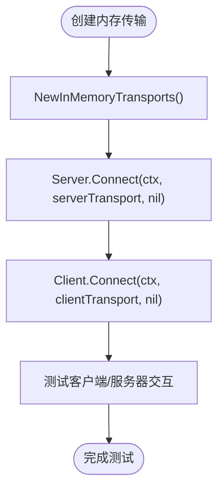
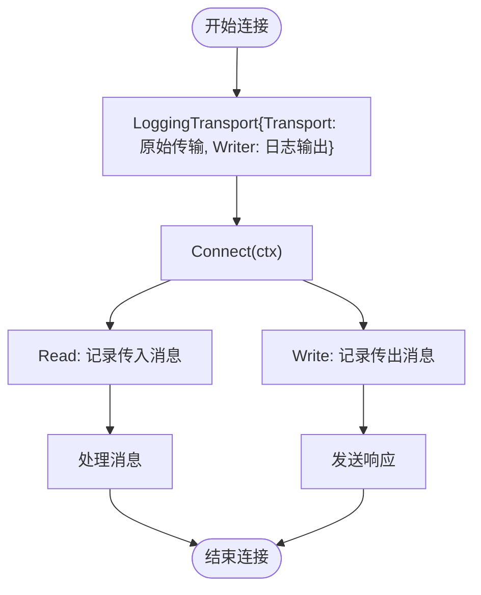
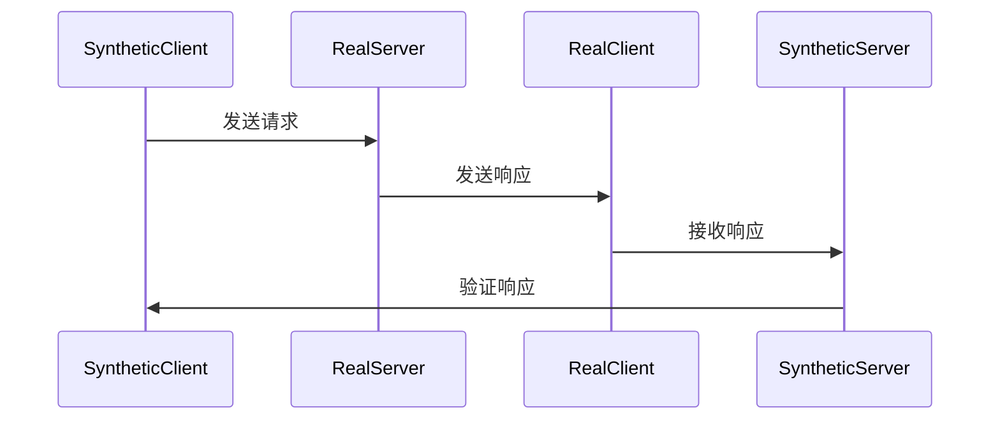

# 连接失败

<cite>
**本文档中引用的文件**  
- [mcp/conformance_test.go](file://mcp/conformance_test.go)
- [mcp/transport.go](file://mcp/transport.go)
- [mcp/client.go](file://mcp/client.go)
- [mcp/server.go](file://mcp/server.go)
- [mcp/logging.go](file://mcp/logging.go)
</cite>

## 目录
1. [简介](#简介)
2. [连接机制与传输模式](#连接机制与传输模式)
3. [常见连接问题诊断](#常见连接问题诊断)
4. [使用 NewInMemoryTransports 进行测试](#使用-newinmemorytransports-进行测试)
5. [日志与通信流量捕获](#日志与通信流量捕获)
6. [io.ErrClosedPipe 错误处理](#ioerrclosedpipe-错误处理)
7. [合成客户端/服务器构建](#合成客户端服务器构建)
8. [网络与权限检查清单](#网络与权限检查清单)
9. [调试代码片段](#调试代码片段)
10. [结论](#结论)

## 简介
本文档旨在为使用 Go SDK 时出现的连接问题提供详细的故障排除指南。重点解决传输层配置错误，涵盖 Stdio 和 HTTP/SSE 传输模式的常见陷阱。基于代码库，展示如何正确使用 `NewInMemoryTransports` 和 `Connect` 方法建立连接，并指出 `net.Pipe` 关闭导致的 `io.ErrClosedPipe` 错误处理。通过 `conformance_test.go` 中的测试模式，说明如何构建合成客户端/服务器来隔离问题。同时提供防火墙、权限设置和跨平台路径问题的检查清单，并包含可复用的调试代码片段。

## 连接机制与传输模式
Go SDK 提供了多种传输模式来实现客户端与服务器之间的通信。每种模式通过实现 `Transport` 接口的 `Connect` 方法建立连接。主要传输模式包括：

- **StdioTransport**：通过标准输入/输出进行通信，使用换行分隔的 JSON 格式。
- **IOTransport**：通过独立的 `io.ReadCloser` 和 `io.WriteCloser` 进行通信。
- **InMemoryTransport**：在内存中通过网络连接进行通信，用于测试。
- **SSEServerTransport** 和 **SSEClientTransport**：通过服务器发送事件（SSE）协议进行通信。
- **LoggingTransport**：包装其他传输，将 RPC 日志写入 `io.Writer`。

这些传输模式在 `mcp/transport.go` 文件中定义，确保了连接的灵活性和可扩展性。

**Section sources**
- [mcp/transport.go](file://mcp/transport.go#L35-L93)

## 常见连接问题诊断
连接问题通常源于传输层配置错误或网络问题。以下是几种常见问题及其诊断方法：

1. **握手失败**：检查客户端和服务器的协议版本是否兼容。`InitializeParams` 和 `InitializeResult` 消息中的 `ProtocolVersion` 字段必须匹配。
2. **消息帧损坏**：确保传输层正确处理换行分隔的 JSON 消息。使用 `LoggingTransport` 捕获底层通信流量，检查消息格式。
3. **流提前关闭**：确认连接未被意外关闭。`net.Pipe` 的关闭会导致 `io.ErrClosedPipe` 错误，需在代码中妥善处理。

通过分析 `conformance_test.go` 中的测试用例，可以验证客户端和服务器的 JSON 级别兼容性，确保能够处理其他 SDK 的输入或输出。

**Section sources**
- [mcp/conformance_test.go](file://mcp/conformance_test.go#L1-L407)
- [mcp/transport.go](file://mcp/transport.go#L110-L137)

## 使用 NewInMemoryTransports 进行测试
`NewInMemoryTransports` 函数返回两个相互连接的 `InMemoryTransport` 对象，用于在内存中测试客户端和服务器的交互。此方法避免了网络依赖，简化了测试过程。



**Diagram sources**
- [mcp/transport.go](file://mcp/transport.go#L134-L137)
- [mcp/conformance_test.go](file://mcp/conformance_test.go#L280-L285)

## 日志与通信流量捕获
`LoggingTransport` 是诊断连接问题的强大工具。它包装其他传输，将 RPC 日志写入指定的 `io.Writer`，帮助识别握手失败、消息帧损坏或流提前关闭等问题。



**Diagram sources**
- [mcp/transport.go](file://mcp/transport.go#L235-L241)
- [mcp/logging.go](file://mcp/logging.go#L1-L207)

## io.ErrClosedPipe 错误处理
当 `net.Pipe` 被关闭时，读取操作会返回 `io.ErrClosedPipe` 错误。在 `conformance_test.go` 中，此错误被特别处理，以避免测试失败。

```go
nextResponse := func() (*jsonrpc.Response, error, bool) {
    for {
        msg, err := cStream.Read(ctx)
        if err != nil {
            if errors.Is(err, io.ErrClosedPipe) {
                err = nil
            }
            return nil, err, false
        }
        // 处理消息
    }
}
```

**Section sources**
- [mcp/conformance_test.go](file://mcp/conformance_test.go#L260-L265)

## 合成客户端/服务器构建
`conformance_test.go` 中的 `runServerTest` 函数展示了如何构建合成客户端/服务器来隔离问题。通过创建内存传输和连接，可以模拟客户端和服务器的交互，验证功能的正确性。



**Diagram sources**
- [mcp/conformance_test.go](file://mcp/conformance_test.go#L150-L160)

## 网络与权限检查清单
在部署和运行 Go SDK 时，需检查以下网络和权限问题：

- **防火墙设置**：确保客户端和服务器之间的端口开放。
- **权限设置**：检查文件和目录的读写权限，特别是使用 `fileResourceHandler` 时。
- **跨平台路径问题**：使用 `filepath.Abs` 和 `filepath.Join` 处理路径，避免路径遍历攻击。

**Section sources**
- [mcp/server.go](file://mcp/server.go#L800-L853)

## 调试代码片段
以下代码片段可用于调试连接问题：

```go
// 使用 LoggingTransport 捕获日志
logWriter := &bytes.Buffer{}
loggingTransport := &mcp.LoggingTransport{
    Transport: originalTransport,
    Writer:    logWriter,
}

// 连接并捕获日志
conn, err := loggingTransport.Connect(ctx)
if err != nil {
    log.Printf("连接失败: %v", err)
    return
}
defer conn.Close()

// 打印日志
log.Printf("通信日志:\n%s", logWriter.String())
```

**Section sources**
- [mcp/transport.go](file://mcp/transport.go#L235-L241)
- [mcp/logging.go](file://mcp/logging.go#L1-L207)

## 结论
通过本文档提供的指南，开发者可以有效地诊断和解决使用 Go SDK 时的连接问题。利用 `NewInMemoryTransports` 进行测试，使用 `LoggingTransport` 捕获通信流量，并妥善处理 `io.ErrClosedPipe` 错误，可以显著提高开发效率和系统稳定性。结合 `conformance_test.go` 中的测试模式，构建合成客户端/服务器，进一步确保系统的兼容性和可靠性。