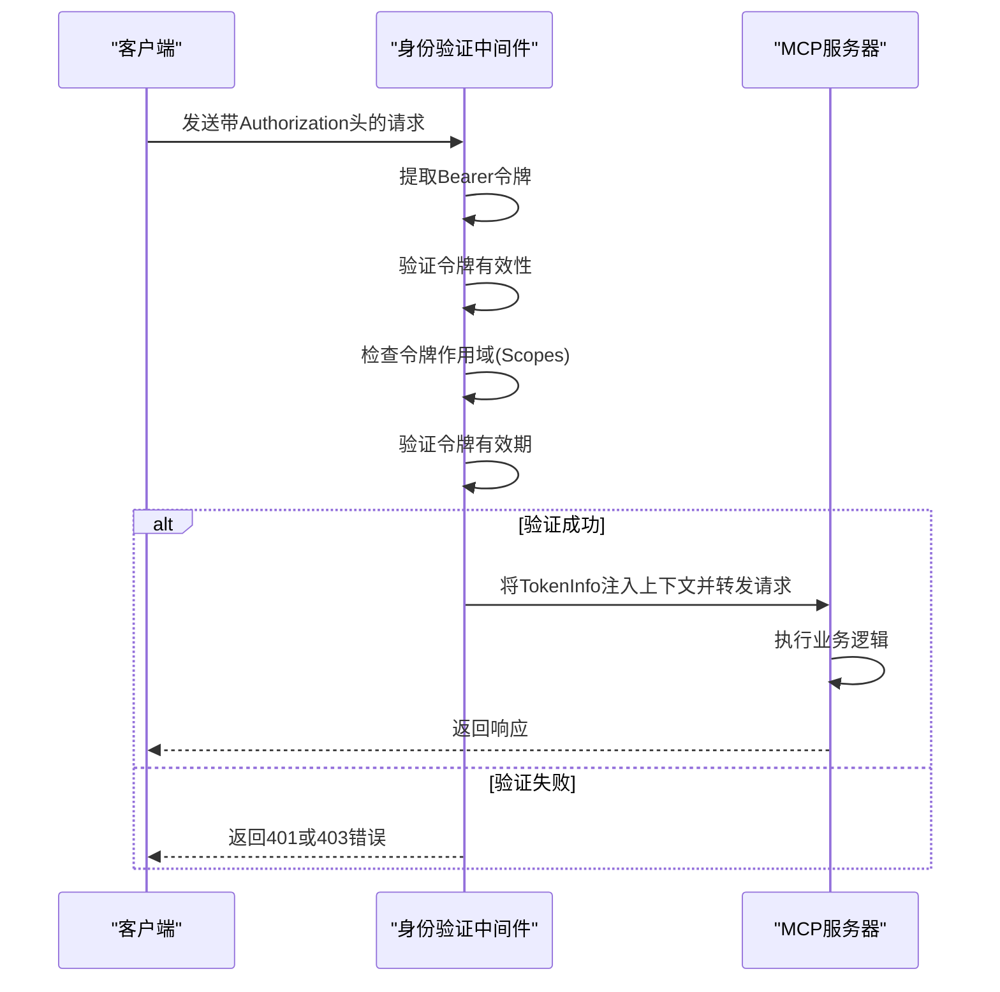
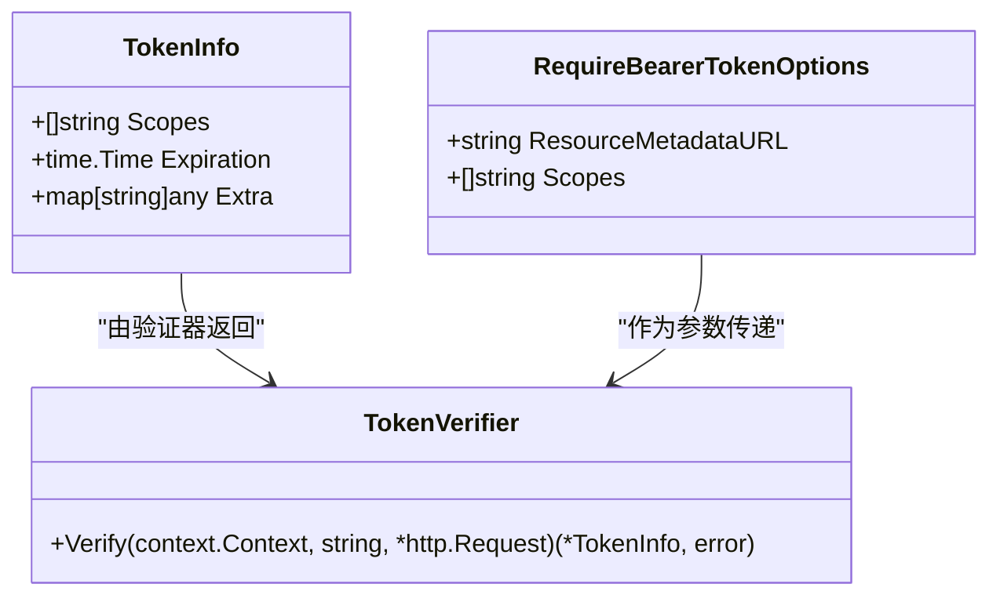
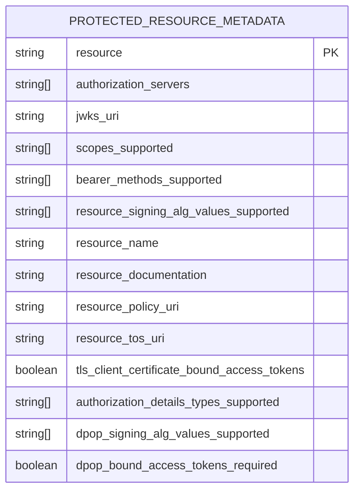
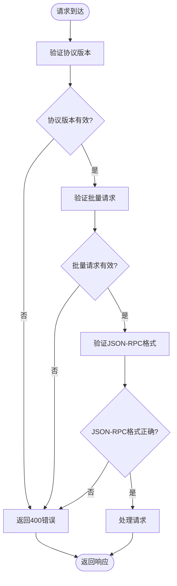
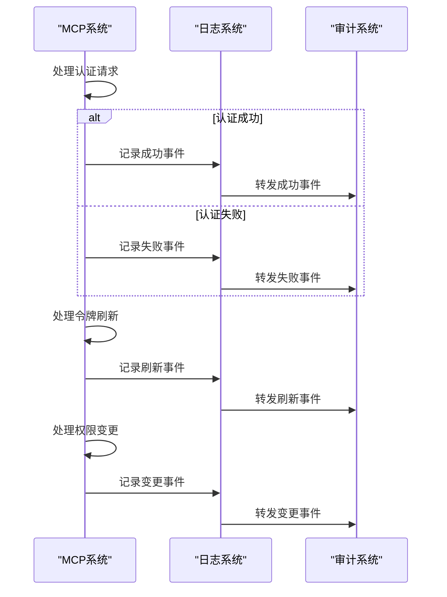

# 安全加固

<cite>
**本文档引用的文件**
- [auth.go](file://auth/auth.go)
- [oauthex.go](file://oauthex/oauthex.go)
- [main.go](file://examples/server/auth-middleware/main.go)
- [troubleshooting.src.md](file://internal/docs/troubleshooting.src.md)
- [server.go](file://mcp/server.go)
</cite>

## 目录
1. [简介](#简介)
2. [强身份验证机制](#强身份验证机制)
3. [令牌管理与刷新](#令牌管理与刷新)
4. [访问控制策略](#访问控制策略)
5. [OAuth 2.0安全集成](#oauth-20安全集成)
6. [输入验证与防御性编程](#输入验证与防御性编程)
7. [安全配置示例](#安全配置示例)
8. [认证流程审计](#认证流程审计)

## 简介
本文档系统性地描述了MCP SDK在生产环境中的安全最佳实践。重点包括使用`auth.RequireBearerToken`中间件实现强身份验证、令牌有效期管理与刷新机制、防止工具滥用的访问控制策略（如速率限制、权限分级）、OAuth 2.0扩展的安全集成（基于oauthex包处理受保护资源）。结合`troubleshooting.src.md`中提到的协议解释差异问题，强调输入验证和防御性编程的重要性。提供安全配置示例，如启用HTTPS、设置安全头部、防范重放攻击，并说明如何审计认证流程以满足合规要求。

## 强身份验证机制

MCP SDK通过`auth.RequireBearerToken`中间件实现强身份验证机制。该中间件验证Bearer令牌的有效性，并将验证后的令牌信息注入请求上下文。中间件支持JWT令牌和API密钥等多种身份验证方式。



**Diagram sources**
- [auth.go](file://auth/auth.go#L60-L79)
- [main.go](file://examples/server/auth-middleware/main.go#L100-L150)

**Section sources**
- [auth.go](file://auth/auth.go#L60-L79)
- [main.go](file://examples/server/auth-middleware/main.go#L100-L150)

## 令牌管理与刷新

令牌管理是安全架构的核心组成部分。MCP SDK要求所有令牌都必须包含有效期信息，并在验证过程中检查令牌是否已过期。`TokenInfo`结构体包含`Expiration`字段，用于存储令牌的过期时间。



**Diagram sources**
- [auth.go](file://auth/auth.go#L16-L21)
- [auth.go](file://auth/auth.go#L38-L40)

**Section sources**
- [auth.go](file://auth/auth.go#L16-L21)
- [auth.go](file://auth/auth.go#L38-L40)

## 访问控制策略

MCP SDK提供了多种访问控制策略来防止工具滥用。通过`RequireBearerTokenOptions`中的`Scopes`字段实现权限分级，确保用户只能访问其权限范围内的资源。同时，通过速率限制中间件控制请求频率。

```go
// 示例：创建速率限制中间件
func GlobalRateLimiterMiddleware(limiter *rate.Limiter) mcp.Middleware {
	return func(next mcp.MethodHandler) mcp.MethodHandler {
		return func(ctx context.Context, method string, req mcp.Request) (mcp.Result, error) {
			if !limiter.Allow() {
				return nil, errors.New("JSON RPC overloaded")
			}
			return next(ctx, method, req)
		}
	}
}
```

**Section sources**
- [main.go](file://examples/server/rate-limiting/main.go#L10-L30)
- [main.go](file://examples/server/auth-middleware/main.go#L200-L250)

## OAuth 2.0安全集成

MCP SDK通过`oauthex`包实现OAuth 2.0扩展的安全集成。`ProtectedResourceMetadata`结构体定义了受保护资源的元数据，包括资源标识符、授权服务器列表、JWKS URI等安全相关信息。



**Diagram sources**
- [oauthex.go](file://oauthex/oauthex.go#L14-L90)

**Section sources**
- [oauthex.go](file://oauthex/oauthex.go#L14-L90)

## 输入验证与防御性编程

基于`troubleshooting.src.md`中提到的协议解释差异问题，输入验证和防御性编程至关重要。MCP SDK在多个层面实施输入验证，包括JSON-RPC消息格式验证、MCP协议版本验证和批量请求验证。



**Diagram sources**
- [transport.go](file://mcp/transport.go#L400-L450)
- [troubleshooting.src.md](file://internal/docs/troubleshooting.src.md#L0-L42)

**Section sources**
- [transport.go](file://mcp/transport.go#L400-L450)
- [troubleshooting.src.md](file://internal/docs/troubleshooting.src.md#L0-L42)

## 安全配置示例

生产环境中的安全配置至关重要。建议启用HTTPS、设置安全头部、配置适当的令牌有效期，并使用环境变量存储敏感信息。

```go
// 安全配置示例
func setupSecureServer() {
	// 使用环境变量存储JWT密钥
	jwtSecret := os.Getenv("JWT_SECRET")
	if jwtSecret == "" {
		log.Fatal("JWT_SECRET environment variable is required")
	}
	
	// 配置安全的HTTP服务器
	server := &http.Server{
		Addr:         ":443",
		TLSConfig:    &tls.Config{MinVersion: tls.VersionTLS12},
		ReadTimeout:  30 * time.Second,
		WriteTimeout: 30 * time.Second,
	}
	
	// 设置安全头部
	http.Handle("/", secureMiddleware(http.DefaultServeMux))
	
	// 启动HTTPS服务器
	log.Fatal(server.ListenAndServeTLS("cert.pem", "key.pem"))
}
```

**Section sources**
- [main.go](file://examples/server/auth-middleware/main.go#L50-L80)
- [server.go](file://mcp/server.go#L100-L150)

## 认证流程审计

为了满足合规要求，需要对认证流程进行审计。MCP SDK提供了日志记录功能，可以记录所有认证相关的操作，包括成功和失败的认证尝试、令牌刷新和权限变更。



**Diagram sources**
- [server.go](file://mcp/server.go#L500-L550)
- [auth.go](file://auth/auth.go#L100-L120)

**Section sources**
- [server.go](file://mcp/server.go#L500-L550)
- [auth.go](file://auth/auth.go#L100-L120)