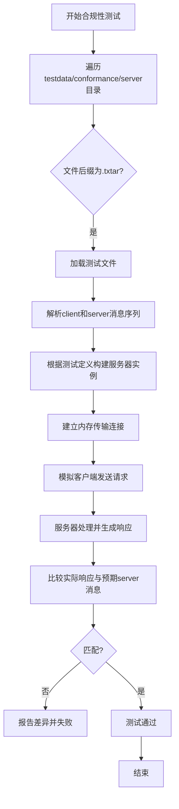
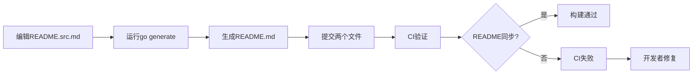

# 开发流程与协作规范

<cite>
**本文档引用的文件**  
- [CONTRIBUTING.md](file://CONTRIBUTING.md)
- [mcp/conformance_test.go](file://mcp/conformance_test.go)
- [internal/readme/README.src.md](file://internal/readme/README.src.md)
- [mcp/server.go](file://mcp/server.go)
- [mcp/client.go](file://mcp/client.go)
- [go.mod](file://go.mod)
</cite>

## 目录
1. [引言](#引言)  
2. [代码风格与提交规范](#代码风格与提交规范)  
3. [自动化测试与合规性验证](#自动化测试与合规性验证)  
4. [多模块开发与本地依赖测试](#多模块开发与本地依赖测试)  
5. [文档维护与同步机制](#文档维护与同步机制)  
6. [CI/CD流水线与API版本控制](#cicd流水线与api版本控制)  
7. [结论](#结论)

## 引言

本规范旨在为Go MCP SDK项目建立生产级开发协作标准。通过明确代码风格、测试要求、多模块开发流程、文档维护机制以及CI/CD集成策略，确保团队协作高效、代码质量可靠、文档与代码一致，并保障API的向后兼容性与平滑升级。

**本文档引用的文件**  
- [CONTRIBUTING.md](file://CONTRIBUTING.md#L0-L292)

## 代码风格与提交规范

### 代码风格

所有Go源码必须遵循[Google Go风格指南](https://google.github.io/styleguide/go/)。该指南涵盖了命名约定、格式化、注释、错误处理等核心编码实践，确保代码库的统一性和可读性。

### 提交信息格式

提交信息（commit message）必须遵循[Go项目所采用的格式](https://go.dev/wiki/CommitMessage)。一个标准的提交信息应包含：
- **主题行（Subject Line）**：以动词开头，简洁描述变更内容，长度不超过72个字符。
- **正文（Body）**：详细解释变更的原因、实现方式以及影响。如果关联了GitHub Issue，应在此处引用（如`Fixes #123`）。

**本文档引用的文件**  
- [CONTRIBUTING.md](file://CONTRIBUTING.md#L180-L182)

## 自动化测试与合规性验证

### 测试执行

项目使用标准Go工具链进行测试。运行`go test ./...`命令可执行所有测试用例，确保代码变更不会引入回归问题。

### 合规性测试

`mcp/conformance_test.go`文件中的`TestServerConformance`函数是核心的合规性测试。它通过加载`testdata`目录下的`.txtar`格式测试文件，验证SDK在JSON层面是否符合MCP规范。



**Diagram sources**  
- [mcp/conformance_test.go](file://mcp/conformance_test.go#L25-L407)

**本文档引用的文件**  
- [mcp/conformance_test.go](file://mcp/conformance_test.go#L25-L407)

## 多模块开发与本地依赖测试

### go.work工作区

为了在开发SDK的同时测试其在其他模块中的使用情况，推荐使用`go.work`文件创建多模块工作区。此方法允许开发者在本地同时开发SDK和依赖它的项目，确保变更可立即验证。

#### 创建工作区

假设项目目录结构如下：
```
project_root/
├── project/          # 使用SDK的项目
└── go-sdk/           # Go MCP SDK
```

在`project_root`目录下执行以下命令初始化工作区：
```sh
go work init ./project ./go-sdk
```

此命令会创建一个`go.work`文件，将`project`和`go-sdk`两个模块纳入同一个工作区。此后，在`project`模块中对`go-sdk`的任何修改都会被直接使用，无需发布或替换`go.mod`中的依赖。

**本文档引用的文件**  
- [CONTRIBUTING.md](file://CONTRIBUTING.md#L32-L45)

## 文档维护与同步机制

### README维护流程

顶级`README.md`文件是自动生成的，**禁止直接编辑**。其源文件位于`internal/readme/README.src.md`。

#### 更新步骤

1.  编辑`internal/readme/README.src.md`文件。
2.  从仓库根目录运行`go generate ./internal/readme`命令，该命令会根据源文件重新生成`README.md`。
3.  将修改后的`README.src.md`和新生成的`README.md`一同提交。

CI系统会自动检查`README.md`是否为最新。如果发现不一致，CI将失败，并提示开发者执行上述生成步骤。



**Diagram sources**  
- [CONTRIBUTING.md](file://CONTRIBUTING.md#L145-L160)
- [internal/readme/README.src.md](file://internal/readme/README.src.md#L0-L68)

**本文档引用的文件**  
- [CONTRIBUTING.md](file://CONTRIBUTING.md#L145-L160)
- [internal/readme/README.src.md](file://internal/readme/README.src.md#L0-L68)

## CI/CD流水线与API版本控制

### CI/CD流水线

应建立CI/CD流水线，集成以下关键环节：
- **静态分析**：使用`golangci-lint`等工具检查代码质量、潜在错误和风格违规。
- **单元测试**：执行`go test ./...`，确保所有单元测试通过。
- **集成测试**：运行`conformance_test.go`等集成测试，验证SDK与MCP规范的兼容性。

流水线应在每次Pull Request提交时自动触发，确保所有变更都经过严格验证。

### API版本控制策略

#### 语义化版本

SDK的版本号遵循[语义化版本（SemVer）](https://semver.org/)规范：
- **主版本号（MAJOR）**：当进行不兼容的API变更时递增。
- **次版本号（MINOR）**：当以向后兼容的方式添加功能时递增。
- **修订号（PATCH）**：当进行向后兼容的问题修正时递增。

#### 废弃通知与向后兼容性

- **废弃（Deprecation）**：当需要移除或修改现有API时，必须先将其标记为“废弃”。应在文档和代码注释中明确说明废弃的API、替代方案以及计划移除的版本。
- **保障向后兼容性**：在主版本号不变的情况下，所有变更都必须保证向后兼容。这包括不修改现有API的行为、不删除功能、不改变数据结构的含义。
- **平滑升级**：通过清晰的版本发布说明、废弃策略和兼容性保证，确保用户能够平滑地从旧版本升级到新版本。

**本文档引用的文件**  
- [CONTRIBUTING.md](file://CONTRIBUTING.md#L100-L115)
- [go.mod](file://go.mod#L0-L12)

## 结论

本规范为Go MCP SDK的开发协作提供了全面的指导。通过严格执行Google Go代码风格、标准化的提交信息、全面的自动化测试（特别是`conformance_test.go`）、利用`go.work`进行本地验证、维护`README.src.md`以确保文档同步，以及建立集成静态分析和测试的CI/CD流水线，团队能够高效协作，持续交付高质量、稳定且符合规范的SDK。同时，严格的语义化版本控制和向后兼容性承诺，将保障用户升级体验的平滑性。