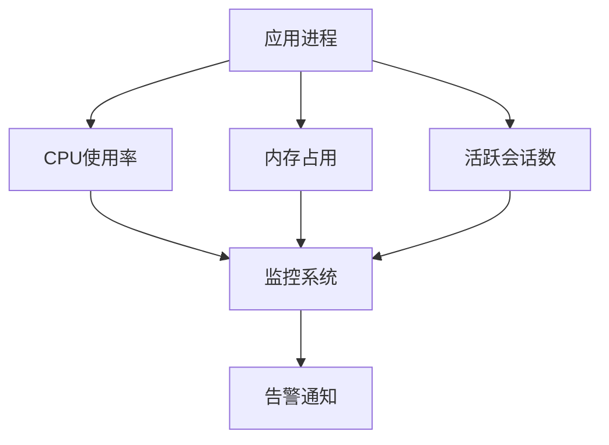
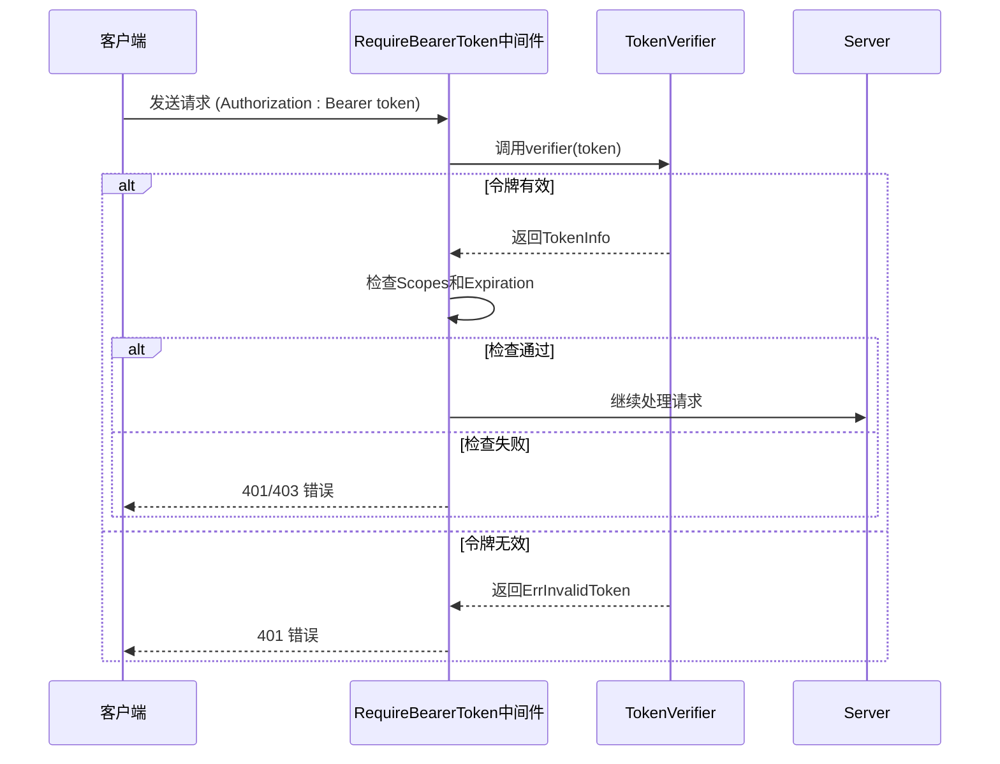
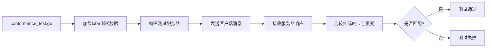

# 生产环境最佳实践

<cite>
**本文档引用的文件**   
- [auth.go](file://auth/auth.go)
- [client.go](file://mcp/client.go)
- [server.go](file://mcp/server.go)
- [conformance_test.go](file://mcp/conformance_test.go)
- [logging.go](file://mcp/logging.go)
- [transport.go](file://mcp/transport.go)
- [CONTRIBUTING.md](file://CONTRIBUTING.md)
</cite>

## 目录
1. [引言](#引言)
2. [资源监控](#资源监控)
3. [错误恢复机制](#错误恢复机制)
4. [安全加固](#安全加固)
5. [版本升级策略](#版本升级策略)
6. [测试实践](#测试实践)
7. [开发规范](#开发规范)
8. [配置示例](#配置示例)
9. [结论](#结论)

## 引言
本文档旨在为在生产环境中部署和运维MCP SDK提供一套全面的最佳实践指南。文档涵盖了从资源监控、错误恢复、安全加固到版本升级和测试实践的各个方面，旨在帮助团队构建稳定、安全、可维护的MCP服务。通过遵循这些实践，可以确保SDK的高质量、高可靠性和团队协作的高效性。

## 资源监控
在生产环境中，对MCP SDK的资源使用情况进行持续监控是确保服务稳定性的关键。主要监控指标包括CPU使用率、内存占用和连接数。

**CPU与内存监控**：应使用系统级监控工具（如Prometheus、Grafana）来跟踪运行MCP服务的进程的CPU和内存消耗。异常的资源增长往往是内存泄漏或性能瓶颈的征兆。建议设置告警阈值，当资源使用率超过预设值时及时通知运维人员。

**连接数监控**：MCP SDK基于JSON-RPC 2.0协议，通过Transport进行通信。应监控活跃的客户端会话数量。`Server`结构体中的`sessions`字段（`[]*ServerSession`）维护了所有当前连接的会话。可以通过遍历`Server.Sessions()`迭代器来获取当前会话数，并将其作为监控指标上报。



**图表来源**
- [server.go](file://mcp/server.go#L47)

## 错误恢复机制
为了保证服务的高可用性，MCP SDK需要具备强大的错误恢复能力，主要包括重试策略、断线重连和会话持久化。

**重试策略与断线重连**：SDK内置了基于心跳（KeepAlive）的健康检查机制。在`ServerOptions`和`ClientOptions`中，可以通过设置`KeepAlive`字段来定义心跳间隔。当客户端或服务器在指定时间内未收到对方的`ping`响应时，会自动关闭连接。这有助于快速发现并处理网络故障。上层应用应在连接关闭后，根据业务逻辑实现重连逻辑。

**会话持久化**：MCP协议本身不强制要求会话状态的持久化。`ServerSession`和`ClientSession`的状态（如`state`字段）主要存储在内存中。对于需要持久化会话状态的场景（例如，长时间运行的推理任务），开发者需要自行设计持久化方案，例如将关键状态信息存储到数据库或Redis中。

**图表来源**
- [server.go](file://mcp/server.go#L40)
- [client.go](file://mcp/client.go#L24)

## 安全加固
安全是生产环境的重中之重。MCP SDK提供了多种机制来增强服务的安全性。

**使用RequireBearerToken中间件**：`auth`包中的`RequireBearerToken`函数提供了一个标准的Bearer Token认证中间件。它可以集成到HTTP服务器中，对每个请求进行身份验证。该中间件会检查`Authorization`头，调用用户提供的`TokenVerifier`函数来验证令牌的有效性，并将解析出的`TokenInfo`存入请求上下文。

**令牌有效期管理**：`TokenInfo`结构体包含了`Expiration`字段，用于存储令牌的过期时间。`RequireBearerToken`中间件会自动检查此字段，拒绝已过期的令牌。开发者应确保其`TokenVerifier`实现能够正确解析并返回令牌的过期时间。

**防止工具滥用**：通过`RequireBearerTokenOptions`，可以指定`Scopes`字段来限制访问特定工具所需的权限范围。中间件会检查令牌中的`Scopes`是否包含所有必需的权限，从而实现基于角色的访问控制（RBAC），有效防止未授权的工具调用。



**图表来源**
- [auth.go](file://auth/auth.go#L60)
- [auth.go](file://auth/auth.go#L10)

## 版本升级策略
平滑的版本升级对于维持服务的连续性至关重要。

**向后兼容性保证**：MCP协议版本在`Initialize`请求/响应中协商。服务器通过`negotiatedVersion`函数选择一个客户端和服务器都支持的最高协议版本。在升级SDK时，必须确保新版本能够处理旧版本的请求，避免破坏现有客户端。

**灰度发布**：建议采用灰度发布策略。首先将新版本部署到一小部分服务器节点，然后将少量流量路由到这些节点。通过监控新版本的性能和错误率，确认无误后再逐步扩大流量比例，直至全量发布。

**API废弃通知**：当需要废弃某个API或工具时，不应立即移除。正确的做法是：
1.  在文档中明确标记该API为“已废弃”。
2.  在服务器日志中记录对该API的调用，以便通知相关方。
3.  维持该API一段时间，给予客户端充分的迁移时间。
4.  最后，在确认无影响后，再从代码中移除。

## 测试实践
自动化测试是保证代码质量和功能正确性的基石。

**使用conformance_test.go进行合规性验证**：`mcp/conformance_test.go`文件是SDK合规性测试的核心。它通过加载`txtar`格式的测试数据，验证SDK在JSON层面的行为是否符合MCP规范。测试会模拟客户端和服务器的交互，比较实际发送和接收的消息序列与预期是否一致。这是确保SDK与其他MCP实现互操作性的关键。



**图表来源**
- [conformance_test.go](file://mcp/conformance_test.go#L0)

## 开发规范
遵循统一的开发规范可以显著提高代码质量和团队协作效率。

**代码风格与提交信息**：团队应遵循[Google Go风格指南](https://google.github.io/styleguide/go/)。提交信息应清晰、简洁，并遵循[Go项目提交信息格式](https://go.dev/wiki/CommitMessage)。例如，使用“feat:”、“fix:”、“docs:”等前缀来分类提交。

**README更新流程**：项目的`README.md`文件是自动生成的，不应直接编辑。需要修改时，应编辑`internal/readme/README.src.md`源文件，然后运行`go generate ./internal/readme`命令来重新生成`README.md`。CI系统会检查`README.md`是否与源文件同步。

**图表来源**
- [CONTRIBUTING.md](file://CONTRIBUTING.md#L0)

## 配置示例
以下是一些关键配置的最佳实践示例。

**设置合理的超时时间**：在创建HTTP客户端或服务器时，应设置合理的超时时间，防止请求无限期挂起。
```go
// 示例：在HTTP Transport中设置超时
httpTransport := &http.Transport{
    DialContext: (&net.Dialer{
        Timeout:   30 * time.Second,
        KeepAlive: 30 * time.Second,
    }).DialContext,
    TLSHandshakeTimeout:   10 * time.Second,
    ResponseHeaderTimeout: 10 * time.Second,
    ExpectContinueTimeout: 1 * time.Second,
}
```

**启用日志记录**：利用`mcp.NewLoggingHandler`将`slog`日志输出到MCP客户端，实现跨服务的日志追踪。
```go
// 示例：为ServerSession创建日志处理器
logger := slog.New(mcp.NewLoggingHandler(serverSession, nil))
logger.Info("Server started")
```

**使用go.work进行多模块开发**：当SDK需要与另一个使用它的项目同时开发时，推荐使用`go.work`工作区。
```bash
# 创建包含项目和SDK的工作区
go work init ./my-project ./go-sdk
```

**图表来源**
- [logging.go](file://mcp/logging.go#L132)
- [CONTRIBUTING.md](file://CONTRIBUTING.md#L27)

## 结论
通过实施上述最佳实践，可以在生产环境中构建一个健壮、安全、可维护的MCP服务。关键在于持续的监控、完善的错误恢复、严格的安全措施、谨慎的版本管理、全面的自动化测试以及团队对开发规范的共同遵守。透明的设计决策和公开的文档记录是支持项目长期可持续治理的基础。遵循这些指南，将有助于充分发挥MCP SDK的潜力，为用户提供稳定可靠的服务。