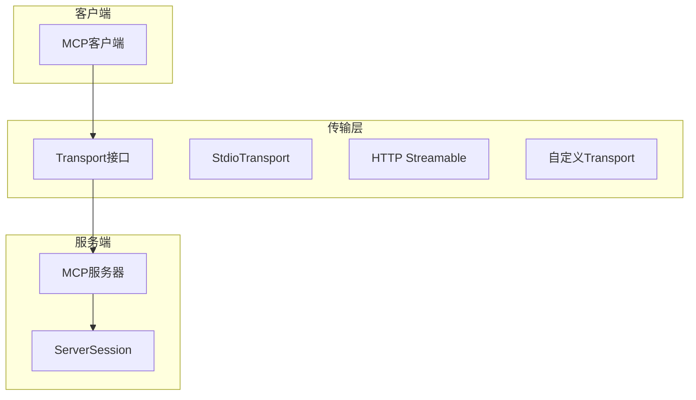
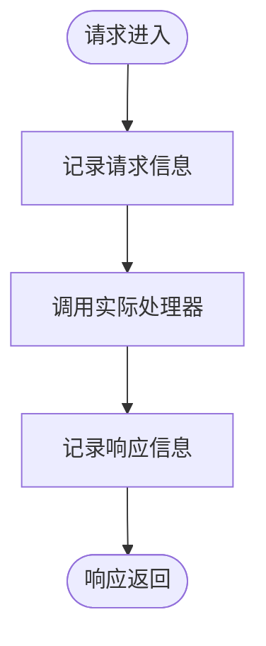

# 部署与监控

<cite>
**本文档中引用的文件**  
- [troubleshooting.src.md](file://internal/docs/troubleshooting.src.md)
- [logging.go](file://mcp/logging.go)
- [transport.go](file://mcp/transport.go)
- [logging_middleware.go](file://examples/http/logging_middleware.go)
- [custom-transport/main.go](file://examples/server/custom-transport/main.go)
</cite>

## 目录
1. [引言](#引言)  
2. [部署架构设计](#部署架构设计)  
3. [资源监控配置](#资源监控配置)  
4. [日志记录策略](#日志记录策略)  
5. [健康检查机制](#健康检查机制)  
6. [通信问题排查](#通信问题排查)  
7. [监控系统集成](#监控系统集成)  
8. [自动化部署与发布策略](#自动化部署与发布策略)  
9. [结论](#结论)

## 引言

在生产环境中部署MCP SDK需要综合考虑架构设计、资源监控、日志记录和健康检查等多个方面，以确保服务的高可用性和可维护性。本指南详细阐述了如何在实际生产环境中部署MCP SDK，并结合调试方法指导用户分析和解决通信问题。通过合理的监控配置和自动化流程，可以有效提升系统的稳定性和运维效率。

## 部署架构设计

MCP SDK支持多种部署方式，包括容器化部署和服务编排。推荐使用Docker等容器技术将MCP服务打包为镜像，并通过Kubernetes进行服务编排。这种架构能够实现服务的弹性伸缩和故障恢复。

对于传输层，MCP SDK提供了多种传输方式，包括基于标准输入输出（stdio）的传输和基于HTTP的流式传输（streamable）。`StdioTransport`结构体用于实现标准输入输出传输，而`IOTransport`则允许自定义读写器来构建更灵活的传输机制。此外，还可以通过实现`Transport`接口来自定义传输逻辑，如示例中的`custom-transport`展示了如何使用`bufio.Reader`和`io.Writer`构建自定义传输。



**Diagram sources**  
- [transport.go](file://mcp/transport.go#L88-L88)
- [transport.go](file://mcp/transport.go#L104-L107)
- [custom-transport/main.go](file://examples/server/custom-transport/main.go#L21-L24)

**Section sources**  
- [transport.go](file://mcp/transport.go#L31-L36)
- [custom-transport/main.go](file://examples/server/custom-transport/main.go#L21-L24)

## 资源监控配置

为了确保MCP服务的稳定性，必须对关键资源指标进行监控，包括CPU使用率、内存占用、连接数和请求延迟。这些指标可以通过Prometheus等主流监控系统进行采集和可视化。

在代码层面，`ServerSession`结构体负责管理会话状态，其中包含`conn`字段表示当前的JSON-RPC连接。通过定期采集该连接的状态信息，可以获得连接数和请求处理时间等关键指标。同时，`LoggingHandler`可以用于记录日志消息，结合速率限制选项`MinInterval`避免日志过载。

建议配置以下监控项：
- CPU使用率：超过80%时触发告警
- 内存使用：设置软硬限制，防止内存泄漏
- 连接数：监控并发连接数量，避免资源耗尽
- 请求延迟：P99延迟超过500ms时发出警告

**Section sources**  
- [server.go](file://mcp/server.go#L921-L931)
- [logging.go](file://mcp/logging.go#L109-L130)

## 日志记录策略

有效的日志记录是排查问题和分析系统行为的基础。MCP SDK提供了多种日志记录机制，包括使用`LoggingTransport`捕获MCP流量、HTTP中间件日志和结构化日志输出。

### 使用LoggingTransport捕获MCP流量

`LoggingTransport`是一种包装器，它可以将底层传输的日志写入指定的`io.Writer`。这对于调试stdio传输非常有用，可以将MCP通信内容记录到文件或标准错误输出中。

```go
transport := &mcp.LoggingTransport{
    Transport: underlyingTransport,
    Writer:    os.Stderr,
}
```

### HTTP中间件日志

对于HTTP传输，可以通过中间件记录请求和响应的详细信息。示例中的`loggingHandler`实现了基本的HTTP日志功能，记录请求时间、客户端地址、方法、路径、状态码和处理时长。



**Diagram sources**  
- [logging_middleware.go](file://examples/http/logging_middleware.go#L21-L51)

### 结构化日志输出

推荐使用结构化日志格式（如JSON），便于后续的日志分析和检索。`NewLoggingHandler`函数创建了一个基于`slog.JSONHandler`的日志处理器，自动去除重复的级别字段，并将日志数据以JSON格式发送。

**Section sources**  
- [transport.go](file://mcp/transport.go#L228-L231)
- [logging.go](file://mcp/logging.go#L109-L130)
- [logging_middleware.go](file://examples/http/logging_middleware.go#L21-L51)

## 健康检查机制

健康检查是保障服务可用性的关键环节。MCP SDK内置了`Ping`方法用于检测服务状态。客户端可以定期发送ping请求，验证服务器是否正常响应。

`ServerSession`的`Ping`方法实现如下：
```go
func (ss *ServerSession) Ping(ctx context.Context, params *PingParams) error {
    _, err := handleSend[*emptyResult](ctx, methodPing, newServerRequest(ss, orZero[Params](params)))
    return err
}
```

建议配置以下健康检查策略：
- 每30秒执行一次ping探测
- 连续3次失败后标记实例为不健康
- 自动隔离不健康实例并尝试重启

**Section sources**  
- [server.go](file://mcp/server.go#L978-L981)

## 通信问题排查

当遇到通信问题时，可以采用多种工具和技术进行排查。

### 使用MCP Inspector

[MCP Inspector](https://modelcontextprotocol.io/legacy/tools/inspector)是一个专门用于调试MCP服务器的工具。它可以帮助验证服务器是否符合TypeScript SDK的行为规范，并检查MCP流量是否正确。

### 使用Wireshark或tcpdump

对于HTTP传输（包括streamable和SSE），可以使用通用网络分析工具如[Wireshark](https://www.wireshark.org/)或[tcpdump](https://linux.die.net/man/8/tcpdump)来捕获和分析HTTP流量。这些工具能够显示完整的请求/响应报文，帮助定位协议层面的问题。

### 启用详细日志

通过配置`LoggingTransport`并将日志输出到缓冲区或文件，可以捕获完整的MCP通信内容。这在分析复杂问题时特别有用。

```go
var buf bytes.Buffer
transport := &mcp.LoggingTransport{
    Transport: baseTransport,
    Writer:    &buf,
}
```

**Section sources**  
- [troubleshooting.src.md](file://internal/docs/troubleshooting.src.md#L1-L42)

## 监控系统集成

### Prometheus集成

通过暴露HTTP端点提供Prometheus格式的指标数据。可以使用`prometheus.ClientGauge`等类型记录MCP相关的自定义指标，如会话数、请求速率等。

### Grafana可视化

将Prometheus作为数据源配置到Grafana中，创建仪表板展示关键指标：
- 实时连接数趋势图
- 请求延迟分布直方图
- 错误率监控面板
- 资源使用率概览

### 告警规则配置

在Prometheus中定义告警规则，例如：
```yaml
- alert: HighRequestLatency
  expr: histogram_quantile(0.99, sum(rate(mcp_request_duration_seconds_bucket[5m])) by (le)) > 0.5
  for: 10m
  labels:
    severity: warning
  annotations:
    summary: "MCP请求延迟过高"
```

**Section sources**  
- [transport.go](file://mcp/transport.go#L228-L231)
- [logging.go](file://mcp/logging.go#L109-L130)

## 自动化部署与发布策略

### 自动化部署流程

建立CI/CD流水线，实现从代码提交到生产部署的全自动化：
1. 代码提交触发单元测试和集成测试
2. 构建Docker镜像并推送到镜像仓库
3. 更新Kubernetes部署配置
4. 执行蓝绿发布或滚动更新

### 蓝绿发布策略

采用蓝绿发布确保服务高可用性：
- 维护两个完全相同的生产环境（蓝色和绿色）
- 新版本先部署到非活跃环境
- 经过验证后切换流量
- 观察新版本稳定性
- 如有问题立即回滚

此策略最大限度减少了发布过程中的停机时间和风险。

**Section sources**  
- [transport.go](file://mcp/transport.go#L31-L36)
- [server.go](file://mcp/server.go#L921-L931)

## 结论

成功部署MCP SDK需要全面考虑架构设计、监控配置、日志策略和发布流程。通过合理利用SDK提供的各种传输方式和日志机制，结合现代化的监控和运维工具，可以构建一个稳定可靠的生产环境。重点在于建立完善的监控体系和自动化流程，以便快速发现问题并及时响应。同时，充分利用MCP Inspector等专用调试工具，能够显著提高问题排查效率。