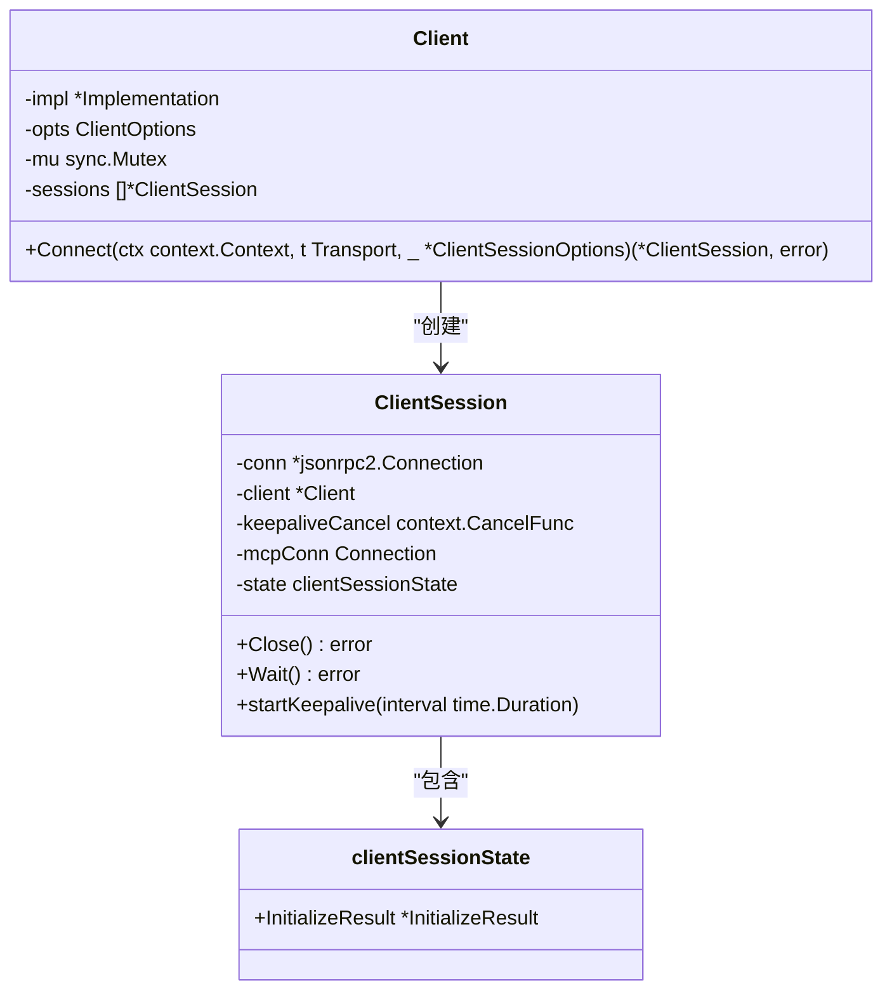
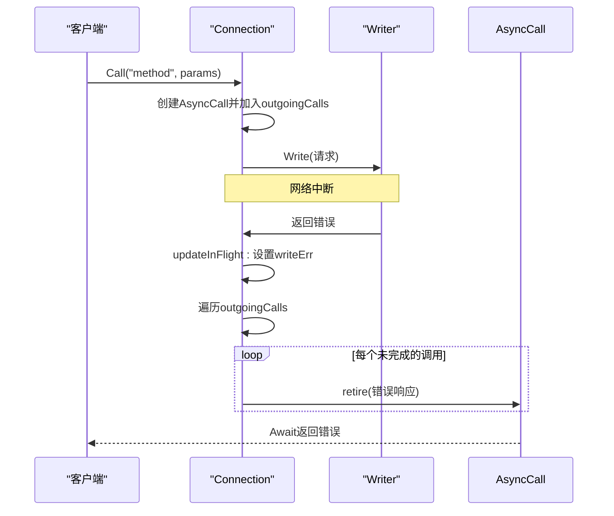

# 错误恢复与弹性

<cite>
**本文档引用的文件**
- [client.go](file://mcp/client.go)
- [server.go](file://mcp/server.go)
- [conn.go](file://internal/jsonrpc2/conn.go)
- [serve.go](file://internal/jsonrpc2/serve.go)
- [transport.go](file://mcp/transport.go)
- [session.go](file://mcp/session.go)
</cite>

## 目录
1. [引言](#引言)
2. [客户端断线重连与会话状态持久化](#客户端断线重连与会话状态持久化)
3. [重试策略与熔断器模式](#重试策略与熔断器模式)
4. [JSON-RPC连接异常处理](#json-rpc连接异常处理)
5. [服务器端优雅关闭流程](#服务器端优雅关闭流程)
6. [连接池与心跳检测](#连接池与心跳检测)
7. [高可用场景下的错误处理模式](#高可用场景下的错误处理模式)
8. [常见故障模式及应对方案](#常见故障模式及应对方案)
9. [结论](#结论)

## 引言
MCP SDK旨在提供一个健壮、可靠的模型上下文协议实现，其核心设计原则之一便是容错与弹性。在分布式系统中，网络波动、服务中断和资源竞争是常态。因此，SDK必须具备从各种故障中恢复的能力，并在异常情况下保持系统稳定。本文档深入探讨MCP SDK的容错与弹性设计，涵盖客户端断线重连、会话状态持久化、重试策略、JSON-RPC连接异常处理以及服务器端的优雅关闭等关键机制。通过分析`client.go`和`server.go`中的API，我们将展示如何配置超时、心跳检测和连接池以提升系统稳定性，并提供实际代码片段演示高可用场景下的错误处理模式。

## 客户端断线重连与会话状态持久化
MCP SDK的客户端设计支持在连接中断后自动或手动重连，确保服务的连续性。`Client`结构体是MCP客户端的核心，它通过`Connect`方法与服务器建立会话。一旦连接建立，`ClientSession`对象便代表了与服务器的逻辑连接。

会话状态的持久化是实现无缝重连的关键。`ClientSession`内部维护了一个`state`字段，该字段的类型为`clientSessionState`，其中包含了`InitializeResult`等初始化信息。当客户端与服务器建立连接时，会执行`initialize`握手流程，服务器返回的`InitializeResult`会被存储在`state`中。如果连接意外中断，新的`ClientSession`可以通过复用旧的`state`来快速恢复会话，而无需重新进行完整的握手流程，从而实现了会话状态的持久化。



**图源**
- [client.go](file://mcp/client.go#L22-L30)
- [client.go](file://mcp/client.go#L135-L170)

**本节源码**
- [client.go](file://mcp/client.go#L22-L30)
- [client.go](file://mcp/client.go#L135-L170)
- [session.go](file://mcp/session.go#L24-L29)

## 重试策略与熔断器模式
虽然SDK本身未直接实现指数退避或熔断器模式，但它为上层应用实现这些高级重试策略提供了坚实的基础。`Client`和`Server`的`Connect`方法都接受一个`context.Context`参数，这使得调用者可以轻松地集成外部重试库。

例如，调用者可以使用`context.WithTimeout`或`context.WithDeadline`来设置连接超时，防止无限期等待。对于更复杂的重试逻辑，如指数退避，开发者可以在调用`Connect`方法的外部循环中实现。每次连接失败后，根据失败次数计算退避时间，然后使用`time.Sleep`进行等待，再尝试重新连接。

熔断器模式同样可以在SDK之上实现。一个熔断器组件可以监控对`Connect`或`CallTool`等方法的调用成功率。当失败率超过预设阈值时，熔断器会“熔断”，直接拒绝后续请求，避免对已知故障的服务进行无谓的调用，从而保护系统资源。一段时间后，熔断器会进入“半开”状态，允许少量请求通过以探测服务是否已恢复。

## JSON-RPC连接异常处理
JSON-RPC连接的异常处理是SDK容错能力的核心，主要由`internal/jsonrpc2`包中的`conn.go`文件实现。`Connection`结构体是处理所有JSON-RPC消息的核心，它通过`readIncoming`和`write`方法分别处理读写操作。

当读取端发生错误（如网络中断）时，`readIncoming`循环会捕获错误并退出。此时，`Connection`的`updateInFlight`方法会被调用，将`readErr`设置为捕获到的错误（通常是`io.EOF`），并标记读取循环已停止。更重要的是，它会遍历所有待处理的`outgoingCalls`，为每个未完成的异步调用（`AsyncCall`）调用`retire`方法，并传入一个带有读取错误的响应。这确保了所有正在等待响应的调用都能立即收到一个错误通知，而不是无限期挂起。



**图源**
- [conn.go](file://internal/jsonrpc2/conn.go#L484-L486)
- [conn.go](file://internal/jsonrpc2/conn.go#L600-L650)

**本节源码**
- [conn.go](file://internal/jsonrpc2/conn.go#L484-L486)
- [conn.go](file://internal/jsonrpc2/conn.go#L600-L650)
- [client.go](file://mcp/client.go#L207-L223)

## 服务器端优雅关闭流程
服务器端的优雅关闭确保了在服务终止时，所有正在进行的请求都能得到妥善处理，避免数据丢失或客户端收到不完整的响应。`Server`结构体通过`Run`方法启动一个阻塞的服务器实例，该方法内部会调用`Connect`来建立会话。

`Run`方法使用`select`语句监听两个通道：一个是传入的`context.Context`的`Done()`通道，另一个是`ServerSession`的`Wait()`通道。当外部调用者取消`context`时，`select`会捕获到`<-ctx.Done()`，此时`Run`会调用`ss.Close()`来启动关闭流程。`Close`方法会安全地取消心跳检测（如果启用），然后调用底层`Connection`的`Close`方法。

底层`Connection`的`Close`方法会设置`connClosing`标志，并等待所有正在进行的读写操作完成。`readIncoming`循环在下一次迭代时会检测到`connClosing`标志，从而退出循环。`handleAsync`循环在处理完队列中所有请求后也会退出。只有当所有goroutine都完成时，`Connection`的`done`通道才会被关闭，`Wait()`方法才会返回，从而完成整个优雅关闭流程。

```mermaid
flowchart TD
A[外部调用者取消Context] --> B[Run方法捕获ctx.Done()]
B --> C[调用ss.Close()]
C --> D[取消keepalive]
D --> E[调用底层conn.Close()]
E --> F[设置connClosing标志]
F --> G[readIncoming循环退出]
F --> H[handleAsync循环处理完队列后退出]
G --> I[所有goroutine完成]
H --> I
I --> J[关闭done通道]
J --> K[ss.Wait()返回]
K --> L[Run方法返回]
```

**图源**
- [server.go](file://mcp/server.go#L764-L791)
- [server.go](file://mcp/server.go#L1187-L1203)
- [conn.go](file://internal/jsonrpc2/conn.go#L484-L486)

**本节源码**
- [server.go](file://mcp/server.go#L764-L791)
- [server.go](file://mcp/server.go#L1187-L1203)
- [conn.go](file://internal/jsonrpc2/conn.go#L484-L486)

## 连接池与心跳检测
MCP SDK通过`ClientOptions`和`ServerOptions`中的`KeepAlive`字段来配置心跳检测，以维持长连接的活性并及时发现断线。当`KeepAlive`被设置为一个非零持续时间时，`ClientSession`或`ServerSession`在连接建立后会调用`startKeepalive`方法。

`startKeepalive`会启动一个后台goroutine，该goroutine会定期向对端发送`ping`请求。如果对端在指定时间内未能响应，`startKeepalive`机制会认为连接已失效，并自动调用`Close`方法来关闭会话。这为上层应用提供了一种自动化的连接健康检查机制。

虽然SDK本身没有内置连接池，但其设计允许上层应用轻松实现。由于`Client`和`Server`对象可以管理多个`ClientSession`或`ServerSession`（通过`sessions []*ClientSession`字段），开发者可以创建一个`Client`实例，并在需要时通过`Connect`方法创建新的会话。通过维护一个会话列表，应用可以实现一个简单的连接池，复用已建立的连接，从而减少握手开销。

## 高可用场景下的错误处理模式
在高可用场景下，MCP SDK的错误处理模式强调清晰的错误传播和资源的及时释放。所有公开的API方法，如`ClientSession.CallTool`或`ServerSession.ReadResource`，在发生错误时都会返回一个`error`类型的值。这个错误通常是对底层`jsonrpc2.WireError`的包装，包含了错误码和描述信息。

一个关键的错误处理模式是`ErrConnectionClosed`。当向一个已关闭或正在关闭的连接发送消息时，`call`函数会捕获`jsonrpc2.ErrClientClosing`或`jsonrpc2.ErrServerClosing`，并将其包装为`ErrConnectionClosed`返回给调用者。这为上层应用提供了一个统一的信号，表明连接已不可用，需要进行重连或其他恢复操作。

此外，SDK利用`context.Context`来处理取消操作。当一个请求的`context`被取消时，SDK会向对端发送一个`cancelled`通知，告知对方请求已被取消。这有助于对端释放相关资源，避免不必要的计算。

## 常见故障模式及应对方案
| 故障模式 | 描述 | 应对方案 |
| :--- | :--- | :--- |
| **网络瞬时中断** | 网络抖动导致TCP连接暂时不可用。 | SDK的`readIncoming`和`write`方法会捕获I/O错误，并通过`updateInFlight`机制将错误传播给所有待处理的调用。上层应用应捕获`ErrConnectionClosed`并实现重连逻辑。 |
| **服务器崩溃** | 服务器进程意外终止。 | 与网络中断类似，客户端会收到I/O错误。`Server.Run`方法会返回错误，上层应用应负责重启服务器或进行故障转移。 |
| **客户端主动关闭** | 客户端在`Run`方法的`select`语句中取消`context`。 | 服务器会收到`ErrServerClosing`，并启动优雅关闭流程。所有正在进行的请求会被处理完毕，然后连接关闭。 |
| **心跳超时** | 由于网络问题或对端无响应，心跳检测失败。 | `startKeepalive`机制会自动调用`Close`方法，主动关闭会话。这可以防止连接处于“半开”状态，及时释放资源。 |
| **协议版本不匹配** | 客户端和服务器支持的MCP协议版本不兼容。 | 在`Client.Connect`方法中，如果服务器返回的`ProtocolVersion`不在`supportedProtocolVersions`列表中，会返回一个`unsupportedProtocolVersionError`。应用应处理此错误，提示用户升级或降级。 |

## 结论
MCP SDK通过精心设计的架构和机制，为构建高可用、弹性的分布式应用提供了强大的基础。其核心容错能力体现在以下几个方面：首先，通过`ClientSession`的`state`字段实现了会话状态的持久化，为断线重连提供了可能。其次，`Connection`的`updateInFlight`机制确保了在连接异常时，所有待处理的请求都能得到及时的错误通知，避免了资源泄漏。再者，基于`context.Context`的超时和取消机制，以及可配置的心跳检测，为系统提供了主动的健康检查和资源管理能力。最后，服务器端的优雅关闭流程保证了服务终止时的平滑过渡。开发者可以在此坚实的基础上，结合指数退避、熔断器等模式，构建出能够从容应对各种故障的健壮系统。