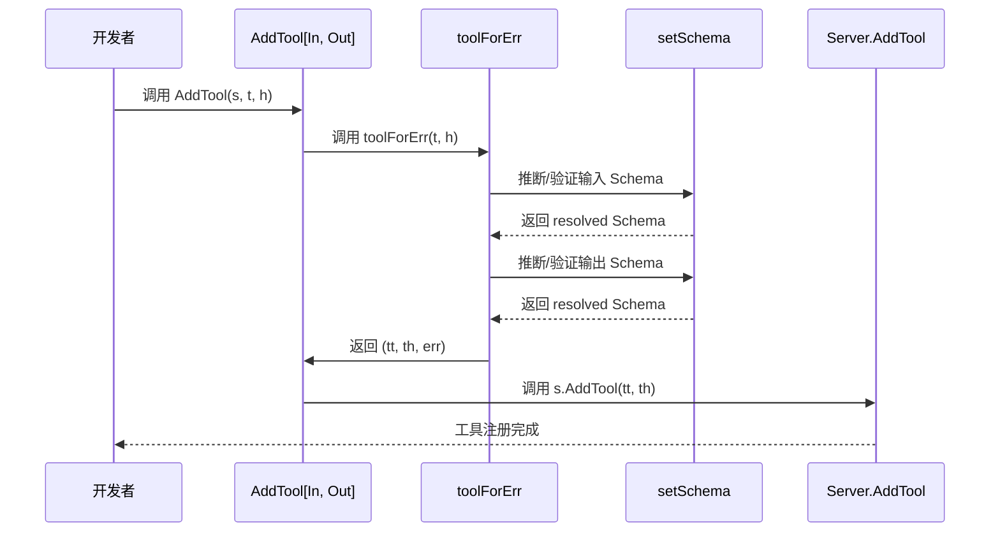
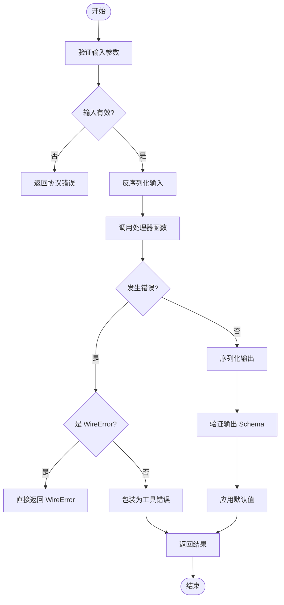
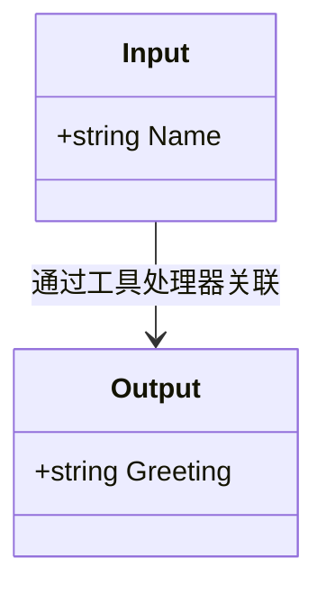
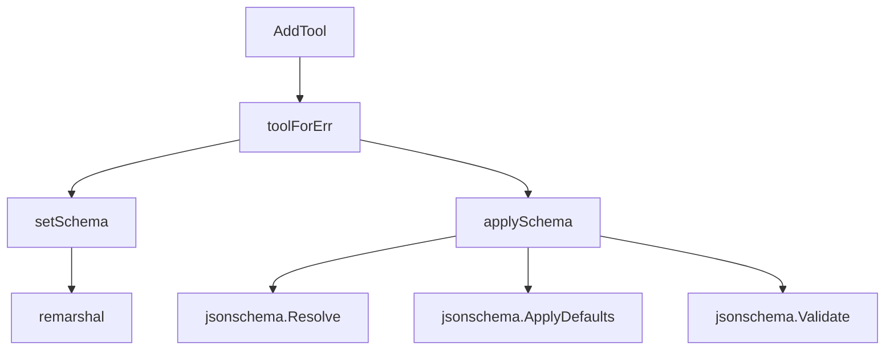

# 工具功能

<cite>
**本文档引用的文件**  
- [main.go](file://examples/server/toolschemas/main.go)
- [tool.go](file://mcp/tool.go)
- [server.go](file://mcp/server.go)
- [protocol.go](file://mcp/protocol.go)
- [util.go](file://mcp/util.go)
</cite>

## 目录
1. [简介](#简介)
2. [核心组件](#核心组件)
3. [架构概述](#架构概述)
4. [详细组件分析](#详细组件分析)
5. [依赖分析](#依赖分析)
6. [性能考量](#性能考量)
7. [故障排除指南](#故障排除指南)
8. [结论](#结论)

## 简介
本文档深入讲解如何使用 `AddTool` 函数注册可调用工具函数。通过分析 `examples/server/toolschemas/main.go` 中的代码示例，详细解释泛型参数 `AddTool[In, Out]` 的使用方式，展示如何定义输入输出结构体并自动生成符合 MCP 规范的 JSON Schema。文档说明了 `ToolHandler` 的调用机制，包括同步与异步处理模式，以及参数验证失败时的 panic 机制。同时，详细阐述了输入输出 Schema 必须为 'object' 类型的强制要求及其设计原因，并提供实际代码片段展示错误处理、性能考量及与 LLM 集成时的数据格式兼容性建议。

## 核心组件
本文档的核心组件包括 `AddTool` 泛型函数、`ToolHandlerFor` 类型、`Tool` 结构体以及 `Input` 和 `Output` 结构体。这些组件共同构成了 MCP SDK 中工具注册和调用的基础架构。`AddTool` 函数通过泛型参数 `In` 和 `Out` 实现类型安全的工具注册，自动处理输入输出的验证和序列化。`ToolHandlerFor` 提供了高层级的工具处理接口，而 `Tool` 结构体则定义了工具的元数据和 Schema 信息。

**Section sources**
- [main.go](file://examples/server/toolschemas/main.go#L20-L29)
- [tool.go](file://mcp/tool.go#L15-L27)
- [server.go](file://mcp/server.go#L405-L411)

## 架构概述
MCP SDK 的工具系统采用分层架构设计，上层提供类型安全的泛型接口，底层实现通用的 JSON-RPC 处理。系统通过 `AddTool` 函数将类型化的工具处理器转换为底层的 `ToolHandler`，并自动处理输入验证、默认值应用和输出序列化。架构设计确保了工具实现既符合 MCP 规范，又具有良好的类型安全性和开发体验。

```mermaid
graph TD
A[ToolHandlerFor[In, Out]] --> |泛型处理| B[AddTool]
B --> C[toolForErr]
C --> D[setSchema]
D --> E[applySchema]
E --> F[JSON Schema 验证]
F --> G[ToolHandler]
G --> H[Server.AddTool]
H --> I[MCP Server]
I --> J[LLM 客户端]
```

**Diagram sources**
- [server.go](file://mcp/server.go#L405-L411)
- [server.go](file://mcp/server.go#L236-L347)

## 详细组件分析

### AddTool 泛型函数分析
`AddTool` 是一个泛型函数，用于注册类型安全的工具处理器。它接受三个参数：服务器实例、工具定义和类型化的处理器函数。函数通过 `toolForErr` 内部函数将 `ToolHandlerFor[In, Out]` 转换为底层的 `ToolHandler`，并处理可能的错误。

当参数验证失败时，`AddTool` 会触发 panic 机制，确保在开发阶段就能发现配置错误。这种设计避免了运行时因错误配置导致的不可预测行为。函数首先检查输入输出类型，然后推断或验证 JSON Schema，最后将处理函数包装为符合 MCP 协议的格式。



**Diagram sources**
- [server.go](file://mcp/server.go#L405-L411)
- [server.go](file://mcp/server.go#L236-L347)

### ToolHandler 调用机制分析
`ToolHandler` 是 MCP SDK 中处理工具调用的核心接口。系统提供了两种处理模式：低层级的 `ToolHandler` 和高层级的 `ToolHandlerFor`。`ToolHandlerFor` 通过泛型参数提供了自动化的输入验证、默认值应用和输出序列化功能。

在调用过程中，系统首先验证输入参数是否符合 JSON Schema，然后将其反序列化为目标类型。处理器函数执行后，输出结果会被序列化并再次验证是否符合输出 Schema。对于错误处理，系统区分了协议错误和工具错误：协议错误直接返回，而工具错误则被包装在 `CallToolResult` 中并设置 `IsError=true`。



**Diagram sources**
- [server.go](file://mcp/server.go#L236-L347)
- [tool.go](file://mcp/tool.go#L15-L27)

### 输入输出结构体分析
输入输出结构体是工具功能的核心数据载体。在 `examples/server/toolschemas/main.go` 中，`Input` 和 `Output` 结构体通过结构体标签定义了 JSON 序列化规则和 Schema 描述。`json:"name"` 标签指定字段的 JSON 名称，而 `jsonschema:"the person to greet"` 标签提供字段的描述信息。

这些结构体必须是对象类型（struct 或 map），因为 MCP 规范要求输入输出 Schema 的类型必须为 'object'。这种设计确保了工具接口的清晰性和可预测性，避免了简单类型（如 string、number）可能带来的歧义。



**Diagram sources**
- [main.go](file://examples/server/toolschemas/main.go#L20-L29)

## 依赖分析
工具功能组件之间存在明确的依赖关系。`AddTool` 函数依赖于 `toolForErr` 函数来处理类型转换和错误，而 `toolForErr` 又依赖于 `setSchema` 和 `applySchema` 函数来处理 Schema 推断和验证。`setSchema` 函数使用反射来推断类型信息，并依赖于 `remarshal` 函数在不同 Schema 表示之间进行转换。



**Diagram sources**
- [server.go](file://mcp/server.go#L405-L411)
- [server.go](file://mcp/server.go#L236-L347)
- [util.go](file://mcp/util.go#L33-L42)

## 性能考量
工具功能的设计在性能方面进行了多项优化。首先，Schema 解析和验证在工具注册时完成，而不是在每次调用时进行，这显著减少了运行时开销。其次，系统使用 `json.RawMessage` 来避免不必要的序列化和反序列化操作，特别是在处理大型数据时。

错误处理机制也经过优化，区分了协议错误和工具错误，避免了不必要的异常处理开销。此外，系统在内部缓存了已解析的 Schema，确保相同的 Schema 不会被重复解析。

## 故障排除指南
当遇到工具注册或调用问题时，应首先检查以下常见问题：输入输出结构体是否正确定义，Schema 是否符合 'object' 类型要求，以及结构体字段是否正确使用了 JSON 标签。对于 panic 错误，应检查 `AddTool` 调用时的参数是否正确，特别是工具名称和 Schema 配置。

如果遇到 Schema 验证失败，可以使用 `jsonschema.For` 函数手动推断 Schema 并进行调试。对于性能问题，可以检查是否在循环中重复注册工具，或者是否处理了过大的输入输出数据。

**Section sources**
- [main.go](file://examples/server/toolschemas/main.go#L122-L184)
- [server.go](file://mcp/server.go#L191-L234)

## 结论
`AddTool` 函数及其相关组件提供了一套强大而灵活的工具注册机制，通过泛型编程实现了类型安全和自动化处理。系统设计充分考虑了 MCP 规范的要求，同时提供了良好的开发体验和性能表现。通过理解这些组件的工作原理，开发者可以更有效地创建和管理 MCP 工具，确保其可靠性和兼容性。