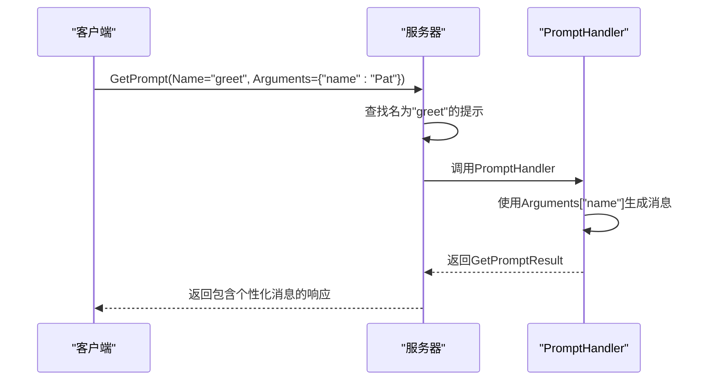
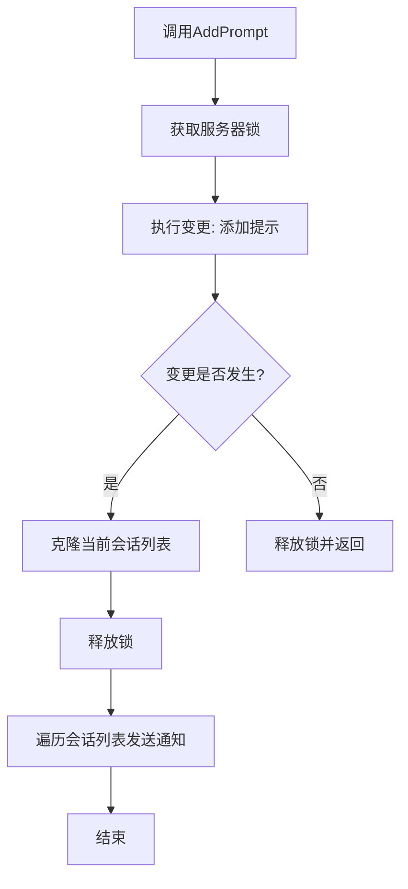

# 提示词管理

<cite>
**本文档引用的文件**   
- [server.go](file://mcp/server.go)
- [protocol.go](file://mcp/protocol.go)
- [prompt.go](file://mcp/prompt.go)
- [client.go](file://mcp/client.go)
- [shared.go](file://mcp/shared.go)
</cite>

## 目录
1. [提示模板注册与管理](#提示模板注册与管理)
2. [PromptHandler调用流程与变量注入](#prompthandler调用流程与变量注入)
3. [提示词列表变更通知机制](#提示词列表变更通知机制)
4. [changeAndNotify使用模式分析](#changeandnotify使用模式分析)
5. [最佳实践建议](#最佳实践建议)

## 提示模板注册与管理

通过 `AddPrompt` 方法，服务器可以注册或替换提示模板。该方法接收一个 `Prompt` 结构体和一个 `PromptHandler` 函数作为参数。`Prompt` 结构体定义了提示的元数据、参数列表、描述、名称和标题等属性。注册时，系统会将提示及其处理程序存储在服务器的内部集合中，供客户端后续调用。

**Section sources**
- [server.go](file://mcp/server.go#L153-L160)
- [protocol.go](file://mcp/protocol.go#L661-L675)

## PromptHandler调用流程与变量注入

`PromptHandler` 是一个函数类型，用于处理客户端对 `prompts/get` 方法的调用。当客户端请求获取特定提示时，服务器会调用相应的 `PromptHandler`。处理程序接收上下文和请求参数（包括提示名称和用于模板化的参数），并返回一个 `GetPromptResult`，其中包含动态生成的消息内容。变量注入通过 `GetPromptParams.Arguments` 实现，允许客户端传递参数以生成个性化的提示内容。

**Diagram sources**
- [server.go](file://mcp/server.go#L533-L545)
- [prompt.go](file://mcp/prompt.go#L13-L16)
- [protocol.go](file://mcp/protocol.go#L364-L371)

## 提示词列表变更通知机制

当提示列表发生变更（通过 `AddPrompt` 或 `RemovePrompts`）时，服务器会触发 `notificationPromptListChanged` 通知。此通知会广播给所有已连接的客户端会话，确保客户端能够及时更新其本地的提示列表缓存。通知的触发条件是任何提示的添加或移除操作，无论提示内容是否实际发生变化。

**Section sources**
- [server.go](file://mcp/server.go#L153-L160)
- [protocol.go](file://mcp/protocol.go#L1155-L1155)

## changeAndNotify使用模式分析

`changeAndNotify` 是一个通用模式，用于在状态变更后通知所有会话。在 `AddPrompt` 方法中，它被用来安全地修改提示集合（在锁内），并在确认有变更后，异步地通知所有会话。这种模式将变更操作与通知操作分离，先在锁的保护下执行变更，获取会话快照，然后在锁外发送通知，从而避免了长时间持有锁，提高了并发性能。它在会话状态同步中起到了核心作用，确保了所有客户端能一致地感知到服务器状态的变化。

**Diagram sources**
- [server.go](file://mcp/server.go#L153-L160)
- [server.go](file://mcp/server.go#L497-L506)
- [shared.go](file://mcp/shared.go#L342-L359)

## 最佳实践建议

为确保内容生成的一致性和安全性，建议实施以下最佳实践：
- **提示词版本控制**：在 `Prompt.Meta` 字段中嵌入版本信息，以便客户端识别和处理不同版本的提示。
- **多语言支持策略**：利用 `Prompt.Title` 和 `Prompt.Description` 的本地化能力，根据客户端的语言偏好返回相应的提示信息。
- **与外部模板引擎集成**：将 `PromptHandler` 设计为适配器，调用如 Go template 或 Handlebars 等外部模板引擎，以支持更复杂的模板逻辑和语法，同时保持MCP协议的兼容性。

**Section sources**
- [protocol.go](file://mcp/protocol.go#L661-L675)
- [prompt.go](file://mcp/prompt.go#L13-L16)
- [shared.go](file://mcp/shared.go#L373-L373)