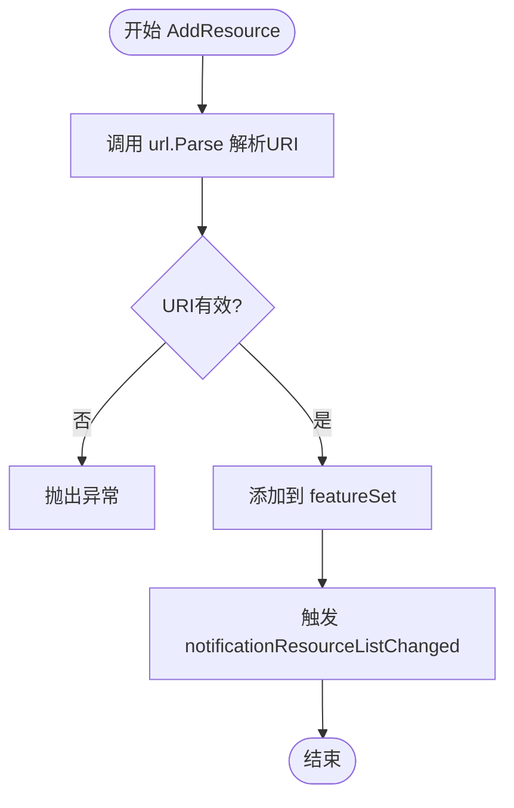
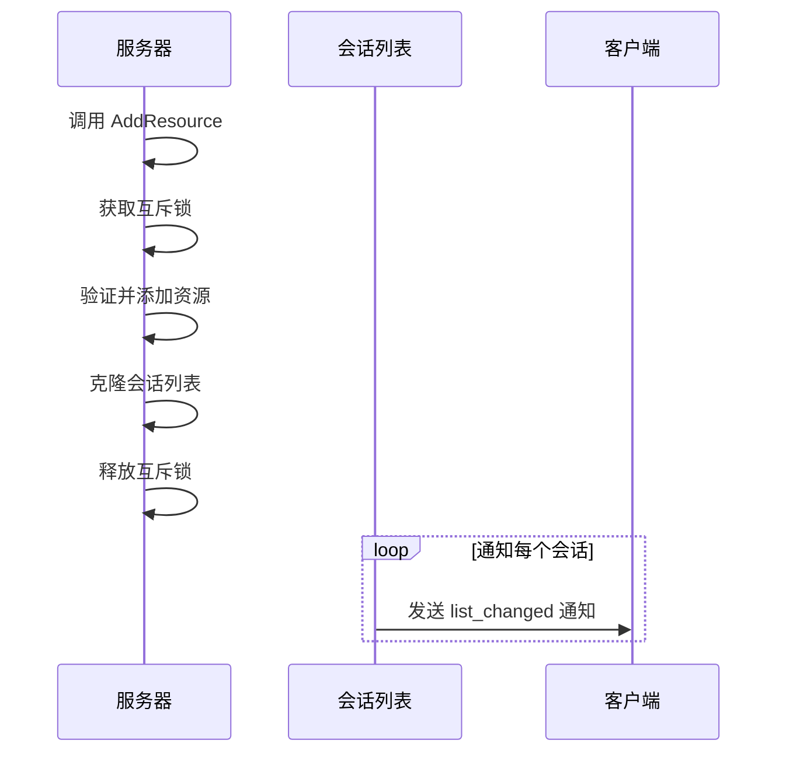

# 资源管理

<cite>
**本文档中引用的文件**  
- [server.go](file://mcp/server.go)
- [protocol.go](file://mcp/protocol.go)
- [resource.go](file://mcp/resource.go)
- [shared.go](file://mcp/shared.go)
- [features.go](file://mcp/features.go)
- [kb.go](file://examples/server/memory/kb.go)
- [main.go](file://examples/server/memory/main.go)
</cite>

## 目录
1. [通过AddResource提供数据源](#通过addresource提供数据源)
2. [ResourceHandler注册与URI合法性校验](#resourcehandler注册与uri合法性校验)
3. [资源变更通知机制](#资源变更通知机制)
4. [内存知识库实现示例](#内存知识库实现示例)
5. [资源URI命名规范与访问控制](#资源uri命名规范与访问控制)
6. [大规模资源场景下的性能优化](#大规模资源场景下的性能优化)

## 通过AddResource提供数据源

`AddResource` 方法用于向MCP服务器注册可读取或可订阅的数据源。该方法将 `Resource` 对象与其对应的 `ResourceHandler` 处理函数关联，使得客户端可以通过 `ReadResource` 请求访问该资源。当资源被成功添加或替换时，系统会自动触发资源列表变更通知。

该机制支持静态资源的注册，每个资源通过唯一的URI标识。服务器通过维护一个资源集合来管理所有已注册的资源，并在客户端请求时调用相应的处理函数返回资源内容。

**Section sources**
- [server.go](file://mcp/server.go#L422-L431)

## ResourceHandler注册与URI合法性校验

`ResourceHandler` 的注册过程在 `AddResource` 方法中完成，其核心流程包括URI合法性校验和资源注册。URI校验通过标准库 `url.Parse` 函数实现，确保提供的URI符合规范且为绝对地址（包含scheme）。若解析失败，方法将直接抛出异常，阻止非法资源的注册。

注册过程采用线程安全的变更通知机制，在修改资源集合后立即通知所有监听客户端。资源集合使用 `featureSet` 数据结构管理，保证每个资源URI的唯一性，并支持高效的增删查操作。

**Diagram sources**
- [server.go](file://mcp/server.go#L422-L431)
- [resource.go](file://mcp/resource.go#L145-L155)

**Section sources**
- [server.go](file://mcp/server.go#L422-L431)
- [resource.go](file://mcp/resource.go#L145-L155)

## 资源变更通知机制

资源变更通知机制以 `notificationResourceListChanged` 常量标识，其值为 `"notifications/resources/list_changed"`。该机制通过 `changeAndNotify` 通用方法实现，确保在资源列表发生变更时，所有活跃的客户端会话都能收到通知。

工作原理如下：当调用 `AddResource` 或 `RemoveResources` 时，系统在持有互斥锁的情况下执行变更操作，并创建当前会话列表的快照。随后在锁外遍历会话列表，向每个会话发送变更通知。这种设计减少了锁的持有时间，提高了并发性能。

通知内容为空参数对象 `ResourceListChangedParams`，客户端收到通知后应重新查询资源列表以获取最新状态。该机制还支持资源内容更新通知 `ResourceUpdated`，允许服务器主动推送特定资源的变更。

**Diagram sources**
- [server.go](file://mcp/server.go#L422-L431)
- [shared.go](file://mcp/shared.go#L468-L485)
- [protocol.go](file://mcp/protocol.go#L1157)

**Section sources**
- [server.go](file://mcp/server.go#L422-L431)
- [shared.go](file://mcp/shared.go#L468-L485)

## 内存知识库实现示例

以 `examples/server/memory` 示例为例，内存知识库（kb.go）实现了基于工具的知识图谱管理，而非直接作为资源注册。该示例通过多个工具（如 `create_entities`, `read_graph`）提供数据操作接口，展示了如何在MCP框架下实现复杂数据管理。

知识库支持分页查询，通过服务器配置的 `PageSize` 参数控制单次返回的最大项目数。实时订阅功能通过 `SubscribeHandler` 实现，客户端可订阅特定资源URI以接收更新通知。状态同步通过文件存储后端实现，当配置了持久化路径时，知识库状态会被序列化到JSON文件中，确保跨会话的一致性。

该实现展示了 `store` 接口的两种实现：`memoryStore` 提供纯内存存储，`fileStore` 提供文件持久化。知识图谱的增删改查操作均通过工具调用触发，并自动维护实体与关系的完整性。

**Section sources**
- [kb.go](file://examples/server/memory/kb.go#L0-L567)
- [main.go](file://examples/server/memory/main.go#L0-L145)

## 资源URI命名规范与访问控制

资源URI必须遵循标准URL语法，包含scheme、authority和path等组成部分。推荐使用 `file://` scheme表示本地文件资源，或自定义scheme表示特定类型的数据源。URI应具有唯一性和可读性，避免使用特殊字符和空格。

访问控制策略主要通过两个层面实现：首先，在 `ResourceHandler` 中可以检查客户端的根目录权限（roots），确保资源访问不超出授权范围；其次，通过 `SubscribeHandler` 和 `UnsubscribeHandler` 可以在订阅阶段进行权限验证，阻止未授权的实时数据访问。

对于文件资源，系统内置了路径遍历防护，使用 `filepath.Localize` 和 `filepath.Rel` 确保请求路径不会逃逸出指定的根目录。此外，服务器选项中的 `GetSessionID` 函数可用于实现会话级别的访问控制。

**Section sources**
- [resource.go](file://mcp/resource.go#L145-L164)
- [server.go](file://mcp/server.go#L100-L120)

## 大规模资源场景下的性能优化

在大规模资源场景下，性能优化建议包括：首先，利用批处理机制减少频繁的变更通知。虽然当前实现中每次资源变更都会触发通知，但可通过在应用层聚合变更，在固定时间间隔内批量发送 `ResourceUpdated` 通知，从而降低网络开销。

其次，合理配置 `PageSize` 参数以平衡单次响应大小与分页查询次数。对于大型资源列表，建议设置适当的分页大小，避免单次返回过多数据导致内存压力。此外，`featureSet` 数据结构的有序键缓存机制确保了列表查询的高效性，但应在批量操作后注意其重建开销。

最后，对于频繁访问的资源，可考虑在 `ResourceHandler` 中实现缓存机制，减少重复的数据加载和处理开销。结合 `Annotations` 中的 `LastModified` 字段，客户端可实现条件请求，进一步优化数据同步效率。

**Section sources**
- [server.go](file://mcp/server.go#L50-L60)
- [features.go](file://mcp/features.go#L45-L60)
- [shared.go](file://mcp/shared.go#L468-L485)