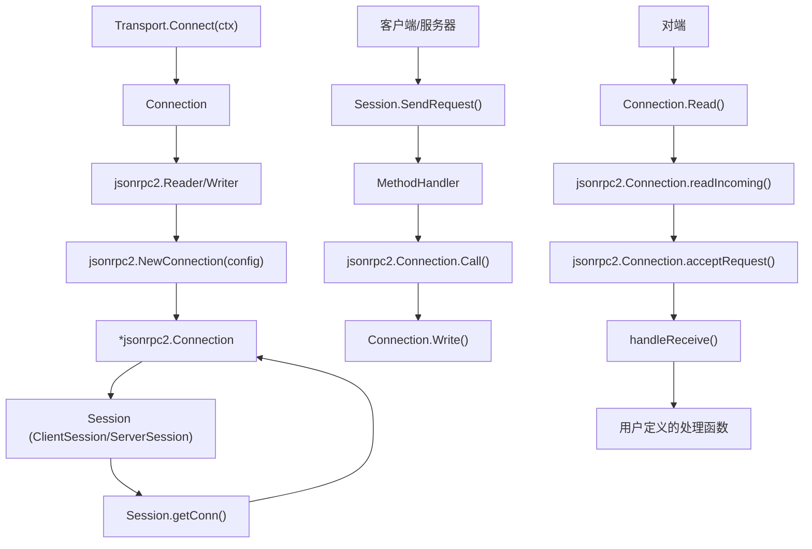

# 会话与传输

<cite>
**本文档中引用的文件**
- [session.go](file://mcp/session.go)
- [transport.go](file://mcp/transport.go)
- [client.go](file://mcp/client.go)
- [server.go](file://mcp/server.go)
- [shared.go](file://mcp/shared.go)
- [internal/jsonrpc2/conn.go](file://internal/jsonrpc2/conn.go)
- [internal/jsonrpc2/jsonrpc2.go](file://internal/jsonrpc2/jsonrpc2.go)
</cite>

## 目录
1. [引言](#引言)
2. [会话生命周期](#会话生命周期)
3. [传输抽象机制](#传输抽象机制)
4. [JSON-RPC 2.0 连接建立](#json-rpc-20-连接建立)
5. [数据流图示](#数据流图示)
6. [心跳与连接关闭](#心跳与连接关闭)
7. [自定义传输实现指南](#自定义传输实现指南)

## 引言
本文档全面阐述了MCP（Model Context Protocol）中的会话（Session）生命周期与传输（Transport）抽象机制。会话（Session）是MCP客户端与服务器之间一次连接的上下文，封装了连接状态、会话ID以及消息处理逻辑。传输（Transport）则提供了一个抽象层，解耦了底层通信协议，使得MCP能够支持多种通信方式，如标准输入输出（Stdio）、内存管道（In-Memory）、HTTP流（SSE）等。通过`Transport`接口的`Connect`方法，可以创建一个逻辑上的JSON-RPC连接，该连接在`internal/jsonrpc2`包的基础上构建，实现了消息的编码、解码和传输。本文将详细解释`Session`接口如何封装连接上下文，`ClientSession`和`ServerSession`的创建过程，以及`Transport`接口如何支持多种底层实现。

## 会话生命周期

`Session`接口是MCP中会话的核心抽象，它定义了会话的基本行为和属性。该接口封装了一次连接的上下文，包括会话ID、消息处理方法和底层连接。`Session`接口的关键方法包括`ID()`用于获取会话ID，`getConn()`用于获取底层的`*jsonrpc2.Connection`对象，以及`sendingMethodInfos()`和`receivingMethodInfos()`用于获取发送和接收消息的方法信息映射。

在MCP中，会话分为客户端会话（`ClientSession`）和服务器端会话（`ServerSession`）。`ClientSession`由`Client.Connect`方法创建，而`ServerSession`由`Server.Connect`方法创建。这两个方法都调用了内部的`connect`函数，该函数负责处理连接的建立和初始化。`connect`函数首先调用`Transport.Connect`方法获取一个`Connection`对象，然后使用`jsonrpc2.NewConnection`创建一个`*jsonrpc2.Connection`，并将其与`Session`对象关联。`ClientSession`和`ServerSession`的结构体都包含了对`*jsonrpc2.Connection`的引用，以及对`Client`或`Server`实例的引用，从而能够访问到上层的业务逻辑。

会话的创建过程是异步的，`Connect`方法返回一个`*ClientSession`或`*ServerSession`对象，该对象可以立即用于发送和接收消息。会话的生命周期从`Connect`调用开始，到`Close`方法被调用结束。在会话的生命周期中，`ClientSession`和`ServerSession`都提供了丰富的API来发送各种MCP请求和通知，例如`ListTools`、`CallTool`、`ListPrompts`等。这些方法通过`sendingMethodHandler()`获取的`MethodHandler`来发送消息，而接收到的消息则通过`receivingMethodHandler()`获取的`MethodHandler`进行处理。

**Section sources**
- [shared.go](file://mcp/shared.go#L67-L76)
- [client.go](file://mcp/client.go#L178-L189)
- [server.go](file://mcp/server.go#L921-L931)
- [client.go](file://mcp/client.go#L135-L170)
- [server.go](file://mcp/server.go#L838-L853)

## 传输抽象机制

`Transport`接口是MCP中传输机制的核心抽象，它解耦了底层通信协议，使得MCP能够支持多种通信方式。`Transport`接口定义了一个`Connect`方法，该方法接受一个`context.Context`并返回一个`Connection`对象和一个错误。`Connect`方法被`Server.Connect`或`Client.Connect`方法精确调用一次，用于建立逻辑上的JSON-RPC连接。

MCP提供了多种`Transport`的实现，包括`StdioTransport`、`IOTransport`、`InMemoryTransport`、`LoggingTransport`、`CommandTransport`、`SSEClientTransport`、`SSEServerTransport`、`StreamableClientTransport`和`StreamableServerTransport`。每种实现都针对不同的通信场景。例如，`StdioTransport`用于通过标准输入输出进行通信，`InMemoryTransport`用于在同一进程内的内存中进行通信，而`SSEClientTransport`和`SSEServerTransport`则用于通过HTTP服务器发送事件（SSE）进行通信。

`Connection`接口是`Transport.Connect`方法返回的逻辑连接，它定义了`Read`、`Write`和`Close`三个方法，分别用于从连接中读取消息、向连接中写入消息和关闭连接。`Connection`接口还定义了一个`SessionID`方法，用于获取连接的会话ID。`IOTransport`是最基础的实现之一，它接受一个`io.ReadCloser`和一个`io.WriteCloser`，并使用`newIOConn`函数创建一个`*ioConn`对象。`ioConn`是一个具体的`Connection`实现，它使用`json.NewDecoder`来解码从`io.ReadCloser`读取的JSON消息，并使用`json.Marshal`来编码要通过`io.WriteCloser`发送的消息。

`LoggingTransport`是一个装饰器模式的实现，它包装了另一个`Transport`，并在消息的读写过程中记录日志。当`LoggingTransport.Connect`被调用时，它首先调用被包装的`Transport`的`Connect`方法，然后返回一个`*loggingConn`对象，该对象在`Read`和`Write`方法中添加了日志记录逻辑。这种设计使得日志功能可以被轻松地添加到任何`Transport`实现上，而无需修改其核心逻辑。

**Section sources**
- [transport.go](file://mcp/transport.go#L31-L36)
- [transport.go](file://mcp/transport.go#L88-L88)
- [transport.go](file://mcp/transport.go#L104-L107)
- [transport.go](file://mcp/transport.go#L119-L121)
- [transport.go](file://mcp/transport.go#L228-L231)
- [transport.go](file://mcp/transport.go#L39-L60)

## JSON-RPC 2.0 连接建立

在`Transport.Connect`方法生成`Connection`之后，MCP使用`internal/jsonrpc2`包在该`Connection`之上建立JSON-RPC 2.0连接。`jsonrpc2.NewConnection`函数是建立此连接的关键，它接受一个`ConnectionConfig`配置对象，该对象包含了`Reader`、`Writer`、`Closer`、`Bind`等字段。`Reader`和`Writer`是从`Connection`对象获取的，`Closer`是`Connection`对象本身，而`Bind`是一个函数，用于将`*jsonrpc2.Connection`绑定到一个`jsonrpc2.Handler`。

`connect`函数在调用`Transport.Connect`获取`mcpConn`后，会创建`jsonrpc2.Reader`和`jsonrpc2.Writer`，并将它们传递给`jsonrpc2.NewConnection`。`Bind`函数的实现会调用`binder`接口的`bind`方法，该方法将`mcpConn`、`conn`、`s`和`onClose`作为参数，返回一个`handler`对象。这个`handler`对象实现了`handle`方法，该方法会调用`handleReceive`来处理接收到的JSON-RPC请求。`handleReceive`函数会根据请求的方法名查找对应的`methodInfo`，然后调用相应的处理函数。

`jsonrpc2.Connection`对象负责管理JSON-RPC协议的细节，包括消息的序列化和反序列化、请求ID的生成、响应的匹配等。它通过`readIncoming`方法从`Reader`中读取消息，并根据消息类型（请求、响应或通知）进行分发。对于请求，它会调用`acceptRequest`方法，该方法会检查请求的有效性，然后将其放入处理队列。对于响应，它会查找对应的`AsyncCall`对象并完成它。`jsonrpc2.Connection`还支持异步处理，通过`Async`函数可以将一个请求标记为异步，从而允许后续的请求被并发处理。

**Section sources**
- [transport.go](file://mcp/transport.go#L149-L179)
- [internal/jsonrpc2/conn.go](file://internal/jsonrpc2/conn.go#L209-L222)
- [internal/jsonrpc2/conn.go](file://internal/jsonrpc2/conn.go#L531-L570)
- [internal/jsonrpc2/conn.go](file://internal/jsonrpc2/conn.go#L574-L660)

## 数据流图示

**Diagram sources**
- [transport.go](file://mcp/transport.go#L35-L35)
- [transport.go](file://mcp/transport.go#L44-L44)
- [transport.go](file://mcp/transport.go#L50-L50)
- [transport.go](file://mcp/transport.go#L56-L56)
- [shared.go](file://mcp/shared.go#L75-L75)
- [internal/jsonrpc2/conn.go](file://internal/jsonrpc2/conn.go#L327-L374)
- [internal/jsonrpc2/conn.go](file://internal/jsonrpc2/conn.go#L285-L320)
- [internal/jsonrpc2/conn.go](file://internal/jsonrpc2/conn.go#L531-L570)
- [internal/jsonrpc2/conn.go](file://internal/jsonrpc2/conn.go#L574-L660)
- [shared.go](file://mcp/shared.go#L412-L422)

## 心跳与连接关闭

MCP支持心跳机制（Keep-Alive），用于检测连接的活性。当`Client`或`Server`的选项中设置了`KeepAlive`时间间隔时，会话会在初始化后启动一个心跳定时器。`startKeepalive`函数负责启动这个机制，它创建一个`context.CancelFunc`并启动一个goroutine，该goroutine会定期调用`Ping`方法。如果`Ping`方法调用失败，该goroutine会调用`Close`方法来关闭会话，从而防止连接处于半开状态。

`ClientSession`和`ServerSession`都实现了`Ping`方法，该方法通过`handleSend`发送一个`methodPing`请求。`ping`方法的实现非常简单，它返回一个`&emptyResult{}`，表示一个空的成功响应。`Close`方法用于优雅地关闭连接，它首先调用`keepaliveCancel`来停止心跳goroutine，然后调用`conn.Close()`来关闭底层的`*jsonrpc2.Connection`。`conn.Close()`会设置`state.connClosing`标志，并等待所有正在进行的读写操作完成，然后关闭`closer`（即`Connection`对象）。

连接的关闭是幂等的，可以被多次调用，即使是从多个goroutine并发调用。`ioConn.Close`方法使用`sync.Once`来确保底层的`io.ReadWriteCloser`只被关闭一次。当`Connection`被关闭时，`readIncoming` goroutine会检测到`ctx.Done()`或`closed`通道被关闭，并退出循环，从而释放资源。`Wait`方法可以用来等待连接完全关闭，它会阻塞直到`done`通道被关闭，然后返回关闭的原因。

**Section sources**
- [shared.go](file://mcp/shared.go#L505-L508)
- [shared.go](file://mcp/shared.go#L515-L541)
- [client.go](file://mcp/client.go#L207-L223)
- [server.go](file://mcp/server.go#L1187-L1203)
- [internal/jsonrpc2/conn.go](file://internal/jsonrpc2/conn.go#L522-L527)
- [internal/jsonrpc2/conn.go](file://internal/jsonrpc2/conn.go#L496-L513)

## 自定义传输实现指南

要实现一个自定义的`Transport`，需要实现`Transport`接口，即提供一个`Connect`方法。`Connect`方法应该返回一个实现了`Connection`接口的对象。`Connection`接口要求实现`Read`、`Write`和`Close`方法。`Read`方法应该从底层通信通道中读取下一个JSON-RPC消息，`Write`方法应该将一个JSON-RPC消息写入底层通信通道，而`Close`方法应该关闭底层通信通道。

在实现`Read`和`Write`方法时，需要注意并发安全。`Write`方法可能被并发调用，因为用户代码中可能会并发地发出调用或通知。因此，`Write`方法内部需要使用互斥锁来保护写操作。`Read`方法虽然通常由单个goroutine调用，但也应该允许与`Close`方法并发调用，因为`Close`方法应该能够取消阻塞的`Read`操作。

一个简单的自定义`Transport`实现可以参考`IOTransport`。它接受一个`io.ReadCloser`和一个`io.WriteCloser`，并在`Connect`方法中创建一个`*ioConn`对象。`ioConn`使用`json.NewDecoder`来异步地从`io.ReadCloser`中读取消息，并将它们发送到一个`incoming`通道。`Read`方法从这个通道中读取消息，而`Write`方法则使用`json.Marshal`将消息编码为JSON并写入`io.WriteCloser`。`Close`方法则关闭底层的`io.ReadWriteCloser`。

对于更复杂的场景，如基于HTTP的传输，可以参考`SSEClientTransport`和`SSEServerTransport`的实现。它们使用HTTP长轮询或服务器发送事件（SSE）来实现双向通信。`SSEClientTransport.Connect`会发起一个HTTP GET请求来建立一个长连接，并启动一个goroutine来读取服务器发送的事件。`Write`方法则通过发起HTTP POST请求来发送消息。这种设计使得MCP可以在Web环境中运行，与浏览器或其他HTTP客户端进行交互。

**Section sources**
- [transport.go](file://mcp/transport.go#L31-L36)
- [transport.go](file://mcp/transport.go#L39-L60)
- [transport.go](file://mcp/transport.go#L104-L107)
- [transport.go](file://mcp/transport.go#L110-L112)
- [transport.go](file://mcp/transport.go#L329-L354)
- [sse.go](file://mcp/sse.go#L334-L397)
- [sse.go](file://mcp/sse.go#L163-L177)