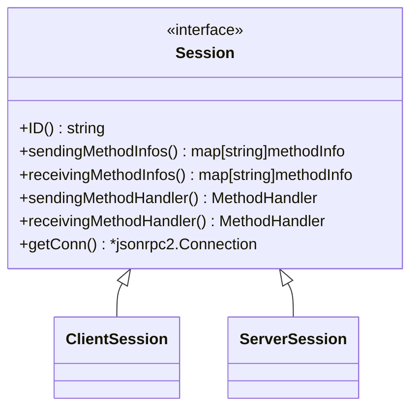
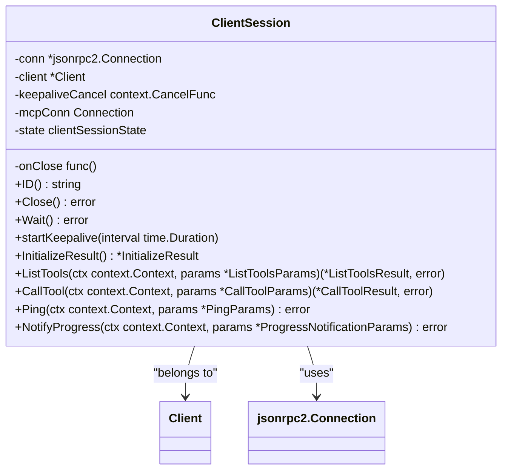
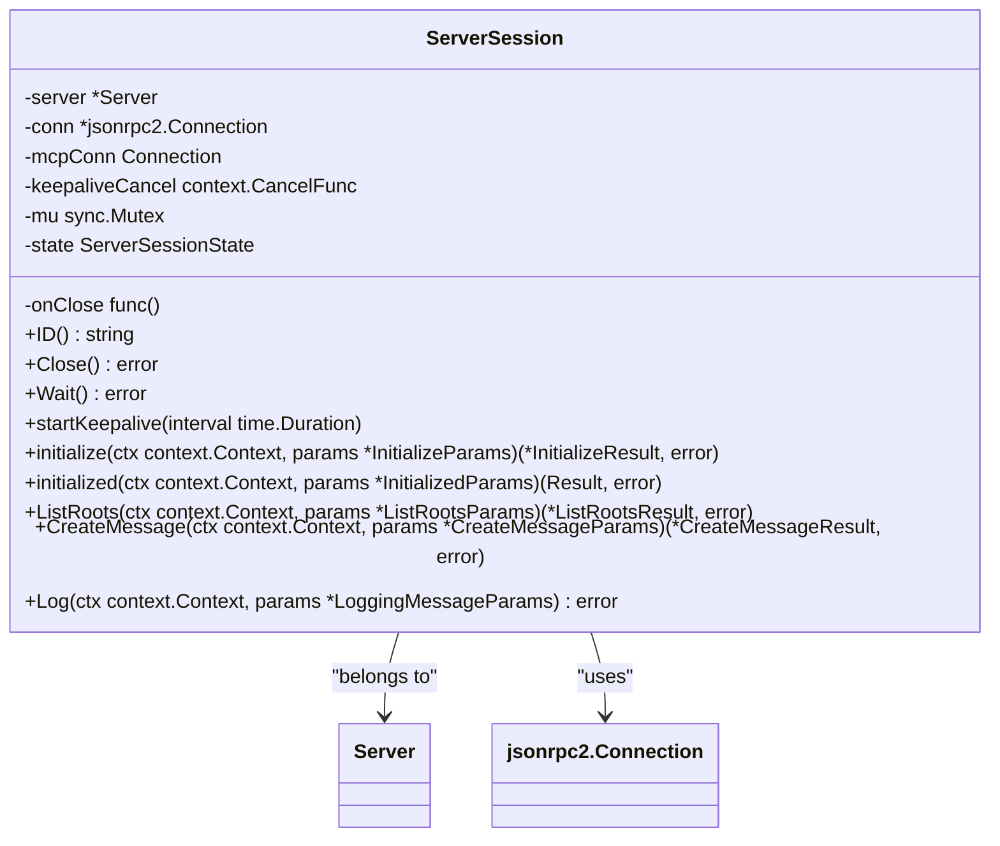
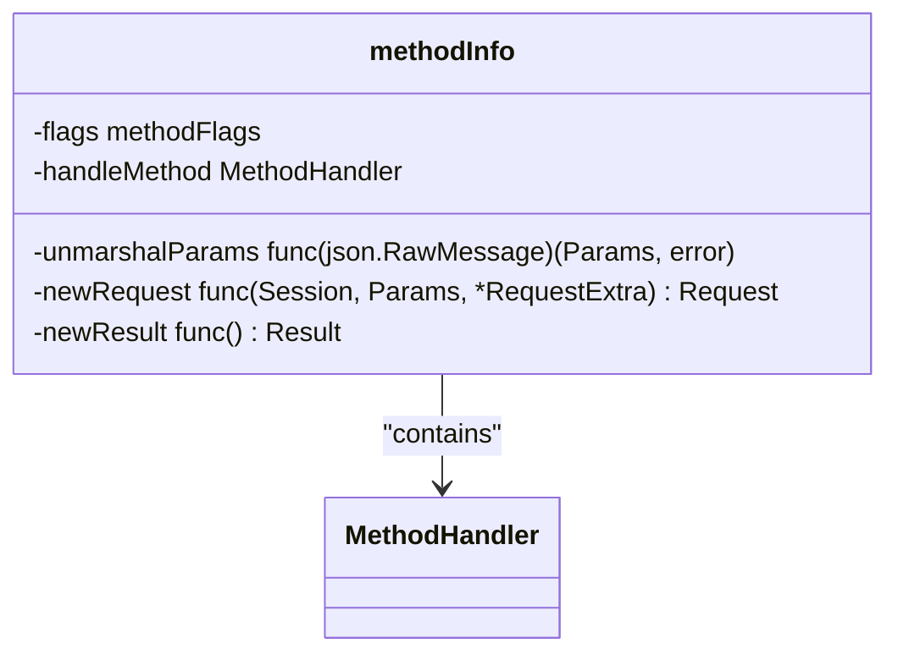

# 会话机制

<cite>
**本文档中引用的文件**  
- [session.go](file://mcp/session.go)
- [shared.go](file://mcp/shared.go)
- [client.go](file://mcp/client.go)
- [server.go](file://mcp/server.go)
</cite>

## 目录
1. [简介](#简介)
2. [会话接口定义](#会话接口定义)
3. [客户端会话 ClientSession](#客户端会话-clientsession)
4. [服务器端会话 ServerSession](#服务器端会话-serversession)
5. [会话生命周期管理](#会话生命周期管理)
6. [方法注册与消息处理](#方法注册与消息处理)
7. [心跳机制与 Keepalive](#心跳机制与-keepalive)
8. [会话与 JSON-RPC 连接的绑定](#会话与-json-rpc-连接的绑定)
9. [最佳实践与常见问题](#最佳实践与常见问题)

## 简介
MCP SDK 中的会话（Session）机制是客户端与服务器之间通信的核心抽象。会话代表了一个逻辑上的连接，封装了通信状态、上下文和生命周期管理。本文档深入解析 `Session` 接口的定义与实现，详细阐述 `ClientSession` 和 `ServerSession` 的结构、生命周期、ID 生成以及上下文传递机制。通过分析会话在客户端 `Connect` 和服务器 `Run` 过程中的角色，以及其与 JSON-RPC 连接的绑定关系，为开发者提供会话状态管理的全面指导。

## 会话接口定义
`Session` 接口是 MCP SDK 中会话机制的核心，它定义了所有会话必须实现的公共方法。该接口为客户端和服务器端的会话提供了统一的抽象，确保了通信的对称性和一致性。



**Diagram sources**
- [shared.go](file://mcp/shared.go#L67-L76)

**Section sources**
- [shared.go](file://mcp/shared.go#L67-L76)

### 接口方法详解
- **`ID()`**: 返回会话的唯一标识符。如果连接实现了 `hasSessionID` 接口，则调用其 `SessionID()` 方法获取 ID；否则返回空字符串。
- **`sendingMethodInfos()`**: 返回一个映射，包含当前会话可以发送的所有方法的元信息（`methodInfo`）。这些信息定义了方法的参数、结果类型和处理逻辑。
- **`receivingMethodInfos()`**: 返回一个映射，包含当前会话可以接收的所有方法的元信息。服务器会话和客户端会话的接收方法集不同。
- **`sendingMethodHandler()`**: 返回用于处理发送请求的 `MethodHandler`。此处理器负责将请求序列化并通过连接发送。
- **`receivingMethodHandler()`**: 返回用于处理接收请求的 `MethodHandler`。此处理器负责反序列化请求并调用相应的处理函数。
- **`getConn()`**: 返回底层的 `*jsonrpc2.Connection` 对象，这是会话与对等方进行实际通信的通道。

## 客户端会话 ClientSession
`ClientSession` 是客户端与服务器建立连接后创建的会话实例。它封装了客户端的通信状态，并提供了向服务器发送请求和接收通知的 API。



**Diagram sources**
- [client.go](file://mcp/client.go#L178-L189)
- [client.go](file://mcp/client.go#L511-L517)
- [client.go](file://mcp/client.go#L532-L536)

**Section sources**
- [client.go](file://mcp/client.go#L178-L189)

### 结构与字段
- **`conn`**: 指向底层的 JSON-RPC 连接，所有通信都通过此连接进行。
- **`client`**: 指向创建此会话的 `Client` 实例，用于访问客户端的全局状态和配置。
- **`mcpConn`**: 一个更高级别的连接抽象，可能包含会话 ID 等信息。
- **`state`**: 存储会话的特定状态，如初始化结果（`InitializeResult`）。
- **`keepaliveCancel`**: 用于取消心跳（keepalive）goroutine 的 `context.CancelFunc`。

### 核心方法
- **`Close()`**: 执行优雅关闭，首先取消心跳 goroutine，然后关闭底层连接。
- **`Wait()`**: 阻塞等待服务器关闭连接。
- **`startKeepalive()`**: 根据配置的间隔启动心跳机制。
- **`ListTools()` / `CallTool()`**: 用于与服务器的工具功能进行交互的具体业务方法，这些方法内部调用 `handleSend` 来发送请求。

## 服务器端会话 ServerSession
`ServerSession` 是服务器为每个连接的客户端创建的会话实例。它管理服务器端的会话状态，并处理来自客户端的请求。



**Diagram sources**
- [server.go](file://mcp/server.go#L921-L931)
- [server.go](file://mcp/server.go#L970-L975)
- [server.go](file://mcp/server.go#L1187-L1203)

**Section sources**
- [server.go](file://mcp/server.go#L921-L931)

### 结构与字段
- **`server`**: 指向创建此会话的 `Server` 实例，用于访问服务器的全局状态、功能和配置。
- **`state`**: 包含服务器会话的特定状态，如 `InitializeParams`、`InitializedParams` 和 `LogLevel`。
- **`mu`**: 互斥锁，用于保护 `state` 的并发访问。

### 核心方法
- **`initialize()`**: 处理来自客户端的 `initialize` 请求，是会话建立的第一步。它会设置会话状态并返回 `InitializeResult`。
- **`initialized()`**: 处理来自客户端的 `notifications/initialized` 通知。这是会话初始化的最后一步，通常在此之后启动心跳机制。
- **`checkInitialized()`**: 一个辅助方法，用于检查会话是否已初始化，确保在初始化完成前不处理某些请求。
- **`ListRoots()` / `CreateMessage()`**: 用于处理客户端请求的具体业务方法，这些方法内部调用 `handleSend` 来发送响应。

## 会话生命周期管理
会话的生命周期从连接建立开始，到连接关闭结束。其管理贯穿于客户端的 `Connect` 和服务器的 `Run` 过程。

### 会话创建与初始化
1.  **客户端连接 (`Client.Connect`)**:
    *   调用 `connect` 函数建立底层传输连接。
    *   发送 `initialize` 请求，包含协议版本、客户端信息和能力。
    *   接收 `InitializeResult` 响应，验证协议版本，并将结果存储在 `ClientSession.state` 中。
    *   发送 `notifications/initialized` 通知，完成初始化。
    *   如果配置了 `KeepAlive`，则调用 `startKeepalive` 启动心跳。
2.  **服务器运行 (`Server.Run`)**:
    *   调用 `Connect` 函数接受客户端连接。
    *   服务器内部会创建 `ServerSession` 实例。
    *   会话等待并处理客户端的 `initialize` 请求和 `notifications/initialized` 通知。
    *   在收到 `initialized` 通知后，如果配置了 `KeepAlive`，则启动心跳。

### ID 生成与上下文传递
- **ID 生成**: 会话 ID 由底层连接（`mcpConn`）提供。如果连接实现了 `hasSessionID` 接口，则调用其 `SessionID()` 方法获取 ID。服务器可以通过 `ServerOptions.GetSessionID` 配置自定义的 ID 生成函数。
- **上下文传递**: 会话通过 `Request` 接口（`ClientRequest` 和 `ServerRequest`）传递上下文。每个请求都包含一个指向其所属会话的指针（`Session` 字段），这使得处理函数可以轻松访问会话状态和方法。

**Section sources**
- [client.go](file://mcp/client.go#L135-L170)
- [server.go](file://mcp/server.go#L856-L887)
- [shared.go](file://mcp/shared.go#L412-L422)

## 方法注册与消息处理
会话通过方法注册表（`methodInfo` 结构）来管理发送和接收的消息处理逻辑。

### methodInfo 结构
`methodInfo` 结构是方法注册的核心，它包含了处理一个方法所需的所有元信息。



**Diagram sources**
- [shared.go](file://mcp/shared.go#L195-L209)

- **`flags`**: 标记位，指示方法是通知还是请求，以及参数是否可选。
- **`unmarshalParams`**: 用于将 JSON-RPC 消息中的原始参数反序列化为具体的 `Params` 类型。
- **`newRequest`**: 工厂函数，用于创建特定于会话类型的 `Request` 实例（`ClientRequest` 或 `ServerRequest`）。
- **`handleMethod`**: 实际的处理函数，当收到匹配的方法调用时被调用。
- **`newResult`**: 工厂函数，用于创建一个指向结果类型的指针，以便将响应结果反序列化到其中。

### 方法注册表
- **`clientMethodInfos`**: 在 `client.go` 中定义的全局变量，映射了客户端可以接收的所有方法（如 `listRoots`, `createMessage`）到其 `methodInfo`。`ClientSession.receivingMethodInfos()` 返回此映射。
- **`serverMethodInfos`**: 在 `server.go` 中定义的全局变量，映射了服务器可以接收的所有方法（如 `initialize`, `listTools`）到其 `methodInfo`。`ServerSession.receivingMethodInfos()` 返回此映射。
- **发送方法**: `ClientSession.sendingMethodInfos()` 返回 `serverMethodInfos`，因为客户端发送的请求是服务器接收的。反之，`ServerSession.sendingMethodInfos()` 返回 `clientMethodInfos`。

**Section sources**
- [shared.go](file://mcp/shared.go#L195-L209)
- [client.go](file://mcp/client.go#L511-L517)
- [server.go](file://mcp/server.go#L1089-L1089)

## 心跳机制与 Keepalive
SDK 通过 `keepaliveSession` 接口和 `startKeepalive` 函数实现了心跳机制，用于检测连接的健康状况。

### keepaliveSession 接口
```go
type keepaliveSession interface {
    Ping(ctx context.Context, params *PingParams) error
    Close() error
}
```
`ClientSession` 和 `ServerSession` 都实现了此接口，因为它们都可以发送 `Ping` 请求并关闭连接。

### startKeepalive 函数
`startKeepalive` 函数是心跳机制的核心。它启动一个 goroutine，以指定的 `interval` 为周期向对等方发送 `Ping` 请求。
- **超时处理**: 每次 `Ping` 请求都带有 `interval/2` 的超时。如果 `Ping` 失败，会立即调用 `session.Close()` 关闭会话。
- **安全取消**: `cancelPtr` 参数确保了 `keepaliveCancel` 函数在 goroutine 启动前就被赋值，避免了竞态条件。

**Section sources**
- [shared.go](file://mcp/shared.go#L505-L540)
- [client.go](file://mcp/client.go#L232-L234)
- [server.go](file://mcp/server.go#L1211-L1213)

## 会话与 JSON-RPC 连接的绑定
会话与底层的 JSON-RPC 连接是紧密绑定的。`getConn()` 方法直接返回 `*jsonrpc2.Connection`，这是所有通信的物理基础。
- **事件驱动**: `jsonrpc2.Connection` 会将接收到的消息分发给会话的 `handle` 方法。
- **双向通信**: 无论是发送请求还是接收通知，最终都通过 `conn.Notify()` 或 `conn.Call()` 等方法在 `getConn()` 返回的连接上执行。
- **生命周期同步**: 会话的 `Close()` 方法会调用 `conn.Close()`，确保会话关闭时底层连接也被正确释放。

**Section sources**
- [shared.go](file://mcp/shared.go#L75-L75)
- [client.go](file://mcp/client.go#L539-L539)
- [server.go](file://mcp/server.go#L1108-L1108)

## 最佳实践与常见问题
### 最佳实践
1.  **正确处理会话关闭**: 始终调用 `Close()` 而不是直接关闭底层连接，以确保资源被正确清理。
2.  **利用中间件**: 使用 `AddSendingMiddleware` 和 `AddReceivingMiddleware` 来添加日志、追踪和认证等横切关注点。
3.  **管理会话状态**: 将需要在多个请求间共享的状态存储在 `Client` 或 `Server` 的全局结构中，而不是会话中，除非状态是会话私有的。
4.  **配置心跳**: 合理设置 `KeepAlive` 间隔，既能及时检测到断开的连接，又不会产生过多的网络流量。

### 常见问题
- **Q: 为什么 `ClientSession` 不需要互斥锁来保护 `state`？**
  A: 因为 `state` 只在 `Client.Connect` 的同步过程中被设置，之后不再修改，所以是线程安全的。
- **Q: `keepaliveCancel` 为什么不需要互斥锁保护？**
  A: 因为 `keepaliveCancel` 只在 `startKeepalive` 中被写入一次，之后只被 `Close()` 读取和调用。`context.CancelFunc` 本身是并发安全的。
- **Q: 如何在服务器端获取当前会话？**
  A: 在服务器端的处理函数（如 `ToolHandler`）中，`*ServerRequest` 的 `Session` 字段就是当前的 `*ServerSession`。

**Section sources**
- [client.go](file://mcp/client.go#L207-L223)
- [server.go](file://mcp/server.go#L1187-L1203)
- [shared.go](file://mcp/shared.go#L513-L540)